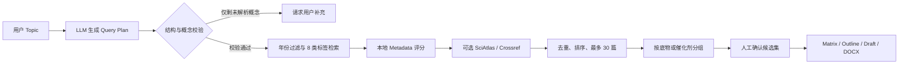

# review-writer

面向化学综述写作的可审计工作流：从自然语言 Topic 出发，生成结构化检索计划，召回并筛选本地 metadata 文献，完成文献矩阵、提纲、分节写作、结论生成、总结图、终审和 Word 导出。

当前 `dy` 分支重点增强了 Topic 检索理解能力：LLM 不再只输出松散关键词，而是先生成可验证的 query plan，将缩写、时间范围、底物、催化剂、反应类型和文章组织方式传递给确定性的检索脚本。

> 完整的原版对比、评分规则、回退逻辑、APA 与 axial-chiral allenes 示例，请参阅 [集成说明.txt](./集成说明.txt)。

## 检索流程



## 修改后的 Topic 检索能力

- **LLM Topic 解析**：通过 `query_plan.draft.json` 连接 LLM 和 `discover.py`，保留概念解析结果、置信度和理由。
- **缩写安全机制**：只在化学上下文充分时展开 APA 等缩写；证据不足时进入 `unresolved_concepts`，不盲猜、不执行无意义的字面检索。
- **中英文时间过滤**：将“近 5 年”“past five years”等转换为包含当前年份的闭区间，并在本地 metadata 评分前过滤。
- **组织意图提取**：将“按照催化剂种类区分”转换为 `group_by: ["catalyst_or_method"]`，而不是把写作指令当关键词。
- **8 类标签定向召回**：关键词只匹配其声明的 structured tag 类别，减少跨字段弱匹配。
- **本地优先、外部补充**：本地 metadata 是正式候选来源；SciAtlas 和 Crossref 用于覆盖检查和补充发现。
- **可审计候选池**：记录命中字段、匹配词、分数、候选角色、过滤统计和分组结果；目标为 20–30 篇，最多保留 30 篇，不用零匹配论文凑数。
- **人工确认门禁**：discovery 初始状态为 `pending`，确认关键词和候选论文后才进入文献矩阵与正文阶段。

本地召回使用以下 8 类 metadata 标签：

| 标签 | 用途 |
|---|---|
| `product` | 目标产物 |
| `substrate` | 底物类别 |
| `catalyst_or_method` | 催化剂或方法 |
| `organometallic_partner` | 有机金属试剂 |
| `ligand_or_chiral_source` | 配体或手性来源 |
| `leaving_group` | 离去基团 |
| `reaction_type` | 反应类型 |
| `document_scope` | 文献类型或范围 |

## 完整综述工作流

```text
Topic discovery
  → literature matrix and outline
  → section blueprint
  → section drafting and source-figure selection
  → first-draft merge
  → conclusion / challenges / insights
  → conclusion integration
  → final audit
  → review summary chart
  → DOCX export
```

新增集成能力包括：

- `review-conclusion-generator`：根据初稿、文献矩阵和阅读笔记生成结论、挑战、趋势及洞见；
- `integrate_generated_conclusion.py`：把通过质量检查的结论合并到最终稿；
- `review-outline-summary-chart`：生成全文和小节结构总结图；
- final audit / DOCX export：检查引用、图片、占位符和格式后导出 Word。

## 快速开始

### 1. 生成结构化 Query Plan

由 Codex/编排器依据以下规则解析 Topic：

```text
skills/review-topic-paper-discovery/references/keyword_expansion_prompt.md
```

输出到：

```text
review-projects/<project-id>/00_discovery/query_plan.draft.json
```

### 2. 执行本地 metadata 检索

```bash
python skills/review-topic-paper-discovery/scripts/discover.py \
  --review-root <review-root> \
  --project-id <project-id> \
  --topic "<review topic>" \
  --query-plan review-projects/<project-id>/00_discovery/query_plan.draft.json
```

可选增加外部覆盖检查：

```bash
--sciatlas-search --web-search
```

不传 `--query-plan` 时仍保留确定性规则回退，便于兼容旧调用；正式 Codex discovery 流程应使用 query plan。

## Discovery 主要产物

```text
00_discovery/
├── topic_input.md
├── query_plan.draft.json
├── keyword_set.draft.json
├── local_results_by_keyword.json
├── web_results_by_keyword.json
├── combined_results_by_keyword.json
├── selected_discovery_results.json
├── human_check_state.json
└── discovery_report.md
```

## 项目结构

```text
skills/          各阶段 Skill、脚本和使用文档
review-library/  规范化论文 metadata 与注册表
view/            人工检查界面
template/        综述与导出参考模板
```

## 文档

- [检索优化与工作流集成说明](./集成说明.txt)
- [Topic 文献发现 Skill](./skills/review-topic-paper-discovery/SKILL.md)
- [总编排器 Skill](./skills/review-writing-orchestrator/SKILL.md)
- [结论生成 Skill](./skills/review-conclusion-generator/SKILL.md)
- [总结图 Skill](./skills/review-outline-summary-chart/SKILL.md)
