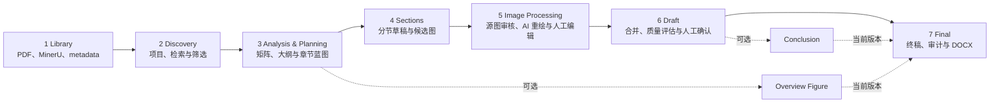

# Review Writer

Review Writer 是一个面向化学综述写作的本地、可审计工作流。它把论文入库、主题检索、文献分析与写作规划、分节写作、化学图像审核与重绘、初稿编辑与质量确认、终稿审计和 Word 导出连接成一个可恢复的七阶段前端流程；后台任务和产物边界仍保持独立。

当前 `dy` 分支的核心设计是：

- **科学产物保存在普通文件中**：Markdown、JSON、PNG、SVG 和 DOCX 可以直接检查、备份和迁移。
- **运行状态持久化到 SQLite**：页面切换或服务重启后，阶段状态、重绘进度和失败记录不会丢失。
- **产物按 SHA-256 版本化**：上游内容变化时，下游旧产物会被标记为过期，避免混用旧图、旧草稿或旧 Word。
- **阶段依赖显式声明**：每个阶段都从当前有效的上一阶段产物读取，而不是凭文件是否存在猜测。
- **Prefect 3 负责编排**：记录 flow/task 运行并处理有限的瞬时故障重试；正文和图片不存入 Prefect 数据库。

## 工作流总览


```mermaid
flowchart LR
    A["1 Library<br/>PDF、MinerU、metadata"] --> B["2 Discovery<br/>项目、检索与筛选"]
    B --> C["3 Analysis & Planning<br/>矩阵、大纲与章节蓝图"]
    C --> D["4 Sections<br/>分节草稿与候选图"]
    D --> E["5 Image Processing<br/>源图审核、AI 重绘与人工编辑"]
    E --> F["6 Draft<br/>合并、质量评估与人工确认"]
    F --> G["7 Final<br/>终稿、审计与 DOCX"]
    C -. 可选 .-> H["Overview Figure"]
    F -. 可选 .-> I["Conclusion"]
    H -. 当前版本 .-> G
    I -. 当前版本 .-> G
```

页面顺序固定为：

```text
Library → Discovery → Analysis & Planning → Sections
        → Image Processing → Draft → Final
```

## 七个前端阶段分别做什么

| 阶段 | 主要操作 | 主要产物 |
|---|---|---|
| 1. Library | 批量上传本地 PDF、调用 MinerU、审核 metadata；也可检索并下载合法开放获取论文 | `review-library/uploads/`、`review-library/metadata/papers/`、`review-library/registry/papers.jsonl` |
| 2. Discovery | 创建项目、生成检索计划、召回全部本地候选文献，并由人工选择进入 Matrix 的论文 | `00_discovery/query_plan.draft.json`、`selected_discovery_results.json`、`human_check_state.json` |
| 3. Analysis & Planning | 生成逐篇阅读记录和文献矩阵；选择或编辑大纲，再生成章节目标、论点、论文角色、图像需求和写作任务 | `01_matrix_outline/literature_matrix.json`、`selected_outline.md`、`section_blueprint.json`、`02_section_drafting/section_tasks.json` |
| 4. Sections | 按当前章节蓝图和论文集合生成分节草稿，并从 MinerU 内容建立候选图 | `section_drafts.json`、`section_drafts.md`、`figure_candidates.json`、`paper_figure_candidates.json` |
| 5. Image Processing | 逐篇选择真正进入重绘的源图，再进行 AI 重绘、批量处理、人工放行及在线 SVG/Ketcher 编辑 | `02_section_drafting/human_figure_review.json`、`03_figure_redraw/redrawn_figure_manifest.json`、`redrawn/*.png`、`manual_arrow_edits/*.svg` |
| 6. Draft | 合并分节草稿、插入当前审核图、整理引用；支持段落/全文编辑、质量评估、AI 候选重写和精确版本人工确认 | `04_first_draft/first_draft.md`、`citations.json`、`figures/`、`draft_approval.json` |
| 7. Final | 生成可选结论和总览图，组装终稿、执行审计并导出 Word | `05_final_audit/final_draft.md`、`overview_figure.png`、审计报告、`final_draft*.docx` |

## 当前主要能力

### 文献库与 MinerU

- Library 只负责共享文献库的入库和阅览；项目从 Discovery 阶段创建。
- 支持一次批量选择最多 30 个本地 PDF，并按文件 SHA-256 去重。
- 本地上传必须完成 MinerU 精确解析，取得 Markdown、图片目录和有效的 `content_list.json`，才会正式写入 Library。
- MinerU 解析不完整或超时的 PDF 不会以“半入库”状态进入后续检索和写作。
- 每篇论文使用稳定的 `Pxxx` ID，metadata、PDF、Markdown、MinerU 图片和原始上传名保持关联。
- Discovery 检索和 Sections 写作统一使用已经入库的规范化 metadata 与 MinerU 全文。
- 联网获取支持 Crossref 检索，并结合 Europe PMC、Semantic Scholar 和可选 Unpaywall 查找开放获取来源；不会绕过付费墙、验证码或访问控制。

### 大纲、Blueprint 与写作

- 第三阶段可选择内置结构，也可上传参考综述。
- 参考综述只用于提取标题层级、章节组织、篇幅分配和论述方式；主题专有标题会被拒绝或改写，不直接复制参考综述内容。
- Blueprint 固化每一节的写作目标、论点、论文分配、证据角色和图像需求。
- Sections 只读取当前 Blueprint 和当前选中论文；Blueprint 更新后，旧章节草稿仍保留在磁盘，但不会被当成当前流程内容。
- Draft 中的人工编辑会保存为当前版本，并通过内容哈希进入 Final，而不是被旧的自动草稿覆盖。

### 化学图像重绘与在线编辑

- Image Processing 中的候选源图审核是 AI 重绘的唯一来源；选择改变后，旧重绘会失效并要求重新生成。
- 共享路由器会识别机理/循环、反应式、底物范围、表格、曲线图、多面板、低清晰度和彩色化学图等类型，也允许人工指定类型。
- AI 请求始终携带当前源图；source hash 和 output hash 会写入 manifest，防止历史候选图串用。
- 彩色化学图会要求去除不必要填充，同时保留苯环、化学键、文字、符号和圆球内标签。
- 机理箭头模式要求保留所有箭头的数量、方向、颜色和连接关系，并把弧形流程箭头改为直线或直角折线。
- 机理图编辑不使用 OCR 驱动重绘；普通 AI 编辑可把 OCR 作为辅助完整性检查，但 OCR 不替代化学结构审核。
- 自动完整性检查未通过时，生成结果仍可作为预览保存；必须由人工审核放行后才能进入正文。
- 批量任务的 `queued`、`running`、`retrying`、`completed`、`failed` 和停止状态写入持久状态，切换 Scheme 或页面后仍可看到。
- 在线 SVG 编辑可选择原图或 AI 图作为底图，支持全图矢量化、选择、框选、移动、删除、撤销、橡皮擦、文本、直线、直角箭头、圆弧箭头和 Ketcher 化学结构。
- SVG 保存会更新当前重绘产物并立即刷新页面；画布尺寸差异会按底图坐标换算，不要求用户手动匹配像素尺寸。

> AI 重绘不能代替人工化学审核。进入 Draft 前仍应逐项检查化学键、原子、立体化学、箭头方向、上下标、电荷和文字。

### Draft、Final 与 Word

- Draft 可以直接编辑段落或全文；保存后更新 handoff 和内容哈希。
- Draft Quality Feedback Loop 位于 Draft 内：按 rubric 评估全文与每个段落，AI 只生成候选重写，人工接受后才修改正文，并尽量保护引用、数值和化学信息。
- 进入 Final 前必须对当前精确 Draft 版本完成评估和人工确认；正文再次修改后，旧评分与旧确认自动失效。
- Conclusion、Overview Figure 和 Generate Final Draft 相互独立；生成终稿时使用当时存在且仍为当前版本的可选产物，不要求按按钮顺序依次执行。
- Overview Figure 使用 Settings 中同一套图像服务配置，并按服务商支持情况协商画布尺寸。
- Final 会重新排列图号并同步正文引用，清理内部插图注释，核对正文 callout 与 References 的对应关系。
- 最终审计会阻止空 References、缺失引用、失效图片、XML 非法控制字符和未处理的 MinerU LaTeX 等问题进入发布文件。
- **Generate & Download Word** 从当前 `final_draft.md` 重新生成 DOCX，并记录源 Markdown 的 SHA-256。
- **Download DOCX** 只下载已经存在且哈希仍与当前终稿一致的 Word；终稿改变后会提示重新生成。

## 快速开始

### 1. 获取 `dy` 分支

```powershell
git clone --branch dy https://github.com/XuehaiWang/review-writer.git
Set-Location review-writer
```

### 2. 创建 Python 环境

建议使用 Python 3.11 或更新版本，并始终用同一个虚拟环境启动前端和执行依赖安装：

```powershell
py -m venv .venv
.\.venv\Scripts\python.exe -m pip install --upgrade pip
.\.venv\Scripts\python.exe -m pip install -r requirements.txt
```

`requirements.txt` 是本地工作流与托管 API 共用的唯一 Python 依赖清单。

### 3. 启动前端

```powershell
.\.venv\Scripts\python.exe view\serve_review_dashboard.py `
  --review-root . `
  --host 127.0.0.1 `
  --port 8765
```

打开：

- 工作台：<http://127.0.0.1:8765/>
- API 设置：<http://127.0.0.1:8765/settings>

若提示 Prefect 未安装，通常是启动前端时用了系统 Python。请重新使用 `.venv\Scripts\python.exe` 启动。

### 4. FastAPI 开发入口

当前版本提供一个小型单体 FastAPI 应用，同时提供网页和版本化 API。开发模式仍可直接读取现有本地项目：

七阶段页面和静态资源已经由 FastAPI 直接、安全地提供。页面暂时仍使用的未版本化
`/api/...` 请求集中在 `review_writer_api/workflow_compat.py`，响应带有
`Deprecation: true`，新功能必须进入 `/api/v1/...`；底层 HTTP 适配只保留在
`review_writer_api/dashboard_executor.py`，用于尚未逐项迁移的工作流端点和受控文件预览。

```powershell
.\.venv\Scripts\python.exe -m pip install -r requirements.txt
.\.venv\Scripts\python.exe -m review_writer_api `
  --review-root . `
  --host 127.0.0.1 `
  --port 8770
```

可访问：

- 健康检查：<http://127.0.0.1:8770/api/v1/health>
- 当前本地身份：<http://127.0.0.1:8770/api/v1/me>
- 项目列表：<http://127.0.0.1:8770/api/v1/projects>
- OpenAPI：<http://127.0.0.1:8770/api/docs>

本地开发模式是单用户模式，不要求登录。需要验证多用户登录注册时，使用下面的 PostgreSQL Compose 部署。

托管数据库迁移使用：

```powershell
$env:REVIEW_WRITER_POSTGRES_HOST='127.0.0.1'
$env:REVIEW_WRITER_POSTGRES_PORT='5432'
$env:REVIEW_WRITER_POSTGRES_USER='review_writer'
$env:REVIEW_WRITER_POSTGRES_PASSWORD='replace-with-your-password'
$env:REVIEW_WRITER_POSTGRES_DB='review_writer'
.\.venv\Scripts\alembic.exe upgrade head
```

也可以用 `REVIEW_WRITER_DATABASE_URL` 直接覆盖上述五项配置。

### 5. 小型线上部署：FastAPI + PostgreSQL

线上结构只保留 FastAPI 和 PostgreSQL。用户、密码哈希、登录会话、项目归属和个人 API 设置都存入 PostgreSQL；项目文件使用 Docker Volume，不依赖 Keycloak、Redis 或 MinIO。

复制 Docker 专用环境变量示例并修改密码与密钥。不要覆盖本地单用户模式可能已经使用的 `.env`：

```powershell
Copy-Item .env.hosted.example .env.hosted
# 编辑 .env.hosted 后，后台启动 PostgreSQL、自动迁移和 API
docker compose --env-file .env.hosted up --build -d
docker compose --env-file .env.hosted ps
```

查看 API 日志或停止服务：

```powershell
docker compose --env-file .env.hosted logs -f api
docker compose --env-file .env.hosted down
```

每次启动都会先等待 PostgreSQL 健康检查，再幂等执行 `alembic upgrade head`；普通重启不需要手动运行迁移。不要给 `down` 添加 `-v`，否则会删除 PostgreSQL 和用户工作区数据卷。

本地开发地址：

- 用户门户：<http://127.0.0.1:8770/>
- 健康检查：<http://127.0.0.1:8770/api/v1/health>
- API 文档（仅在显式启用后）：<http://127.0.0.1:8770/api/docs>

注册和登录直接使用站内邮箱与密码，不要求邮箱验证。密码通过 scrypt 加盐哈希后保存，浏览器只接收 HttpOnly、SameSite Cookie；数据库只保存会话 Token 的 SHA-256，不保存原始 Token。所有项目和模型凭据查询都必须携带当前 `user_id`，数据库外键同时阻止跨用户关联。

`REVIEW_WRITER_PUBLIC_ORIGIN`、数据库地址、Cookie 名称、有效期、HTTPS Cookie 开关和监听地址都由环境变量配置，不写死在前后端。生产环境必须把 `REVIEW_WRITER_PUBLIC_ORIGIN` 设置为实际 HTTPS 域名，并设置 `REVIEW_WRITER_SESSION_COOKIE_SECURE=true`。

托管模式的文本模型、图像模型和 MinerU 密钥通过 `/api/v1/provider-settings` 按当前登录用户保存。API 只返回是否已配置及末四位提示，密钥使用 AES-256-GCM 加密落库；`REVIEW_WRITER_CREDENTIAL_ENCRYPTION_KEY` 必须作为部署密钥长期安全保存，不能提交到 Git，也不能随意更换，否则已有模型密钥将无法解密。本地单用户模式仍沿用 `.review-writer/provider-settings.json`。

托管模式默认关闭 `/api/docs` 和 `/api/openapi.json`；确需内部调试时可临时设置 `REVIEW_WRITER_EXPOSE_API_DOCS=true`。

## API 设置

推荐在网页的 **API Settings** 中配置，而不是直接编辑代码。设置页包含：

- MinerU API token；
- 文本 API URL、key、模型和 wire API；
- 图像 API URL、key、模型和 wire API。

本地单用户模式保存到当前工作区的：

```text
.review-writer/provider-settings.json
```

托管模式不会使用这个共享文件，而是按当前用户加密保存到 PostgreSQL 的 `provider_credentials` 表。

该文件和 `.env` 都不会提交到 Git。浏览器重新进入设置页时会显示 URL、模型、接口类型和密钥掩码；空着密钥框再次保存表示保留已有 key，而不是清除。

运行子进程的配置合并优先级是：

```text
启动进程环境 < 项目根目录 .env < Settings 页面保存值
```

也可以在根目录创建 `.env`。以下只展示变量结构，禁止把真实 key 提交到 Git：

```dotenv
# 文本模型
OPENAI_BASE_URL=https://your-text-provider.example/v1
OPENAI_API_KEY=replace-with-your-key
REVIEW_WRITING_BASE_URL=https://your-text-provider.example/v1
REVIEW_WRITING_MODEL=your-text-model
REVIEW_WRITING_WIRE_API=chat-completions

# 图像模型；可以与文本模型使用不同服务商和密钥
IMAGE_OPENAI_BASE_URL=https://your-image-provider.example/v1
IMAGE_OPENAI_API_KEY=replace-with-your-image-key
IMAGE_OPENAI_MODEL=your-image-model
IMAGE_OPENAI_WIRE_API=images

# MinerU
MINERU_API_TOKEN=replace-with-your-mineru-token

# 可选开放获取服务
UNPAYWALL_EMAIL=you@example.org
SEMANTIC_SCHOLAR_API_KEY=
```

支持的文本 wire API 为 `chat-completions` 和 `responses`；支持的图像 wire API 为 `images` 和 `chat-completions`。兼容服务必须真的在响应中返回图像，仅返回 `choices` 但没有图片数据时，项目会明确报告“response did not contain an image”。

高级兼容项：

```dotenv
# 某些图像服务要求 multipart 字段使用 image[]
IMAGE_OPENAI_FIELD=image[]

# 已知只支持方形输出的服务商可跳过横向尺寸尝试
IMAGE_SUPPORTED_SIZES=1024x1024

# 运行时数量限制
REVIEW_MAX_LITERATURE_BATCH=30
```

## 数据、状态与版本

### 本地科学产物

```text
review-library/
├─ uploads/                  本地上传 PDF 与规范化 MinerU 结果
├─ downloads/                联网获取的 PDF
├─ metadata/papers/          规范化论文 metadata
└─ registry/papers.jsonl     论文注册表

review-projects/<project-id>/
├─ project_config.json
├─ 00_discovery/
├─ 01_matrix_outline/
├─ 02_section_drafting/
├─ 03_figure_redraw/
├─ 04_first_draft/
└─ 05_final_audit/
```

这些是用户运行数据，不属于发布代码。仓库只保留 `review-library/.gitkeep`；干净克隆首次启动时会自动创建其余目录。

### SQLite 工作流状态

服务首次启动时创建：

```text
.review-writer/workflow.sqlite3
```

它只保存编排信息，不保存论文正文和图片二进制：

- 项目、阶段状态和明确依赖；
- stage run、错误、时间和 Prefect run ID；
- 文件 SHA-256、逻辑产物名、不可变版本与当前版本指针；
- 输出版本对输入版本的 lineage；
- 批量重绘进度、重试和停止状态。

项目状态可通过只读接口检查：

```text
GET /api/project/<project-id>/workflow-state
```

### Handoff 与过期判断

各阶段继续输出人类可读的 JSON handoff。SQLite 中的产物版本和 handoff 中的内容哈希共同完成衔接：

1. 阶段成功后登记输入和输出的 SHA-256；
2. 下游只消费当前版本；
3. 上游内容变化后，依赖旧 hash 的下游显示为 stale；
4. 旧文件保留在磁盘以便追溯，但不会自动显示或进入新终稿；
5. 重新执行相应阶段后建立新的 handoff 和依赖版本。

## Prefect 3 的作用

前端启动时自动启用 Prefect：

- 每个可执行阶段形成 flow/task 运行记录；
- 对超时、连接中断、429 和部分 5xx 做有限重试；
- 400、401、403、404 和确定性校验错误不会盲目重试；
- Prefect 服务短暂启动失败时会处理本地 `/api/health` 的 502/503/504；
- 业务进度仍写入 `workflow.sqlite3`，因此不依赖 Prefect UI 才能恢复任务；
- Windows 下按当前账户使用 `.review-writer/prefect-<account>/`，减少多账户 ACL 冲突。

默认使用按需启动的本地临时 Prefect 服务。如需长期查看 Prefect UI：

```powershell
$env:PREFECT_HOME=(Resolve-Path '.review-writer\prefect-local').Path
.\.venv\Scripts\prefect.exe server start --host 127.0.0.1 --port 4200
```

在另一个 PowerShell 窗口中：

```powershell
$env:PREFECT_API_URL='http://127.0.0.1:4200/api'
.\.venv\Scripts\python.exe view\serve_review_dashboard.py --review-root . --host 127.0.0.1 --port 8765
```

Prefect UI：<http://127.0.0.1:4200>

## Taxonomy 与项目级配置

metadata 构建、校验和 Discovery 检索统一使用 `review_writer_core/taxonomy.py`：

- 一般化学主题默认使用 `review_writer_core/taxonomies/chemistry_general.py`；
- 联烯主题自动选择 `review_writer_core/taxonomies/allene.py`；
- profile 写入 `review-projects/<project-id>/project_config.json`，已有项目不会被静默切换；
- Blueprint 的主题规则包由 `skills/review-section-blueprint/references/rule_packs.json` 选择，不再固定加载单一主题规则。

可显式覆盖：

```dotenv
REVIEW_TAXONOMY_PROFILE=allene
# 绝对路径或相对项目根目录
REVIEW_CLASSIFICATION_RULES=review_writer_core/taxonomies/my_topic.py
```

更多说明见 [Review Writer portable configuration](review_writer_core/CONFIGURATION.md)。

## 项目结构

```text
skills/                     各阶段 Skill、脚本、references 与校验器
view/                       七阶段前端网页、兼容 HTTP API、SQLite 与 Prefect flow
review_writer_core/         跨阶段共享配置、provider、taxonomy 和图像路由
review-library/             本地文献库（运行时数据，Git 忽略）
review-projects/            每个综述项目的阶段产物（运行时数据，Git 忽略）
examples/reference-reviews/ 示例综述与测试资源
prefect.toml                Prefect 本地配置
requirements.txt            Python 依赖（工作流与 API 共用）
```

主要文档与入口：

- [前端使用说明](view/前端使用说明.md)
- [Skills 工作流说明](skills/技能工作流说明.md)
- [总编排器](skills/review-writing-orchestrator/SKILL.md)
- [本地 PDF / MinerU](skills/mineru-precise-parse-review-writer/SKILL.md)
- [联网文献获取](skills/review-literature-acquisition/SKILL.md)
- [图像重绘与编辑](skills/review-figure-style-redraw/SKILL.md)
- [逐段反馈循环](skills/review-first-draft-feedback-loop/SKILL.md)
- [最终审计与发布](skills/review-final-audit-release/SKILL.md)
- [DOCX 导出](skills/review-export-docx/SKILL.md)

## 测试

项目的发布级检查文件位于 `view/*_checks.py`。在项目根目录执行：

```powershell
Set-Location view
..\.venv\Scripts\python.exe -m unittest discover -s . -p '*_checks.py'
Set-Location ..
```

提交前还应检查：

```powershell
git diff --check
git status --short
```

不要把 `.env`、`.review-writer/`、`review-projects/`、用户 PDF、MinerU 输出、日志和密钥提交到仓库。

## 局域网临时共享

默认只监听 `127.0.0.1`。若要在可信局域网中临时共享，必须设置访问密码：

```powershell
$env:REVIEW_DASHBOARD_ACCESS_TOKEN='replace-with-a-long-random-password'
.\.venv\Scripts\python.exe view\serve_review_dashboard.py `
  --review-root . `
  --host 0.0.0.0 `
  --port 8765
```

也可用 `--access-token` 传入密码。浏览器使用 HTTP Basic 登录，用户名可任意填写，密码为上述 token。

这只是可信网络中的临时保护，不是完整的多租户认证、项目隔离或公网部署方案。不要直接把本地服务暴露到互联网。

## 常见问题

- **设置保存后任务仍访问 `https://api.openai.com`**：确认设置页显示的 active workspace 与当前部署目录一致，然后重新保存；不要同时启动多个指向不同 `--review-root` 的服务。
- **`Prefect is not installed`**：使用 `.venv\Scripts\python.exe` 启动，或重新安装 `requirements.txt`。
- **MinerU 没有生成 `content_list.json`**：该 PDF 不会正式入库；先检查 MinerU token、网络和解析日志，再重新上传。
- **`model_not_found` 或 `No available channel`**：服务商当前没有所填模型的可用渠道，应在 Settings 中改为该服务商实际支持的模型。
- **图像接口只返回 `choices`、没有 image**：服务商的 Chat Completions 通道没有返回图片内容；切换到真正支持图片输出的模型/令牌，或使用 `images` wire API。
- **Cloudflare 1010 / browser signature banned**：这是服务商网关拦截，不是项目内容错误；需要服务商解除限制或更换可访问的图像端点。
- **下游提示 stale / 过期**：上游内容哈希已经改变。旧文件没有被删除，但必须重新执行受影响阶段以建立新的依赖版本。
- **Word 提示已过期**：当前 `final_draft.md` 的 SHA-256 与上次 DOCX 导出记录不同，请点击 Generate & Download Word。

## 安全边界

- 只处理用户有权访问的论文和开放获取来源。
- API key 仅保存在本地 `.env` 或 `.review-writer/provider-settings.json`，不得写入代码、README、截图或提交历史。
- 删除项目会永久删除 `review-projects/<project-id>` 及其输出，界面要求输入完整 project ID 二次确认。
- AI 生成的化学结构、机理、箭头和文字必须经过人工审核。
- 对外提供网站服务前，需要另行实现 HTTPS、用户认证、权限隔离、配额、对象存储和数据库备份；当前本地存储模式主要面向单机或可信局域网使用。
