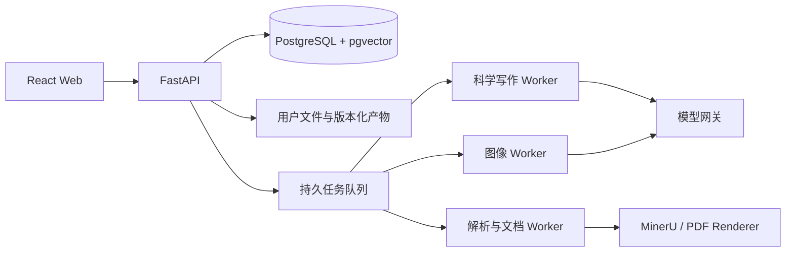

# Review Writer

Review Writer 是一个基于证据链的学术综述写作系统。它把论文解析、主题检索、证据整理、大纲规划、章节写作、图像处理、全文优化和文档导出组织成一条可恢复、可追溯的工作流。

系统重点支持化学论文中的反应式、机理图和分子结构，同时也可用于其他学科的文献综述。

## 核心功能

- **论文入库**：批量上传 PDF，通过 MinerU 提取 Markdown、版面结构、图片和书目信息。
- **主题检索**：结合题录规则、PostgreSQL 全文索引和向量语义召回筛选相关论文。
- **证据整理**：生成文献 Matrix、科学事实和可定位的原文证据，保留论文、事实、Claim 与引用的身份关系。
- **大纲与 Blueprint**：根据主题要求和实际证据建立章节结构，并为每章分配论文、科学问题和写作任务。
- **章节写作**：先生成 Claim 与证据计划，再生成正文，降低漏引、错引和无证据扩写。
- **图像处理**：支持原图选择、AI 重绘、SVG 对象编辑和 Ketcher 分子结构编辑。
- **初稿优化**：合并章节和图像，支持段落编辑、历史回滚、质量评估及局部安全重写。
- **终稿导出**：生成摘要、关键词、参考文献和综述总览图，导出 DOCX 或双栏 PDF。
- **多用户运行**：隔离用户、项目、论文库、任务和文件，保存长任务状态，刷新页面后可继续查看进度。
- **服务端模型管理**：文本模型、图像模型和 MinerU 统一由服务器配置，并记录模型用量和费用。

## 工作流程

1. **文献库**：上传并解析 PDF，确认书目信息和全文索引状态。
2. **检索筛选**：输入综述主题，检索候选论文并人工确认采用范围。
3. **分析与大纲**：生成 Matrix、科学事实、综述范围、大纲和章节 Blueprint。
4. **章节生成**：按 Blueprint、证据包和引用计划生成各章节正文。
5. **图像处理**：选择原图、重绘或编辑图片，并确定最终插图版本。
6. **初稿评估**：合并全文，定位证据、引用、写作和图像问题并执行局部优化。
7. **终稿发布**：完成全文组织和发布检查，生成 DOCX/PDF。

## 逻辑架构


```mermaid
flowchart LR
    B[React Web] --> A[FastAPI]
    A --> DB[(PostgreSQL + pgvector)]
    A --> FS[用户文件与版本化产物]
    A --> Q[持久任务队列]
    Q --> SW[科学写作 Worker]
    Q --> DW[解析与文档 Worker]
    Q --> IW[图像 Worker]
    SW --> G[模型网关]
    DW --> M[MinerU / PDF Renderer]
    IW --> G
```

- **React + TypeScript**：用户界面和七阶段工作台。
- **FastAPI**：用户、项目、文献、任务、产物和管理接口。
- **PostgreSQL + pgvector**：业务状态、全文索引、语义向量、任务和用量账本。
- **独立 Worker**：分别处理科学写作、论文解析/文档发布和图像任务。
- **模型网关**：统一转发文本与图像模型请求，控制并发并记录费用。
- **LuaLaTeX Renderer**：生成独立的出版级 PDF。

## Docker 部署

### 环境要求

- Git
- Docker Desktop 或 Docker Engine
- Docker Compose v2

### 1. 获取项目

```powershell
git clone --branch dy-launch https://github.com/XuehaiWang/review-writer.git
Set-Location review-writer
Copy-Item .env.hosted.example .env.hosted
```

### 2. 配置服务

编辑 `.env.hosted`，至少设置以下内容：

```dotenv
REVIEW_WRITER_POSTGRES_PASSWORD=数据库密码
REVIEW_WRITER_CREDENTIAL_ENCRYPTION_KEY=凭据加密密钥
REVIEW_WRITER_INTERNAL_WORKER_TOKEN=内部任务令牌
REVIEW_WRITER_PDF_RENDERER_TOKEN=PDF服务令牌

REVIEW_WRITER_OPENAI_API_KEY=文本模型密钥
REVIEW_WRITER_IMAGE_API_KEY=图像模型密钥
REVIEW_WRITER_MINERU_API_TOKEN=MinerU令牌

REVIEW_WRITER_ADMIN_EMAILS=owner@example.com
```

`.env.hosted` 包含敏感信息，不要提交到 Git。

### 3. 启动

```powershell
docker compose --env-file .env.hosted up -d --build
docker compose --env-file .env.hosted ps
```

默认访问地址：<http://127.0.0.1:8770/>。

局域网部署可在 `.env.hosted` 中设置：

```dotenv
REVIEW_WRITER_PUBLIC_ORIGIN=http://192.168.0.5:5175
REVIEW_WRITER_BIND_ADDRESS=0.0.0.0
REVIEW_WRITER_HTTP_PORT=5175
REVIEW_WRITER_SESSION_COOKIE_SECURE=false
```

然后重新执行完整启动命令，同一局域网设备即可访问 <http://192.168.0.5:5175/>。服务器防火墙需要允许对应端口。

### 4. 更新与维护

```powershell
git pull origin dy-launch
docker compose --env-file .env.hosted up -d --build
```

更新时应整体重建服务，避免 API、模型网关和 Worker 运行不同版本的镜像。

查看状态和日志：

```powershell
docker compose --env-file .env.hosted ps
docker compose --env-file .env.hosted logs -f api worker worker-ingest-document worker-image model-gateway
```

停止服务：

```powershell
docker compose --env-file .env.hosted down
```

不要执行 `docker compose down -v`，除非确定要永久删除数据库和用户文件。

## 数据与备份

Compose 使用两个主要持久卷：

- `postgres_data`：用户、项目、任务、余额和产物索引。
- `review_state`：论文 PDF、MinerU 解析结果、草稿、图片和导出文件。

正式使用时应同时备份两个卷，并妥善保存 `REVIEW_WRITER_CREDENTIAL_ENCRYPTION_KEY`。数据库迁移和回滚操作见 [PostgreSQL 工作流迁移手册](docs/postgresql-workflow-migration.md)。
