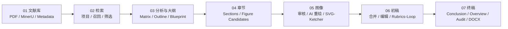
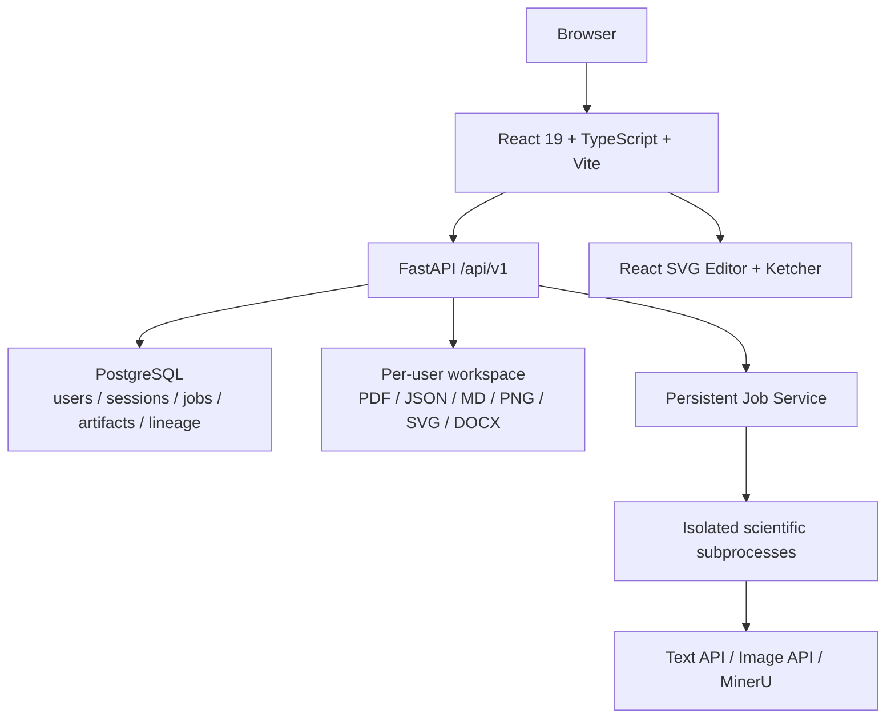

# Review Writer

Review Writer 是一个面向科研团队的综述生产系统，尤其适合包含化学反应式、机理图和结构图的综述项目。它把 PDF 入库、MinerU 解析、文献检索、证据矩阵、大纲规划、章节写作、图像重绘、人工审核、初稿优化、终稿审计和 Word 导出组织为一条可恢复、可追溯的七阶段工作流。

当前 `dy-launch` 分支采用：

- **React + TypeScript SPA**：统一工作台、登录页、产品首页和中英文界面；
- **FastAPI**：认证、项目 API、阶段服务、后台任务和文件下载；
- **PostgreSQL**：用户、会话、项目状态、任务、产物版本和依赖关系；
- **按用户隔离的文件工作区**：保存 PDF、MinerU 输出、Markdown、JSON、PNG、SVG 和 DOCX；
- **内容哈希与不可变产物版本**：识别上游变化，阻止旧图、旧草稿或旧 Word 混入当前版本；
- **内置持久任务执行器**：记录进度、失败、取消和重试，页面刷新后仍能恢复状态。

在线运行不再依赖 Prefect 或 SQLite 作为业务状态系统。历史 SQLite 仅用于一次性迁移到 PostgreSQL。

## 工作流


```mermaid
flowchart LR
    L["01 文献库<br/>PDF / MinerU / Metadata"] --> D["02 检索<br/>项目 / 召回 / 筛选"]
    D --> P["03 分析与大纲<br/>Matrix / Outline / Blueprint"]
    P --> S["04 章节<br/>Sections / Figure Candidates"]
    S --> I["05 图像<br/>审核 / AI 重绘 / SVG-Ketcher"]
    I --> R["06 初稿<br/>合并 / 编辑 / Rubrics-Loop"]
    R --> F["07 终稿<br/>Conclusion / Overview / Audit / DOCX"]
```

| 阶段 | 用户操作 | 当前主要产物 |
|---|---|---|
| 01 文献库 | 批量上传 PDF、MinerU 解析、Metadata 审核、开放文献检索和下载 | PDF、Markdown、`content_list.json`、图片、规范化 Metadata |
| 02 检索 | 创建项目、生成检索计划、召回文献、筛选并确认项目论文 | Query Plan、Discovery Results、人工选择状态 |
| 03 分析与大纲 | 生成阅读记录和证据矩阵；选择内置大纲或学习参考综述的结构；编辑并确认 Blueprint | Literature Matrix、Selected Outline、Section Blueprint、Section Tasks |
| 04 章节 | 按当前 Blueprint 与论文分配生成章节草稿，提取并整理候选图 | Section Drafts、Paper Figure Inventory、Figure Candidates |
| 05 图像 | 选择源图、自动判断图像类型、AI 重绘、完整性审核、批量通过、SVG/Ketcher 编辑 | Figure Review、Redrawn Manifest、PNG/SVG、人工审核状态 |
| 06 初稿 | 合并章节和当前审核图；全文/段落编辑；Rubrics 评估、候选重写与批量安全优化 | First Draft、Citations、Quality Report、Rewrite Proposals、Draft Approval |
| 07 终稿 | 可选生成结论和总览图；合并终稿、审计引用与格式、生成 Word | Final Markdown、Overview Figure、Audit/Release Report、DOCX |

## 主要能力

### 文献库与 MinerU

- 每批最多上传 30 个 PDF，并按文件内容去重；
- 上传任务在统一进度区域显示整体进度，不为每个文件堆叠独立卡片；
- PDF 必须完成 MinerU 解析并得到有效 Markdown、图片目录和 `content_list.json` 后才正式入库；
- Metadata、PDF、Markdown、MinerU 图片和来源信息保持可追溯关联；
- 联网检索显示论文来源链接，只处理合法开放获取资源，不绕过付费墙或访问控制；
- 文献库只负责资料准备，项目在检索阶段创建。

### 检索、矩阵与大纲

- 基础 Metadata 标签在入库时生成，项目检索再结合当前主题、查询计划和全文证据进行匹配；
- 检索结果支持点击整行查看详情、选择/排除论文和确认当前集合；
- 证据矩阵记录论文在各章节中的角色，减少同一论文在多个章节重复承担相同论述任务；
- 内置大纲支持底物结构、催化剂与方法、反应类型等通用组织方式；
- 上传参考综述时只学习标题层级、章节节奏、篇幅分配和写作方式，不复制其主题标题或正文内容；
- Blueprint 明确每一节的目标、论点、论文分配、证据角色、图像需求和写作任务。

### 化学图像重绘与人工编辑

- AI 重绘始终绑定当前选中的源图和源产物版本，候选图变化后不会继续复用旧图；
- 可识别或人工指定机理图、反应式、底物范围、彩色化学图、表格、曲线图、多面板图等类型；
- 彩色化学图可去除不必要填充，同时要求保留苯环、键型、文字、上下标、电荷和圆球内符号；
- 机理图提示要求保留箭头数量、方向、颜色和连接关系，并支持将弧形流程箭头转换为直线或直角折线；
- AI 结果未通过自动完整性检查时仍可预览，但必须人工审核后才能进入正文；
- 左侧图像列表持续显示排队、生成、重试、完成和失败状态；
- React SVG 编辑器支持选择、框选、移动、删除、撤销、橡皮擦、文本、直线、直角箭头和圆弧箭头；
- 可选择原图或 AI 重绘图作为编辑底图，并在同一工作区打开 Ketcher 编辑化学结构；
- SVG 保存会更新当前重绘产物并立即刷新，画布坐标会按底图尺寸换算。

> AI 图像编辑不能替代化学审核。进入初稿前仍需检查原子、化学键、立体化学、箭头、文字、上下标和电荷。

### 初稿评估与反馈循环

- 初稿合并只使用当前 Blueprint、章节产物和已审核图片；
- 用户可编辑全文或单段，保存后生成新的不可变版本；
- Rubrics/Loop 对全文和每个段落评分，记录硬门禁、可自动修复问题和需人工确认的问题；
- 单段候选会先完成完整性校验和候选评分，再由用户查看原文/候选对比并决定保存或放弃；
- 接受单段候选后只增量更新该段及总体评分，不强制重新评估全文；
- 批量安全优化保留每段提案与决策记录，不直接覆盖引用、数字、图片元数据或受保护化学信息；
- 进入终稿前，必须确认当前精确初稿版本。初稿再次修改后，旧确认自动失效。

### 终稿、总览图与 Word

- Generate Conclusion、Generate Overview Figure、Generate Final Draft 和 Word 导出是独立任务；
- 终稿会使用当时存在且仍与当前初稿匹配的可选结论和总览图，不要求按固定顺序点击；
- 总览图插入 Introduction 前的正文区域，不放在参考文献之后；
- Table of Contents 在 Word 中使用结构化样式，而不是单行文本堆叠；
- 终稿重新整理图号并同步正文引用，清理内部插图注释；
- 最终审计检查引用 callout、References、图片产物、XML 控制字符和 MinerU LaTeX；
- Generate & Download Word 从当前 Final Markdown 重新生成 DOCX；
- Download DOCX 只下载仍与当前终稿哈希一致的文件，过期后要求重新生成。

## 技术架构


```mermaid
flowchart TB
    B["Browser"] --> SPA["React 19 + TypeScript + Vite"]
    SPA --> API["FastAPI /api/v1"]
    API --> DB["PostgreSQL<br/>users / sessions / jobs / artifacts / lineage"]
    API --> FS["Per-user workspace<br/>PDF / JSON / MD / PNG / SVG / DOCX"]
    API --> JOB["Persistent Job Service"]
    JOB --> PROC["Isolated scientific subprocesses"]
    PROC --> PROVIDERS["Text API / Image API / MinerU"]
    SPA --> K["React SVG Editor + Ketcher"]
```

### 前端

- React 19、TypeScript、React Router；
- TanStack Query 同步服务端状态和轮询后台任务；
- React Hook Form 管理表单；
- Zustand 只保存语言等非敏感浏览器偏好；
- Vite 负责开发服务器、测试和生产构建；
- 中英文界面、产品首页、登录、工作台、项目删除弹窗和七阶段导航。

### 后端与数据

- FastAPI + Uvicorn 提供页面和 `/api/v1`；
- SQLAlchemy + Alembic 管理 PostgreSQL；
- 密码使用带盐 scrypt 哈希；
- 登录会话使用 HttpOnly、SameSite Cookie，数据库只保存 Token 哈希；
- 文本、图像和 MinerU 凭据按用户使用 AES-256-GCM 加密保存；
- 用户、项目、文献、任务、产物和凭据均按 `user_id` 隔离；
- 删除项目时先更新数据库状态，再把项目文件移动到该用户的可恢复 Trash。

### 产物版本与依赖

每个阶段发布不可变产物版本，并记录：

- 逻辑产物名；
- SHA-256；
- 生产阶段和任务；
- 当前版本指针；
- 输入产物与输出产物的依赖关系。

上游内容变化后，依赖旧版本的下游会显示为 stale。旧文件仍保留用于追溯，但不会继续作为当前流程内容进入初稿、终稿或 Word。

## 快速部署

### 环境要求

- Git；
- Docker Engine 或 Docker Desktop；
- Docker Compose v2；
- 可访问的 MinerU 服务；
- 可选的 OpenAI-compatible 文本和图像服务。

### 1. 获取发布分支

```powershell
git clone --branch dy-launch https://github.com/XuehaiWang/review-writer.git
Set-Location review-writer
```

### 2. 创建部署配置

```powershell
Copy-Item .env.hosted.example .env.hosted
```

至少修改：

```dotenv
REVIEW_WRITER_POSTGRES_PASSWORD=replace-with-a-long-random-password
REVIEW_WRITER_CREDENTIAL_ENCRYPTION_KEY=replace-with-32-random-bytes-as-base64url
REVIEW_WRITER_PUBLIC_ORIGIN=http://127.0.0.1:8770
REVIEW_WRITER_BIND_ADDRESS=127.0.0.1
REVIEW_WRITER_SESSION_COOKIE_SECURE=false
```

生成 32 字节 URL-safe Base64 密钥：

```powershell
python -c "import secrets; print(secrets.token_urlsafe(32))"
```

`.env.hosted` 包含部署密码和加密密钥，禁止提交到 Git。加密密钥必须长期保存；更换后，数据库里已有的用户 API Key 将无法解密。

### 3. 构建并启动

```powershell
docker compose --env-file .env.hosted up -d --build
docker compose --env-file .env.hosted ps
```

打开：

- 应用：<http://127.0.0.1:8770/>
- 健康检查：<http://127.0.0.1:8770/api/v1/health>

首次打开后注册账户、登录，然后进入 **API Settings** 配置个人服务。

### 4. 日志与停止

```powershell
docker compose --env-file .env.hosted logs -f api
docker compose --env-file .env.hosted down
```

不要执行 `docker compose down -v`，除非确定要永久删除 PostgreSQL 和用户工作区 Volume。

## API Settings

API Settings 按当前登录用户分别保存三类配置：

| 类型 | 配置内容 | 用途 |
|---|---|---|
| Text model | Base URL、Model、API Protocol、API Key | 检索计划、矩阵、大纲、章节、反馈循环、结论和终稿文本 |
| Image model | Base URL、Model、API Protocol、API Key | 化学图像重绘和 Overview Figure |
| MinerU | API Token | PDF 解析、Markdown、版面和图片提取 |

支持的文本协议：

- `chat-completions`
- `responses`

支持的图像协议：

- `images`
- `chat-completions`

兼容服务必须在响应中真正返回图像。只返回 `choices` 而没有图片数据时，系统会报告 `response did not contain an image`。

服务器不会把已保存的明文密钥返回浏览器。设置页只显示配置状态和掩码；密钥框留空或保留掩码再次保存，不会清除已有密钥。

### Provider 网络安全

公开部署默认只允许 `REVIEW_WRITER_ALLOWED_PROVIDER_HOSTS` 中的精确域名。增加第三方服务前，应先在 `.env.hosted` 加入可信域名：

```dotenv
REVIEW_WRITER_ALLOWED_PROVIDER_HOSTS=api.openai.com,mineru.net,provider.example
```

只有在可信内网中确实需要访问私有模型地址时，才考虑：

```dotenv
REVIEW_WRITER_ALLOW_PRIVATE_PROVIDER_URLS=true
```

公开部署不应开启该选项。

## 局域网和公网部署

### 可信局域网

在 `.env.hosted` 中设置服务器的局域网地址：

```dotenv
REVIEW_WRITER_PUBLIC_ORIGIN=http://192.168.0.5:8770
REVIEW_WRITER_BIND_ADDRESS=0.0.0.0
REVIEW_WRITER_SESSION_COOKIE_SECURE=false
```

同一局域网用户访问 `http://192.168.0.5:8770/`。请同时使用系统防火墙限制来源范围。

### 公网

公网部署应由 Nginx、Caddy 或云负载均衡器提供 HTTPS，并设置：

```dotenv
REVIEW_WRITER_PUBLIC_ORIGIN=https://review.example.org
REVIEW_WRITER_BIND_ADDRESS=127.0.0.1
REVIEW_WRITER_SESSION_COOKIE_SECURE=true
REVIEW_WRITER_EXPOSE_API_DOCS=false
```

还应配置：

- PostgreSQL 与用户工作区备份；
- 防火墙和反向代理请求大小/超时；
- API 用量与磁盘配额；
- 日志轮转和服务监控；
- 部署密钥与数据库密码的安全托管。

## 数据目录

Compose 使用两个持久卷：

- `postgres_data`：账户、会话、项目状态、任务和产物索引；
- `review_state`：每个用户的文献库和项目文件。

用户文件在逻辑上采用以下结构：

```text
hosted-workspaces/<user-id>/
├─ review-library/
│  ├─ uploads/
│  ├─ downloads/
│  ├─ metadata/
│  ├─ registry/
│  └─ .artifacts/
├─ review-projects/<project-id>/
│  ├─ 00_discovery/
│  ├─ 01_matrix_outline/
│  ├─ 02_section_drafting/
│  ├─ 03_figure_redraw/
│  ├─ 04_first_draft/
│  └─ 05_final_audit/
└─ .trash/
```

这些都是运行数据，不属于发布源码。仓库已忽略 `.env`、`.env.hosted`、`.review-writer/`、`review-projects/`、用户文献、MinerU 输出、数据库、日志、缓存、`node_modules` 和前端 `dist`。

## 历史 SQLite 迁移

Compose 的 `migrate` 服务会在 API 启动前：

1. 等待 PostgreSQL；
2. 执行 Alembic 升级；
3. 检查旧 SQLite 工作流；
4. 生成迁移报告和独立备份；
5. 在迁移满足完整性条件后允许 API 启动。

旧 SQLite 不会被自动删除。缺失文件或内容漂移需要人工核对，不应在首次部署时直接开启接受开关。详见 [PostgreSQL 工作流迁移与回滚](docs/postgresql-workflow-migration.md)。

## 本地开发

### 后端

后端必须连接 PostgreSQL。推荐先通过 Compose 启动数据库，再配置环境变量运行 API。

```powershell
python -m venv .venv
.\.venv\Scripts\python.exe -m pip install --upgrade pip
.\.venv\Scripts\python.exe -m pip install -r requirements.txt
```

数据库连接可以使用 `REVIEW_WRITER_DATABASE_URL`，也可以使用 `REVIEW_WRITER_POSTGRES_HOST`、`PORT`、`USER`、`PASSWORD` 和 `DB`。完成配置后：

```powershell
.\.venv\Scripts\alembic.exe upgrade head
.\.venv\Scripts\python.exe -m review_writer_api --review-root . --host 127.0.0.1 --port 8770
```

### 前端

```powershell
Set-Location frontend
npm.cmd ci
npm.cmd run dev
```

Vite 默认运行在 <http://127.0.0.1:5173/>，并把 `/api`、Ketcher 和旧静态资源代理到 <http://127.0.0.1:8770/>。

如后端地址不同：

```powershell
$env:VITE_DEV_API_TARGET='http://127.0.0.1:8770'
npm.cmd run dev
```

生产镜像会在 Node 构建阶段执行前端测试和构建，FastAPI 在同一端口直接提供 React SPA，因此部署时不需要单独运行 Vite。

## 测试

前端：

```powershell
Set-Location frontend
npm.cmd test
npm.cmd run build
Set-Location ..
```

后端完整回归：

```powershell
.\.venv\Scripts\python.exe -m unittest discover -s review_writer_api/tests -p 'test_*.py'
```

仓库与科学工作流检查：

```powershell
.\.venv\Scripts\python.exe view\repository_hygiene_checks.py
.\.venv\Scripts\python.exe -m unittest discover -s view -p '*_checks.py'
git diff --check
git status --short
```

## 仓库结构

```text
frontend/                   React + TypeScript SPA
review_writer_api/          FastAPI、认证、任务、阶段服务和 PostgreSQL 仓储
review_writer_core/         Workspace、Provider、Taxonomy 和跨阶段共享逻辑
skills/                     科学工作流 Skill、脚本、References 与校验器
view/assets/ketcher/        Ketcher 静态资源
view/                       科学检查与兼容资源
migrations/                 Alembic 数据库迁移
infra/                      部署相关资源
docs/                       迁移和阶段一致性文档
examples/reference-reviews/ 参考综述示例
compose.yaml                PostgreSQL、迁移服务和 API
Dockerfile.api              前端构建与 Python 运行镜像
```

进一步阅读：

- [工作流功能对齐](docs/workflow-feature-parity.md)
- [PostgreSQL 工作流迁移](docs/postgresql-workflow-migration.md)
- [可移植配置](review_writer_core/CONFIGURATION.md)
- [Skills 工作流说明](skills/技能工作流说明.md)
- [总编排 Skill](skills/review-writing-orchestrator/SKILL.md)
- [图像重绘 Skill](skills/review-figure-style-redraw/SKILL.md)
- [初稿反馈循环 Skill](skills/review-first-draft-feedback-loop/SKILL.md)
- [终稿审计 Skill](skills/review-final-audit-release/SKILL.md)
- [DOCX 导出 Skill](skills/review-export-docx/SKILL.md)

## 常见问题

### 设置保存后任务仍访问错误的服务商

确认当前登录账户的 API Settings 已保存正确的 Base URL、Model 和 API Protocol，并确认该域名已加入服务器的 Provider allowlist。

### MinerU 没有产生 `content_list.json`

该 PDF 不会正式进入文献库。检查 MinerU Token、网络、任务详情和解析结果后重新上传。

### `model_not_found` 或 `No available channel`

服务商当前没有该模型的可用渠道。在 API Settings 中改为服务商实际支持的模型和协议。

### 图像接口返回 `choices` 但没有图片

当前 Chat Completions 通道没有返回图片内容。需要更换支持图片输出的模型/令牌，或改用服务商真正支持的 Images API。

### Cloudflare 1010 / browser signature banned

这是第三方网关拒绝服务器请求，不是化学内容错误。需要服务商解除限制或更换可访问端点。

### 下游显示 stale / 过期

上游产物版本已经改变。旧文件仍保留，但不会作为当前内容继续使用；重新运行受影响阶段后会建立新的依赖版本。

### Word 显示已过期

当前 Final Markdown 与上次导出 DOCX 记录的源哈希不同。重新执行 Generate & Download Word。

## 安全与合规

- 只处理用户有权访问的论文和合法开放获取来源；
- 不把 API Key、数据库密码、Cookie、用户 PDF、Metadata、项目产物或日志提交到 Git；
- 公开部署必须使用 HTTPS、Secure Cookie、防火墙、备份和资源配额；
- Provider URL 经过域名、重定向和私网目标检查；
- 科学脚本在隔离任务目录中执行，结果校验后才发布；
- AI 生成的化学结构、机理、箭头、文字和引用必须经过人工审核。

## 分支

- `dy-launch`：当前 React + FastAPI + PostgreSQL 发布分支。
