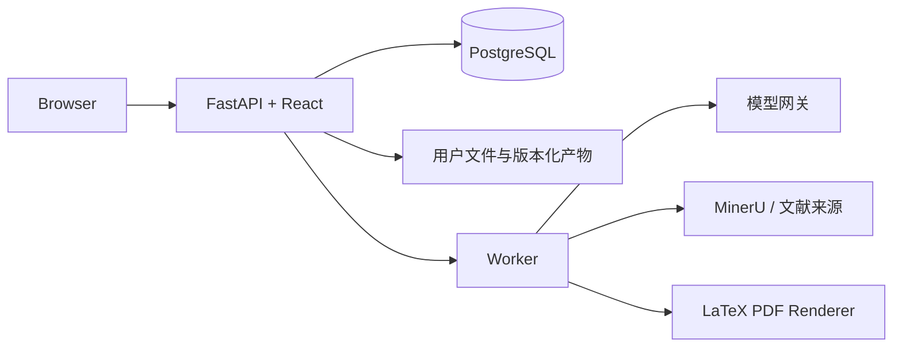

# Review Writer

Review Writer 是一个面向学术综述写作的 Web 系统，重点支持化学论文、反应式、机理图和结构图，同时保留通用学术主题的使用能力。

系统把文献准备、检索筛选、证据整理、大纲规划、章节写作、图片处理、全文修改和 Word/PDF 出版组织成一条可恢复、可追溯的流程。

## 主要功能

- 上传和解析 PDF，保存原文、元数据、Markdown 与图片；
- 多来源文献检索、筛选和项目论文确认；
- 生成证据矩阵、综述范围、学术目标、大纲和章节 Blueprint；
- 按章节分配论文、Claim 和引用，减少漏引与错误路由；
- 保留现有图片审核、AI 重绘、SVG 编辑和 Ketcher 化学结构编辑流程；
- 合并初稿，支持段落修改、质量评估和安全优化；
- 输出 DOCX，以及基于 LaTeX 的出版级 PDF；
- 支持用户、项目、任务、文件和余额隔离；
- 任务失败不会覆盖当前成果，刷新页面后可以继续查看任务状态。

## 写作流程

1. **文献库**：上传 PDF，完成 MinerU 解析和元数据确认。
2. **检索**：输入研究主题，生成查询并筛选项目论文。
3. **分析与大纲**：生成证据矩阵、综述范围、学术目标和 Blueprint。
4. **章节**：按照 Blueprint、论文路由和引用计划生成章节草稿。
5. **图像**：审核源图，按需重绘或编辑，通过后进入正文。
6. **初稿**：合并章节与图片，进行全文评估、修改和确认。
7. **终稿**：生成结论与总览图，完成发布检查，导出 Word 或 PDF。

系统只在关键学术决定处要求确认，不要求用户逐段反复操作。

## 逻辑架构


```mermaid
flowchart LR
    U[Browser] --> A[FastAPI + React]
    A --> D[(PostgreSQL)]
    A --> F[用户文件与版本化产物]
    A --> W[Worker]
    W --> G[模型网关]
    W --> M[MinerU / 文献来源]
    W --> P[LaTeX PDF Renderer]
```

- **React + TypeScript**：项目工作台和七阶段页面；
- **FastAPI**：登录、项目、任务、文件和管理接口；
- **PostgreSQL**：用户、余额、项目状态、任务、产物索引和版本关系；
- **Worker**：执行检索、解析、写作、图像和文档等长任务；
- **模型网关**：统一管理文本与图像模型调用、并发和费用；
- **文件工作区**：按用户保存 PDF、Markdown、JSON、图片、DOCX 和 PDF；
- **PDF Renderer**：使用 LuaLaTeX 生成双栏学术版式 PDF。

## Docker 部署

### 环境要求

- Git；
- Docker Desktop 或 Docker Engine；
- Docker Compose v2。

### 1. 获取代码

```powershell
git clone --branch dy-launch https://github.com/XuehaiWang/review-writer.git
Set-Location review-writer
```

### 2. 创建环境配置

```powershell
Copy-Item .env.hosted.example .env.hosted
```

至少修改以下配置：

```dotenv
REVIEW_WRITER_POSTGRES_PASSWORD=设置一个数据库密码
REVIEW_WRITER_CREDENTIAL_ENCRYPTION_KEY=设置一个随机加密密钥
REVIEW_WRITER_INTERNAL_WORKER_TOKEN=设置另一个随机内部令牌
REVIEW_WRITER_PDF_RENDERER_TOKEN=设置一个随机PDF令牌

REVIEW_WRITER_OPENAI_API_KEY=文本模型API密钥
REVIEW_WRITER_IMAGE_API_KEY=图像模型API密钥
REVIEW_WRITER_MINERU_API_TOKEN=MinerU令牌

REVIEW_WRITER_PUBLIC_ORIGIN=http://127.0.0.1:8770
REVIEW_WRITER_BIND_ADDRESS=127.0.0.1
REVIEW_WRITER_HTTP_PORT=8770
REVIEW_WRITER_SESSION_COOKIE_SECURE=false
REVIEW_WRITER_ADMIN_EMAILS=owner@example.com
```

如果文本和图像使用同一个服务商密钥，`REVIEW_WRITER_IMAGE_API_KEY` 可以留空。

登录页的“忘记密码”通过一次性邮件链接完成。需要自行配置 SMTP；未配置时按钮仍会提示用户联系管理员，但不会允许仅凭邮箱直接修改密码：

```dotenv
REVIEW_WRITER_PASSWORD_RESET_MINUTES=30
REVIEW_WRITER_SMTP_HOST=smtp.example.com
REVIEW_WRITER_SMTP_PORT=587
REVIEW_WRITER_SMTP_SECURITY=starttls
REVIEW_WRITER_SMTP_USERNAME=mailer@example.com
REVIEW_WRITER_SMTP_PASSWORD=邮件服务授权码
REVIEW_WRITER_SMTP_FROM_EMAIL=mailer@example.com
```

`REVIEW_WRITER_SMTP_SECURITY` 可选 `starttls`、`tls`（通常用于 465 端口）或 `none`；`none` 只适用于无需认证的可信内网邮件中继。

可以用下面的命令分别生成加密密钥和内部令牌：

```powershell
python -c "import secrets; print(secrets.token_urlsafe(32))"
```

如果使用自定义模型网关，还需要把它的域名加入：

```dotenv
REVIEW_WRITER_ALLOWED_PROVIDER_HOSTS=api.openai.com,mineru.net,你的模型域名
```

`.env.hosted` 包含密码和密钥，不要提交到 Git。

### 3. 启动服务

```powershell
docker compose --env-file .env.hosted up -d --build
docker compose --env-file .env.hosted ps
```

默认访问：

- 应用：<http://127.0.0.1:8770/>
- 健康检查：<http://127.0.0.1:8770/api/v1/health>

Compose 会同时启动 PostgreSQL、迁移任务、API、模型网关、PDF 渲染器，以及三个相互隔离的 Worker 池：科学写作、文献索引/文档发布、图片处理。默认并发分别为 `2 / 2 / 1`，可通过 `.env.hosted` 中的 `REVIEW_WRITER_SCIENTIFIC_WORKERS`、`REVIEW_WRITER_INGEST_DOCUMENT_WORKERS` 和 `REVIEW_WRITER_IMAGE_WORKERS` 调整。

### 4. 局域网访问

例如服务器地址是 `192.168.0.5`，希望使用 `5175` 端口：

```dotenv
REVIEW_WRITER_PUBLIC_ORIGIN=http://192.168.0.5:5175
REVIEW_WRITER_BIND_ADDRESS=0.0.0.0
REVIEW_WRITER_HTTP_PORT=5175
REVIEW_WRITER_SESSION_COOKIE_SECURE=false
```

重新启动：

```powershell
docker compose --env-file .env.hosted up -d --build
```

同一局域网中的设备访问：<http://192.168.0.5:5175/>。同时需要在系统防火墙中允许该端口。

### 5. 更新与停止

更新代码：

```powershell
git pull origin dy-launch
docker compose --env-file .env.hosted up -d --build
```

查看日志：

```powershell
docker compose --env-file .env.hosted logs -f api worker worker-ingest-document worker-image model-gateway
```

停止服务：

```powershell
docker compose --env-file .env.hosted down
```

不要执行 `docker compose down -v`，除非确定要永久删除数据库和用户文件。

## 使用方式

1. 打开网站并注册账号。
2. 使用 `.env.hosted` 中设置的管理员邮箱登录，可进入管理后台管理用户和余额。
3. 在文献库上传 PDF，等待解析完成并确认元数据。
4. 创建项目，填写研究主题，进入检索阶段筛选论文。
5. 生成并检查证据矩阵、大纲和 Blueprint。
6. 生成章节，检查论文分类、路由、Claim 和引用安排。
7. 在图像阶段选择、重绘或编辑图片，并确认最终使用版本。
8. 合并初稿，完成必要的全文评估与修改后确认初稿。
9. 生成终稿，检查发布问题，然后下载 DOCX 或 LaTeX/PDF。

如果余额不足，模型、MinerU 或图像任务不会开始；管理员充值后可以重新执行。

## 数据与备份

Compose 使用两个持久卷：

- `postgres_data`：用户、余额、项目、任务和产物索引；
- `review_state`：文献 PDF、解析结果、草稿、图片和导出文件。

正式使用时应同时备份这两个卷，并长期保存 `REVIEW_WRITER_CREDENTIAL_ENCRYPTION_KEY`。更换或丢失该密钥后，已有加密凭据可能无法读取。

数据库部署、迁移与回滚操作见 [PostgreSQL 工作流迁移手册](docs/postgresql-workflow-migration.md)。
