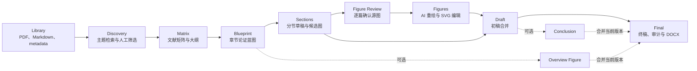

# Review Writer

Review Writer 是一个面向化学综述写作的本地、可审计工作流。它把论文入库、主题检索、文献矩阵、章节规划、分节写作、化学图像审核与重绘、初稿合并、终稿审计和 Word 导出连接成同一个项目流程。

当前实现以三个基础层保证阶段之间稳定衔接：

1. **持久状态**：SQLite 保存阶段运行、人工放行、失败记录和可恢复批处理进度。
2. **产物版本**：每个文件按 SHA-256 登记不可变版本，并维护当前版本指针。
3. **明确依赖**：输出记录它所依赖的输入版本；上游变化后，下游会被标记为过期。

Prefect 3 负责可执行阶段的编排、运行记录和有限重试，科学正文与图片仍以普通文件保存，便于检查、复制和归档。

## 工作流总览


```mermaid
flowchart LR
    A["Library<br/>PDF、Markdown、metadata"] --> B["Discovery<br/>主题检索与人工筛选"]
    B --> C["Matrix<br/>文献矩阵与大纲"]
    C --> D["Blueprint<br/>章节论证蓝图"]
    D --> E["Sections<br/>分节草稿与候选图"]
    E --> F["Figure Review<br/>逐篇确认源图"]
    F --> G["Figures<br/>AI 重绘与 SVG 编辑"]
    E --> H["Draft<br/>初稿合并"]
    G --> H
    H --> I["Final<br/>终稿、审计与 DOCX"]
    D -. 可选 .-> J["Overview Figure"]
    H -. 可选 .-> K["Conclusion"]
    J -. 合并当前版本 .-> I
    K -. 合并当前版本 .-> I
```

人工检查页面按以下顺序排列：

```text
Library -> Discovery -> Matrix -> Blueprint -> Sections
        -> Figure Review -> Figures -> Draft -> Final
```

## 主要能力

- **全局中英文界面**
  - 顶部语言切换器覆盖九个阶段，选择结果保存在浏览器并跨页面保持。
  - 仅翻译系统控件和运行状态，不改写论文正文、Markdown、JSON 或化学内容。
- **论文入库与结构化 metadata**
  - 管理 PDF、MinerU Markdown、图片和论文注册表。
  - Library 支持一次选择最多 30 个本地 PDF；逐篇校验、按 SHA-256 去重、
    提取全文并生成统一的 `Pxxx` metadata 与 Markdown。
  - 可检索文本 PDF 会立即供 Discovery 召回和 Sections 内容生成使用；
    扫描版 PDF 会登记入库并提示后续 OCR。
  - 审核标题、作者、摘要、路径及 8 类化学标签。
- **联网发现与开放获取下载**
  - 按主题检索 Crossref。
  - 结合 Europe PMC、Semantic Scholar 和可选的 Unpaywall 寻找开放获取 PDF。
  - 在 Library 弹窗内填写主题、年份、数量和可选联系邮箱。
  - 下载文件先校验 PDF，再登记到本地文献库；不会把 HTML 错误页当作论文。
- **可审计的主题检索**
  - 先生成结构化 query plan，再检索本地 metadata 和可选外部来源。
  - 支持缩写消歧、时间范围、化学概念、反应类型和组织方式。
  - 人工确认关键词与论文后，才允许进入矩阵阶段。
- **矩阵、蓝图与分节写作**
  - 生成逐篇阅读记录、文献矩阵、大纲候选和选定大纲。
  - 将章节目标、论点、论文角色、逻辑关系和图表需求固化为 blueprint。
  - 分节草稿与候选图绑定，保留来源关系。
- **化学图像工作流**
  - Figure Review 先逐篇选择最终源图，再进入批量重绘。
  - AI 重绘根据图像类型选择约束，批量进度和停止状态可恢复。
  - 支持使用原图或 AI 重绘图作为在线 SVG 编辑底图。
  - 全图转换为可编辑 SVG 路径，支持选择、框选、移动、删除、撤销、
    橡皮擦、文本、直线和多种箭头。
  - 保存后的人工编辑会更新重绘 manifest，并同步到已有初稿/终稿图片。
- **终稿与 Word 导出**
  - Conclusion 和 Overview Figure 是相互独立的可选产物。
  - Generate Final Draft 使用当时存在且为当前版本的可选产物，不强制串行点击。
  - 终稿统一图号及正文引用，清理内部插图标记和异常引用标签。
  - `Generate & Download Word` 根据当前 `final_draft.md` 重新生成 DOCX；
    `Download DOCX` 只下载已经确认与当前 Markdown 一致的最新文件。

## 阶段与主要产物

| 页面 | 作用 | 主要产物 |
|---|---|---|
| Library | 本地批量 PDF 入库、metadata 审核、联网检索和 OA 下载 | `review-library/uploads/Pxxx.{pdf,md}`、`review-library/metadata/papers/*.metadata.json`、`review-library/registry/papers.jsonl` |
| Discovery | 主题解析、候选召回、人工筛选 | `00_discovery/query_plan.draft.json`、`selected_discovery_results.json` |
| Matrix | 深读、矩阵、大纲候选与大纲选择 | `01_matrix_outline/literature_matrix.json`、`paper_reading_notes.json`、`selected_outline.md` |
| Blueprint | 章节论证计划和写作任务 | `01_matrix_outline/section_blueprint.json`、`02_section_drafting/section_tasks.json` |
| Sections | 分节草稿和图像候选 | `section_drafts.json`、`section_drafts.md`、`figure_candidates.json` |
| Figure Review | 逐篇确认最终源图 | `02_section_drafting/human_figure_review.json` |
| Figures | AI 重绘、人工 SVG 编辑和图片清单 | `03_figure_redraw/redrawn_figure_manifest.json`、`redrawn/*.png`、`manual_arrow_edits/*.svg` |
| Draft | 合并、润色、插图和引用整理 | `04_first_draft/first_draft.md`、`citations.json`、`figures/*` |
| Final | 可选结论/总览图、最终审计和 Word 导出 | `05_final_audit/final_draft.md`、`overview_figure.png`、`release_report.md`、`final_draft*.docx` |

## 快速开始

### 1. 获取 `dy` 分支

```powershell
git clone --branch dy https://github.com/XuehaiWang/review-writer.git
Set-Location review-writer
```

### 2. 创建工作环境

```powershell
py -m venv .venv
.\.venv\Scripts\python.exe -m pip install --upgrade pip
.\.venv\Scripts\python.exe -m pip install -r requirements-workflow.txt
```

`requirements-workflow.txt` 包含当前前端工作流所需的 Prefect、Pillow、
python-docx 和 pypdf。个别准备阶段还可能需要其对应 Skill 文档中列出的外部程序，
例如 MinerU 或 Tesseract。

### 3. 配置 `.env`

推荐启动前端后打开 `http://127.0.0.1:8765/settings`，在“API 服务商设置”中
填写 MinerU 密钥、文本 API 和图像 API。该页面把密钥保存在 Git 忽略的
`.review-writer/provider-settings.json`，读取时只向浏览器返回掩码；保存后会立即
应用到新启动的任务。每次执行阶段脚本时都会重新合并当前工作区的 `.env` 与本地
设置，并显式传给子进程，因此不依赖启动前端时所在终端的临时环境变量。设置按
项目目录隔离；复制到新的部署目录后，需要在新目录对应的设置页中重新保存一次。

也可以继续通过项目根目录的 `.env` 手动配置。若两者同时存在，本地设置页保存的
值优先：

在项目根目录创建 `.env`。下面仅为变量结构示例，请填写自己的服务地址、
模型名和密钥：

```dotenv
# 文本模型：OpenAI 或兼容服务
OPENAI_BASE_URL=https://api.openai.com/v1
OPENAI_API_KEY=replace-with-your-key
REVIEW_METADATA_MODEL=your-text-model
REVIEW_WRITING_MODEL=your-text-model
REVIEW_CONCLUSION_MODEL=your-text-model

# 图像编辑可与文本模型使用不同令牌和传输接口
IMAGE_OPENAI_BASE_URL=https://www.micuapi.ai/v1
IMAGE_OPENAI_WIRE_API=chat-completions
IMAGE_OPENAI_API_KEY=replace-with-your-vip_2_image-key

# 可选：文献服务与本地 OCR
UNPAYWALL_EMAIL=you@example.org
SEMANTIC_SCHOLAR_API_KEY=
MINERU_API_TOKEN=
TESSERACT_CMD=C:\Program Files\Tesseract-OCR\tesseract.exe
```

注意：

- `.env` 已被 Git 忽略，不要把真实密钥写入 README、提交记录或截图。
- 文本服务需要兼容项目所调用的 `chat/completions` 或 `responses` 接口。
- 标准 AI 重绘按 `IMAGE_OPENAI_WIRE_API` 使用 `images/edits` 或
  `chat/completions`，并把当前 Stage 6 源图随请求发送。严格机理箭头编辑固定使用
  `images/edits`，因为它不能降低为普通聊天图像通道。
- Unpaywall 邮箱不是下载的强制条件；未填写时仍会尝试其他合法开放获取来源。

### 4. 启动本地前端

```powershell
.\.venv\Scripts\python.exe view\serve_review_dashboard.py `
  --review-root . `
  --host 127.0.0.1 `
  --port 8765
```

浏览器打开：

```text
http://127.0.0.1:8765
```

如需在可信局域网内临时访问，可将 `--host` 改为 `0.0.0.0`，然后让同一局域网
中的用户访问 `http://<本机局域网IP>:8765`。该前端没有内置多用户认证，
不要直接暴露到公网，也不要在不可信网络中开放防火墙端口。

## 数据、状态与版本

### 科学产物

科学内容继续保存在普通文件中：

```text
review-library/
├─ metadata/papers/       规范化论文 metadata
├─ registry/papers.jsonl  论文注册表
├─ downloads/             联网下载的本地 PDF（默认不提交 Git）
└─ uploads/               本地上传的 PDF 与提取出的全文 Markdown

review-projects/<project-id>/
├─ 00_discovery/
├─ 01_matrix_outline/
├─ 02_section_drafting/
├─ 03_figure_redraw/
├─ 04_first_draft/
└─ 05_final_audit/
```

`review-library/` 是运行时文献库：除占位文件外不会提交到 Git。干净克隆首次启动时
会自动创建上述目录；每个用户的 metadata、注册表、PDF 和 Markdown 都只保留在其
本地部署中。

### 共享 taxonomy profile

metadata 构建、校验和第二阶段检索统一通过
`review_writer_core/taxonomy.py` 加载同一套分类规则。默认 profile 为
`review_writer_core/taxonomies/allene.py`，也可配置：

```dotenv
REVIEW_TAXONOMY_PROFILE=allene
# 或使用自定义文件（绝对路径或相对项目根目录）
REVIEW_CLASSIFICATION_RULES=review_writer_core/taxonomies/my_topic.py
```

生成的 metadata 与 Discovery 产物会记录 taxonomy 文件路径和 SHA-256，便于判断
后续结果是否仍依赖当前规则版本。

### SQLite 业务状态

服务首次启动时创建：

```text
.review-writer/workflow.sqlite3
```

它只保存编排 metadata，不存放论文正文或图片二进制：

- 项目和阶段依赖；
- 阶段 run、状态、错误与 Prefect run ID；
- 文件 SHA-256、逻辑名称、产物版本和当前版本；
- 输出版本到输入版本的依赖关系；
- 批量 AI 重绘等长任务的进度与停止状态。

上游文件发生变化后，依赖旧版本的下游产物会显示为过期，避免把旧图片、
旧章节或旧 DOCX误当作当前结果。可通过只读接口查看项目状态：

```text
GET /api/project/<project-id>/workflow-state
```

### Handoff 文件

各阶段仍保留 JSON handoff，方便人工检查、脚本调用和项目迁移。新 handoff
会记录内容哈希和版本快照；旧项目会继续兼容，并在下一次成功执行相应阶段后
升级为新的版本规则。

## Prefect 编排

前端启动时启用 Prefect 3：

- 每个可执行阶段生成独立 flow run 和 task run；
- HTTP 429、500、502、503、504、连接中断和超时可自动重试一次；
- 400、401、403、404 和确定性校验错误不会盲目重试；
- 批量重绘仍按项目逻辑逐张处理，业务进度写入 `workflow.sqlite3`；
- Prefect 按 Windows 当前账户使用独立目录：
  `.review-writer/prefect-<account>/`，避免不同账户之间的 ACL 冲突。

默认使用按需启动的本地临时 Prefect 服务。需要持续查看 Prefect UI 时，可以
单独启动服务：

```powershell
$env:PREFECT_HOME=(Resolve-Path '.review-writer\prefect-local').Path
.\.venv\Scripts\prefect.exe server start --host 127.0.0.1 --port 4200
```

在另一个 PowerShell 窗口中启动 Review Writer：

```powershell
$env:PREFECT_API_URL='http://127.0.0.1:4200/api'
.\.venv\Scripts\python.exe view\serve_review_dashboard.py `
  --review-root . `
  --host 127.0.0.1 `
  --port 8765
```

Prefect UI 地址为 `http://127.0.0.1:4200`。

## 项目结构

```text
skills/                 各阶段 Skill、规则、脚本和校验器
view/                   本地前端、HTTP API、持久状态和 Prefect flow
review_writer_core/      跨阶段共享代码与可配置 taxonomy profiles
review-library/         本地运行时 metadata、注册表和文献（Git 忽略）
review-projects/        每个综述项目的阶段产物（本地工作数据）
examples/reference-reviews/  示例综述、参考 PDF 和测试夹具
prefect.toml            Prefect 本地运行配置
requirements-workflow.txt
```

主要入口：

- [前端使用说明](view/前端使用说明.md)
- [Skills 工作流说明](skills/技能工作流说明.md)
- [总编排器](skills/review-writing-orchestrator/SKILL.md)
- [联网文献获取](skills/review-literature-acquisition/SKILL.md)
- [图像统一风格与编辑](skills/review-figure-style-redraw/SKILL.md)
- [最终审计与发布](skills/review-final-audit-release/SKILL.md)
- [DOCX 导出](skills/review-export-docx/SKILL.md)

## 安全与使用边界

- 仅下载合法开放获取或用户有权访问的论文，不绕过付费墙、验证码或访问控制。
- AI 重绘不能代替化学正确性审核；化学键、原子、立体化学、箭头方向和文字
  必须由人工确认。
- SVG 编辑保存的是人工修改结果，仍应在 Draft 和 Final 阶段检查实际插图。
- 删除项目会永久删除 `review-projects/<project-id>` 及其输出，界面要求输入完整
  project ID 二次确认。
- `review-projects/`、下载文件、`.env` 和 `.review-writer/` 都属于本地工作数据，
  推送代码前应再次检查 `git status`，避免提交敏感内容。
