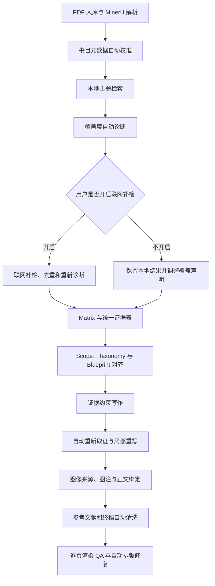

# Review Writer 自动准确性提升改进方案

## 1. 文档定位

本文基于 `new` 项目最终综述、各阶段产物以及对应审稿意见，整理项目从书目入库、主题检索、Matrix、Blueprint、证据提取、章节写作、图像处理到终稿导出的准确性改进方案。

本方案的重点不是增加更多控制门，也不是让用户逐条处理质量问题，而是让系统优先完成：

- 自动发现错误；
- 自动采用更可靠的数据；
- 自动重新取证；
- 自动缩小或修正不受支持的表述；
- 自动清理参考文献、图注和排版问题；
- 只把系统无法可靠决定的少量问题交给用户。

检索覆盖不足是本方案中的例外：系统只自动诊断并提示，不自动开启联网检索。是否扩大到联网检索由用户手动确认。

## 2. 已确认的主要问题

### 2.1 书目元数据错误向后续阶段传播

PDF 入库时可能把下载日期、PDF 创建日期或网页访问日期识别为出版年份。例如原论文正文中同时存在正式出版年份和“Downloaded 2026”，系统可能保存 2026。

联网书目核验即使找到了正确的 Crossref/OpenAlex 候选，当前冲突处理也可能因为本地值与联网值不同而保留错误本地值。Discovery、Matrix、Blueprint、正文和参考文献随后继续使用该错误年份。

### 2.2 检索覆盖不足没有形成明确的用户决策

`new` 项目标题限定 2015–2026，但本次实际只检索本地文献库，外部来源处于关闭状态。系统虽然能统计年份分布，却没有把“年份空缺、方法类别空缺、代表性研究不足”转换成清晰提示，也没有让用户明确选择：

1. 开启联网补检；
2. 保持当前本地结果并缩小覆盖声明。

### 2.3 Scope、分类和正文结构没有完全对齐

用户标题是 2015–2026，Blueprint 却根据 Matrix 推导出其他时间范围；章节又混合底物、反应模式、产物类别和 `Cross-category` 兜底项，但诊断仍然通过。

项目内部已有 Scope Contract 和 Taxonomy Contract，不需要增加新的平行体系，只需要提高现有契约的优先级和一致性检查。

### 2.4 证据提取存在，但没有形成自动修正闭环

当前 MinerU、全文索引和科学事实提取已经能形成带论文、页码和 chunk 来源的证据。主要问题发生在证据生成之后：

- 检索问题过宽，容易把“命中任意相关词”误认为目标事实充分；
- 写作前没有形成统一的跨论文比较字段；
- 草稿评估已经发现部分陈述证据不足，但没有自动重新取证和局部重写；
- 用户接受质量提示后，问题可以原样进入终稿。

### 2.5 图像、参考文献和导出继续放大上游错误

- 图像可能来自不合适的论文或不合适的 Figure 类型；
- 图像可能被放入错误章节，或集中堆积到结论；
- 总览图可能生成没有数据支持的 `moderate`、`cost-effective`、`sustainability` 等评价；
- 参考文献直接读取 Matrix 中未经清洗的字段；
- 先按 Matrix 编号、再删除未引用文献，会产生不连续编号；
- PDF QA 只做结构检查时，无法发现图像漂移、大片空白、图注乱码和模板残留。

## 3. 总体原则

### 3.1 自动修复优先于提示和阻断

系统发现问题后的默认处理顺序为：

```text
自动重新获取可靠数据
  → 自动修正或缩小表述
  → 自动局部重写
  → 自动重新检查
  → 无法可靠决定时再提示用户
```

只有文件损坏、引用目标不存在且无法恢复、终稿正文不可渲染等确定性完整性问题，才需要停止对应产物发布。普通质量警告不应阻断整个流程。

### 3.2 保留现有证据链，不建设第二套平台

继续使用现有：

- MinerU 精确解析；
- Library Metadata 和书目核验记录；
- PostgreSQL Artifact 版本；
- Discovery、Matrix、Blueprint、Sections、Figures、Draft、Final 阶段服务；
- Evidence Package 和科学事实；
- FastAPI、任务队列与模型网关。

不新增独立向量数据库、知识图谱、通用质量中心或第二套书目数据库。新字段扩展现有产物和现有服务。

### 3.3 权威来源优先，但保护人工修改

自动修正只覆盖低置信度机器提取值。用户已经人工确认或修改的书目字段不能被后台任务静默覆盖；发现新冲突时只提示差异。

## 4. 目标流程



## 5. 详细改进方案

### 5.1 书目元数据自动校准

#### 5.1.1 MinerU 已有信息与职责边界

MinerU 通常已经把论文首页、页眉页脚和正文中的日期文字保存在 Markdown、layout JSON 或内容列表中。例如同一篇论文中可能同时出现：

```text
Received 22 October 2012
Accepted 3 January 2013
Published online 10 February 2013
Downloaded 16 June 2026
```

这说明多数年份错误不需要重新运行 MinerU，也不表示 MinerU 没有解析出出版日期。真正的问题是当前 Metadata 提取没有充分识别日期的语义角色，可能把 PDF 创建日期、下载日期或第一个出现的年份当成出版年份。

MinerU 在这条链路中的职责是保留可定位的原始文字和版面信息，不负责决定最终规范出版年份。规范出版日期必须由 Metadata 校准逻辑结合日期标签、DOI、期刊卷期和权威书目来源确定。

不同日期的使用规则如下：

| 日期类型 | 处理方式 |
|---|---|
| 出版社/Crossref 的 `published-print` 或正式卷期年份 | 用于 `bibliographic_year` |
| `Published online`、`First published`、`Online First` | 用于 `first_publication_date`；尚无正式卷期时也用于临时参考文献年份 |
| `Received`、`Revised`、`Accepted` | 不采用 |
| `Downloaded`、`Accessed`、`Retrieved` | 不采用 |
| PDF `CreationDate`、`ModifiedDate` | 不采用 |
| 网页抓取、上传、解析和任务时间 | 不采用 |
| 本文参考文献列表中的年份 | 只能作为其他论文的候选，不可直接作为本文年份 |

如果在线出版年份与正式卷期年份不同，不能只保存一个含义不明的 `year`。规范 Metadata 至少区分：

- `first_publication_date`：论文首次公开发表日期，默认用于判断是否落入用户限定的检索时间范围；
- `bibliographic_year`：正式卷期对应年份，默认用于生成终稿参考文献；
- `publication_status`：`online_first|early_view|issue_assigned|unknown`。

例如论文在 2026 年 Online First、2027 年编入正式卷期时，可以按照 `first_publication_date=2026` 纳入截至 2026 年的主题范围，终稿参考文献则使用期刊正式卷期记录。尚未分配卷期时暂用在线出版年份，并保留 Online First/Early View 状态。Scope Contract 必须记录本项目采用的时间范围判断口径，避免检索统计和终稿引用混用同一个年份字段。

#### 5.1.2 年份提取规则

出版年份的来源优先级调整为：

1. DOI 对应的出版社/Crossref/OpenAlex 正式记录；
2. PDF 首页明确的期刊卷期、页码和版权行；
3. 正文中的规范引文信息；
4. PDF 文档属性和文件名只作为低置信度候选。

下列内容不得直接作为出版年份：

- `Downloaded`、`Accessed`、`Retrieved` 后的日期；
- PDF 创建、修改或扫描日期；
- 网页抓取时间；
- 当前项目年份；
- 文件夹或任务时间戳。

无法可靠确认时，对应的 `first_publication_date` 或 `bibliographic_year` 保存为 `null`，不得自动使用当前年份填充。兼容旧接口的 `year` 只能由已经确认的规范字段派生。年份未知的论文可以保留在候选列表中，但不计入任何年份的覆盖数量，等待后续自动书目核验或用户修正。

#### 5.1.3 自动采用权威候选

使用简化的高置信规则，不引入复杂评分平台：

- 从 PDF 正文提取出的 DOI 首先只是候选，因为它可能来自本文参考文献列表；
- DOI 对应的权威记录只有在标题与当前论文高度一致，并且作者至少部分一致时，才能确认为当前论文 DOI；
- DOI 已确认属于当前论文后，对应的出版社/Crossref 正式书目记录优先；
- 没有 DOI 时，标题高度一致，并且作者、期刊中至少一项一致，允许用权威来源修正低置信度本地字段；
- 两个独立权威来源给出相同结果时，可修正低置信度本地值；
- 只存在单项弱相似或多个权威来源互相冲突时，不自动修改，显示待复核提示；
- 本地 Metadata 原有置信度必须被保留，不能把所有已有字段统一视为最高置信度。

自动修正后继续使用现有 Metadata 更新和失效传播机制，只让真正依赖旧书目内容的下游产物过期。

### 5.2 检索覆盖诊断与手动联网补检

本节中的“联网补检”专指根据主题搜索并新增候选论文，必须由用户手动开启。它与书目核验不是同一操作：书目核验只核对已经上传或已经入库论文的标题、DOI、作者、期刊和日期，不扩大候选论文集合，可以按 5.1 的规则自动运行。两类任务必须使用不同的任务类型、状态和前端文案，避免用户把自动书目校准误解成后台自动扩大检索。

#### 5.2.1 系统自动做什么

Discovery 完成本地检索后，自动生成可解释的覆盖诊断：

- 用户声明的时间范围；
- 每年文献数量和明显空白年份；
- 主要主题簇或方法类别分布；
- 已配置但未启用的数据源；
- 结果是否过度集中于少数年份、期刊或研究团队；
- 可能遗漏的查询术语和主题簇；
- 当前结果更适合“代表性综述”还是“限定本地语料综述”。

诊断不能虚构“已覆盖领域 90%”等无法证明的精确比例。

#### 5.2.2 前端提示与用户操作

当发现明确缺口时，在 Discovery 页面显示非阻断提示，例如：

> 当前检索仅使用本地文献库。2017–2021 年结果较少，且部分主题簇没有代表性论文。是否开启联网补检？

提供两个主要动作：

- `开启联网补检`：由用户手动确认后调用当前可用的 Crossref、OpenAlex、Semantic Scholar 等来源；
- `保持当前结果`：继续当前流程，但将 `coverage_mode` 记录为 `local_bounded`，自动把生成稿调整为“基于当前本地语料的代表性综述”，不能继续宣称完整覆盖整个时间范围。

系统不得仅因为诊断到覆盖不足就自动联网，也不得在后台静默扩大检索范围。

该提示是非阻断状态。用户没有点击“开启联网补检”而继续进入 Matrix 时，默认按“保持当前结果”处理，不启动任何联网主题检索。项目创建时的原始主题继续保留；系统只自动调整生成稿中依赖覆盖范围的标题表述、摘要、Review Methods、Introduction、Conclusion 和总览图说明。例如完整覆盖证据不足时，可把生成标题改为 `Selected Advances ...`，用户仍可在 Final 中编辑。

#### 5.2.3 版本和失效边界

- 只显示覆盖提示不会使 Matrix 及后续内容失效；
- 用户点击联网补检并产生新的 Selected Papers 后，才按现有依赖关系使 Matrix 及后续阶段过期；
- 用户保持当前结果或直接继续时，不使 Matrix、全文索引和科学事实失效；只更新 Scope、Front Matter、Review Methods 以及正文和总览图中依赖完整覆盖声明的局部内容；
- 已进入 Matrix 后再次发现缺口，仍由用户明确点击补检后才重建后续内容。

### 5.3 Scope、Taxonomy 与 Blueprint 自动对齐

#### 5.3.1 Scope 优先级

- 用户明确输入的主题、时间范围和纳入条件优先；
- Matrix 分布只能用于判断覆盖情况，不能静默改写用户范围；
- 用户拒绝联网补检且现有语料不能支持完整范围时，自动降低覆盖声明，而不是伪造完整覆盖；
- 检索日期、数据库、查询式、纳入排除条件和最终论文数量自动生成可公开的 Review Methods 内容。

#### 5.3.2 单一一级分类轴

Blueprint 必须选择一个一级分类轴，例如：

- 研究对象/底物；
- 方法或反应模式；
- 机理；
- 时间演进；
- 应用场景。

其他属性作为二级标签。系统发现同级章节混用不同逻辑时，自动重新聚类并解释调整原因。

`Cross-category` 不能作为普通兜底章节自动生成；它只能用于真正的跨方法比较或总结。

Blueprint 确认后仍允许系统根据证据分布和实际写作结果进行重构，但必须生成新的 Blueprint 版本、记录触发原因和章节映射，并保留旧版本用于回滚：

- 尚未生成章节内容时，可以自动应用新版本，并在页面显示结构调整说明；
- 已生成章节但没有用户人工修改时，可以自动应用新版本，迁移论文、证据、可复用段落和图像候选，只重新生成受影响章节；
- 已存在用户人工修改或人工确认内容时，系统生成重构候选和差异说明，复用现有 Blueprint 确认交互，由用户确认后再替换；
- 重构不得直接覆盖旧 Artifact，也不得无记录地清空已生成内容。

自动重构可由分类轴混用、章节证据不足、论文或证据高度重复、主论文无法合理分配、大量内容进入兜底章节、跨章节重复写作或实际论证顺序不通等结构性问题触发。普通单段质量问题只进行局部重写，不触发整份 Blueprint 重构。

#### 5.3.3 通用基础知识框架

不同领域通过 Taxonomy Profile 提供最小基础知识清单。若没有领域规则包，系统根据主题提出基础概念候选，并从已纳入的权威资料中取证后加入 Blueprint。

对于化学综述可包括构型定义、测定方法、稳定性、术语和可比指标，但不能把联烯专用内容写死到通用流程。

基础概念所需的经典资料可以早于用户限定的主研究时间范围，但必须标记为 `context/background evidence`：

- 只用于定义、历史背景、术语和基础理论；
- 不计入时间范围内的主研究覆盖数量；
- 不得被写成该时间段的新方法或代表性进展；
- 在参考文献和证据链中继续保留正常来源追踪。

### 5.4 结构化证据表与比较性写作

在现有 Matrix 和 Evidence Package 中扩展统一比较字段，不增加新的证据数据库。

通用字段包括：

- 研究对象或样本；
- 方法、条件和关键变量；
- 主要结果及其单位；
- 选择性、性能或效应指标；
- 适用范围；
- 局限性；
- 机理或因果解释的证据等级；
- 验证方法；
- 规模、可重复性或外部验证；
- 绝对构型、统计方法等领域专用字段。

字段缺失时保持空白，模型不能补猜。章节写作先从结构化证据表形成比较关系，再生成自然语言正文。

重复的谨慎性说明应合并：每节可以有一处集中说明证据边界，不在每篇论文后反复使用相同免责声明。

### 5.5 草稿后的自动取证与局部修正

当前 Draft 评估结果要直接驱动自动修复，而不只是生成分数和提示。

每个问题必须绑定：

- `claim_id` 或 `paragraph_id`；
- 涉及的论文；
- 缺失的证据类型；
- 原始数值、引文和受保护术语；
- 推荐修复动作。

自动处理顺序：

1. 使用具体实体、数值、方法名和 Figure/Table 编号重新检索目标论文；
2. 找到直接证据时，补充精确来源并重写相关句子；
3. 只有部分证据时，自动缩小陈述强度和适用范围；
4. 证据与正文矛盾时，重新定位原论文页面和相邻上下文；确认是直接证据后再按原论文纠正正文；
5. 找不到支持时，删除该陈述，不把“没有检索到”写成“领域中不存在”；
6. 对修改后的段落重新评估；
7. 默认最多执行两轮局部修正，避免整篇反复生成。

自动重写必须锁定引用、数字、化学式、专有名词和用户手工修改内容。只有仍存在无法解决的科学歧义时，才提示用户查看。

删除无证据陈述后，如果对应论文原本被标记为该章节的主论文，系统不能为了满足“主论文必须引用”而保留空泛或无证据引用。应依次：

1. 在同一论文中寻找与章节论点直接相关的其他已支持事实；
2. 找到后把论文重新分配到合适段落；
3. 找不到时将其从 `primary` 降为 `supporting/context`，或移出该章节分配；
4. 重新计算章节覆盖状态，但不强制生成引用。

### 5.6 图像来源、图注与正文自动绑定

继续采用现有 Figure Artifact 和 Figure Manifest，增加以下约束：

- 图像必须绑定来源论文、原 Figure/Scheme 编号、证据和目标章节；
- 默认只从目标章节的主论文中选择核心图；
- 综述论文中的二手图、优化条件表和 Supporting Information 图片默认不作为核心方法图；
- 图像角色必须与目标段落任务匹配，不能只按论文第一次出现的位置插入；
- 结论部分默认只保留一张基于证据表生成的比较表或总览图，不堆积原论文图片；
- 总览图中的评价词必须能回溯到结构化数据，不允许图像模型自由增加排名、成本或可持续性结论；
- 图注自动加入来源参考文献和 DOI，但不能因为已经注明来源就自动声称取得复用许可；
- 图像权利状态区分 `source_attributed|license_verified|permission_unknown|original_synthesis`；只有存在明确许可记录时才能标记 `license_verified`；
- `Adapted/Reproduced` 描述只表示图像与来源的关系，不能替代版权许可状态；
- 无法确认复用权限时，优先根据经过核验的事实独立设计新的信息组织、构图和版式，标记为 `original_synthesis`；不能通过描摹原图或只改变颜色、字体来规避来源与版权问题；
- 无法形成可靠独立图且权限未知时，暂不插入该图并显示非阻断提示。

图像处理失败时优先自动重新匹配、重新概括图注或使用中性图注。一张非关键图片不能阻断整篇综述。

### 5.7 参考文献自动重建

终稿参考文献不能直接拼接未经核验的 Matrix 原始字段。

生成流程改为：

1. 收集终稿实际引用的 `paper_id`；
2. 从当前已核验的规范 Metadata 读取书目信息；
3. 清除 `Cite This`、`Read Online`、`Article Recommendations`、`Supporting Information` 等网页残片；
4. 合并重复标点、作者符号和期刊年份；
5. 检查 DOI、标题、年份和期刊是否相互一致；
6. 只对实际引用文献重新从 1 连续编号；
7. 同步重写正文引用编号；
8. 保存 `paper_id → final_reference_number` 映射，供 PDF、DOCX 和网页 Preview 共用。

### 5.8 终稿和 PDF 自动清洗

Final 阶段在导出前自动执行：

- 删除内部模板名称、版本号和工作流残片；
- 清理未解析 HTML、Markdown、LaTeX 和 Unicode 替换字符；
- 修复图像路径、孤立图注和缺失调用；
- 检查标题、摘要、关键词、作者和公开 Methods 是否完整；
- 检查时间范围与参考文献年份是否一致；
- 检查章节标题与 Blueprint 主轴是否一致。

PDF 生成后渲染全部页面并自动检查：

- 异常空白页或大片空白；
- 图像漂移到其他章节；
- 图注跨页或溢出；
- 图片裁切、重叠和低分辨率；
- 参考文献断裂；
- 页眉、模板文字和题目信息错误。

能够通过重新排版解决的问题自动重排一次。仍无法修复的问题显示具体页码和原因，并允许下载带警告版本；只有文件不可用或正文不可见时才停止发布。

## 6. 用户交互边界

### 6.1 新增但不强制的用户决策

本方案只新增一个主要用户决策：

> 当系统诊断出检索覆盖不足时，由用户选择是否开启联网补检。

该选择不应弹出阻断式对话框，建议在 Discovery 页面使用状态栏或提示卡展示。

### 6.2 默认自动完成的工作

- 高置信书目纠错；
- Scope 与当前语料声明对齐；
- 分类轴调整；
- 结构化证据表生成；
- 草稿重新取证和局部重写；
- 图像重新匹配和图注清理；
- 引用连续编号和参考文献清洗；
- 终稿标记清理和 PDF 自动重排。

### 6.3 仅在无法可靠决定时提示

- 多个权威书目来源互相矛盾；
- 用户人工书目与出版社记录冲突；
- 学术分类存在两个同样合理的主轴；
- 图像复用权限无法确认且用户仍希望保留原图；
- 原论文自身存在互相矛盾的数据或构型说明。

这些提示默认不增加新的阶段，不要求用户逐条确认后才能继续。

## 7. 实施边界与技术选择

### 7.1 复用当前服务

| 改进内容 | 放入现有位置 |
|---|---|
| 书目置信度和自动纠错 | Library / bibliography audit |
| 覆盖诊断和手动联网补检 | Discovery / Planning |
| Scope、Taxonomy 和 Blueprint 对齐 | Planning / Blueprint |
| 证据字段和重新取证 | Matrix / Sections Evidence Package |
| 局部重写与复评 | Draft feedback loop |
| 图像来源、角色和段落绑定 | Figures / Figure Manifest |
| 参考文献连续编号和清洗 | Draft assembly / Final |
| 页面级视觉检查 | Final PDF QA |

### 7.2 不引入的技术

- 不新增独立向量数据库；
- 不新增知识图谱；
- 不新增第二套任务队列；
- 不新增平行 Quality Service；
- 不引入自动浏览器抓取作为主检索方式；
- 不为单一化学主题编写无法复用的硬编码判断；
- 不让视觉模型独立判断化学结构真实性。

## 8. 实施顺序

### P0：先修复会造成事实失真的问题

1. 修复年份识别和书目权威来源优先级；
2. 让书目核验结果能够自动修正低置信度规范 Metadata；
3. 增加覆盖不足提示和用户手动开启联网补检；
4. 让 Draft 评估自动触发重新取证、局部重写和复评；
5. 从规范 Metadata 重建连续编号参考文献；
6. 清除网页抓取残片和终稿模板残片。

### P1：提高综合与图文一致性

1. Scope、Taxonomy 与 Blueprint 自动对齐；
2. 建立统一比较字段并驱动比较性写作；
3. 自动补充公开的 Review Methods；
4. 加强图像来源、角色、正文段落和证据绑定；
5. 总览图严格由结构化证据生成。

### P2：提高出版质量

1. PDF 全页渲染 QA；
2. 自动重排图像、图注和参考文献；
3. 历史项目按需重新校准书目、重写受影响段落并重建终稿。

## 9. 历史项目处理

对 `new` 等已经完成的项目，不要求重新上传 PDF 或重新执行全部 MinerU 解析。

推荐迁移顺序：

1. 对现有 Library Metadata 重新运行书目校准；
2. 重新生成覆盖诊断并显示联网补检提示；用户没有开启时默认保持本地结果继续；
3. 若不补检，自动调整 Scope、Front Matter、Methods 和其他完整覆盖声明；
4. 重建 Matrix 中受书目修正影响的字段；
5. 复用现有全文索引和科学事实，重新生成统一证据表；
6. 只重写受影响的章节和段落；
7. 重新匹配图像并重建参考文献、Final、DOCX 和 PDF。

历史项目按实际变化分级失效：

| 变化类型 | 推荐处理 |
|---|---|
| 作者格式、期刊简称、页码或标点清理，论文身份不变 | 只重建参考文献、Final、DOCX 和 PDF |
| 年份修正但论文仍处于用户限定范围内 | 重算覆盖诊断和 Matrix 派生字段；正文科学事实未变化时不整篇重写 |
| DOI/论文身份改变，或年份修正使论文跨越纳入范围边界 | 重新计算 Selected Papers，并使 Matrix、Blueprint 和后续依赖内容过期 |
| 用户联网补检并新增或删除论文 | 使 Matrix、Blueprint 和后续阶段过期 |

因此，“联网新增论文”不是唯一需要重建 Matrix 和 Blueprint 的情况；任何改变论文身份或纳入资格的 Metadata 修正都必须按现有依赖关系传播。

## 10. 验收标准

### 10.1 书目准确性

- MinerU 已解析出的 `Published` 日期能够被识别，不需要为修正年份重复解析全文；
- `Received`、`Accepted`、`Downloaded` 和 PDF 创建日期不会覆盖正式出版日期；
- `first_publication_date`、`bibliographic_year` 和 `publication_status` 职责明确，Online First 不会因卷期年份不同而被错误排除；
- 从全文提取的 DOI 只有在标题和作者确认属于当前论文后才能写入规范 Metadata；
- 已确认 DOI 对应的期刊和年份与出版社记录一致；
- 低置信度本地字段可以被高置信权威来源自动修正；
- 用户人工确认字段不会被静默覆盖；
- 参考文献不存在网页抓取残片和不连续编号。

### 10.2 检索行为

- 本地覆盖不足时显示年份、主题簇和数据源缺口；
- 系统不会自动开启联网检索；
- 自动书目核验不会新增候选论文，并与主题联网补检显示为不同任务；
- 只有用户点击后才新增联网论文并使后续阶段过期；
- 用户拒绝或忽略联网补检提示后，Matrix 和事实证据保持有效，但生成稿不会继续声称不受支持的完整覆盖。

### 10.3 证据与写作

- 正文中的数值、结论和方法描述能够定位到直接证据；
- 评估发现的可修复问题会自动重新取证和局部重写；
- 证据不足的陈述会被缩小或删除，不会被模型补猜；
- 主论文没有可支持的直接论点时会被重新分配或降级，不会为了覆盖率强制引用；
- 时间范围外的经典基础资料只作为 `context/background evidence`，不计入主研究覆盖；
- 章节中存在真实的跨论文比较，而不是连续单篇摘要；
- 谨慎性免责声明不会在多段机械重复。

### 10.4 图像和终稿

- 图像来源、Figure/Scheme 编号、目标章节和正文调用一致；
- 来源标注、复用许可和系统独立生成图具有不同状态，不会把引用来源误当成版权许可；
- 总览图没有无证据评价；
- 图注没有原论文内部编号、LaTeX 残片和网页残片；
- 结论不会堆积大量来源图；
- PDF 不再出现模板残留、图像漂移、异常空白和未完成参考文献排版。

## 11. 最终结论

本轮改进的核心不是建立更严格的“投稿门”，而是打通一条自动准确性修复链：

```text
书目自动校准
  + 覆盖不足自动诊断、用户手动决定联网补检
  + Scope 和分类自动对齐
  + 证据表驱动写作
  + 草稿问题自动重新取证和局部重写
  + 图像与来源自动绑定
  + 参考文献和 PDF 自动清洗
```

这套方案保留当前项目已经具备的 MinerU、全文索引、科学事实、证据追踪和阶段产物机制，重点修复错误进入证据链之前和终稿输出之前的两个薄弱环节。除是否开启联网补检外，不增加新的强制人工确认步骤。
