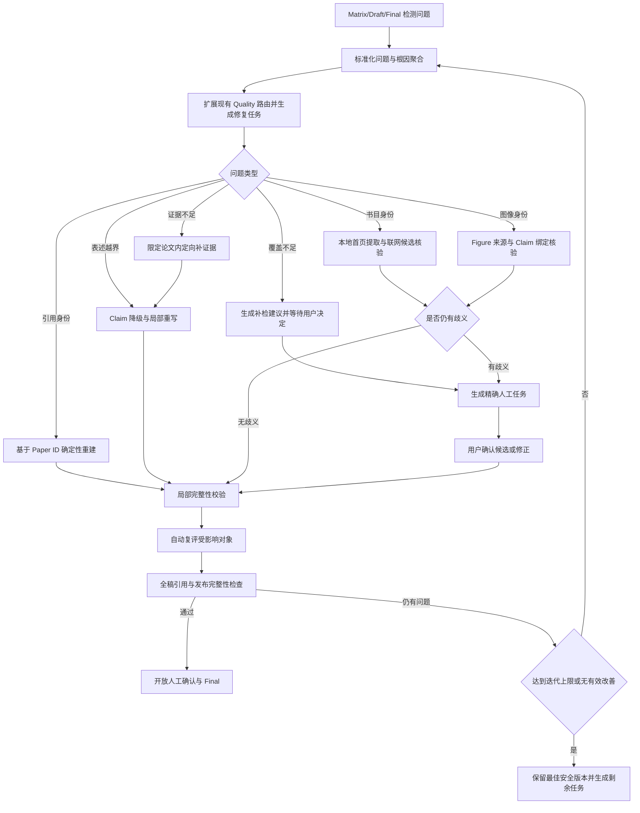

# Review Writer 书目核验与质量问题自动修复闭环功能优化方案

## 1. 文档定位

本文针对 Review Writer 当前两个尚未形成完整产品闭环的功能进行专项优化：

1. Matrix 能够发现规范书目信息待核验，但只显示状态，不能直接帮助用户解决；
2. Draft 能够评估并暴露引用、证据、图像和写作问题，但部分问题没有可执行路由，导致人工确认被硬门禁阻塞，用户只能反复评估或返回前序阶段自行查找原因。

本文面向所有项目和所有学科，不针对 `yy`、ATA、联烯化学或某一篇论文编写专用规则。`yy` 仅作为本次问题复现和验收样本。

本文整合以下现有方案中与书目解决、Draft 自动修复和质量放行相关的内容，并作为这些功能的当前实施基线：

- `evidence-chain-accuracy-general-optimization-plan.zh-CN.md`；
- `automatic-accuracy-improvement-plan.zh-CN.md`；
- `draft-evaluation-rewrite-one-click-optimization-plan.zh-CN.md`。

上述文档继续保留其历史审计和背景价值；如果其 Draft 修复流程、状态模型、接口或验收标准与本文冲突，以本文为准，开发时不再并行实现两套方案。

本次不建设第二套书目数据库、通用 Issue 平台、独立质量服务或新的任务框架。继续使用现有 FastAPI、PostgreSQL、Artifact 版本、任务系统、全文/语义检索和服务端模型网关。

核心产品目标是：

> 系统发现问题后，必须同时给出准确位置、可执行解决方式和后续自动复评；可以安全自动处理的问题由系统处理，只有真实歧义、语料范围扩大和人工修改冲突才交给用户决定。

---

## 2. 当前问题与根因

### 2.1 Matrix 书目待核验只有提示，没有解决入口

当前 Matrix 会统计 `bibliography_identity.verified === false` 的论文数量，并显示“书目待核验 N”。选中论文后也会显示“规范书目信息待核验”，但没有：

- 待核验论文清单；
- 缺失或冲突字段；
- 自动重新核验按钮；
- 联网候选记录；
- 人工结构化修正表单；
- 确认规范书目的操作；
- 将无法形成正式书目身份的资料降为辅助来源的操作。

因此用户只能看到问题，无法在当前流程中完成处理。

### 2.2 文献库“已审核”与书目审计状态没有打通

当前文献库“标记为已审核”主要写入 Metadata 中的：

```json
{
  "human_review": {
    "status": "reviewed"
  }
}
```

Matrix 判断书目是否已解决时读取的却是 Bibliography Audit 中的：

```json
{
  "manual_review_status": "resolved"
}
```

两套状态没有统一。用户即使已经检查并保存 Metadata，Matrix 仍可能继续显示“书目待核验”。

本方案不再让两套状态互相镜像，而是明确单一数据真相：

- `Bibliography Audit.manual_review_status` 是书目身份是否解决的唯一权威状态；
- `Metadata.human_review` 只表示用户检查过普通 Metadata，不代表书目身份已经满足正式发布要求；
- 只有专用的“确认书目”操作才能原子更新规范字段、字段级 `human_checked` 和 Bibliography Audit 状态；
- 普通“标记为已审核”不能消除书目待核验状态。

### 2.3 Draft 问题已分类，但没有统一执行闭环

当前 Draft 已经具备部分底层能力：

- 评估段落；
- 为问题计算 `repair_route`；
- 定向补充 Evidence Package；
- 局部重写段落；
- 确定性修复部分参考文献编号；
- 对候选进行完整性校验和复评；
- 生成可回滚的 Artifact。

但这些能力仍然是分散的：

1. 普通问题显示在评估列表中；
2. 硬门禁显示在人工确认页面；
3. 部分硬门禁没有段落明细；
4. 书目问题在 Matrix；
5. 图像身份问题在 Draft 或 Figures；
6. 覆盖不足可能被路由到 Discovery；
7. 用户不知道应该点击哪个功能、是否已经修复以及修复后是否需要重新评估。

### 2.4 引用修复仍然过度依赖可变的数字编号

当前引用修复会尝试从正文中的 `[1]`、`[2]` 等数字和段落 `cited_paper_ids` 反推映射。当正文经过多轮局部重写、引用组数量变化或旧编号残留时，可能出现：

- 一个数字无法映射到论文；
- 同一数字在不同段落映射到不同论文；
- 引用数量与结构化论文数量不一致；
- 任意一个未解析编号导致整次引用修复不应用。

这会形成死锁：

```text
引用映射错误
  → 触发硬门禁
  → 批量优化因硬门禁不能安全采用
  → 人工确认又禁止覆盖硬门禁
  → 用户无法继续
```

### 2.5 评估问题数量没有按根因聚合

同一个根因可能在多个段落产生大量问题。例如一个引用账本错误可能影响五个段落，但界面会把它与写作长度、图像来源、证据不足等问题混在一起。用户看到“32 个问题”时，无法判断：

- 是 32 个独立科学问题；
- 是一个根因影响多个段落；
- 哪些系统能够自动修复；
- 哪些确实需要人工确认。

---

## 3. 优化目标与非目标

### 3.1 功能目标

1. Matrix 的书目提示必须能够定位到具体论文和具体字段；
2. 用户可以在 Matrix 直接启动自动核验、查看候选、人工修正并确认；
3. 自动核验不能虚构书目信息，也不能用网页更新时间、下载时间或 PDF 创建时间替代出版时间；
4. Draft 评估结果按根因聚合，并在现有 Quality 和优化 Job 中生成可执行修复任务；
5. 引用、编号、格式和重复残片等确定性问题自动修复，不调用 LLM；
6. 证据不足时先在允许论文范围内补证据，再局部重写；
7. 找不到证据时保留 Claim 追踪记录，优先降低解释；完全无依据且无法安全泛化的细节才从当前 Claim 移出；
8. 必要时由当前用户选择的模型参与证据比较、分类建议和局部改写；
9. 修复完成后自动复评受影响段落，并执行一次全稿完整性检查；
10. 只有仍无法可靠判断的问题才进入人工任务；
11. 每个问题可以直接定位到论文、段落、Claim、证据或图像；
12. 任何自动修改都有 Artifact 版本、变更记录和回滚能力；
13. 修复范围按影响最小化原则计算，不因书目字段变化重跑全部科学事实和章节。

### 3.2 非目标

- 不自动扩大主题检索范围或静默加入新论文；
- 不允许 LLM 猜测 DOI、作者、年份、引用身份或图像来源；
- 不用降低质量规则或隐藏警告制造“已经通过”的结果；
- 不要求用户逐篇确认所有正常书目、逐段确认所有自动改写；
- 不因普通写作低分阻止用户预览或导出非正式版本；
- 不把所有问题都升级为硬门禁；
- 不新增复杂的微服务、知识图谱或第二套数据库；
- 不用某一化学领域的固定词表定义通用修复逻辑。

---

## 4. 总体闭环



正常用户流程应表现为：

```text
查看问题摘要
  → 点击“修复可自动处理的问题”
  → 查看修复进度
  → 系统自动复评
  → 仅处理剩余少量明确任务
  → 人工确认
  → 进入 Final
```

---

## 5. Matrix 书目核验解决功能

### 5.1 待核验书目列表

“书目待核验 N”应改为可点击入口。点击后显示待处理列表：

| 字段 | 说明 |
|---|---|
| `paper_id` | 稳定论文身份 |
| 显示编号 | 当前 Matrix 中的 P001、P002 等编号 |
| 当前标题 | 当前规范标题或解析标题 |
| 缺失字段 | 作者、期刊、年份、DOI 等 |
| 冲突字段 | 本地、PDF 首页、联网来源不一致的字段 |
| 核验状态 | 未核验、核验中、候选待确认、已解决、未找到 |
| 建议动作 | 自动核验、确认候选、人工补充、改为辅助来源 |

用户点击某一条后，右侧立即选中该论文并打开“书目解决”面板。

### 5.2 自动重新核验

自动核验按以下顺序执行：

1. 读取当前 Canonical Metadata；
2. 读取 PDF 首页与 MinerU 首页文本；
3. 提取 DOI、正式题名、作者行、期刊、卷期页和出版日期候选；
4. DOI 可靠时优先按 DOI 查询；
5. DOI 缺失时使用题名＋第一作者或题名＋期刊进行候选检索；
6. 对候选计算题名相似度、作者重叠、年份一致性和 DOI 一致性；
7. 生成字段级 provenance 和冲突列表；
8. 只有高置信度、无冲突且未被人工确认的字段才能自动更新；
9. 自动结果同时满足来源类型的最低必要字段、身份一致性和高置信度要求时，原子更新规范字段，并将现有 `manual_review_status` 置为 `resolved`、`resolved_by` 置为 `automatic`；这里复用的是既有字段名，不代表必须经过人工；
10. 只有部分字段可信时可保存候选和 provenance，但不得把书目状态标记为已解决；
11. 存在多个合理候选时进入“候选待确认”，不得自动选择。

自动书目核验只核对已经入库的论文，不新增主题论文，不等同于 Discovery 的联网补检。

### 5.3 候选比较与确认

书目候选以字段对比方式展示：

| 字段 | 当前值 | PDF 首页 | 候选 A | 候选 B | 推荐值 |
|---|---|---|---|---|---|
| 标题 |  |  |  |  |  |
| 作者 |  |  |  |  |  |
| 期刊 |  |  |  |  |  |
| 年份 |  |  |  |  |  |
| DOI |  |  |  |  |  |

用户可执行：

- `确认推荐记录`；
- `选择其他候选`；
- `人工补充`；
- `重新联网核验`；
- `作为辅助来源保留`；
- `从当前 Matrix 排除`。

`从当前 Matrix 排除` 不是书目核验的解决状态，而是项目范围变更。该操作必须单独确认并明确提示会使依赖该论文的阶段 03 及后续产物过期，不能用“排除论文”掩盖书目异常。

确认后需要同时完成：

1. 写入新的 Metadata Artifact；
2. 对用户确认字段写入 `human_checked=true`；
3. 将 Bibliography Audit 的 `manual_review_status` 作为唯一权威书目审核状态并更新为 `resolved`；
4. 保存确认人、确认时间和候选来源；
5. 刷新 Matrix bibliography overlay；
6. 按第 11 节的字段差异分类计算影响范围，不能一律只刷新参考文献，也不能一律让全部阶段失效。

`Metadata.human_review` 可以继续记录普通 Metadata 是否被用户查看，但不能作为 Matrix 和 Final 的书目放行依据，也不要求与 Bibliography Audit 状态保持镜像。

### 5.4 人工补充表单

普通用户不应被要求编辑完整 JSON。提供结构化字段：

- 标题；
- 作者；
- 期刊或正式来源；
- 出版年份；
- 出版年月；
- 卷、期、页码或文章号；
- DOI；
- 文献类型；
- 备注。

保存前执行：

- 年份格式校验；
- DOI 格式规范化；
- DOI 与题名轻量一致性检查；
- 按文献类型检查必要字段；
- 用户确认来源声明。

各类型的最低确认要求如下：

| 文献类型 | 最低必要字段 | 额外约束 |
|---|---|---|
| 期刊论文 | 标题、作者、期刊、年份 | DOI 存在时必须核对；没有 DOI 不构成失败 |
| 书籍章节 | 作者、章节标题、书名、出版方、年份 | 保存章节与书籍层级关系 |
| 学位论文 | 作者、题名、学校、年份 | 记录学位类型（可确认时） |
| 专利 | 题名、申请人或发明人、专利号、年份 | 专利号必须格式化保存 |
| Supporting Information | 文件标题或说明、母论文 `paper_id` | 必须绑定可引用的母论文 |
| 其他正式来源 | 标题、责任主体、来源类型、年份和可定位标识 | 无法形成可验证引用时不得标记 release-ready |

人工解决不要求必须存在 DOI，但必须保存用户所依据的 PDF 页码、首页信息、正式网页或其他来源说明。系统不能提供没有依据的“强制通过”按钮。

高级 Metadata JSON 编辑继续保留在文献库，但不作为解决书目问题的主要入口。

### 5.5 无法形成正式书目身份的资料

实验程序、Supporting Information、学位论文片段、书籍章节节选或来源不明资料可能包含有用信息，但不一定能够独立形成标准期刊论文条目。系统应允许：

```json
{
  "bibliography_role": "supporting_only",
  "primary_reference_allowed": false,
  "direct_claim_eligible": false,
  "context_only": true,
  "parent_paper_id": "optional"
}
```

其行为为：

- 不承担主要论文覆盖；
- 没有可验证引用身份且没有母论文时，只能作为内部上下文，不能直接支持终稿 Claim；
- Supporting Information 或实验程序绑定可引用母论文后，证据身份继承母论文，并保留具体文件、页码和片段位置；
- 学位论文、书籍章节、专利等只要能形成自身的规范引用，就可以作为非主要但可直接引用的来源；
- 不生成伪造期刊、年份或 DOI；
- 任何实际支持终稿 Claim 的来源都必须能够落入参考文献账本，不能出现“正文使用但文后无来源”；
- 如果核心 Claim 只依赖无法引用的资料，必须降低 Claim、寻找可引用母来源或转入人工确认。

### 5.6 Agent 的使用边界

书目 Agent 仅在以下情况使用：

- 首页布局复杂，确定性解析无法区分作者、期刊和日期；
- 需要从多个候选中解释字段差异；
- 需要判断某份资料属于正式论文、补充材料、实验程序还是其他来源。

Agent 只生成候选和理由，不拥有最终书目身份的决定权。DOI、年份、作者和期刊必须经过确定性格式校验和来源一致性检查。

---

## 6. 统一问题模型与根因聚合

### 6.1 标准问题结构

所有影响 Draft 和 Final 的问题统一转换为以下结构，但继续保存在现有 Quality/Artifact 中，不新建独立 Issue 服务：

```json
{
  "issue_id": "ISS-0001",
  "root_cause_id": "RC-citation-ledger-01",
  "issue_type": "citation_reference_mapping",
  "severity": "blocking",
  "stage_detected": "draft",
  "repair_stage": "draft",
  "paper_ids": ["P..."],
  "section_ids": ["S01", "S04"],
  "paragraph_ids": ["S01-p1", "S04-p2"],
  "claim_ids": ["CLM-..."],
  "figure_ids": [],
  "evidence_keys": [],
  "diagnosis": "Numeric callout cannot be resolved to the stable Paper ID ledger.",
  "repair_route": "deterministic_reference_rebuild",
  "auto_repairable": true,
  "requires_user_decision": false,
  "status": "open"
}
```

### 6.2 根因聚合

界面不再简单显示“32 个问题”，而是显示：

```text
5 类根因，共影响 32 个检查项
```

推荐根因类型：

| 根因类型 | 示例 | 默认处理 |
|---|---|---|
| 书目身份未解决 | 缺年份、DOI 冲突 | 书目解决流程 |
| 引用账本错误 | `[16]` 无对应条目 | 确定性重建 |
| 证据包不完整 | Claim 对应 chunk 未进入 Evidence | 定向补证据 |
| Claim 表述越界 | 数字、范围或机理超过证据 | Claim 降级并重写 |
| 图像身份未确认 | Figure 与来源图号不明确 | 图像来源核验 |
| 写作结构问题 | 残句、模板句、重复、过短 | 局部改写 |
| 分类/大纲问题 | 章节分区与 Topic 契约不一致 | Planning 候选修复 |
| 文献覆盖不足 | 当前语料不能回答核心问题 | 用户决定是否补检 |

同一根因影响多个段落时只创建一个根任务，并在任务中列出全部位置。

---

## 7. Draft 自动修复编排器

### 7.1 复用现有 Quality、优化候选与 Job

本方案不新增 `draft/repair_plan.json`。评估和修复状态继续使用现有数据结构：

- `draft/quality.json`：保存根因、影响对象、修复路由和最终复评；
- `draft/optimization-proposals.json`：只保存不能安全自动采用的候选；
- 现有 `draft.optimize` Job：保存执行进度、局部结果、失败原因和重试动作；
- Evidence Package、Draft、Overlay 和 Quality Artifact：保存已经安全发布的版本结果。

`draft/quality.json` 增加 `root_causes` 和 `repair_summary`，Job 的 `result` 增加 `repair_tasks`。每个修复任务记录：

- 输入 Draft、Quality、Writing Plan、Evidence Package、Matrix 和 Figure Manifest 的 Artifact ID；
- 根因和影响范围；
- 自动处理或人工处理标记；
- 依赖关系；
- 执行子状态；
- 修复结果和复评结果；
- 失败原因与重试建议。

Draft 或任一输入 Artifact 改变后，旧 Job 结果只能用于查看历史，不得继续写入新版本。服务端通过现有 expected revision 和 current Artifact 比较保证这一点。

### 7.2 修复执行顺序

一次“修复可自动处理的问题”按以下顺序执行：

1. 冻结当前输入 Artifact；
2. 合并重复问题并确定影响范围；
3. 从 Claim、Evidence 和 Writing Plan 恢复稳定的 `paper_id` 引用身份，但暂不生成最终数字编号；
4. 修复 Evidence Package；
5. 处理 Claim disposition；
6. 局部重写受影响段落；
7. 核验图像绑定和图注引用；
8. 根据最终实际 Claim 和 Paper ID 集合重新渲染数字引用及参考文献；
9. 执行段落级完整性检查；
10. 增量复评受影响段落；
11. 执行一次全稿引用和发布完整性检查；
12. 安全结果自动发布；
13. 剩余歧义形成明确人工任务。

### 7.3 确定性引用重建

引用身份必须来自稳定链路：

```text
paragraph_id
  → claim_id
  → evidence_key
  → paper_id
  → Final 首次引用顺序
  → 数字编号
```

内部数据不再把数字编号作为权威身份。建议在正文编辑状态保存不可见引用锚点或独立段落引用结构：

```json
{
  "paragraph_id": "S01-p1",
  "claim_citations": [
    {
      "claim_id": "CLM-S01-01",
      "paper_ids": ["P001", "P004"]
    }
  ]
}
```

页面仍显示 `[1, 4]`，但保存、重写和跨阶段传递都使用 `paper_id`。

对历史 Draft 执行一次迁移：

1. 使用 Writing Plan 和 Section Index 恢复 Claim；
2. 使用 Evidence Package 恢复 Paper ID；
3. 重新渲染段落引用；
4. 无法恢复时列出具体段落，不猜测；
5. 允许其他已恢复段落继续修复，不能因一个异常编号让整次任务全部不应用。

### 7.4 证据不足修复

对 `partially_supported`、`unsupported` 和部分 `needs_human_review` 执行：

1. 从 Writing Plan 读取原 Claim；
2. 读取 Claim 已绑定的精确 evidence refs；
3. 只在当前 Matrix 和章节允许的论文中检索；
4. 使用词法、短语、字段和已有语义索引进行补充召回；
5. 相邻块只用于理解，直接 Claim 必须绑定 `claim_eligible` 证据；
6. 数字、实体、条件和结果必须能定位到证据文本；
7. 找到证据时更新 Evidence Package；
8. 未找到时进入 Claim 降级，不从其他论文随意拼接事实。

### 7.5 Claim 降级与局部重写

证据不足不等于删除论文或删除全部 Claim。系统按以下顺序处理：

1. 优先把无法充分支持的具体数字、条件、范围或机理细节降级为证据能够支持的定性表达，不直接删除整条 Claim；
2. 保留能够由当前证据支持的核心事实；只有某个细节完全没有依据且无法安全泛化时，才从当前 Claim 中移除该细节；
3. 将绝对结论改为来源限定或证据边界明确的陈述；
4. 同类证据边界在章节内合并表达，避免重复免责声明；
5. 保存 `claim_disposition`，记录原 Claim、保留内容、删除内容和原因；
6. 只重写受影响段落；
7. 根据 Claim 依赖关系同步检查其他消费者，包括章节比较段、Conclusion、Abstract、综述总览图和相关图注；只有实际依赖该 Claim 的内容才进入重建范围。

Agent 可以用于比较证据和生成候选段落，但不能：

- 引入允许论文范围以外的新论文；
- 生成证据中没有的数字和化学实体；
- 修改 Claim 的 Paper ID 身份；
- 自动反转存在原文冲突的结论。

### 7.6 图像问题修复

图像问题分为：

- Figure ID 与来源图号可确定，但图注或章节位置错误：自动修复；
- 图像来源论文确定，但具体 Figure/Scheme 不确定：在原论文图像清单中重新匹配；
- 来源论文、版权方式或图像内容存在歧义：进入人工确认；
- 图注包含内部提示词或模板残片：确定性清理并由 Agent 生成简短学术图注；
- 图像科学内容与正文 Claim 不一致：不自动改变图像科学结构，进入人工确认。

### 7.7 覆盖不足的特殊边界

文献覆盖不足是唯一默认需要用户决定是否扩大语料范围的问题。

系统应显示：

- 缺失的 Topic 分区；
- 缺失的年份或方法类型；
- 当前 Matrix 中为什么无法回答；
- 推荐补检查询；
- `开启补充检索`；
- `保持当前语料并缩小综述范围`。

不允许 Draft 优化任务自行联网新增论文。

---

## 8. 问题定位与页面交互

### 8.1 Matrix 页面

Matrix 顶部状态改为：

```text
书目待核验 1    [查看并解决]
```

点击后：

1. 左侧只显示待核验论文；
2. 自动选中第一篇；
3. 右侧显示缺失字段和来源；
4. 提供“自动核验”“确认候选”“人工补充”“辅助来源”操作；
5. 完成后自动移动到下一篇；
6. 全部完成后恢复完整 Matrix 列表。

### 8.2 Draft 页面

评估页增加根因摘要：

```text
当前发现 5 类根因，影响 32 个检查项

可自动处理：4 类 / 28 项       [修复可自动处理的问题]
需要用户决定：1 类 / 4 项      [查看待确认任务]
```

每个根因卡片显示：

- 根因名称；
- 影响段落、论文和图像数量；
- 一句话诊断；
- 修复方式；
- 自动/人工标识；
- `定位查看`；
- `立即修复`；
- `查看证据`。

### 8.3 定位行为

定位必须在正确页面打开正确对象：

| 问题对象 | 定位行为 |
|---|---|
| 书目论文 | 打开 Matrix 对应论文及书目面板 |
| Draft 段落 | 打开当前 Preview 并滚动、高亮段落 |
| Claim | 展开该段 Claim 与 Evidence |
| Evidence | 打开原文片段、论文和页码 |
| Figure | 打开 Figures 中的对应 Figure ID |
| Classification | 打开 Matrix/Blueprint 对应分类项 |
| Coverage | 打开 Discovery 并预填建议查询，但不自动执行 |

### 8.4 人工确认页面

人工确认页面不再只显示硬门禁名称。每个硬门禁必须包含：

- 根因；
- 影响位置；
- 已尝试的自动修复；
- 为什么仍未解决；
- 下一步按钮。

如果旧 Quality Artifact 没有明细，系统应从当前 Draft、Writing Plan、Evidence Package 和引用账本重新生成诊断，而不是只显示“旧报告没有段落明细”。

---

## 9. 状态机与任务恢复

### 9.1 现有 Job 状态与修复子状态

外层 Job 继续使用当前状态，不新增数据库级 Job 状态：

```text
queued → running → succeeded|failed|cancelled|interrupted
```

修复步骤写入现有 Job 的进度与 `result.feedback_status.phase`：

```text
diagnosing
  → repairing_deterministic
  → repairing_evidence
  → rewriting
  → validating
  → reevaluating
  → completed
```

业务结果写入 `job.result.repair_status`，不作为 Job 表的状态：

- `completed`：自动任务全部完成；
- `partial_success`：Job 为 `succeeded`，安全任务已发布，剩余任务需人工处理；
- `requires_user_input`：Job 为 `succeeded`，没有后台任务继续占用，页面显示待确认任务；
- `failed_retryable`：Job 为 `failed` 或 `interrupted`，并提供 `retry`；
- `failed_terminal`：Job 为 `failed`，输入 Artifact 缺失或身份无法恢复；
- `stale`：Job 不再允许发布结果，页面提示基于最新版本重新执行。

### 9.2 刷新与恢复

页面刷新后必须根据服务端 Job、Job Result 和当前 Quality Artifact 恢复：

- 当前步骤；
- 进度；
- 已修复根因；
- 正在处理的段落；
- 已发布 Artifact；
- 待确认任务；
- 可重试动作。

不得仅在前端内存保存运行状态，也不得在已有任务运行时只返回 “Another job is active” 而不恢复该任务界面。

### 9.3 停止条件

自动循环在以下任一条件满足时停止：

- 所有自动可修复问题已解决；
- 达到用户设置的最大迭代轮次；
- 连续一轮没有质量改善；
- 剩余问题全部需要人工决定；
- 需要扩大主题检索范围；
- 上游 Artifact 在任务运行中改变。

停止后保留最佳安全版本，不因最后一轮失败覆盖更好的已发布版本。

---

## 10. Artifact 与数据设计

### 10.1 继续使用现有数据真相

| 数据 | 权威来源 |
|---|---|
| 论文身份 | Library Paper + Canonical Metadata |
| 书目核验 | Library Bibliography Audit |
| 项目论文范围 | Matrix |
| 科学事实 | Matrix Facts |
| 章节问题 | Blueprint/Writing Plan |
| 原文证据 | Evidence Package |
| Claim | Writing Plan/Section Drafts |
| 段落 | Draft |
| 引用编号 | Final Citation Ledger 渲染结果 |
| 图像身份 | Figure Manifest |
| 根因与修复路由 | Draft Quality `root_causes` |
| 运行进度与子任务 | 现有 Draft Optimize Job Result |
| 人工候选 | Draft Optimization Proposals |
| 修复结果 | Draft Quality `repair_summary` + Artifact History |

### 10.2 新增或统一字段

Bibliography Audit：

```json
{
  "status": "verified|conflict|not_found|pending_retry",
  "manual_review_status": "not_reviewed|resolved|supporting_only|rejected",
  "resolved_by": "automatic|human|agent_assisted",
  "resolved_at": "ISO-8601",
  "resolved_fields": ["title", "authors", "year", "doi"],
  "selected_candidate_source": "crossref",
  "selected_candidate_id": "...",
  "bibliography_role": "primary|secondary|supporting_only",
  "parent_paper_id": "optional",
  "direct_claim_eligible": true,
  "manual_evidence": {
    "evidence_type": "pdf_page|first_page|formal_url|catalog_record|other",
    "location": "page 1 or https://...",
    "note": "用户确认该字段的依据"
  }
}
```

其中 `manual_evidence` 在 `save_manual` 和人工选择 `supporting_only` 时必填；自动核验可改为保存机器候选的 provenance。`direct_claim_eligible` 不能由前端任意勾选，而应由“是否具有自身规范引用”或“是否绑定可引用母论文”的确定性规则派生。

Quality Issue：

```json
{
  "root_cause_id": "...",
  "repair_route": "...",
  "auto_repairable": true,
  "requires_user_decision": false,
  "repair_attempts": [],
  "status": "open|repairing|resolved|requires_user_input|accepted_boundary"
}
```

引用结构：

```json
{
  "paragraph_id": "...",
  "claim_id": "...",
  "paper_ids": ["..."],
  "rendered_callouts": [1, 4]
}
```

`rendered_callouts` 只能作为当前版本输出，不能作为稳定身份。

---

## 11. 失效范围与局部更新

| 变更 | 失效或重建范围 |
|---|---|
| DOI 格式、作者格式、期刊缩写或卷页规范化，论文身份不变 | 所有引用该共享 Library 论文项目的 Bibliography Overlay、References、Final release check |
| 年份变化但仍满足项目 Scope | 覆盖统计、Bibliography Overlay、References、Final release check |
| 年份变化跨越项目 Scope 边界 | 先提示用户确认是否继续纳入；确认后更新 Matrix Scope 诊断及相关下游状态 |
| DOI 指向另一篇论文或与标题/作者冲突 | 进入身份冲突，不自动应用；检查别名、重复论文和 Matrix 归属 |
| 标题或作者大幅变化 | 重跑论文身份、去重和题录/语义索引判断，再决定是否影响 Matrix |
| 论文身份被判定为错误论文 | Matrix 需用户确认，确认后阶段 03 以后失效 |
| 引用编号错位 | Citation Ledger、正文 callout、References |
| 新增 Evidence chunk | 受影响 Evidence Package、Claim 和段落 |
| Claim 降级 | 受影响段落及实际依赖该 Claim 的比较段、Conclusion、Abstract、总览图和图注 |
| 图注或 Figure 位置 | Figure Manifest、Draft/Final 图像渲染 |
| Matrix 分类变化 | 受影响 Blueprint、Sections、Draft |
| 新论文确认进入 Matrix | 阶段 03 以后失效 |
| 仅提出补检建议但用户未开启 | 不失效任何现有产物 |

Library 是用户级共享数据。规范书目被确认后，所有引用该论文的项目都应刷新书目 Overlay，但只有发生 Scope 跨界、论文身份变化或 Matrix 归属变化时才让科学事实、Blueprint 或章节过期。普通格式规范化不得触发整篇重写。

---

## 12. 服务端接口建议

接口名称可以按现有项目风格调整，核心语义如下。

### 12.1 书目解决

```text
GET  /api/v1/library/papers/{paper_id}/bibliography-audit
POST /api/v1/library/papers/{paper_id}/bibliography-audit-jobs
POST /api/v1/library/papers/{paper_id}/bibliography-resolution
```

候选、字段 provenance 和冲突继续由现有 `bibliography-audit` 响应返回，不新增独立 candidates 接口。

`bibliography-resolution` 支持：

```json
{
  "action": "accept_candidate|save_manual|supporting_only|reject",
  "candidate_id": "optional",
  "fields": {},
  "document_type": "journal_article|book_chapter|thesis|patent|supporting_information|other",
  "parent_paper_id": "optional",
  "manual_evidence": {
    "evidence_type": "pdf_page|first_page|formal_url|catalog_record|other",
    "location": "...",
    "note": "..."
  },
  "reason": "optional"
}
```

服务端根据 `document_type` 执行第 5.4 节的最低字段校验；`save_manual` 不满足最低字段或缺少 `manual_evidence` 时返回可定位的字段错误。`supporting_only` 若未绑定可引用母论文且自身不能形成规范引用，服务端固定派生为 `context_only=true`、`direct_claim_eligible=false`，不能由请求绕过。

### 12.2 Draft 修复闭环

```text
POST /api/v1/projects/{project_id}/draft/evaluation-jobs
POST /api/v1/projects/{project_id}/draft/optimization-jobs
POST /api/v1/projects/{project_id}/draft/paragraphs/{paragraph_id}/rewrite-jobs
POST /api/v1/projects/{project_id}/draft/optimization-proposals/{proposal_id}/{decision}
GET  /api/v1/jobs/{job_id}
```

继续扩展现有 Quality、Job Result 和 Optimization Proposal 载荷，不新增平行 Repair Plan 接口。现有“批量安全优化”按钮直接执行根因聚合、自动修复、局部重写和复评；用户不需要理解新的后台对象。

---

## 13. 安全与自动化边界

### 13.1 可以自动执行

- 连续引用编号和参考文献重建；
- 已知 `paper_id` 的引用重新渲染；
- HTML、模板残片和重复引用清理；
- 在允许论文范围内补充证据；
- 将无证据的具体数字和过度结论降级为证据支持的表达；完全无法保留的细节从当前 Claim 移出并记录 disposition；
- 对安全候选段落自动采用；
- 高置信度、无冲突、未人工确认且不改变论文身份的书目字段修正；
- 受影响段落的自动复评；
- 全稿引用和发布完整性检查。

### 13.2 必须由用户决定

- 多个书目候选均合理；
- 本地论文与联网记录身份冲突；
- 是否把来源不明资料作为辅助来源；
- 是否扩大主题检索范围；
- 原始论文之间存在无法自动解释的科学冲突；
- 图像来源或版权方式无法确定；
- 自动修复会覆盖用户人工修改的高风险科学内容。

### 13.3 Agent 只在有价值时调用

确定性问题不调用 Agent。Agent 适用于：

- 复杂首页书目信息抽取；
- 多来源字段冲突解释；
- Claim 与证据语义比较；
- 受约束的局部段落改写；
- 图注概括；
- 分类或结构建议。

所有 Agent 输出都必须经过确定性身份、数字、实体、来源和允许范围校验。

---

## 14. 实施顺序

### P0：解除当前流程阻塞

1. Matrix 待核验计数可点击并定位具体论文；
2. 增加单篇自动核验、候选确认和人工结构化补充；
3. 将 Audit `manual_review_status` 确立为唯一书目审核状态，普通 Metadata `human_review` 不再参与书目放行；
4. 硬门禁输出具体 `paper_id/paragraph_id/figure_id`；
5. 引用修复改为基于 Claim/Evidence/Paper ID，不再依赖旧数字推断；
6. 历史 Draft 引用映射支持局部恢复，不能再全有或全无；
7. 修复后自动重新评估并刷新人工确认状态。

### P1：形成一键自动修复闭环

1. 扩展现有 Quality 的 `root_causes/repair_summary` 和 Optimize Job 的 `repair_tasks`；
2. 按根因聚合评估问题；
3. 串联确定性修复、Evidence 修复、Claim 降级和局部重写；
4. 增加问题定位与任务进度；
5. 安全修改自动应用，歧义修改继续进入现有 Optimization Proposal；
6. 自动执行增量复评和全稿完整性检查；
7. 页面刷新后从现有 Job、Job Result 和 Quality 恢复进度及剩余操作。

### P2：体验与历史项目完善

1. 批量处理历史待核验书目；
2. 增加候选差异可视化和字段 provenance；
3. 为旧 Quality Artifact 补生成问题明细；
4. 增加修复历史、版本比较和一键回滚入口；
5. 汇总常见失败原因，但不将具体主题规则写入通用核心。

---

## 15. 测试与验收标准

### 15.1 书目核验

- 点击“书目待核验 N”可以看到每一篇具体论文；
- 每篇论文显示具体缺失或冲突字段；
- 自动核验能够显示执行状态和候选来源；
- 用户确认候选后 Matrix 状态立即更新；
- 人工补充不需要修改 JSON；
- 用户确认字段不会被后续自动核验覆盖；
- 书目格式规范化只刷新相关项目的书目 Overlay、References 和 Final 检查；年份跨 Scope、DOI 冲突或论文身份变化按第 11 节扩大影响范围；
- 找不到正式书目时可以明确设为 `supporting_only`；无可引用身份或母论文时只能作为内部上下文，不能直接支持终稿 Claim；
- 人工解决必须满足对应来源类型的必要字段并保存核验依据，不存在无依据的“强制通过”；
- 自动书目核验不会新增主题候选论文。

### 15.2 Draft 修复

- 硬门禁必须显示具体段落或对象；
- 同一引用账本根因影响多个段落时只创建一个根任务；
- 引用编号完全由 `paper_id` 重新渲染；
- 正文、图注和参考文献不存在未知、重复或错位引用；
- Evidence 修复只搜索当前允许论文；
- 无证据细节被降级为可支持的定性表达；完全无法保留时才从 Claim 移出并记录原因，而不是被 Agent 换一种措辞伪装保留；
- 安全修复自动应用并自动复评；
- 无法自动解决时显示明确原因和下一步按钮；
- 页面刷新后任务状态和进度不丢失；
- 达到迭代上限后保留最佳版本，不形成无限循环；
- 低分可以按现有规则人工覆盖，但引用身份、来源身份等完整性硬门禁不能被覆盖。

### 15.3 `yy` 回归样本

使用当前 `yy` 项目进行回归时至少满足：

1. Matrix 明确列出 P014 为待核验论文；
2. P014 可直接启动核验、查看缺失字段并人工解决；
3. P014 的科学事实完整状态与书目身份状态分别展示；
4. 系统将正文中受旧 `[16]` 影响的段落聚合为一个引用账本根因；
5. 根据 P016 的稳定 `paper_id` 重建引用，而不是简单全局替换数字；
6. `S05-p3`、`S08-p1`、`S12-p2` 分别显示具体图像或证据问题；
7. 11 个 `partially_supported` 段落按证据补充或 Claim 降级处理；
8. 修复后自动重新评估，引用硬门禁消失时人工确认按钮立即开放；
9. P014 如果仍未解决，Final 可以预览，但发布报告必须指向 P014 和缺失字段；
10. 整个过程中不要求用户返回 Agent 原始输出或手工查找 `[16]` 出现位置。

---

## 16. 最终产品行为

优化完成后，系统不再表现为：

```text
发现问题
  → 显示一句警告
  → 禁用下一步
  → 用户不知道如何解决
```

而应表现为：

```text
发现问题
  → 指向具体论文/段落/Claim/图像
  → 在现有 Quality 和优化任务中生成根因修复任务
  → 自动处理确定性和低风险问题
  → 必要时调用当前选择的模型完成受约束修复
  → 自动复评并刷新门禁
  → 仅保留少量真实人工决策
  → 进入 Final
```

这套方案不会增加大量人工确认步骤。相反，它把当前隐藏在 Matrix、Draft、Figures 和 Final 中的分散问题统一转成可以执行的任务，并将人工操作收敛到书目候选歧义、图像身份歧义、科学冲突和是否扩大检索范围四类真正需要用户判断的情况。
