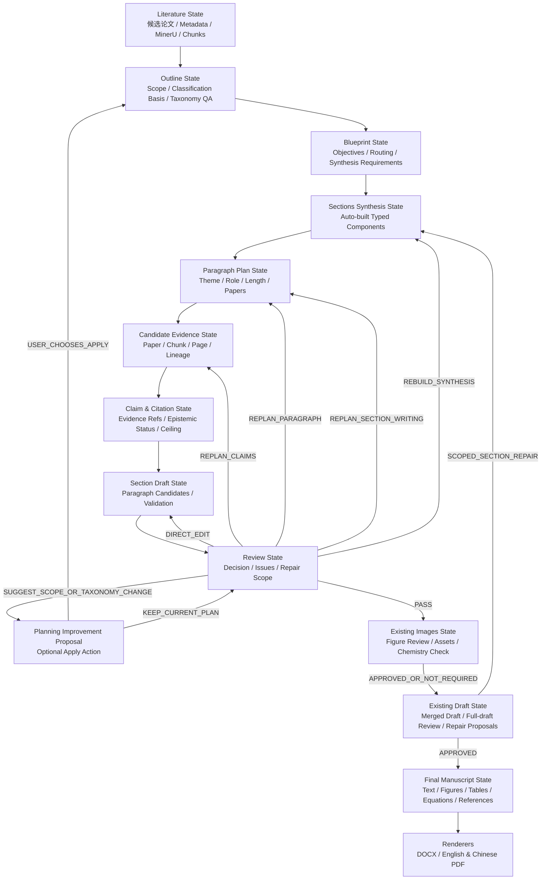

# 学术组织、写作状态机与出版级 PDF 改进方案

> 文档状态：四次架构审核后定稿版，待实施
> 编写日期：2026-08-19
> 适用项目：Review Writer
> 参考系统：Deep Academic Survey（DAS，arXiv:2608.18034）
> 目标范围：通用学术组织核心、化学增强规则、段落与 Claim/Citation 计划、低交互自动分级返工、保留 DOCX 的中英文出版级 PDF
> 本文不包含：本次直接修改业务代码、整体迁移 DAS、替换现有 DOCX 工作流

## 1. 执行摘要

Review Writer 已经具备完整的科研综述生产工作台：文献入库、MinerU 解析、检索、Matrix、可编辑大纲、Blueprint、章节生成、化学图像处理、初稿反馈、终稿审计、DOCX 导出，以及 PostgreSQL、不可变 Artifact、依赖关系和 stale 传播。

当前最需要提升的不是再增加一个顶层阶段，而是补齐 Blueprint 与章节正文之间的学术组织状态，使系统从：

```text
章节计划 → 整节生成 → 初稿后统一评价和段落重写
```

升级为：

```text
候选论文
→ Scope 合同与 Taxonomy 分类依据（扩展现有 Outline）
→ Section Blueprint 与论文路由（扩展现有 Blueprint）
→ 按需综合状态（比较 / 机制 / 时间线 / 术语 / Roadmap）
→ 段落计划
→ 候选证据召回
→ Claim/Citation 计划（引用证据 ID）
→ 逐段生成
→ 即时确定性校验
→ 小节语义审校
→ 按缺陷范围局部返工
→ 接受并进入终稿
```

该改造主要解决十类问题：

1. 引言缺少可执行的 Scope、中心问题和分类依据；
2. Taxonomy 没有阻止 “Other or unspecified” 等兜底章节；
3. 章节结构与候选文献之间缺少显式、可检查的路由关系；
4. 正文前缺少比较矩阵、机制抽象、历史演进、术语和研究 Roadmap；
5. 当前 `review_claims` 主要位于章节层，不能稳定约束每个段落的职责和正向综合结论；
6. 引用目前可以绑定到论文和检索 chunk，但尚缺少“一个 Claim 对应哪组证据、允许写到什么程度”的计划层；
7. evidence ceiling 容易在没有积极综合合同的情况下诱发过度防御式写作；
8. 整节生成使局部问题容易扩大为整节重写，成本高且不易保持已通过内容；
9. 初稿反馈循环尚不能把问题准确退回 Scope、Taxonomy、综合产物、Claim 或段落计划；
10. 当前 DOCX 输出能力完整，但缺少共用的出版级 PDF 状态、图文耦合和 bibliography 完整性门禁。

本方案的核心决策是：

- 保留现有七阶段用户工作流，不新增顶层导航阶段；
- 在 Planning 和 Sections 内部增加嵌套学术状态；
- Scope 与 Taxonomy 未通过时，不允许以兜底章节继续生成；
- 采用“通用学术核心 + chemistry profile 增强门禁”，保持跨领域泛化性；
- 根据章节需要产出可追溯的综合知识组件，不要求每个项目生成全部组件；
- 保留“一篇论文只有一个详细介绍主章节”的本地策略，同时允许有边界的辅助路由；
- 优先扩展现有 Outline、Blueprint、Evidence Package、Section Drafts、Draft Quality 和 Final Artifact，不建立平行真相源；
- 将段落、Claim、引用组和证据块保存为不可变、可追溯状态；
- Writer 只接收当前段落所需的最小上下文；
- Reviewer 只决定返工范围，不能绕过原文证据和化学事实门禁；
- 小节 Reviewer 只能提出 Scope/Taxonomy 升级建议；默认继续使用当前已批准规划，用户主动采用建议时才重做全局规划；
- 用“正向综合 + 证据边界 + 设计启示”替代机械的否定式审慎；
- 保留当前 Word/DOCX 的全部功能，并新增使用同一终稿状态的中英文 LaTeX/PDF 渲染路径；
- 先评测词法证据链和分层写作收益，再决定是否引入向量召回或更复杂的 Agent 编排。

### 1.1 已确认的产品决策

1. 化学综述是项目的主要优势场景，但通用学术综述必须继续可用；
2. “扩展现有能力”指在现有 Artifact 和页面内增加字段与子视图，不增加用户可见顶层阶段；
3. 不新增 Scope、Taxonomy、Routing、Synthesis、Paragraph、Evidence、Claim 或 Reviewer 的独立必点确认；Scope/Taxonomy/Routing 和 Synthesis Requirements 合并进现有 Blueprint 确认，实际 Synthesis 与段落、证据状态在 Sections 内自动编排；
4. 首先交付学术组织、证据和写作状态闭环；PDF 作为后续独立里程碑，首版只提供一个模板，但同一模板必须支持英文和中文稿件；
5. Word/DOCX 不是过渡兼容层，现有导出、下载、引用、图表和后续维护能力必须保留；新增 PDF 不能以删除或降级 Word 功能为代价；
6. Images 的源图选择、审核、AI 重绘、重试、逐图批准、SVG/Ketcher 编辑和最终确认流程保持现状；本方案只能消费其既有输出和审核状态，不改变重绘逻辑、接口语义或用户路径。

本方案的交互预算是“零个新增强制确认”。现有 Outline/Blueprint、Images、Sections 和 Draft 交互点继续承担最终控制权；新增状态默认自动生成、自动校验并以摘要形式展示，用户只在希望修改计划、采用重规划建议或系统遇到真实事实阻断时下钻处理。

## 2. 背景与 DAS 可借鉴点

DAS 将综述生成建模为共享稿件状态上的构建过程，显式维护 literature、organization、writing 和 finalization 四类状态。其值得借鉴的部分包括：

- 候选文献驱动的 taxonomy 规划；
- 从论文到章节的反向路由；
- 段落计划和 Claim/Citation 计划先于正文生成；
- Writer 只接收对应计划和证据，而不是自由读取全部候选文献；
- 章节审校可以选择 PASS、直接修改、重做段落或重做整节；
- 每次修复只重新激活受影响的写作状态；
- 最终由统一 Finalizer 处理图表、引用、LaTeX、BibTeX 和编译。

DAS 的消融实验显示，论文路由和语义审校对引用质量、分类组织和层级论证具有较稳定的收益；分级返工比固定使用一种返工策略具有更高的审校通过率和更低的平均审校成本。

但以下部分不应直接照搬：

- DAS 核心生成代码当前公开仓库仍标注为待发布，不能作为可直接集成的依赖；
- DAS 主要依赖大型生成模型和预计算元数据湖，成本与本项目的多用户部署目标不同；
- DAS Reviewer 不读取原始论文，因此不能替代本项目已有的原文检索、化学事实保护和少量关键控制点；
- DAS 的自由多标签论文路由可能增加重复介绍，本项目应保留唯一主章节约束；
- DAS 的自动内容图像生成不适合未经人工审核地生成化学结构、反应式或机理图。

技术选择遵循“问题驱动而非 DAS 对齐”：先定义本项目实际失败模式、权威 Artifact、确定性门禁和验收指标，再选择最小实现。DAS 只提供可验证的设计参考，不构成目标架构、依赖或必须复刻的 Agent 分工。若一个 DAS 概念不能在本地基准上提高学术质量、可追溯性或局部返工收益，或会引入平行状态、额外点击和重复模型调用，就不采用。优先级始终是：现有确定性代码与 Artifact 能解决的问题不交给 Agent；一个领域任务能完成的工作不拆成多个用户任务；一个权威状态能表达的数据不再建立第二份真相源。

参考资料：

- DAS 论文：<https://arxiv.org/html/2608.18034v1>
- DAS 公开仓库：<https://github.com/ZhikaiXu24/DAS>
- DAS-Bench：<https://github.com/ZhikaiXu24/DAS/tree/main/DAS-Bench>

## 3. 当前项目基础与差距

### 3.1 已有基础

当前项目已经具备：

- Matrix 中的论文角色、主题相关性和证据字段；
- 可编辑 Outline 与参考综述结构学习；
- Blueprint 中的 section thesis、review problem、主/辅论文、review claims、图表需求和避免模式；
- 一篇论文单一主章节、辅助交叉引用的分配策略；
- MinerU `content_list.json` 和 Markdown 的页码级切片；
- `paper_id + chunk_id + page + source lineage` 证据链；
- Section 写作的 `allowed_papers` 范围限制；
- 章节发布时对论文和 chunk 身份的确定性检查；
- 稳定 paragraph marker、段落级评分、候选重写、原文复核和人工接受；
- 化学身份、数值、立体化学、图源和引用保护；
- Artifact 不可变版本、输入快照、依赖关系和 stale 传播；
- DOCX、图像、引用和终稿审计。

相关实现入口：

- `skills/review-section-blueprint/scripts/init_section_blueprint.py`
- `review_writer_api/domain_services/sections.py`
- `skills/review-section-drafting-figure-picking/scripts/generate_section_drafts.py`
- `review_writer_core/retrieval/chunker.py`
- `review_writer_api/domain_services/library_index.py`
- `skills/review-first-draft-feedback-loop/`

### 3.2 当前主要差距

#### 章节计划与段落职责之间存在空档

Blueprint 已经生成章节级 claims，但 Section Writer 仍主要基于章节任务一次生成完整小节。模型需要在一次调用中同时完成段落划分、Claim 组织、证据选择和文字实现，导致这些决策难以单独检查和重用。

#### Claim 与引用之间缺少显式合同

当前可验证模型返回的 `paper_id` 和 `chunk_id` 是否属于证据包，但不能充分回答：

- 该 chunk 具体支持哪一句 Claim；
- 多篇论文是否真正共同支持同一个综合结论；
- 某个结论是 reported result、author inference 还是 review synthesis；
- 当前证据允许使用“证明”“显示”“提示”还是“可能”；
- 证据不足时应该删掉结论、降低措辞，还是请求额外证据。

#### 返工主要发生在正文层

现有反馈循环擅长对失败段落生成安全候选，但若真正问题来自错误的论文分配、段落职责或 Claim/Citation 计划，单纯润色正文无法根治。

#### 终稿结构仍偏 Markdown 驱动

Markdown 适合编辑和版本管理，但不适合作为复杂出版排版的唯一结构模型。图表浮动、交叉引用、公式编号、长表格、附录、页眉页脚和多种输出模板需要更明确的中间表示。

### 3.3 基于专业审稿反馈的失败模式映射

本次专业审稿意见表明，当前问题不是单纯的语言质量下降，而是多个上游学术状态缺失后在终稿中的集中暴露。应将这份稿件视为回归测试样本，并把审稿意见转化为以下系统门禁：

| 审稿人观察 | 本地流程根因 | 必须补齐的系统能力 | 发布门禁 |
|---|---|---|---|
| 引言没有 Scope 和综述目的 | Blueprint 默认直接进入章节生成，没有结构化范围合同 | `Scope State`：研究问题、时间跨度、纳入/排除标准、分析轴、目标读者和综述目标 | Scope 缺失时禁用现有 Blueprint 确认，不新增确认页 |
| 出现 “Other or unspecified” | taxonomy 允许用兜底节点吸收无法路由的文献 | 分类依据声明、孤儿论文处置和 catch-all 标题硬门禁 | 实质性 “其他/未分类” 章节数必须为 0 |
| 仅按原料粗分，后续逻辑断裂 | 分类节点没有统一、可解释的分析维度 | 对候选分类做覆盖、互斥性、解释力和跨层一致性诊断 | 分类依据不一致时退回重构 Taxonomy |
| 全文像文献笔记或论文摘要串联 | 正文前没有跨论文知识综合产物 | 按 profile/章节职责启用比较、机制、时间线、术语或 Roadmap 组件 | Blueprint 声明为 required 的组件缺失时不得起草 |
| 大量否定式、规避式句尾 | evidence ceiling 被当成主要写作目标，缺少正向综合合同 | 每段声明 `reader_takeaway`、`positive_synthesis`、边界和设计启示；限制语句只做诊断 | 只有否定边界、没有正向结论的分析段落不得通过 |
| “挑战”停留在表象 | future direction 没有因果深度要求 | “观察—机理根因—证据—后果—可检验设计方向”挑战链 | 空泛挑战退回 Claim 或段落重规划 |
| 只有原论文 Scheme 截图，没有作者综合机制图 | 图片选择与学术综合相互独立 | 来源约束的 `Mechanism Map` 与作者综合图计划，在现有 Images 审核中确认化学正确性 | 未追溯或未通过现有 Images 审核的综合机理图不得发布 |
| 图注仅为 “Scheme 1”，正文不解读条件和结果 | figure、caption、Claim 和正文没有结构化耦合 | 图意图、关键结构/条件/产率/ee、正文讨论段和自洽图注合同 | 图文脱节或 caption 不自洽时阻止 Final |
| “Cross-category comparison” 没有量化表格 | 比较章节只生成文字，没有强制共同维度 | 来源可追溯的结构化比较矩阵和出版表格 | 核心比较节没有共同维度数据时不得标为完成 |
| 早期与现代文献混放 | 论文只有主题路由，没有历史角色和演进关系 | foundation、transition、modern advance 标签及时间线 | 奠基文献必须说明其对后续路线的作用 |
| 轴手性、旋转能垒和构型判定未定义 | 缺少面向目标读者的术语覆盖状态 | `Terminology Glossary` 与首次出现检查 | 核心术语未定义时不得通过引言/基础章节 |
| 参考文献字段残缺、存在 HTML 标签 | bibliography 规范化和内容清洗太晚且不完整 | 元数据完整性、HTML/XML 残码、期刊样式预检 | 必填字段完整率 100%，残码数为 0 |

这一映射改变了实现顺序：必须先解决 Scope、Taxonomy 和综合知识产物，再优化段落措辞与 PDF 样式。否则更漂亮的 PDF 只会让结构性缺陷显得更正式。

## 4. 设计目标与非目标

### 4.1 设计目标

1. 正文生成前明确综述目的、研究问题、时间边界、纳入/排除标准、分析轴和目标读者；
2. Taxonomy 使用可辩护且一致的分类原则，不允许用实质性“其他/未分类”章节掩盖路由失败；
3. 每篇已选论文都有清晰的主章节、辅助章节和未分配理由；
4. 正文前根据主题 profile 和章节职责形成必要的比较、机制、历史、术语或 Roadmap 组件；
5. 每个正文小节都有明确的学术角色、范围、问题和预期综合结论；
6. 每个段落都有独立职责、目标长度、论文集合、正向 takeaway、边界和上下文关系；
7. 每个可引用 Claim 都绑定论文、chunk、页码和证据强度；
8. Writer 不能自行扩展论文范围或绕过已批准计划；
9. 每个段落生成后立即完成身份、格式、证据范围和防御式写作诊断；
10. Reviewer 能根据问题范围选择最小必要返工层级；Scope/Taxonomy 问题只生成可选升级建议，不打断当前写作；
11. 局部修改只使受影响状态及其下游变 stale；
12. 用户能够在 UI 中从章节下钻到段落、Claim、比较数据、图表计划和原文证据；
13. 图、表和 Scheme 有明确学术目的、正文讨论位置、自洽 caption 和来源链；
14. DOCX 和 PDF 使用同一终稿内容状态，不产生两个内容版本；
15. PDF 达到长篇学术综述的可读性、参考文献完整性和图表专业性要求；
16. 所有新增模型调用都可记录模型、Token、耗时、重试和成本。
17. 新字段只有一个权威归属，避免 Routing、Evidence、Review 和 Final 出现平行真相源；
18. 首期兼容当前阶段级 stale，在 `WorkflowStageRun` 输入/输出快照中记录 dirty 与实际重算对象，为后续对象级依赖积累数据。

### 4.2 非目标

- 不整体引入 DAS 的运行框架；
- 不以复刻 DAS 的 Agent 数量、调用顺序、模型规模或元数据湖作为实施成功标准；
- 不增加新的顶层工作流阶段；
- 不为每个逻辑概念都新增独立 Artifact 或 API Job；
- 不取消现有必要的 Matrix/Outline、Blueprint、适用时的 Images、Sections 和 Draft 控制点，也不为新增内部状态增加第二轮确认；
- 不允许 Reviewer 自动覆盖化学事实门禁；
- 不在首期实现开放式自动滚雪球检索；
- 不在首期要求 pgvector；
- 不替换现有 DOCX 导出；
- 不删除、简化或重写现有 Images/AI 重绘/人工审核基本流程；
- 不自动生成未经来源约束的化学结构和机理图；
- 不要求通用学术 profile 执行 yield/ee、催化循环或化学结构专用门禁；
- 不在学术组织首个里程碑中同时交付 LaTeX/PDF；
- 不声称自动生成结果无需领域专家审核即可投稿。

## 5. 总体目标架构



这不是一套与现有工作流并列的新系统，而是对现有 Artifact 和阶段依赖的细化：

- Scope 和 Taxonomy 作为现有 Outline 的结构化字段，Section Objective、Routing 和 `synthesis_requirements` 归入现有 Blueprint；
- 实际 Synthesis 是 Sections 自动构建的派生 Artifact，不属于已确认 Blueprint，也不是五个强制子阶段；Blueprint 确认需求，Sections 根据当前证据生成或刷新内容；
- Synthesis、Paragraph、Claim、Evidence、Draft 和小节 Review 归入 Sections，全稿 Review 归入 Draft；
- Final Manuscript State 和 Renderers 归入 Final。

图中的状态是 Artifact 内部的逻辑状态，不等于新增用户阶段或确认按钮。现有七阶段和内部 `discovery/matrix/blueprint/sections/figure-review/figures/draft/final` 状态保持兼容。

### 5.1 现有阶段映射与人工交互预算

| 逻辑状态/Artifact | 现有内部 producer stage | 用户可见阶段 | 默认行为 | 人工交互 |
|---|---|---|---|---|
| `selected_outline.json` 的 Scope/分类依据 | `matrix` | Planning | 保存 Outline 时自动校验 | 复用现有 Matrix/Outline 操作，不新增确认 |
| Blueprint、Routing、taxonomy QA、Synthesis Requirements | `blueprint` | Planning | 一次任务自动形成 Planning Bundle | 复用一次现有 Blueprint 确认 |
| Synthesis State、Writing Plan、Evidence、Claim、逐段 Draft、Validation、Reviewer | `sections` | Sections | Blueprint 确认后自动串联并按需局部重试 | 只在草稿就绪后复用现有 Sections 确认；中间状态可选下钻 |
| Scheme/图片候选与已选资产 | `figure-review` / `figures` | Images | 完全沿用当前选图、重绘、编辑、逐图批准和最终确认逻辑 | 不增加、不删除、不合并现有 Images 操作 |
| 全稿质量与优化建议 | `draft` | Draft | 自动审校和生成候选 | 复用现有 Draft 接受/修改流程 |
| Markdown、DOCX；后续 Manuscript State/中英文 PDF | `final` | Final | 保留 Word 并自动构建、编译和 QA PDF | 无新增确认；真实 blocker 回到其现有页面 |

Sections 内部可使用 `retrieving_synthesis_evidence → building_synthesis → building_plan → merging_paragraph_evidence → planning_claims → drafting → reviewing → review` 等子状态展示进度，但它们不是可导航阶段、也不是用户任务清单。系统应在后台连续推进，只有取消、编辑或真实 blocker 才暂停。

## 6. 学术组织模型

### 6.1 Scope State：先回答“这篇综述为什么存在”

在现有 Outline Artifact 中新增 `scope_contract` 字段，不创建平行的 Scope Artifact，也不增加独立 Scope 确认：

```text
planning/selected_outline.json
└─ scope_contract
```

```json
{
  "topic": "轴手性丙二烯的不对称合成",
  "target_question": "不同轴手性生成策略如何实现选择性控制，其共同瓶颈是什么？",
  "review_objective": "建立以轴手性生成方式和选择性决定步骤为主轴的领域地图，并比较其适用边界",
  "organizing_hypothesis": {
    "statement": "按轴手性生成方式组织可能比只按原料组织更能解释选择性控制差异",
    "status": "provisional",
    "allowed_final_outcomes": ["confirmed", "revised", "rejected"]
  },
  "time_span": {"foundation_from": 1955, "systematic_review_from": 2015, "to": 2026},
  "inclusion_criteria": ["产生或控制丙二烯轴手性的研究", "提供直接证据或具有明确奠基作用"],
  "exclusion_criteria": ["仅合成非手性丙二烯", "与中心问题无可说明的关系"],
  "evidence_availability_policy": "原文不可得不自动排除，但不能支撑定量或机制强断言，并需标记来源限制",
  "primary_navigation_axis": "chirality_generation_strategy",
  "secondary_axes": ["mechanism", "catalyst", "chirality_induction_mode"],
  "target_readers": ["不对称催化研究者", "进入该方向的研究生"],
  "required_reader_outcomes": ["理解构型与消旋基础", "比较三类生成策略", "识别配体和能垒设计机会"]
}
```

Scope 的确定性检查包括：

- `target_question`、`review_objective`、时间跨度和纳入/排除标准不得为空；
- `organizing_hypothesis` 是可选且暂定的组织假说，不得被当作预设结论；Scope 已提供假说时，主体证据综合后必须确认、修订或否定它，不能以 `not_applicable` 跳过验证；结果写入 Draft Quality 的全稿综合结论，不回写不可变 Scope；
- 必须声明一个主要导航轴；允许机制、催化剂、底物等作为正交标签或明确标注的二级轴，但不得在没有说明关系时混列为同层类别；
- Introduction 必须实现“背景—核心概念—范围—分类依据—本文贡献—阅读路线”；
- Conclusion 必须回扣同一中心问题，不能临时扩展到 Scope 外的话题；
- 用户在现有 Outline/Blueprint 流程中主动修改 Scope 后才创建新版本并使 Taxonomy/Blueprint 及全部下游 stale；自动诊断不得自行改写 Scope；原始文献和抽取结果不受影响；
- Matrix 论文集合变化不改写已随 Planning Bundle 批准的 Scope，只把 `scope_coverage_validation` 标为 stale，并重新诊断覆盖情况。

### 6.2 Taxonomy 节点类型

每个章节节点增加明确的学术功能：

| 类型 | 用途 | 是否进入深度写作 |
|---|---|---|
| `navigational` | 组织子章节、定义阅读路线、承上启下 | 通常 Route A，简短概述 |
| `analytical` | 方法、机制、证据、性能、对象或类别比较 | Route B，完整段落与 Claim 计划 |
| `reflective` | 局限、争议、研究空白和未来方向 | Route B，但更强调证据边界 |

建议节点合同：

```json
{
  "section_id": "S03",
  "title": "Catalytic strategies",
  "node_type": "analytical",
  "academic_role": "method_comparison",
  "semantic_scope": "比较催化模式、底物边界和选择性控制",
  "structural_role": "core_body",
  "writing_objective": "建立可比较的方法分类并解释差异",
  "key_questions": [
    "不同催化模式解决的核心问题是什么？",
    "各方法的证据是否处在相同评价基础上？"
  ],
  "boundary_exclusions": [
    "不重复介绍基础概念",
    "不在本节完整展开应用案例"
  ],
  "expected_synthesis": "形成方法选择与证据边界之间的综合判断"
}
```

### 6.3 候选文献驱动的结构检查

Outline 仍由用户选择、编辑或从参考综述学习，但系统应基于当前候选论文提供结构诊断，而不是直接覆盖用户结构。

诊断包括：

- `coverage_gap`：关键研究方向没有对应论文；
- `empty_section`：正文节点没有足够证据形成多段讨论；
- `boundary_overlap`：相邻章节的 scope 高度重叠；
- `orphan_direction`：候选论文形成明显主题簇，但大纲没有容纳位置；
- `unsupported_reflective_node`：局限或未来方向没有来源证据；
- `excessive_navigation`：导航节点过多，正文分析不足；
- `flat_taxonomy`：所有章节处于同一层且缺乏明确分类逻辑。

结构诊断随 Planning Bundle 自动生成：warning 直接附在现有 Blueprint 摘要中；`planning_blocker` 会禁用现有 Blueprint 确认并给出一键自动修复或原位编辑入口，而不是弹出第二个确认框。修复后重新生成同一 Planning Bundle，再由用户完成一次 Blueprint 确认。

### 6.4 Taxonomy 硬门禁与孤儿论文处置

分类不是标题生成任务，而是综述的核心学术判断。每个同层节点必须声明其与主要导航轴的关系。例如本主题可使用以下路线标签：

1. `de_novo_construction`：从头构建轴手性，包括催化取代、加成或重排；
2. `chirality_transfer`：中心手性、已有立体信息或手性底物向轴手性转移；
3. `kinetic_resolution_or_desymmetrization`：通过速率差或对称性破缺获得轴手性。

这些标签并非天然互斥：去对称化也可能属于 de novo construction，手性转移也可能出现在催化取代中。因此系统应要求“主要章节归属 + 正交策略标签 + 重叠说明”，不能把三个标签当作互斥枚举。金属种类、具体机理和底物类型可作为二级轴。实际分类由当前文献证据生成，并随现有 Blueprint 一次批准；不把上述三类硬编码为所有主题的通用模板。

以下标准化标题在实质性正文节点中默认视为阻断问题：`other`、`miscellaneous`、`unspecified`、`其他`、`未分类`、`其他或未指定`。不能只匹配单词；应结合节点是否承载无法解释的异质论文判断，避免误伤 “Other applications of …” 等有明确语义的标题。孤儿论文只能按以下方式处置：

- 重新路由到现有类别并说明契合的判定特征；
- 根据成簇证据细化或重构 taxonomy；
- 作为边界案例放入最相关类别，但明确其挑战分类的原因；
- 从 Scope 中排除，并记录可审计的排除理由；
- 在无法从现有证据确定归属时标为边界案例，并在现有 Blueprint 页面提供可选人工调整。

不得以兜底章节绕过分类失败。若一个边界案例不能形成独立学术问题，也不得仅为容纳单篇论文创建空洞章节。

### 6.5 正文前的综合知识产物

Blueprint 和论文路由确认后、Paragraph Plan 开始前，Sections 任务按 `synthesis_requirements` 自动生成一个结构化 Artifact。Blueprint 只确认“需要哪些组件及其用途”，不包含实际综合内容；实际组件可以在同一 Sections 运行内按证据变化安全刷新，不要求用户再点一次“构建综合”或“确认综合”：

```text
sections/synthesis_state.json
├─ comparison_components[]
├─ mechanism_components[]
├─ timeline_components[]
├─ glossary_components[]
└─ roadmap_components[]
```

Synthesis 不是无证据的模型总结。Sections 先通过统一 Retrieval/Evidence Item 构造器建立 staging evidence registry，生成稳定 `evidence_key`；Synthesis 只读取这些来源指针。随后 Paragraph 级候选检索把新增结果合并进同一 registry，最终统一发布为 `evidence_package.json`，避免“综合检索”和“Claim 检索”形成两套证据库。

组件按主题和章节职责启用：比较章节通常需要 comparison；涉及专业术语且目标读者需要解释时启用 glossary；强调历史演变时启用 timeline；只有机制是核心论证或需要作者综合 Scheme 时启用 mechanism；Conclusion 需要具体研究方向时启用 roadmap。未启用组件记录 `not_required_reason`，不能把“五类齐全”作为所有 Route B 章节的统一门禁。

#### 比较矩阵

核心字段至少包括：生成策略、反应类型、底物类别、催化剂/配体、手性诱导方式、提出的机理、关键条件、产率、ee/er/dr、底物范围、主要局限、论文和证据 chunk。缺失值必须标为 `not_reported` 或 `not_comparable`，不得由模型猜测。

系统依据章节目标选择共同维度。只有多个方法在同一指标定义下可比较时，才允许形成高低排序；否则应解释不可比原因，同时仍要给出读者可用的定性选择规则。

#### 机制地图与作者综合 Scheme

`synthesis_state.json` 中的 mechanism component 不保存一张无来源的“漂亮图”，而保存反应步骤、关键中间体、选择性决定步骤、竞争路径、证据等级和来源。作者综合图由该组件渲染或人工绘制，并满足：

- 区分实验支持、原作者假说和综述作者推断；
- 能对比不同催化体系的共同步骤与分歧；
- 图中每个关键化学断言可追溯；
- 化学结构、电子转移、构型和箭头在进入 Images 阶段后复用现有图片审核；没有结构图时，机制文字仍按证据等级自动校验，不新增人工步骤。

#### 历史时间线

每篇早期文献标注 `foundation_role`，现代文献标注其 `extends`、`revises` 或 `overcomes` 的前序工作。正文不得只按年份排队，而要解释“什么能力在何时被引入、解决了什么旧限制、又产生了什么新问题”。

#### 术语表

术语组件声明核心术语、目标读者所需定义、首次出现位置、构型判定规则和证据来源。对本主题至少覆盖 axial chirality、丙二烯累积双键产生轴手性的结构基础、构型互变/消旋路径与能垒，以及 R/S 构型判定。必须将丙二烯轴手性与通常由受阻单键旋转产生的 atropisomerism 区分说明；具体定义和示意图需经化学审核。

#### 研究 Roadmap

Roadmap 不复述“底物范围有限、区域选择性困难、方法难比较”等表象，而使用以下链条：

```text
可观察限制 → 可能的机理根因 → 现有证据 → 对方法设计的后果
→ 可检验的设计方向 → 判定进展所需实验或指标
```

例如“高位阻底物 ee 下降”应尽可能连接到选择性决定过渡态、配体口袋或竞争路径，并提出可检验的配体/条件设计方向。若现有证据不足以支持根因，系统应明确标为 `open_mechanistic_question` 并说明需要的实验，而不是为满足 Roadmap 模板编造解释。对丙二烯体系，还应显式评估构型稳定性、消旋路径和反应后处理条件，而不能笼统写成“稳定性问题”。

写作前的 Roadmap 是待验证的规划组件。Sections Reviewer 可在首次 Sections 确认前自动执行 `REBUILD_SYNTHESIS`；全稿 Reviewer 若在 Draft 阶段发现需要更新，只能创建指向 Sections 的 scoped repair，使 Sections Synthesis、受影响段落和 Conclusion 重新生成并复用现有 Sections 流程。该动作只更新组件和依赖它的内容，不得回写来源事实或自动改变 Scope/Taxonomy。

### 6.6 Introduction 与 Conclusion 合同

Introduction 必须包含：核心概念和术语、领域重要性、历史起点、现有综述或分类的不足、本文 Scope、分类依据、综述目标和章节 Roadmap。暂定的 `organizing_hypothesis` 可以作为组织理由表达，但不得伪装成已证实的中心结论。系统应禁止只有背景堆叠、没有“本文将解决什么”的引言进入终稿。

Conclusion 必须完成三件事：

1. 回答 Scope 中的中心问题，给出明确而有边界的领域地图；
2. 从比较矩阵总结可迁移的选择性控制或方法选择原则；
3. 沿研究 Roadmap 提出具体、可检验的未来设计方向，包括需要改变的变量、预期改善的瓶颈和验证指标。

全稿 Review 必须在 `draft/quality.json.review_summary.organizing_hypothesis_outcome` 记录 outcome、最终表述、支撑 Claim ID 和理由：Scope 已提供假说时 outcome 只能为 `confirmed/revised/rejected`；只有 Scope 未设置假说时才使用 `not_applicable`。Conclusion 读取该结果回答 Scope 的中心问题；不得修改原 Scope 来制造“最初假说始终正确”的假象。

“现有研究难以比较”只能作为问题诊断，不能替代结论。系统也不要求模型伪造原创理论；证据不足时应明确缺口，并将需要什么证据说清楚。

### 6.7 通用核心与 chemistry profile

所有项目执行通用核心：Scope、分类依据、非兜底 taxonomy、论文路由、段落职责、Claim—Evidence 绑定、引用完整性、图文关系和参考文献规范化。

chemistry profile 在通用核心上增加：

- 化学身份、化合物编号、计量单位和条件角色保护；
- yield/conversion/recovery 与 ee/er/dr/de 指标类型一致性；
- 催化剂、配体、试剂和底物/产物角色校验；
- 立体化学、构型互变、消旋和机制证据等级；
- Reaction/Scheme、化学结构和综合机制图复用现有 Images 审核；
- 面向化学综述的比较矩阵字段和 `chemistry-review` 渲染能力。

`general_academic` 不执行化学字段完整性门禁，但仍执行数字、引用、证据范围和图源保护。具体规则由现有 taxonomy profile 选择，不在提示词中临时猜测领域。

## 7. 论文—章节路由

### 7.1 路由原则

本地项目采用与当前失败模式匹配的反向论文—章节路由；DAS 只是这一设计的外部参考，不决定实现方式。约束如下：

1. 每篇核心论文最多有一个 `primary_section`；
2. `primary_section` 表示详细介绍归属，不限制同一论文在其他章节支持独立 Claim；
3. Introduction 和 Conclusion 原则上只做综合引用，不拥有论文的详细介绍权；
4. 辅助路由必须说明 `use_for` 和 `reuse_boundary`；
5. 弱相关论文可以不路由，并记录原因；
6. 论文不能仅因 taxonomy 未覆盖而被静默删除；
7. 人工调整优先于自动路由，并作为新路由版本保存。

### 7.2 扩展现有 Blueprint 路由字段

路由应继续以现有 Blueprint 为唯一真相源，不新增 `paper_routing.json`：

```text
blueprint/section_blueprint.json
├─ sections[].primary_papers
├─ sections[].supporting_papers
└─ paper_routes[]
```

示例：

```json
{
  "schema_version": 2,
  "source_matrix_artifact_id": "...",
  "paper_routes": [
    {
      "paper_id": "P001",
      "primary_section": "S03",
      "primary_use_for": [
        "foundational method",
        "reported substrate scope"
      ],
      "supporting_routes": [
        {
          "section_id": "S05",
          "use_for": "说明该方法在高位阻底物上的限制",
          "reuse_boundary": "只引用限制，不重复完整实验条件"
        }
      ],
      "excluded_sections": ["S04"],
      "routing_confidence": "high",
      "routing_reason": "方法与 S03 的比较轴一致",
      "human_modified": false
    }
  ]
}
```

### 7.3 路由确定性检查

- 所有 `paper_id` 必须存在于当前 Matrix 和活动 Library；
- 所有 section ID 必须存在于当前 Blueprint；
- 主章节数量不得超过一个；
- 辅助章节不得重复主章节；
- `use_for` 和 `reuse_boundary` 不能为空；
- 辅助路由数量不设固定上限，但高复用率产生重复风险警告；
- Introduction/Conclusion 不得成为详细介绍主章节；
- 主路由覆盖率、未分配率和重复路由率必须写入报告；
- 路由修改后，Synthesis、Writing Plan、Evidence、Sections、Draft、Final、DOCX/PDF 变 stale；Matrix、Library 原文和 MinerU 抽取不变。

## 8. 段落计划

### 8.1 Route A 与 Route B

根据节点功能和证据密度选择写作路线：

- Route A：导航节点或证据不足以支撑多段技术讨论的节点，使用轻量合同生成一段短概述；仍须有 1 个 Paragraph Plan、1–3 个 Claim 及必要证据，只跳过深层多段规划和多轮语义循环；
- Route B：分析和反思节点，进入段落计划、候选证据召回、Claim 计划、逐段生成和审校循环。

Route 选择由规则与模型共同建议，但必须满足确定性边界。导航节点或 Blueprint 标为非必要的补充节点在证据稀疏时可自动降级为 Route A 并给出 warning。若 Scope/Blueprint 要求回答的核心分析节点只有一篇弱相关论文，系统先执行一次受限补充检索；仍不足时形成 `planning_blocker` 或建议删除该必要性声明，不能用短概述掩盖核心覆盖缺口。

### 8.2 段落角色

建议标准化以下角色：

| 角色 | 学术功能 |
|---|---|
| `definition` | 定义概念、范围和术语 |
| `foundation` | 建立基础方法、基线或历史起点 |
| `mechanism` | 解释机制、方法架构或作用路径 |
| `comparison` | 在共同维度上比较多篇研究 |
| `extension` | 展示从基线到扩展的变化 |
| `limitation` | 限定适用范围和证据边界 |
| `synthesis` | 形成跨论文综合判断 |
| `transition` | 连接前后学术问题 |

### 8.3 Writing Plan 中的 Paragraph Plan

Paragraph 和 Claim 计划放在同一个版本化 Writing Plan 中，避免两个计划独立更新后失配：

```text
sections/writing_plan.json
├─ sections[].paragraphs[]
└─ sections[].claims[]
```

示例：

```json
{
  "section_id": "S03",
  "route": "B",
  "paragraphs": [
    {
      "paragraph_id": "S03-P02",
      "theme": "不同催化模式的适用边界",
      "argument_role": "comparison",
      "objective": "比较底物边界并解释差异的证据基础",
      "target_words": {
        "min": 180,
        "max": 260
      },
      "primary_papers": ["P03", "P08"],
      "supporting_papers": ["P11"],
      "opening_function": "承接上一段的机制分类",
      "closing_function": "导向下一段的局限讨论",
      "reader_takeaway": "不同催化模式的适用边界来自不同的选择性决定步骤，而不是简单的优劣排序",
      "positive_synthesis": "先归纳可支持的共同规律，再限定其适用范围",
      "caveat_policy": "diagnostic_only",
      "knowledge_component_refs": ["synthesis_state:comparison:CM-S03", "synthesis_state:mechanism:MM-02"],
      "required_synthesis": "解释差异而不是简单报告差异",
      "must_not_repeat": [
        "P03 的完整实验条件",
        "上一段已解释的催化循环"
      ]
    }
  ]
}
```

### 8.4 段落计划检查

- 每个段落必须有一个主要学术职责；
- 同一篇主论文不能在多个段落重复完整介绍；
- 相邻段落具有相同 theme 和 role 时产生重复风险警告；只要子问题和推进关系不同即可保留；
- 每个正文小节至少有一个 synthesis 或 limitation 出口；
- 每个分析段落必须有可单独复述的 `reader_takeaway`，不能只列论文结果；
- 除专门的 limitation 段落外，边界说明应服务于正向综合结论，不能取代结论；
- 若章节启用了相应综合组件，comparison、mechanism 和 synthesis 段落应引用相关组件；否则直接绑定来源证据；
- 计划总长度与章节目标长度的偏差作为可配置警告，不作为事实门禁；
- 必须声明段落间的顺序关系；
- supporting route 中的论文可以成为某个独立 Claim 的唯一证据，但不得在辅助章节重复其完整方法介绍；
- Writing Plan 修改使对应候选 Evidence、Draft 和 Review 变 stale。

## 9. Claim / Citation 计划

### 9.1 定义

Claim/Citation 计划是在正文生成前建立的学术合同：

> 一个段落准备提出哪些具体论断，每个论断由哪些论文、哪些原文块支持，证据属于什么等级，以及正文最多可以写到什么程度。

它不是提前插入引用编号，也不是论文摘要列表。

### 9.2 Claim 类型

避免把内容功能和证据强度混成一个枚举。每个 Claim 分别声明：

- `claim_kind`：`reported_finding`、`reported_method`、`cross_study_comparison`、`mechanism_interpretation`、`historical_transition`、`review_synthesis` 或 `future_direction`；
- `epistemic_status`：`direct_source_report`、`source_author_interpretation`、`cross_source_inference` 或 `review_hypothesis`；
- `support_status`：`supported`、`partially_supported` 或 `blocked`。

趋势、领域规律、设计原则和比较局限作为 `review_synthesis` 的 `synthesis_subtype`，不再与其平级，减少重叠类型。

### 9.3 Evidence Item 等级与措辞上限

| 证据等级 | 允许措辞示例 | 禁止扩大 |
|---|---|---|
| `direct_measurement` | 表明、测得、观察到 | 不得扩大到未测试对象 |
| `reported_result` | 报道、显示 | 不得写成普遍规律 |
| `author_inference` | 作者提出、作者认为 | 不得写成已证实机制 |
| `correlated_observation` | 与……相关、伴随 | 不得写成因果关系 |

Evidence Item 只描述来源本身；“证据不足”不是 Evidence Item 等级，而是 Claim 的 `support_status=partially_supported/blocked`。综述作者的跨来源推断也不属于 evidence level，而属于 Claim 的 `epistemic_status=cross_source_inference` 或 `review_hypothesis`。措辞上限由 `epistemic_status + evidence_level + support_status` 共同计算。`required_wording` 不作为硬约束，以免所有段落套用相同句式；系统只禁止语义扩大，并提供非强制措辞建议。

### 9.4 Writing Plan 中的 Claim Plan

Claim 与 Paragraph Plan 共用同一个 Artifact 版本：

```text
sections/writing_plan.json
```

示例：

```json
{
  "paragraph_id": "S03-P02",
  "claims": [
    {
      "claim_id": "S03-P02-C01",
      "sequence": 1,
      "claim": "铜催化体系在高位阻底物上的已报道适用范围相对有限",
      "claim_kind": "review_synthesis",
      "synthesis_subtype": "comparative_limitation",
      "epistemic_status": "cross_source_inference",
      "support_status": "supported",
      "citation_group": ["P03", "P07"],
      "evidence_refs": [
        {"evidence_id": "EV-P03-006", "evidence_key": "sha256:..."},
        {"evidence_id": "EV-P07-008", "evidence_key": "sha256:..."}
      ],
      "evidence_ceiling": "只能说明已报道范围有限，不能声称完全不能反应",
      "required_details": ["底物类别", "指标类型"],
      "semantic_constraints": ["不得扩大到未测试底物", "不得声称完全不能反应"]
    }
  ]
}
```

### 9.5 Citation Group 规则

- 同一引用组中的论文必须共同支持一个明确 Claim；
- 主题相关但证据功能不同的论文不得仅为增加引用数量而放入同一组；
- 反例或限制论文要标记 `relationship=contrasts` 或 `relationship=limits`；
- `review_synthesis`、比较、趋势和 future direction 必须引用支撑其前提的来源；
- 只有过渡、章节导航或明确的作者操作说明等非证据性句子可以不引用，并且不进入 Claim Plan；
- 同一论文可以支持多个 Claim，但每次必须说明不同的 `supports`；
- Writer 不得新增 Claim Plan 中不存在的论文或引用组；
- `support_status=blocked` 的 Claim 不得进入可发布正文；`partially_supported` 默认自动降低范围，仍无法安全表达时才形成现有 Sections blocker；
- 引用编号只在正文实现和最终 bibliography 阶段分配，计划层始终使用稳定 paper ID。

### 9.6 防御式写作控制与作者立场

证据审慎不等于每段都以否定句收尾。Writer 的目标顺序应为：

```text
共同事实或比较结果 → 作者的正向综合 → 解释或机制 → 适用边界 → 设计含义
```

系统对 “does not support”“should not be interpreted as”“remains incomplete”“do not justify” 等表达只做重复诊断，不做简单全局禁词，因为在真正的证据边界段落中它们可能必要。判定失败的条件是：

- 一个分析段落没有明确的正向 takeaway，只剩“不支持什么”；
- 连续多个段落使用同一否定模板结尾；
- 限定语数量显著高于实质性综合 Claim；
- `review_synthesis` 仅复述不可比性，没有给出仍然成立的比较结论；
- Conclusion 只列限制，没有设计原则或可检验方向。

建议记录 `caveat_count`、重复短语和段落句法结尾分布，交给 Reviewer 结合段落角色判断。修复时优先重做 Claim/Paragraph Plan，而不是机械删除 “not”，以免把审慎写作变成无根据的强断言。

## 10. 证据包

### 10.1 证据检索单位

扩展当前已经存在的 `sections/evidence_package.json`，不新增复数版本或第二套证据存储。每个候选 Evidence Item 分配稳定的展示 ID `evidence_id` 和跨 Artifact 使用的确定性身份 `evidence_key`；Claim Plan 同时保存二者，缓存失效和 lineage 校验以 key 为准。证据包基于 MinerU chunk 和 LibraryIndex，至少保留：

- `evidence_id`；
- `evidence_key = sha256(canonical(paper_id, chunk_id, source_lineage_hash))`；
- `paper_id`；
- `chunk_id`；
- `page_start/page_end`；
- `section_path`；
- `content_type`；
- `content`；
- `asset_refs`；
- `previous_chunk_id/next_chunk_id`；
- `source_lineage_hash`；
- 检索 query、score 和 match reason。

`synthesis_state.json` 不复制 chunk 正文，也不创建另一套 Evidence Item；其 comparison、mechanism、timeline、glossary 和 roadmap 组件只保存 `evidence_key`、来源指针及组件自身的分析字段。Writing Bundle 以这些 key 作为候选证据种子，再由 Evidence Package 解析当前内容。若 chunk 或 lineage 改变，key 随之改变，所有引用旧 key 的 Synthesis/Claim 自动进入 dirty 列表，避免“综合证据”和“正文证据”出现双重身份。

### 10.2 两阶段证据准备

建议分成：

1. 段落计划阶段：为整个段落召回候选证据；
2. Claim 计划阶段：从候选证据中选择 Claim 级证据，必要时做一次受限补充检索。

因此确定依赖顺序为 `Paragraph Plan → Candidate Evidence → Claim Plan`。Claim Plan 固定其输入 Evidence Artifact ID，并保存所选 `evidence_id + evidence_key`；证据包更新时，只有 key 不再存在或 content lineage 变化的 Claim 才进入 dirty 列表。`evidence_id` 可保持便于 UI 阅读的项目内稳定别名，但不得单独作为缓存身份。

首期继续使用 PostgreSQL 精确短语与全文词法检索。只有评测证明同义表达召回不足时，才在统一检索接口后增加 pgvector。

### 10.3 证据不足处理

当证据不足时只能选择：

- 降低 Claim 强度；
- 若来源只支持推断前提，将 Claim 标记为 `review_hypothesis` 并保留前提引用；
- 请求一次受限补充检索；
- 删除 Claim；
- 对确有原文冲突、来源身份不明或化学事实无法安全裁决的情况标记真实 blocker，并回到现有 Sections/Images 处理入口。

不允许 Writer 使用模型记忆填补缺失证据；完全没有来源前提的事实性 Claim 必须标为 `blocked`，不能发布。

## 11. 逐段生成

### 11.1 Writer 输入隔离

Writer 每次只接收：

- 当前章节 Blueprint 的 objective、scope 和压缩论证路线；
- 当前 Paragraph Plan；
- 前一段和后一段的计划意图，不提供未验证正文；
- 当前 Claim Plan；
- 当前 Claim 使用的证据块；
- 当前段落引用的 Synthesis/Glossary 组件切片；
- 前一段已验证正文的压缩上下文；
- 领域规则和写作规则。

Writer 不接收：

- 全部 Matrix；
- 全部候选论文全文；
- 其他章节的完整证据；
- 未路由论文；
- 未批准的旧计划。

### 11.2 Writer 输出合同

```json
{
  "paragraph_id": "S03-P02",
  "text": "...",
  "claim_realizations": [
    {
      "claim_id": "S03-P02-C01",
      "sentence_indices": [1, 2],
      "citation_group": ["P03", "P07"]
    }
  ],
  "transition": {
    "from_previous": "...",
    "to_next": "..."
  }
}
```

正文中的数字引用由程序根据稳定 paper ID 映射，不允许模型自由生成编号。

### 11.3 前序段落上下文

为了保持小节连贯，后续段落可读取前一段已验证正文、后一段的计划意图和章节级压缩路线，但不能读取未验证候选。前一段只能作为衔接和去重上下文，不能成为当前 Claim 的来源证据。

## 12. 即时确定性校验

每段生成或修改后，先执行程序校验，再进入语义审校。

### 12.1 身份与证据校验

- paragraph ID 必须属于当前计划；
- claim ID 必须属于当前 Claim Plan；
- paper ID 必须属于当前段落允许集合；
- chunk ID 必须属于对应 paper 和当前 lineage；
- citation group 必须与 Claim Plan 一致；
- 所有 `support_status != blocked` 的 required Claim 必须被实现；blocked Claim 必须在生成前移出发布计划；
- 不得出现计划外引用；
- 证据不足 Claim 不得使用确定性措辞。

### 12.2 内容与格式校验

- 段落只能是一个完整 prose block；
- 不得出现占位符、裸 paper ID、模型说明或 JSON 残片；
- 不得把论文标题当小标题；
- 超出目标字数范围产生写作警告；只有超过系统安全上限或明显低于完成 Claim 所需内容时才阻断；
- 不得重复上一段的完整句子和同一引用束；
- 引用必须邻近其支持 Claim；
- 正文状态保存规范化 Unicode 和结构化内联节点，不提前做 XML/LaTeX 转义；Renderer 在输出边界负责一次性转义；
- 不得破坏 paragraph marker。

### 12.3 化学与科学事实门禁

继续复用现有保护规则：

- 数字与单位；
- yield、conversion、recovery、selectivity、ee、er、dr、de 等指标类型；
- 催化剂、配体、试剂角色；
- 温度、时间、压力、浓度、当量和气氛；
- 立体化学描述；
- 分子式、化学身份和化合物编号；
- 图、caption 和来源身份。

安全的格式问题可以程序修复；事实问题必须重新生成，自动重试后仍无法安全裁决时才回到现有 Sections/Images 处理入口。

### 12.4 门禁分级

为避免把写作偏好误当成事实错误，所有规则必须声明级别：

| 级别 | 示例 | 行为 |
|---|---|---|
| `blocker` | 身份/lineage 错误、计划外引用、blocked Claim、未解析占位符、未通过现有 Images 审核的化学结构错误 | 先自动修复/重试；仍失败时阻止发布并回到对应现有页面 |
| `planning_blocker` | Scope 缺失、实质性 catch-all、Blueprint required component 缺失 | 禁用现有 Blueprint 确认；在原页自动修复或编辑，不新增门禁页 |
| `warning` | 字数偏差、相邻段落同 role、辅助路由过多、重复防御式短语、建议组件缺失 | 允许保存并交 Reviewer/用户判断 |
| `planning_proposal` | 后续写作暴露的 Scope 漂移、分类依据冲突或更优结构 | 作为可选改进建议展示；不打断当前计划，也不自动改变全局状态 |

profile 可以增加 blocker，但不能把 chemistry 专用规则应用到 `general_academic`。任何自动 override 必须记录规则 ID、理由和操作者。

`planning_proposal` 只承载需要学术判断的改进意见。若当前 Artifact 因用户编辑、输入 lineage 变化或程序校验补跑而确定性违反 hard gate，它不是 Proposal：系统应把现有 Blueprint 标为 stale，自动生成修复后的 Planning Bundle，并只要求复用原有 Blueprint 确认。模型 Reviewer 的主观评分不能单独触发这种失效，必须有确定性 rule ID 和可复现证据。这样既不放行无效分类，也不会把每条审稿建议变成人工步骤。

## 13. 小节语义审校与分级返工

### 13.1 Reviewer 输入

Reviewer 读取：

- 当前小节相关的 Scope、taxonomy、Blueprint 和路由切片；
- 当前小节实际引用的 Synthesis 组件切片，而不是完整全局 Artifact；
- 当前小节完整正文；
- section objective、scope 和 expected synthesis；
- Paragraph Plans；
- Claim Plans；
- 每个实际 Claim 选中的 Evidence Item 原文片段、paper/chunk/page、`evidence_key` 和 lineage；只加载当前小节需要的片段，不把全部论文全文塞入 Reviewer；
- 每段验证状态；
- 引用覆盖摘要；
- 跨段重复诊断。

Reviewer 不直接修改上游 Matrix、Outline、Taxonomy 或路由，也不能把自身判断当作来源证据。它发现需要学术判断的全局问题时只能创建 Planning Improvement Proposal；当前已批准计划继续可用，只有用户主动选择“应用并重规划”才传播全局 stale。若确定性校验能够复现 hard-gate 失败，则按上节的 Blueprint stale/自动修复流程处理，不由 Reviewer 自行升级。若问题在首次 Blueprint 确认前已能发现，应归为 `planning_blocker` 原位修复，而不是留到写作后制造一次额外确认。

### 13.2 Reviewer 评估维度

- 当前内容是否偏离已确认 Scope 或暴露 taxonomy 问题；此项只产生非阻断的改进建议；
- 与 taxonomy 节点目标的对齐；
- 段落顺序和论证推进；
- 跨段冗余；
- 比较是否建立在共同维度上；
- 定量比较是否来自结构化矩阵，缺失和不可比数据是否被正确处理；
- 中央 Claim 是否有引用支持，所选原文 Evidence 是否语义蕴含该 Claim，归因主体和措辞强度是否一致；
- 限制和证据上限是否保留；
- 小节是否形成明确的正向综合出口，而不是仅列“不能得出什么”；
- 挑战是否达到“表象—根因—证据—设计机会”的深度；
- 启用 timeline 时，基础文献与现代进展是否形成演进关系；
- 启用 glossary 时，核心术语是否在目标读者需要的位置定义；
- Sections 阶段只检查图/Scheme 的学术意图、候选来源和正文预期讨论位置；实际资产、caption 自洽性、图文耦合及化学结构审核分别在 Images、Draft/Final 执行；
- 是否重复其他章节的主要论文介绍。

Introduction/Conclusion 的合同实现由全稿语义审校评估；bibliography 字段、HTML 残码和最终图文绑定由 Final Audit 评估，不在每个小节重复执行。

### 13.3 返工动作

| 动作 | 适用问题 | 保留范围 |
|---|---|---|
| `PASS` | 小节满足要求 | 全部保留 |
| `DIRECT_EDIT` | 措辞、过渡、局部重复 | 保留计划和证据，仅重写正文 |
| `REPLAN_CLAIMS` | Claim 无证据、引用组错误、证据强度不符 | 保留段落职责，重做 Claim/Evidence 和正文 |
| `REPLAN_PARAGRAPH` | 段落职责混乱、单段负担过多、应拆分或合并 | 保留章节目标和路由，重做该段及依赖状态 |
| `REPLAN_SECTION_WRITING` | Blueprint 范围内覆盖不足或段落顺序失败 | 保留 Blueprint/路由，只重做该节 Paragraph/Evidence/Claim/Draft/Review；若章节边界本身错误则改为非阻断 Planning Proposal |
| `REBUILD_SYNTHESIS` | 缺少共同维度、机制抽象、历史演进、术语或具体 Roadmap | 保留 Scope/Taxonomy/路由，重建综合 Artifact 及相关下游 |
| `SUGGEST_REPLANNING` | 写作后发现 Scope 漂移、分类依据混杂或更优组织路径 | 只创建非阻断建议；用户主动应用后才生成新 Outline/Blueprint 并传播 stale |
| `HUMAN_BLOCKER` | 自动重试后仍存在原文冲突、化学身份或图源身份不明 | 不自动宣称修复；复用现有 Sections/Images 入口处理 |

推荐标准化 issue type：

- `scope_missing`、`scope_drift`；
- `catch_all_taxonomy`、`taxonomy_basis_inconsistent`、`orphan_cluster_unresolved`；
- `synthesis_missing`、`comparison_dimensions_missing`、`historical_link_missing`；
- `defensive_writing_overuse`、`positive_takeaway_missing`、`challenge_depth_insufficient`；
- `figure_intent_missing`、`figure_source_candidate_missing`；
- `term_undefined`。

`reference_metadata_incomplete`、`html_residue`、`caption_not_self_contained` 和最终 `figure_text_disconnect` 属于 Draft/Final Audit issue type，不由小节 Reviewer 在资产尚未确定时重复生成。

### 13.4 复用当前阶段的现有 Artifact

小节审校发生在 Sections 阶段，不能倒写尚未生成的 Draft Artifact；全稿审校才属于 Draft 阶段。两者分别扩展现有状态，不新增 `sections/review_decisions.json`：

```text
sections/section_drafts.json
└─ sections[].reviews[] / validations[] / repair_candidates[] / planning_proposals[]

draft/quality.json
└─ full_draft_issues[] / review_summary / planning_proposals[]

draft/optimization-proposals.json
└─ full_draft_repair_candidates[]
```

每个 Planning Proposal 只保存在其产生阶段的一个 Artifact 中，前端可以聚合展示但不得复制为第二份可编辑记录。

示例：

```json
{
  "section_id": "S03",
  "iteration": 2,
  "decision": "REPLAN_CLAIMS",
  "target_ids": ["S03-P02-C01"],
  "issues": [
    {
      "type": "citation_scope_mismatch",
      "severity": "major",
      "reason": "P08 的证据不支持高位阻底物结论"
    }
  ],
  "preserve": [
    "S03-P02 的比较职责",
    "S03-P02-C02"
  ],
  "repair_objective": "重新选择证据或降低结论强度",
  "reviewer_model_snapshot": "...",
  "created_at": "..."
}
```

当 `decision=SUGGEST_REPLANNING` 时，产生阶段的不可变 Artifact 只记录建议本身：

```json
{
  "proposal_id": "PP-001",
  "type": "taxonomy_basis_inconsistent",
  "evidence_section_ids": ["S03", "S04"],
  "proposal": "将混入一级的催化剂类别改为策略章节下的二级标签",
  "impact_preview": {
    "stale_stages": ["blueprint", "sections", "draft", "final"],
    "preserved_sources": ["matrix", "library", "mineru"]
  }
}
```

建议不是新的待办门禁，也不在不可变 Artifact 内原地更新 `status`。前端默认以非阻断卡片展示，用户可以忽略或稍后处理；当前已批准规划和正文仍可继续。用户选择“应用并重规划”或“忽略”时，复用现有 `WorkflowApproval` 记录 `subject_type=planning_proposal`、`subject_id=PP-001`、decision、用户、时间、proposal Artifact ID、expected current Outline/Blueprint ID 和影响范围。Planning Service 仅接受带 approval ID 的应用请求，并校验 approval 与项目、proposal、当前输入版本一致，防止旧建议重放；随后基于 current Outline/Blueprint 创建新版本。Reviewer 不能直接写入。这样既保留审计，又不要求用户在正常流程中逐条确认建议。

### 13.5 预算和停止条件

- 每段最多 3 次 draft/check 尝试；
- 每小节最多 3 次 semantic review；
- 同一问题连续两次未改善时升级自动返工范围；只有仍属于真实 blocker 才回到现有人工入口；
- 达到 Token、时间或重试预算后保留最后一个通过确定性校验的完整版本；
- 不得以预算耗尽为理由把失败状态标为 PASS。

## 14. 与现有 Artifact 和 stale 机制集成

### 14.1 Artifact 收敛策略

```text
现有 Artifact（扩展 Schema）
├─ planning/selected_outline.json
│  └─ scope_contract / classification_basis
├─ blueprint/section_blueprint.json
│  └─ section contracts / paper_routes / synthesis_requirements / taxonomy_diagnostics
├─ sections/evidence_package.json
│  └─ synthesis + paragraph candidate evidence / stable evidence identity
├─ sections/section_drafts.json
│  └─ paragraph draft / realization / validation / subsection review / planning proposal
├─ draft/quality.json
│  └─ full-draft issues / review summary / planning proposals
├─ draft/optimization-proposals.json
└─ final/manuscript.md / validation.json / release.json / manuscript.docx

学术组织里程碑仅新增
├─ sections/synthesis_state.json
└─ sections/writing_plan.json

PDF 里程碑再新增
├─ final/manuscript_state.json
├─ final/render_manifest.json
├─ final/manuscript.tex
└─ final/manuscript.pdf
```

Synthesis Evidence、Synthesis、Paragraph Plan、段落候选 Evidence 合并、Claim Plan、Draft 和小节 Review 在同一个 Sections 任务的 staging 区按顺序计算；成功后将 `synthesis_state.json`、`writing_plan.json`、`evidence_package.json` 和 `section_drafts.json` 作为同一 stage transition 原子提升为 current。失败或取消时继续保留上一组完整 current Artifact，避免用户看到只更新了一半的 Sections 状态。

### 14.2 Schema 版本与旧项目兼容

所有扩展或新增 JSON 都必须包含 `schema_version`，但上线不能要求用户重开项目或手工迁移：

- Reader 对旧 Artifact 缺失的新字段使用安全默认值，并通过纯内存 `v1 → v2` adapter 暴露统一领域模型；
- adapter 不原地重写旧 Artifact，也不改变其 content hash、lineage 或 current pointer；
- Writer 只产生当前版本，下一次用户本来就会执行的保存/生成操作自然发布新版 Artifact；
- 未提供 Scope 的旧 Outline 可自动从 topic、时间范围和现有章节推导草案；只有关键字段仍为空时才在原 Blueprint 页形成 `planning_blocker`；
- 兼容测试至少覆盖旧 Outline/Blueprint/Evidence/Draft 的读取、默认值、重放、stale 传播和新旧混合项目；
- Schema 升级失败保留旧 current Artifact，并返回可操作错误，不得把失败迁移伪装成成功。

### 14.3 依赖关系

```text
Matrix + Literature State
→ selected_outline.json（Scope + Taxonomy）
→ section_blueprint.json（Section Plan + Routing + Synthesis Requirements）
→ Sections staging：Synthesis Evidence → Synthesis → Paragraph Plan → Candidate Evidence Merge → Claim Plan → Draft/Validation/Subsection Review
→ 原子发布：synthesis_state.json + writing_plan.json + evidence_package.json + section_drafts.json
→ Accepted Sections
→ 现有 figure-review / figures（保持现有选图、重绘、编辑和审核）
→ First Draft
→ draft/quality.json（Full-draft Review + Repair Scope）
→ final/manuscript.md + validation/release
→ 现有 DOCX
→ 后续 PDF 里程碑：Final Manuscript State → English/Chinese LaTeX-PDF；DOCX 同时保留
```

### 14.4 局部 stale 规则

| 上游变化 | 失效范围 |
|---|---|
| Matrix 论文集合变化 | Scope 内容保留；Scope coverage validation、Taxonomy/Blueprint 及下游 stale |
| 用户主动编辑或应用 Proposal 导致 Scope 变化 | Taxonomy/Blueprint、Synthesis 及全部下游 stale |
| 用户主动编辑 Outline | Blueprint、Synthesis 及全部下游 stale |
| Blueprint（含 Routing）变化 | Synthesis、Writing Plan/Evidence 及全部下游 stale |
| 单篇论文主章节变化 | Synthesis/Writing Plan/Evidence/Sections、现有 `figure-review/figures`、Draft、Final、DOCX/PDF stale；原始论文不变 |
| Synthesis 组件变化 | 同一 Sections repair 中重算依赖它的 Writing/Evidence/Draft/Review；已确认 Sections 则使 Sections 及下游 stale |
| 单个 Paragraph Plan 变化 | 首期重新原子发布 Writing Plan/Evidence，Sections 及下游阶段 stale |
| 单个 Claim Plan 变化 | 首期 Sections 及下游阶段 stale，并记录 dirty claim/paragraph ID |
| Library 文档 lineage 变化 | 引用该 lineage 的 Evidence 及全部下游 stale；记录受影响 evidence/claim ID |
| 段落人工编辑 | 始终重做该段 Validation/Review，并使 Draft、Final、DOCX/PDF stale；若改变 Claim、figure intent、caption 需求或图文引用，再条件性使 `figure-review/figures` stale |
| 图片选择、重绘结果或审核状态变化 | 保持 Sections 学术文本；使现有 Images 下游集成、Draft、Final、DOCX/PDF stale，具体操作流程不变 |
| bibliography 元数据变化 | 引用清单和 DOCX/PDF；正文 Claim 不变 |
| 仅 PDF 模板变化 | 只使 PDF Renderer 失效，正文内容不变 |

首期继续使用当前阶段级 stale，避免假装已有对象级状态机。`Project.stage_states` 只是 `{status, revision}` 的兼容投影，不保存 dirty 信息。每次任务启动时，执行器比较上一成功 `WorkflowStageRun.input_snapshot` 与当前上游 Artifact/稳定对象 ID，确定性计算 `dirty_object_ids`，并将其写入本次 `WorkflowStageRun.input_snapshot`，作为首期唯一权威记录；不可变 Artifact 和旧 Run 不得回写。成功输出的 Run/Artifact 再记录 `recomputed_object_ids` 和输入 Artifact ID。只有评测证明“任务启动时计算”不足以支持排队诊断或跨任务查询后，才通过迁移给 `WorkflowStageState` 增加 metadata 或新增失效事件表；不得同时维护两套 dirty 真相源。任何失效都不能依赖浏览器页面是否被打开。

## 15. 前端交互设计

### 15.1 默认快速路径：不增加阶段，也不增加必点确认

现有 Planning 页面默认只显示一张 Planning Bundle 摘要卡；以下内容作为同页可选下钻标签，不按顺序要求用户逐一访问：

```text
Matrix | Outline & Scope | Blueprint & Routing
```

Sections 默认点击一次“生成”后后台连续完成 Synthesis、计划、取证、Claim、逐段写作和 Review；以下标签仅用于查看或高级编辑：

```text
Synthesis | Writing Plan | Evidence | Draft | Review
```

Outline & Scope 视图展示研究问题、综述目标、暂定组织假说、时间跨度、纳入/排除标准和主/次分析轴。Blueprint & Routing 视图展示基于当前 Matrix/Outline 生成的 taxonomy diagnostics，并在现有章节卡片和论文分配上补充路由理由、复用边界和覆盖警告，不创建独立 Routing 工作流。

Blueprint 只展示 Synthesis Requirements；实际组件在 Sections 中由 profile、Blueprint 和当前 Evidence 自动构建，用户无需逐项启用。可选 Synthesis 下钻页只展示已生成组件及“为什么需要/为什么未启用”；比较矩阵支持查看每个数值的原文证据，chemistry profile 下的机制地图显示证据等级和现有 Images 审核状态，Roadmap 以“限制—根因—设计方向—验证指标或待补证据”链展示。

默认快速路径应保持为：

```text
保存 Outline → 生成并确认一次 Planning Bundle → 生成 Sections → 确认 Sections
→（有图时完整走现有 Images/重绘流程）→ 现有 Draft → Final
```

新增学术状态不出现在必办计数中。warning 收进摘要，Planning Proposal 放在“可选改进”区；只有 `planning_blocker` 禁用当前 Blueprint 确认，或真实事实 blocker 阻止相应内容发布。

### 15.2 Routing 视图

推荐使用矩阵：

```text
Paper          S01     S02     S03     S04
P001           —       Primary Support —
P002           —       —       Primary Support
P003           —       —       —       Unassigned
```

用户如需干预可以：

- 修改主章节；
- 添加或删除辅助路由；
- 编辑 `use_for` 和 `reuse_boundary`；
- 查看未分配原因；
- 查看每节核心论文覆盖率。

### 15.3 Paragraph 视图

每节显示：

```text
S03 Catalytic strategies
P01 foundation      210 words  P01/P03
P02 comparison      230 words  P03/P07/P08
P03 limitation      190 words  P07/P11
P04 synthesis       170 words  section-wide
```

高级用户可拖动顺序、编辑职责、拆分、合并和保存新版本；不操作时系统使用自动计划继续生成。

### 15.4 Claim & Evidence 视图

层级展示：

```text
Section
└─ Paragraph
   └─ Claim
      ├─ Citation group
      ├─ Paper
      ├─ Chunk / Page
      └─ Source preview
```

用户可直接查看原文证据，并看到：

- Claim 类型；
- 证据等级；
- 允许措辞；
- 禁止扩大；
- 是否存在必须处理的真实 blocker，以及它应回到哪个现有页面。

### 15.5 Review 视图

显示：

- 当前决定；
- 问题位置和严重度；
- 返工范围；
- 将保留和重做的对象；
- 原文与候选对比；
- 返工前后分数、Token 和耗时；
- 接受、拒绝、恢复上一版本。

Review 默认自动应用不改变事实和证据边界的安全局部修复；现有候选接受/拒绝界面只保留给语义变化、用户已编辑文本或真实 blocker。Planning Proposal 单独放入非阻断“可选改进”，不得制造弹窗、红点强迫或阻止用户继续当前稿件。

## 16. 出版级 PDF 架构

### 16.1 PDF 美观的真正来源

高质量 PDF 不是简单调整 CSS，而来自：

- 稳定的文稿结构；
- 明确的标题层级；
- 统一字体、字号、行距和段距；
- 图、表、公式和正文的可靠交叉引用；
- 合理的浮动体与分页控制；
- 专业表格规则；
- 引用和 bibliography 的一致样式；
- 编译、日志和视觉 QA。

因此 PDF 应建立在 Final Manuscript State 上，而不是直接对 Markdown 做一次无状态转换。

### 16.2 Final Manuscript State

该状态在 PDF 里程碑才引入。切换前，现有 `final/manuscript.md` 仍是权威终稿；切换时由已接受 Sections 构建结构化状态，之后 Markdown 变为只读派生视图，不能与 JSON 同时可编辑。建议逻辑名：

```text
final/manuscript_state.json
```

示例：

```json
{
  "schema_version": 1,
  "language": "en",
  "locale": "en-US",
  "title": "...",
  "authors": [],
  "abstract": "...",
  "keywords": [],
  "blocks": [
    {
      "type": "section",
      "id": "S03",
      "title": "Catalytic strategies",
      "level": 1
    },
    {
      "type": "paragraph",
      "id": "S03-P01",
      "inlines": [
        {"type": "text", "value": "..."},
        {"type": "citation", "paper_ids": ["P01", "P03"]},
        {"type": "text", "value": "..."}
      ],
      "claim_ids": ["S03-P01-C01"],
      "source_paragraph_artifact_id": "..."
    },
    {
      "type": "figure",
      "id": "F03",
      "figure_role": "cross_method_mechanism_comparison",
      "caption": {
        "inlines": [
          {"type": "text", "value": "..."},
          {"type": "citation", "paper_ids": ["P03"]}
        ]
      },
      "artifact_id": "...",
      "source_paper_ids": ["P03"],
      "source_claim_ids": ["S03-P01-C01"],
      "discussed_in_paragraph_ids": ["S03-P01"],
      "caption_required_elements": ["transformation", "key_conditions", "selectivity", "source_note"],
      "chemistry_approval": "approved",
      "placement": "section"
    },
    {
      "type": "table",
      "id": "T02",
      "caption": {"inlines": [{"type": "text", "value": "..."}]},
      "columns": [{"id": "strategy", "header": {"inlines": [{"type": "text", "value": "Strategy"}]}}],
      "rows": [
        {
          "cells": {
            "strategy": {
              "inlines": [{"type": "text", "value": "..."}],
              "evidence_keys": ["sha256:..."]
            }
          }
        }
      ]
    },
    {
      "type": "equation",
      "id": "E01",
      "math_source": {"format": "latex", "value": "..."}
    }
  ],
  "bibliography": [
    {
      "paper_id": "P03",
      "csl_json": {"type": "article-journal", "title": "...", "author": [], "issued": {"date-parts": [[2024]]}},
      "source_metadata_artifact_id": "..."
    }
  ],
  "source_artifact_ids": []
}
```

同一结构化 `inlines` 模型必须用于正文、caption、表头和表格单元格，避免这些位置重新退化为带 Markdown/HTML/LaTeX 残码的字符串；每个包含事实或数值的表格单元格保存 `evidence_keys`，不能只在整行挂论文 ID。bibliography 保存规范化 CSL JSON 和稳定 paper ID，而不是预排版文本。`inlines` 还应支持 emphasis、strong、cross_reference、inline_math、line_break 和受控链接。LaTeX 可作为数学表达的规范输入格式，但不能作为普通正文或表格的中间表示。`language` 首期支持 `en` 和 `zh-CN`，Renderer 根据它选择断行、字体、固定文本和 bibliography locale。

该状态启用后作为 DOCX 和 PDF 的共同内容源；两个 Renderer 可以改变引用和 bibliography 的样式序列化，但不能改变正文语义、Claim、来源关系或图表身份。迁移期间现有 DOCX Renderer 保持默认且功能冻结保护；只有 DOCX 回归测试证明正文块、引用、图表、样式和下载行为不退化后，才允许它改读 Final Manuscript State。PDF 是新增输出，不取代 Word，两个格式都必须长期可生成和下载。

### 16.3 推荐渲染路线

```text
Final Manuscript State
├─ DOCX Renderer → 当前 Word 工作流
└─ Language-aware LaTeX Renderer
   ├─ en profile
   └─ zh-CN profile
   → manuscript.tex
   → references.bib
   → assets/
   → latexmk
   → manuscript.pdf
   → render/ 页面 PNG
   → PDF QA Report
```

推荐使用版本固定的 LuaLaTeX 作为首个 PDF Renderer，使英文和中文共用一个 Unicode/OpenType 引擎，减少双引擎分叉；中文 profile 使用 `ctex`/`fontspec` 和随镜像打包的开源 CJK 字体，英文 profile 使用同一引擎但加载拉丁字体与英文断行规则。原因是：

- 学术论文与综述模板生态成熟；
- 引用、公式、浮动体和交叉引用可靠；
- 可复用 `booktabs`、`tabularx`、`longtable`、`cleveref` 等能力；
- 编译日志可以进行确定性检查；
- 后续可以增加期刊模板而不改变内容状态。

`final/render_manifest.json` 必须固定 `language_profile`、template version、LuaLaTeX/TeX Live image digest、拉丁/CJK/数学字体文件哈希、bibliography locale、SVG converter version 和所有输入 Artifact ID。相同 manifest 的重复构建应产生语义和页面几何一致的输出；PDF 字节中若包含构建时间等非确定字段，可在比较前规范化。

### 16.4 PDF 模板

首个 PDF 里程碑只提供 `modern-survey`，同时提供 `en` 和 `zh-CN` 语言 profile，并确保 chemistry profile 的 Scheme、长表格和矢量图可用。以下另外两套在首版稳定后再提供：

#### `journal-classic`（后续）

- 黑白为主；
- 传统学术标题和页眉；
- 单栏；
- 适合提交前内部评审。

#### `modern-survey`（首版）

- 使用现代长篇综述常见的清晰层级、留白和信息密度；DAS 可作为视觉参考样本之一，但不复制其版式或把相似度作为验收标准；
- 更清晰的章节层级与主题色；
- 适合大图、比较表和长篇阅读；
- 可配置封面、摘要和目录。

#### `chemistry-review`（后续）

- 为 Scheme、Reaction、Mechanism 和长表格优化；
- 优先使用宽栏和跨页表格；
- caption 与图源信息更突出；
- 化学图优先保留 SVG/PDF 矢量格式。

模板参数包括：

- 页面尺寸和边距；
- manuscript language/locale、断行和固定标签语言；
- 拉丁/CJK 正文、无衬线和数学字体及 fallback；
- 标题字号与间距；
- 行距和段距；
- 主题色；
- 页眉页脚；
- 目录深度；
- caption 样式；
- bibliography 样式；
- 单栏/双栏；
- 图表默认宽度。

### 16.5 图像和化学 Scheme

PDF 里程碑不修改 `figures.py`、Images 页面、重绘模型调用、候选选择、编辑或审批数据结构。Renderer 只读取当前已经通过现有 Images 流程的资产及其审核记录；若新增综合机制图，也必须先作为普通候选完整经过同一现有流程。

- SVG/PDF 矢量优先；LuaLaTeX 不直接接收 SVG，render bundle 构建时使用版本固定、禁网、参数白名单的离线转换器把已审核 SVG 预转换为 PDF，并校验尺寸、字体和内容哈希；不得启用 TeX shell escape，也不得改变原 Images Artifact；
- 照片或连续色调位图有效分辨率至少 300 DPI；无法保留矢量的线图、Scheme 和文字型图像目标至少 600 DPI；
- 原图、AI 重绘图和人工编辑图必须保留来源 Artifact；
- 图号由 Finalizer 统一分配；
- 正文引用与 figure ID 绑定，而不是依赖模型生成的数字；
- caption 必须包含来源或改绘说明；
- caption 必须自洽说明图的学术目的；反应 Scheme 还应按需要包含底物/产物含义、关键催化剂或配体、温度以及代表性 yield/ee，而不是只写 “Scheme 1”；
- 每张图必须绑定至少一个正文讨论段，正文应解释读者需要观察的结构差异、条件、选择性结果和作者归纳；
- 原论文截图只能作为被讨论的来源图，不能替代跨论文综合 Scheme；
- 综合机制图必须来自 `synthesis_state.json` 的 mechanism component，并用视觉编码区分已证实步骤、原作者假说和综述推断；
- 化学结构和机理图必须通过现有 Images 审核门禁，不增加第二次化学确认；
- 不允许 PDF Renderer 修改化学内容；
- 图片宽高比和页宽适配只做版式变换。

### 16.6 表格

比较表应来自结构化数据，而不是让模型返回任意 LaTeX：

```json
{
  "table_id": "T02",
  "columns": [
    {"id": "method", "header": {"inlines": [{"type": "text", "value": "Method"}]}},
    {"id": "scope", "header": {"inlines": [{"type": "text", "value": "Scope"}]}},
    {"id": "selectivity", "header": {"inlines": [{"type": "text", "value": "Selectivity"}]}},
    {"id": "limitation", "header": {"inlines": [{"type": "text", "value": "Limitation"}]}}
  ],
  "rows": [
    {
      "cells": {
        "method": {"inlines": [{"type": "text", "value": "..."}], "evidence_keys": ["sha256:..."]},
        "scope": {"inlines": [{"type": "text", "value": "..."}], "evidence_keys": ["sha256:..."]},
        "selectivity": {
          "inlines": [{"type": "text", "value": "97% ee"}],
          "metric_definition": "enantiomeric_excess_percent",
          "evidence_keys": ["sha256:..."]
        },
        "limitation": {"inlines": [{"type": "text", "value": "..."}], "evidence_keys": ["sha256:..."]}
      },
      "source_paper_ids": ["P03", "P07"]
    }
  ]
}
```

Renderer 再转换为 `booktabs`、`tabularx` 或 `longtable`。`source_paper_ids` 是由单元格证据聚合出的展示字段；事实、数值、限制和 `not_reported/not_comparable` 的权威溯源位于单元格 `evidence_keys`，不得只做行级归因。对于计算值，还要记录公式、输入单元格和单位归一化方式。

对于 chemistry profile 的核心方法比较，默认表头应从以下字段中选择，而不是只使用泛化的 `Method/Scope/Limitation`：生成策略、反应类型、底物、催化剂/配体、温度、时间、yield、ee/er/dr、底物覆盖、限制和来源。通用 profile 由 taxonomy 和章节目标选择指标。若论文报告口径不同，表格应显示指标定义或 `not_comparable`，不得填入伪精确数值。

### 16.7 Bibliography 规范化与文本清洗

参考文献不是 Renderer 的装饰性附属物。DOI 和元数据规范化应尽量复用 Library ingestion 与 `paper_sources/normalize.py`，先自动补齐可可靠解析的字段；Finalizer 只做发布前验证并创建批量修复请求，不能在导出时静默改写 Library，也不应要求用户逐条检查正常记录。分配引用编号前应完成：

- DOI、题名、作者、期刊、年份、卷号、期号和页码/文章号的字段级校验；
- 依据文献类型声明哪些字段必填，并把缺失项返回 Library 修复；
- 合并 DOI、规范化题名和作者后的重复记录；
- 将合法的上下标、希腊字母和化学式转换为结构化富文本或受控 LaTeX；
- 解析合法 HTML entity，并清除正文、caption 和 bibliography 中未解析的 `<sup>`、`</sup>`、`<sub>`、XML/Markdown 残码；
- 按目标模板使用统一 ACS/RSC/期刊样式，禁止不同来源格式直接拼接；
- 保存元数据来源和人工修订记录，避免自动补全覆盖用户确认值。

存在必填字段缺失、原始 HTML 标签或无法解析的引用时，不得生成 current PDF。

### 16.8 交叉引用

Finalizer 维护稳定 ID：

```text
sec:S03
fig:F03
tab:T02
eq:E01
```

正文内部使用结构化引用节点。DOCX Renderer 转为 Word 域或文本引用，LaTeX Renderer 转为 `\cref{}`，从而避免图号变化后正文不同步。

### 16.9 PDF 确定性检查

编译前：

- 所有引用 paper ID 均有 bibliography 记录；
- 所有 figure/table/equation 引用均能解析；
- 所有资产存在且属于当前项目；
- 不存在跨项目 Artifact；
- 不存在 stale 的正文、图片或引用；
- `language` 只能为首期支持的 `en` 或 `zh-CN`，所需拉丁/CJK/数学字体均存在于固定 renderer 镜像；
- SVG 已在 render bundle 预处理阶段转换为受控 PDF 资产，TeX 源中不存在外部转换命令或 shell escape；
- LaTeX 特殊字符已转义；
- 不存在未解析占位符。
- bibliography 必填字段完整率为 100%；
- HTML/XML/Markdown 残码数为 0；
- 每张 figure/table 均有正文讨论位置和自洽 caption；
- 综合 Scheme 有来源 Claim、Synthesis mechanism component 版本和化学审核状态；

编译后：

- `latexmk` 使用固定 LuaLaTeX profile 成功；
- 无 undefined reference/citation；
- 无缺失图片；
- 无超过配置阈值的 overfull box；例如超过 10 pt 为 blocker，2–10 pt 为 warning，阈值由模板版本固定而不是每次模型决定；
- 页数、图表数和参考文献数与 manifest 一致；
- PDF 可打开、字体全部嵌入、页面尺寸一致，缺字/tofu、Unicode replacement character 和字体 fallback 失败数为 0；
- 生成渲染 PNG 用于视觉 QA。

### 16.10 自动 PDF 视觉 QA

视觉 QA 在生成 PDF 后自动执行，用户只查看结果或下载，不需要逐页确认。实现分三层：编译日志和 manifest 确定性检查；基于 PDF 文本/图形 bounding box 的页面规则；Poppler 页面 PNG 的 golden-page 回归与可选多模态异常检测。多模态判断只能产生 warning 或定位建议，不能单独修改科学内容或否决引用。检查包括：

- 标题是否落在页底；
- 图和 caption 是否分离；
- 图表是否超过页宽；
- 长表是否截断；
- 单独一行或孤立标题；
- 目录是否拥挤；
- 图中文字是否可读；
- Scheme 是否被错误缩小；
- 参考文献是否溢出；
- 页眉页脚是否遮挡正文；
- 双栏模式下公式和图表是否越界。

`modern-survey` 必须维护英文和中文各一套最小 golden 文稿，覆盖封面、摘要、目录、多级标题、中文/英文混排、公式、Scheme、跨页长表、脚注和 bibliography。模板或 TeX 发行版变化时执行页面尺寸、元素位置、字体、有效 DPI 和感知图像差异回归；允许的差异阈值随模板版本保存。建议的确定性规则包括：内容 bounding box 不得越出页框；标题位于页面末尾 15% 且后续不足两行正文时产生分页问题；正文/图中文字低于模板最小有效字号产生 warning；照片低于 300 DPI、线图低于 600 DPI 产生资产问题。

视觉 QA 按问题类型自动返工：分页、浮动体和字体问题只重做版式；低分辨率、图中文字不可读返回资产层；caption 信息不足或正文未讨论返回 Final 内容层；化学结构或机理错误回到现有 Images 审核。Renderer 不得借视觉修复改写科学内容。达到自动返工预算后，系统保留最后一个可打开且确定性检查通过的 PDF，并清楚标出剩余版式 warning；只有化学结构、缺失资产、引用错误等 blocker 阻止发布。

### 16.11 部署边界

当前 API 镜像没有 TeX 发行版。为避免显著增加主 API 镜像体积和攻击面，LaTeX 编译应使用版本固定的独立 renderer 镜像或受限 worker，内含 LuaLaTeX、英文/CJK/数学字体、Poppler 和受控 SVG→PDF 转换器：禁用 shell escape、限制 CPU/内存/时间、只挂载当前 render bundle、禁止外网、保存转换与编译日志。主 API 只提交受控 manifest 并接收 PDF/QA Artifact；该 worker 不调用或替代现有 Images/AI 重绘服务。

## 17. API 与任务建议

避免把每个内部函数暴露成独立 Job。建议扩展现有领域任务，并在任务内部记录子步骤：

```text
planning.save_outline_scope        # 复用现有保存；校验 Scope/分类依据，不创建新 Job 或确认
planning.generate_blueprint_bundle # QA → Routing → Synthesis Requirements，并复用现有 Blueprint 确认
sections.generate_with_bundle      # Synthesis Evidence → Synthesis → Paragraph → Evidence Merge → Claim → Draft/Review
sections.repair                    # 根据 repair scope 自动执行局部返工
planning.apply_proposal            # 可选用户动作；必须携带 WorkflowApproval ID
final.export                       # 保留现有 Word/DOCX 任务、接口和行为
final.build_render_bundle          # Manuscript State + bibliography + figure/text contracts
final.render_pdf                   # 按 en/zh-CN profile 受限编译 + 确定性检查 + 页面渲染
final.review_pdf_qa                # 视觉 QA 与分级返工建议
```

前五项属于学术组织里程碑，但默认用户只感知“生成 Planning Bundle”和“生成 Sections”两个长任务；保存、局部修复和应用建议不是新增流程门禁。`final.export` 继续提供现有 DOCX；三个新增 PDF 子任务属于独立里程碑，并可由一次“生成 PDF”操作后台串联。Bibliography 的实际规范化逻辑复用 Library/Core，Final 任务只编排和验证。

每个任务必须记录：

- 用户、项目、阶段和目标对象 ID；
- 输入 Artifact ID；
- `dirty_object_ids` 与实际 `recomputed_object_ids`；
- 模型和协议快照；
- Token、耗时和尝试次数；
- 预算；
- 成功、失败、取消或 stale；
- 输出 Artifact ID；
- 失败原因和可操作建议。

不需要为此引入新的工作流引擎，继续使用现有 FastAPI、JobService、科学子进程和 PostgreSQL 状态体系。

## 18. 质量评测体系

### 18.1 学术质量

可借用 DAS-Eval 已公开的四类评价维度作为对照，但不要求接入其工具或完全复制权重；本地可独立实现并以本项目回归目标为准：

- BSC：Claim 支持、归因准确、多论文综合、引用分布；
- TSQ：覆盖、分类边界、全局组织、研究洞见；
- HDQ：多层目标对齐、段落推进、Claim 具体性、局部综合；
- MAR：引用完整、图表整合、版式、组件完整。

同时保留本地项目特有指标：

- Scope 合同完整率和引言实现率；
- 实质性 catch-all 章节数，目标为 0；
- taxonomy 分类依据一致率和孤儿论文处置率；
- 比较矩阵对核心论文与共同维度的覆盖率；
- 已启用机制综合图的 Claim 可追溯率与现有 Images 审核通过率；
- 已启用术语组件的首次出现定义覆盖率；
- 已启用历史组件的奠基文献—现代进展关系覆盖率；
- 分析段落正向 takeaway 覆盖率；
- 重复防御式短语和连续否定式结尾比例；
- 挑战段“根因—证据—设计方向—验证指标”完整率；
- 原文证据可定位率；
- 化学事实保护通过率；
- 数值和指标类型一致率；
- 机理措辞证据等级一致率；
- 图、caption 和来源身份一致率；
- 人工修改后安全重放率。

### 18.2 状态机指标

- 路由主章节覆盖率；
- 未分配论文率；
- 跨章节重复介绍率；
- Paragraph Plan 通过率；
- Claim 有效证据覆盖率；
- Claim—Citation 一致率；
- Reviewer PASS 率；
- 各返工动作占比；
- 平均返工层级；
- 每节 Token 和耗时；
- 局部返工相对整节重写的节省比例；
- stale 后错误复用率，目标为 0；
- 相对当前流程新增的强制确认次数，目标为 0；
- 从 Outline 到 Final 的必需用户操作中位数不得因内部状态增加，真实 blocker 发生率单独统计；
- 现有 Images 选图、重绘、重试、编辑、批准和确认回归测试通过率为 100%，请求/响应合同无非必要变化。

### 18.3 PDF 指标

- 英文和中文基准分别统计编译成功率；
- undefined citation/reference 数，目标为 0；
- 缺失资产数，目标为 0；
- 致命版式问题数；
- 自动视觉 QA 通过率，以及基准评测中的抽样专家复核一致率；
- DOCX 与 PDF 的正文块、引用、图表数量一致率；
- 现有 DOCX 导出回归通过率，目标为 100%；
- 中英文 PDF 缺字、tofu、未嵌入字体和错误 fallback 数，目标为 0；
- 模板或语言 profile 切换是否保持语义内容哈希不变；
- bibliography 必填元数据完整率，目标为 100%；
- 未解析 HTML/XML/Markdown 残码数，目标为 0；
- caption 自洽率和 figure—正文讨论绑定率；
- 核心比较表中事实/数值单元格的 `evidence_key` 覆盖率，目标为 100%。

### 18.4 基准集

首期建立 7–10 个固定项目：

- 4–5 个化学综述主题；
- 至少 3 个非化学主题，分别覆盖计算机/工程、生命科学或医学、社会科学或教育等不同证据与组织范式；
- 可选增加 1–2 个材料、环境或跨学科主题；
- 固定论文池、Outline、目标长度和模型；
- 保存当前流程输出作为 baseline；
- 与新状态机输出进行盲评和自动评测。

每个新增能力分别做消融：Routing、Synthesis、Writing Bundle、Evidence-aware Reviewer 和 scoped repair 可以独立开关，比较质量、成本、延迟和用户操作数。只有盲评显示学术组织/证据质量有明确提升，且成本、延迟、现有 Word/Images 功能和可控性没有不可接受回归时，才默认启用相应能力。不能因为它来自 DAS 或其他项目就整体启用，也不能仅因成本下降而接受学术质量下降。

## 19. 实施阶段

### 阶段 0：基线与失败样本

目标：冻结评测集，定义带明确 `schema_version` 的可演进基线合同，不改变正文生成。

交付：

- 基准项目；
- BSC/TSQ/HDQ/MAR 与化学安全指标；
- 将本次 Major Revision 稿件及审稿意见固化为回归样本；
- `selected_outline`、Blueprint、Synthesis、Writing Bundle、Evidence 和 Draft Quality 的增量 Schema；
- Artifact 依赖图和 stale 规则；
- 成本、Token 和耗时基线。

### 阶段 1：扩展现有 Outline 与 Blueprint

目标：正文开始前明确综述要回答的问题，并消灭无法辩护的兜底分类。

交付：

- 在 `selected_outline.json` 增加 `scope_contract` 和 `classification_basis`；
- 在 `section_blueprint.json` 增加节点合同、paper routes、synthesis requirements 和带输入版本的 taxonomy diagnostics；
- taxonomy `classification_basis`；
- catch-all 标题、分类维度混杂、空节和孤儿簇诊断；
- Introduction/Conclusion 合同；
- 非阻断 Planning Proposal、`WorkflowApproval` 复用和可选应用动作；
- Scope、taxonomy QA、Routing 和 Synthesis Requirements 合并为一次 Planning Bundle 并复用现有 Blueprint 确认；实际 Synthesis 不在此阶段生成；
- 首期阶段级 stale 加运行快照中的 `dirty_object_ids`，不提前建设对象级依赖表。

### 阶段 2：按需综合状态

目标：利用 Blueprint 中的 Routing，把文献集合转化为正文可消费、按 profile 选择的领域地图。

交付：

- Blueprint & Routing UI；
- 单一详细介绍主章节和有边界的辅助证据复用；
- 覆盖、重复和未分配诊断；
- 一个由 Sections producer 管理的 `sections/synthesis_state.json`，内部组件按需存在；
- chemistry profile 下的综合机制图只通过既有候选输入复用现有 Images 审核入口，不修改选图或重绘实现；
- 首期按现有阶段把 Sections 及下游标为 stale，同时记录受影响组件/段落 ID，只重算相关对象。

### 阶段 3：Writing Bundle 与证据顺序

目标：补齐 Blueprint 和正文之间的学术状态。

交付：

- `synthesis_state.json`、`writing_plan.json`、扩展后的现有 `evidence_package.json` 和 `section_drafts.json` 在成功时作为同一 Sections transition 原子发布；
- 严格执行 Paragraph Plan → Candidate Evidence → Claim Plan；
- Claim 级证据和措辞上限；
- `reader_takeaway`、`positive_synthesis`、诊断式 caveat policy 和综合组件引用；
- 可选查看和编辑计划；默认无需进入计划子视图；
- 计划的确定性校验。

阶段 1–3 共同构成最高优先级：Scope 和 Taxonomy 保证“地图正确”，综合 Artifact 保证“有归纳”，Paragraph/Claim 合同保证“能实现为正文”。三者不能只实现最后一层。

### 阶段 4：逐段生成与即时校验

目标：Writer 只根据当前计划和证据逐段写作。

交付：

- 最小上下文 Writer；
- Claim realization 输出；
- 段落即时校验；
- 防御式表达重复诊断和正向 takeaway 实现检查；
- 前序段落上下文；
- 段落级重试和 fallback；
- 保持现有章节草稿兼容格式。

### 阶段 5：自动分级返工与可选 Planning Proposal

目标：让 Reviewer 选择最小必要返工范围。

交付：

- PASS、DIRECT_EDIT、REPLAN_CLAIMS、REPLAN_PARAGRAPH、REPLAN_SECTION_WRITING、REBUILD_SYNTHESIS、SUGGEST_REPLANNING、HUMAN_BLOCKER；
- Reviewer 读取每个 Claim 选中的原文 Evidence Item，执行支持关系、归因主体和措辞强度检查；
- 安全的局部返工自动执行；Scope/Taxonomy 建议不阻断，只有用户主动点击应用时才重规划；
- 返工预算和停止条件；
- 语义变化或用户已编辑文本复用现有候选比较/接受流程，并保留段落历史；
- 返工分布与成本统计。

### 阶段 6：独立 PDF 里程碑

目标：保留现有 Word/DOCX，同时让 DOCX 与英文/中文 PDF 最终共用一个终稿内容状态。

交付：

- `manuscript_state.json`；
- 版本固定的 LuaLaTeX Renderer、英文/CJK 字体和受控 SVG→PDF 预转换；
- 单一 `modern-survey` 模板的 `en` 与 `zh-CN` profile，兼容 chemistry profile 的 Scheme 和长表；
- BibTeX、cross-reference、图表和公式；
- bibliography 完整性与 HTML/XML 残码门禁；
- figure—caption—正文耦合校验；
- latexmk 编译；
- 中英文 golden 文稿、页面渲染和自动 PDF QA；
- PDF 下载和 stale 状态；
- 现有 `final.export` DOCX 功能与现有 Images/重绘工作流的完整回归测试，不允许因 PDF 里程碑退化；
- 独立受限 renderer 镜像和资源限制。

### 阶段 7：评测后增强

仅在基准结果证明有必要时实现：

- pgvector 语义证据召回；
- LLM reranker；
- 比较矩阵和时间线的高级自动补全建议；
- DAS-2M 作为 CS/AI 主题的可选发现索引；
- 期刊专用 LaTeX 模板；
- `journal-classic` 和 `chemistry-review` 模板；
- PDF 自动版式修复建议。

## 20. 验收标准

### 20.1 Academic Organization

- Scope 的研究问题、边界、分析轴、目标读者和综述目标完整，并包含在唯一一次 Planning Bundle 确认中；
- Introduction 明确说明综述目的、范围、分类依据和阅读 Roadmap；
- taxonomy 声明主要导航轴和正交标签关系，实质性 “Other/unspecified/其他/未分类” 兜底章节数为 0；
- 100% 孤儿论文被自动重新路由、促成 taxonomy 调整、记录排除理由或明确标为边界案例；只有证据无法裁决的少数案例才在现有 Blueprint 页提供可选调整；
- 100% 已选核心论文有主章节或明确未分配原因；
- 每篇论文最多一个主章节；
- 每个辅助路由有 `use_for` 和 `reuse_boundary`，不使用固定数量上限；
- 每个进入正文的小节都有 Paragraph Plan；Route A 使用一段轻量计划，Route B 使用完整多段计划；
- 每个实质段落有明确 academic role；
- 每个正文小节有 synthesis 或 limitation 出口；
- 核心比较章节存在来源可追溯的共同维度矩阵；
- 启用 timeline 时，奠基文献与现代工作之间有明确 `extends/revises/overcomes` 关系；
- 启用 glossary 时，核心术语在目标读者首次需要处定义；
- 每个挑战连接证据支持的根因和可检验方向；证据不足时明确列为 open question 和所需实验；
- Scope 已设置的暂定 `organizing_hypothesis` 在 Draft Quality 中得到 `confirmed/revised/rejected` 结果和 Claim 依据；未设置时才记录 `not_applicable`；
- 必要核心分析节点证据不足时不得静默降级为 Route A；
- 路由和计划修改只使正确的下游状态 stale。

### 20.2 Claim/Citation

- 100% 模型生成引用可解析到稳定 paper ID；
- 100% Claim Plan 中的证据可解析到当前 chunk 和 lineage；
- Writer 不能发布计划外引用；
- 每个 citation group 都绑定明确 Claim；
- evidence ceiling 能进入生成提示和校验；
- Reviewer 对 Claim 使用的原文 Evidence excerpt、归因主体和措辞强度执行支持关系检查；
- `support_status=blocked` 的 Claim 不得发布；`partially_supported` Claim 默认自动降低范围，无法形成安全措辞时才作为现有 Sections blocker；
- Citation/Claim 身份错误必须阻止发布。

### 20.3 Writing State Machine

- 每个已发布状态有输入 Artifact 快照和输出 Artifact；任务内部子步骤不强制各自产生 Artifact；
- `synthesis_state.json` 由 Sections producer 管理；Blueprint 只拥有 requirements，Reviewer 不跨阶段静默改写已批准 Blueprint；
- 每次返工记录目标对象、保留对象和重做范围；
- 局部返工不覆盖已通过的其他段落；
- 预算耗尽保留最后一个确定性校验通过版本；
- 不能把失败或预算耗尽标记为 PASS；
- 页面刷新后任务和状态可恢复。
- 分析段落必须实现正向 `reader_takeaway`，不能只由否定式边界组成；
- 防御式短语只作诊断，修复不得通过删除否定词制造无证据的强断言；
- Scope、Taxonomy 或综合产物级问题能退回正确上游，而不是只润色正文。
- Reviewer 的 Scope/Taxonomy Proposal 不阻断当前稿件；只有用户主动应用且产生 `WorkflowApproval` 后，Planning Service 才能生成新版本并使下游 stale；
- 新增内部状态带来的强制确认数为 0；warning 和 Planning Proposal 不弹出阻断式对话框，也不进入必办队列；

### 20.4 PDF

- 现有 Word/DOCX 功能、接口、下载和文稿内容无退化，并可与 PDF 同时生成；
- 完成迁移后 DOCX 与 PDF 来源于同一 Final Manuscript State；迁移前由一致性测试保证等价；
- 模板或 `en/zh-CN` profile 切换不改变正文和引用语义；
- 英文和中文 PDF 均编译成功，无 undefined citation/reference、缺字、tofu 或未嵌入字体；
- 所有图片和表格来源 Artifact 可追溯；
- bibliography 必填字段完整率为 100%，未解析 HTML/XML/Markdown 残码为 0；
- 图号、表号和正文引用一致；
- 每张图/Scheme 有自洽 caption 和正文讨论段；chemistry profile 的反应图按需解释关键条件、yield 和 ee；
- 核心跨类别比较表在 profile 对应的共同指标下展示数据、缺失值和不可比项；
- 核心比较表的事实和数值单元格均绑定 `evidence_key` 和指标定义；
- 启用作者综合机制图时，可追溯到 Synthesis mechanism component 和 Claim，并通过现有 Images 化学审核；
- 化学图未经现有 Images 审核不得进入 PDF；
- PDF 实施不得改变现有 Images 的源图选择、AI 重绘、重试、编辑、逐图批准和最终确认行为；
- SVG 通过受控离线预转换进入 LuaLaTeX，TeX shell escape 保持关闭；
- PDF 视觉 QA 为 `pass` 或仅含非致命版式 warning 的 `pass_with_warnings` 时才显示为 current；任何 blocker 均阻止 current；
- 内容或图片变化后旧 PDF 自动 stale。

## 21. 风险与控制

### 风险 1：状态过多导致用户负担增加

控制：零新增强制确认；扩展现有页面和 Artifact。Scope/Taxonomy/Routing/Synthesis Requirements 合并为一次 Planning Bundle，实际 Synthesis/Paragraph/Evidence/Claim/Draft/Review 在 Sections 内自动串联。默认只显示摘要，用户需要时才下钻，不要求逐项批准计划或逐条处理建议。

### 风险 2：模型调用和延迟增加

控制：Route A 使用轻量计划；Synthesis/Paragraph/Evidence/Claim/Draft/Review 在一个 Sections 任务内批量计算并原子发布；只重算 dirty 对象；记录预算和成本；使用现有模型选择而不绑定超大模型。

### 风险 3：模型生成的 Claim Plan 本身错误

控制：Claim Plan 只使用允许论文和检索 evidence；执行 ID 和 evidence ceiling 校验；自动降低部分支持 Claim 的范围；真正的原文冲突才进入现有 Sections blocker；计划不作为事实源。

### 风险 4：过度限制导致文字僵硬

控制：计划约束学术事实和引用范围，不规定固定句式；允许 Writer 在不改变 Claim 和证据边界的情况下自由组织语言。

### 风险 5：多层返工形成循环

控制：每层有限预算；同一问题连续失败升级返工范围；保留最后有效版本；人工终止和恢复；不允许无限自动循环。

### 风险 6：通用学术与化学规则混用

控制：所有规则和 rubric 按 taxonomy profile 选择；`general_academic` 不加载化学专用门禁的评分权重，但仍执行通用数字、引用和证据保护。

### 风险 7：PDF 模板影响内容

控制：Renderer 只读取 Final Manuscript State；模板变化只允许改变序列化样式；正文、Claim、来源和图表的语义身份哈希必须保持不变，最终文件字节哈希可以变化。

### 风险 8：LaTeX 编译环境增加部署复杂度

控制：PDF Renderer 独立容器或受限科学子进程；固定 LuaLaTeX、字体、转换器和模板版本；禁用 shell escape；只编译系统生成的受控 TeX；保存日志和失败诊断。

### 风险 9：扩展字段形成多源真相

控制：Scope 只属于 selected Outline，Routing 只属于 Blueprint，Evidence 只属于现有 Evidence Package；小节审校只属于 Section Drafts，全稿审校只属于 Draft Quality。派生视图不可编辑，所有发布使用 expected-current 检查。

### 风险 10：小节 Reviewer 误触发全局重建或制造确认疲劳

控制：Reviewer 只能创建非阻断 Planning Proposal，默认不弹窗、不进入必办列表，也不改变当前状态。只有用户主动点击“应用并重规划”，系统写入 `WorkflowApproval` 后，Planning Service 才创建新的 Outline/Blueprint 版本并传播 stale。

### 风险 11：阶段级 stale 导致局部返工收益不足

控制：首期保持阶段状态正确性，在任务启动时从新旧输入计算 dirty object IDs，并只写入 `WorkflowStageRun.input_snapshot`；不可变 Artifact 和 `Project.stage_states` 投影不承担 dirty 真相；收集命中率和重算成本后再决定是否建设对象级 current pointer。

### 风险 12：新增 PDF 导致 Word 或 Images 基本功能回归

控制：`final.export`、Images API/UI、AI 重绘、编辑和批准路径建立冻结回归测试；PDF 只新增 Renderer 和只读消费已批准图像，不修改这些既有路径。任何 Word/Images 回归均阻止 PDF 功能默认启用。

### 风险 13：中英文 PDF 形成两套模板分叉

控制：使用同一 `modern-survey` 模板和 LuaLaTeX 引擎，只把字体、断行、固定标签和 locale 做成受控 language profile；两种语言共享 Manuscript State Schema、布局 token、确定性检查和 golden-page 测试。

## 22. 推荐的首个可交付版本

首个版本不应一次实现全部 DAS 思想和 PDF 功能；每项能力按本地问题和消融结果独立启用。建议范围：

1. 扩展现有 `selected_outline.json`，加入 Scope 和分类依据；
2. 扩展现有 Blueprint，加入节点合同、paper routes、synthesis requirements 和 taxonomy diagnostics；
3. 建立通用核心 + chemistry profile 规则选择；
4. 新增一个按需 `sections/synthesis_state.json`，由 Sections 在 Blueprint 确认后自动构建；首期优先 comparison 和 glossary，timeline/roadmap 按章节启用，mechanism 图仅复用现有 Images 审核；
5. 成功时原子提升 `synthesis_state.json + writing_plan.json + evidence_package.json + section_drafts.json`，严格执行统一 Evidence registry → Synthesis → Paragraph → Evidence Merge → Claim → Draft → Review；
6. Writer 改成逐段生成，并读取相邻计划意图和相关综合组件切片；
7. 每段执行计划外引用、证据身份、占位符和 profile-specific 事实校验；字数与防御式表达先作为诊断；
8. 小节审校读取 Claim 对应原文 Evidence，扩展现有 Section Drafts；全稿审校复用 Draft Quality/Optimization，并加入自动最小返工和非阻断 Planning Proposal；
9. Scope/Taxonomy 建议默认可忽略；只有用户主动应用并产生 `WorkflowApproval` 后才传播 stale；
10. 将本次审稿稿件加入基线 A/B 盲评；
11. 保持现有 Final Markdown、DOCX、Images 和 AI 重绘全部基本功能与交互不变。

首个版本暂不实现：

- pgvector；
- 完整自动语义返工；
- 自动生成化学机理图；
- 真正的对象级 current pointer 和依赖图；
- 大规模 DAS-2M 导入；
- Final Manuscript State、LaTeX/PDF 和新模板；
- 无人值守自动投稿级输出。

学术组织里程碑通过盲评后，再启动单一 `modern-survey` 模板、`en/zh-CN` 双 profile 的 PDF 里程碑；现有 DOCX 同时保留。

## 23. 建议代码改动范围

以下是后续实施时的推荐边界，不代表本文已经修改这些文件。

### 后端

- `review_writer_api/workflow_models.py`：首期原则上不增加状态表；只有评测后引入对象级依赖时再迁移；
- `review_writer_api/repositories.py`：复用 Artifact 原子发布和 expected-current 检查；Run 快照记录 dirty/recomputed object IDs，并保持 Artifact 与 `Project.stage_states` 投影语义不变；
- `review_writer_api/domain_services/planning.py`：扩展 Outline/Blueprint、路由、结构诊断和 Synthesis Requirements，不生成实际 Synthesis；
- `review_writer_api/domain_services/sections.py`：实际 Synthesis、原子 Sections Bundle、逐段生成、Evidence-aware Review 和即时校验；
- `review_writer_api/domain_services/drafts.py`：接受段落、重放和后置反馈兼容；
- `review_writer_api/domain_services/final.py`：学术里程碑保持现有 Markdown/DOCX 兼容；PDF 里程碑再增加 Manuscript State 和中英文 PDF 编排；
- `review_writer_api/native_handlers.py`：新增任务处理器；
- `review_writer_api/schemas.py`：API 合同；
- `review_writer_api/routers/`：Routing、Planning、Review 和 PDF 接口；
- `migrations/versions/`：首期无必要则不迁移；不要把大 JSON 计划拆成过度复杂的关系表。

### Core

- 新增一个收敛的 `review_writer_core/academic_contracts.py`，维护 Scope、Taxonomy、Synthesis 和 Writing Plan 的纯校验；
- 新增或扩展 `review_writer_core/claim_evidence.py`，分离 Claim kind、epistemic status 和 support status；
- 扩展现有 `review_writer_core/review_structure.py`，不重复实现论文主章节分配；
- `review_writer_core/manuscript_state.py` 延后到 PDF 里程碑；
- 复用 `review_writer_core/retrieval/`；
- 扩展 paragraph markers、review structure 和 text safety。
- 扩展 bibliography normalization、HTML/XML residue 检查和 figure—text contract 校验。

### Skills

- `review-section-blueprint`：节点角色、结构诊断和现有论文路由字段；
- `review-section-drafting-figure-picking`：只扩展逐段写作和即时校验部分；现有 figure-picking 分支、候选 Schema 和行为保持兼容，不借本方案重写选图逻辑；
- `review-first-draft-feedback-loop`：接收 Claim/Review 状态，并保持现有人工候选流程；
- `review-final-audit-release`：保留 DOCX 审计，并在后续增加 Final Manuscript State 和中英文 PDF 审计；
- LuaLaTeX Renderer、双语 profile、固定字体和模板资源延后到独立 PDF 里程碑。

### 前端

- Planning：Outline & Scope、Blueprint & Routing、Synthesis Requirements 只读摘要；
- Sections：Synthesis、Writing Plan、Evidence、Draft、Review 视图；
- Draft：显示 Claim/Evidence 来源和返工历史；
- Final：始终保持 DOCX；PDF 里程碑再增加语言选择、模板、编译状态和 QA 报告；
- 继续使用现有 TanStack Query 轮询和任务进度模式。

### 明确保持不变的图像边界

本方案不要求修改 `review_writer_api/domain_services/figures.py`、现有 Images 前端页面、`review-figure-style-redraw` 的模型选择与提示、逐图批准、批量批准、SVG/Ketcher 编辑或最终 Images 确认。Sections 只能继续输出与当前接口兼容的 figure intent/candidate；Final/PDF 只能读取已批准资产。若实现必须改变这些路径，必须拆成独立提案和回归评估，不能作为本方案的隐含改动。

## 24. 最终建议

本项目不应复制 DAS，也不必采用其具体 Agent 或调用逻辑；应从本地失败模式出发，只吸收经基准证明有效且不冗余的学术构建原则：

```text
保留本地优势：
少量关键人工控制 + 化学事实安全 + 原文证据 + Artifact lineage + 多用户产品化

可选择吸收并分别评测的原则：
候选文献驱动组织 + 反向路由 + 段落计划 + Claim/Citation 计划 + 分级返工

新增出版能力：
学术闭环验证后再引入统一 Final Manuscript State + 保留 DOCX + 中英文 PDF Renderer
```

优先级应为：

```text
Scope Contract / Taxonomy 硬门禁
> 扩展 Blueprint Routing / 按需综合组件
> Paragraph Plan / Claim-Citation Plan
> 逐段生成与即时校验
> 自动分级返工 / 可选 Planning Proposal
> 学术质量盲评
> Final Manuscript State / 单一 modern-survey 模板的 en/zh-CN PDF
> bibliography / 图文门禁 / PDF 视觉 QA
> 向量召回和其他增强
```

其中最关键的不是增加更多 Agent、阶段或平行 Artifact，也不是与 DAS 保持结构相似，而是扩展现有权威状态，让系统在写作前形成一张可辩护的领域地图，并让每一步都有明确的输入、结构化输出、证据边界、确定性校验、版本依赖和最小返工范围。通用核心保证泛化性，chemistry profile 保留化学事实、指标和 Scheme 审核优势；现有 Word、Images 和重绘基本功能保持不变。PDF 的美观应作为正确学术结构的呈现结果，而不能遮盖分类失败、综合不足、图文脱节或参考文献不完整。
