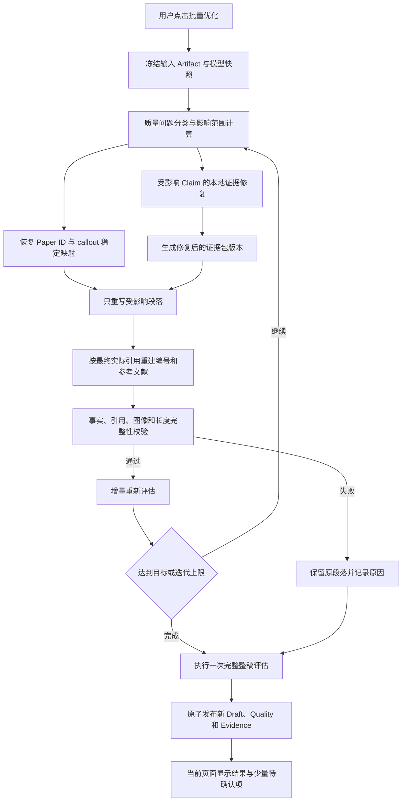

# Review Writer 评估与重写一键闭环功能优化方案

## 1. 文档定位

本文针对 Draft 阶段“评估与重写”功能进行专项优化，解决当前系统能够识别证据问题，却主要停留在段落文字改写，不能自动修复章节证据包的问题。

本文是 `automatic-accuracy-improvement-plan.zh-CN.md` 和 `end-to-end-evidence-writing-optimization-plan.zh-CN.md` 的落地补充，不建设第二套工作流、质量服务、检索平台或数据库。

核心产品目标是：

> 用户只点击一次“批量优化”，系统就在当前页面完成问题分类、证据修复、引用修复、受影响段落重写、重新评估和安全发布；用户不需要返回 Blueprint、章节或 Agent 中间产物逐项处理。

扩大主题文献覆盖不属于本功能的自动行为。系统只自动检索当前项目 Matrix 已选论文，以及 Blueprint/Writing Plan 明确允许的主论文和背景论文；这些论文必须已经存在于当前用户有权访问的 Library 中。未知数字引用、错误引用或仅存在于用户 Library 但尚未纳入项目的论文，不能自动扩大证据集合。需要新增外部论文时，继续使用 Discovery 阶段的联网补检提示，由用户手动开启。

## 2. 项目 555 的当前基线

### 2.1 优化前后结果

对项目 555 的最新 Artifact 进行复核后，现有批量优化结果如下：

| 指标 | 优化前 | 优化后 |
|---|---:|---:|
| 总体评分 | 77.80 | 80.28 |
| `verified` 段落 | 5 | 19 |
| `partially_supported` 段落 | 33 | 20 |
| `needs_human_review` 段落 | 3 | 2 |
| 段落问题数量 | 40 | 34 |
| 阻塞段落数量 | 35 | 30 |
| 最终决策 | `REGENERATE_SECTIONS` | `REGENERATE_SECTIONS` |

本次批量优化生成并采用了 23 个段落变更。单轮状态中共处理 27 个待改写段落，其中 19 个候选通过、8 个候选被完整性校验拒绝。

### 2.2 已确认的主要断点

1. 批量优化能够读取段落诊断和 `unsupported_claims`，但主要执行删除、弱化或重新表述；
2. 优化过程中没有发布新的 `sections/evidence_package.json` Artifact；
3. 证据没有补齐时，重新评估仍会得到 `local_source_recheck` 或 `REGENERATE_SECTIONS`；
4. 当前存在 `citation_reference_map_mismatch`，此类确定性问题不应交给 LLM 反复重写；
5. 多个段落被显示成相同的“返回章节检查证据并重新生成”建议，用户无法分辨真正需要补证据、只需改写或只需修复引用的问题；
6. 章节表面状态和内部查询状态可能不一致。例如章节可以显示 `ready`，但内部仍存在 `partial` 或 `insufficient` 查询；
7. 现有优化到达迭代上限后会留下大量问题，用户只能再次运行或返回前一阶段人工处理，尚未形成闭环。

### 2.3 结论

当前能力不是无效，而是不完整：段落改写已经产生一定提升，但缺少“质量诊断 → 定向补证据 → 局部改写 → 再评估”的前半段，因此不能只靠重复改写彻底解决证据问题。

## 3. 优化目标与非目标

### 3.1 功能目标

1. 保留当前 Draft 页面和主要交互，只升级“批量优化”的后台编排；
2. 一次点击完成可以自动解决的问题，不要求用户返回前序阶段；
3. 重写前先恢复稳定的 Paper ID 与 callout 映射并修复证据，段落重写完成后再生成最终引用编号和参考文献；
4. 只处理受影响章节、问题、论文和段落，不重新生成整篇稿件；
5. 自动采用通过完整性校验、证据状态得到改善且没有产生新严重问题的结果；
6. 每次运行生成完整 Artifact 版本和变更记录，支持历史回滚；
7. 只把原文冲突、图像身份不明或人工新增高风险事实等系统无法可靠决定的问题留给用户；
8. 使用项目当前选择的 Luna、Terra 或 Sol 模型，不在任务脚本中固定模型。

### 3.2 非目标

- 不自动开启联网主题检索或新增外部论文；
- 不自动改变用户已经确认的综述范围；
- 不为单段证据问题重构整份 Blueprint；
- 不新增向量数据库、知识图谱、独立 Quality Service 或第二套任务队列；
- 不通过降低评分规则、隐藏警告或反复润色制造“已经解决”的假象；
- 不静默覆盖存在科学内容冲突的人工编辑。

## 4. 总体流程



整个任务在 Draft 页面内运行。前端可以显示阶段状态和详细结果，但不要求用户打开 Agent 原始输出或跳转到章节页面。

## 5. 问题分类与自动修复路由

质量评估不能再把不同原因统一转成同一句“重新生成章节”。每个问题至少记录以下字段：

```json
{
  "issue_type": "claim_evidence_gap",
  "paragraph_id": "S04-p2",
  "section_id": "S04",
  "claim_ids": ["CLM-S04-02"],
  "paper_ids": ["P..."],
  "question_ids": ["Q-S04-03"],
  "repair_route": "targeted_evidence_then_paragraph_rewrite",
  "auto_repairable": true
}
```

推荐路由如下：

| 问题类型 | 默认处理 | 是否返回前序页面 |
|---|---|---|
| 引用编号缺失、重复或参考文献映射错误 | 确定性重建引用映射 | 否 |
| 已有证据但段落表述超过证据边界 | 缩小主张并局部重写 | 否 |
| 当前证据片段不足，但原论文全文可用 | 在限定论文内定向补检后局部重写 | 否 |
| 章节必需问题处于 `partial/insufficient` | 只修复相关问题和章节证据包 | 否 |
| 语言、结构、长度或重复问题 | 只重写对应段落 | 否 |
| 多段之间存在轻度重复 | 在同一受影响章节内联合优化相关段落 | 否 |
| 原文之间相互矛盾 | 保留原文并进入待确认 | 否，当前页确认 |
| 用户人工加入且无法找到支持的科学事实 | 不静默删除，进入待确认 | 否，当前页确认 |
| 需要新增外部论文才能补足主题覆盖 | 显示联网补检建议 | 是，但只有用户主动开启时才进入 Discovery |
| Blueprint 分类轴或章节顺序存在结构性问题 | 生成结构优化建议或候选版本 | 仅在确属结构问题时，不由普通段落问题触发 |

## 6. 证据包自动修复

### 6.1 先修复状态计算

章节状态不能只查看是否有命中数量，也不能因为任意一个可选查询不充分就判定整个章节不可写。需要显式区分：

- `required_for_claims=true`：当前写作计划中的核心 Claim 必须依赖的问题；
- `optional_context=true`：背景、扩展比较或可选问题；
- `claim_eligible`：可以作为直接科学事实证据的命中；
- `coverage_only`、`neighbor_context`：只能用于覆盖检查或上下文，不能作为直接 Claim 证据。

章节可以标记为 `ready` 的条件应为：

1. 所有仍保留的核心 Claim 至少存在一条可定位的 `claim_eligible` 证据；
2. 所有 `required_for_claims` 查询均已充分，或者对应 Claim 已被安全降级为明确的证据边界说明；
3. 当前要求覆盖的 `writeable` 主论文已经得到有效证据或被重新标记为 `context_only/unresolved`；
4. 不存在未知论文、未知 chunk 或跨项目证据引用。

可选查询仍为 `partial` 时，不必阻断章节，但必须在诊断中准确显示，不能把它混入核心 Claim 的证据状态。

### 6.2 定向补证据流程

对每个 `unsupported_claim` 执行：

1. 从段落 Claim、引用 callout、Writing Plan 和当前 Evidence Package 反向确定论文和科学问题；
2. 只在当前 Matrix 已选论文及 Blueprint/Writing Plan 明确允许的主论文、背景论文全文索引中检索；未知或错误引用不能成为扩展证据范围的依据；
3. 使用 Claim 中的实体、数值、反应条件、结论词和当前项目 Profile 的同义扩展；
4. 命中后读取相邻块用于理解，但直接证据只能来自 `claim_eligible` 内容；
5. 保存论文 ID、chunk ID、页码、支持级别和检索问题；
6. 对新旧证据进行去重，发布新的 Evidence Package 版本；
7. 将修复结果标记为 `supported|partially_supported|not_found|contradicted`。

首期继续使用当前 PostgreSQL 全文检索、精确短语、字段检索和相邻块扩展，不增加新的向量数据库。

### 6.3 未找到证据时的处理

- 非核心细节：删除、缩小或改成明确的有限表述；
- 核心 Claim：保留 Claim 及其可追溯记录，优先使用同一章节中已有支持的证据重新组织段落；仍无法支持时标记为 `downgraded_due_to_insufficient_evidence`，降低解释深度、删除无法支持的具体细节，并改写为当前证据边界或尚不能得出结论的说明；
- 整个科学问题缺乏证据：不从原始 Writing Plan 静默删除 Claim，而是在本次优化产物中保存 Claim disposition。正文只能说明当前所选证据无法支持该问题的确定性结论，不能继续保留无证据的肯定事实；
- 原文明确反驳当前 Claim：不得自动改成相反结论，进入待确认；
- 只有新增论文才能回答：显示“建议联网补检”，但不自动联网。

系统不得把“当前检索片段中没有出现”直接判断为“原论文证明该主张错误”。

“降低解释”不是简单添加“可能”“似乎”等模糊词继续保留原结论。自动改写必须移除无法支持的数值、条件、机理和比较结论，只保留能够由当前证据证明的内容，以及准确描述证据不足的边界说明。

Claim 记录被保留不代表每个降级 Claim 都必须在正文中生成一条免责声明。同一章节存在多个同类证据缺口时，应合并为至多一条简洁的证据边界说明；只有该缺口会影响章节结论时才写入正文，其他降级信息保存在 Claim disposition 和完成摘要中，避免产生大量重复的 “does not establish” 模板句。

## 7. 确定性引用与参考文献修复

`citation_reference_map_mismatch` 不需要 LLM 处理。引用修复分为重写前和重写后两步。

重写前只恢复稳定身份：

1. 根据段落、Claim 和 Evidence 中保存的 Paper ID 恢复 callout 对应论文；
2. 标记无法映射的引用，但不猜测论文身份；
3. 向段落重写任务提供稳定 Paper ID，避免数字编号变化造成错引。

所有段落候选确定后，再根据最终实际引用集合执行：

1. 删除没有正文引用且不属于出版要求的条目；
2. 补回正文引用但参考文献列表缺失的已知论文；
3. 按正文首次出现顺序连续编号；
4. 同步更新正文 callout、图注 callout 和参考文献列表；
5. 重新运行未知引用、重复引用、缺号和孤立条目检查。

无法映射到已知 Paper ID 的引用不得由模型猜测，保留为待确认并显示具体位置。

## 8. 受影响段落重写

### 8.1 重写输入

每个段落重写任务必须读取：

- 原段落及其角色；
- 具体诊断，不使用笼统的“重新生成章节”；
- 已确认的 `unsupported_claims`；
- 修复后的直接证据片段；
- 当前段落允许使用的 Paper ID、Claim ID 和 Figure ID；
- 数字、条件、化学实体、引用和图像等受保护签名；
- 字数规则是否适用于该段落角色。

### 8.2 重写边界

- 只修改受影响段落，默认不重新生成整个章节；
- 不增加证据包以外的新事实、新论文、新数值和新机理；
- 证据不足时优先缩小表述，不用含糊文字伪装成已验证；
- 保留 Markdown 图像、Figure ID 和人工确认内容；
- 多个问题涉及同一段时合并成一次重写，避免多个任务互相覆盖；
- 多段重复或论证顺序问题可以在同一章节内联合处理，但发布时仍记录每段差异。

### 8.3 自动采用条件

候选段落只有同时满足以下条件才能自动采用：

1. 所有引用都在该段允许的证据集合中；
2. 没有引入新的受保护事实、数字、化学实体和图像；
3. 未经许可删除的引用、Figure 或人工内容为零；
4. 目标证据问题被修复、Claim 被安全降级或证据边界得到准确说明；
5. 没有产生新的严重问题，整稿确定性检查不恶化；
6. 候选通过现有完整性验证；
7. 评分只作为辅助排序指标。正确删除无证据细节造成的单段信息量或风格评分小幅下降，不能单独否决一个科学准确性更高的候选。

未通过的候选不写入当前 Draft，只在运行报告中记录拒绝原因。通过的候选可以自动采用，无需第二次逐段确认，并可从历史版本回滚。

用户人工编辑的科学内容应区别处理：确定性格式错误可以自动修复；涉及删除、改变或否定人工科学主张时不静默采用，只在当前页面生成待确认候选。

## 9. 重新评估与迭代

### 9.1 增量评估

只重新评估以下对象：

- 被修改的段落；
- 与其共享引用或 Claim 的相邻段落；
- 被修复引用映射影响的引用完整性；
- 被修改章节的证据状态；
- 整稿级硬完整性检查。

未受影响的段落沿用上一版本结果，但必须记录来源 Quality Artifact，避免把局部评估误显示成全稿重新评估。

增量评估只用于迭代过程。最后一轮结束后必须对最终候选稿执行一次完整整稿评估，重新计算：

- 所有段落的证据状态和路由；
- 跨段重复、章节衔接和论证结构；
- 整稿维度评分；
- 引用与参考文献完整性；
- 最终阻塞问题和待人工确认项。

只有这次完整评估可以成为当前 `draft/quality.json`。最终 Quality 不得继续标记为 `batch_selected_paragraphs` 或沿用旧 `feedback_status`；增量结果只保留在运行历史中。

### 9.2 迭代规则

继续使用用户设置的最大迭代轮次。每轮顺序固定为：

```text
问题分类
  → 稳定引用身份与证据修复
  → 段落重写
  → 最终引用和参考文献重建
  → 完整性校验
  → 增量评估
```

停止条件：

- 已无可自动修复的阻塞问题；
- 达到用户设置的最大迭代轮次；
- 连续两轮没有有效改进。有效改进优先指证据状态改善、阻塞问题减少、引用完整性恢复或 Claim 被安全降级，不能只比较总分；
- 剩余问题全部属于待人工确认或需手动开启联网补检。

迭代上限只限制同一次任务的循环次数，不允许通过隐藏问题或降低门槛将任务标记为成功。

## 10. 前端交互与状态显示

### 10.1 页面操作

保留一个主要按钮：

> 批量优化

点击后不跳转页面、不弹出 Agent 原始文本窗口，也不要求用户先回章节阶段。任务运行时按钮进入禁用或取消状态。

优化任务运行期间，正文和会改变 Draft、Evidence、引用或图像关系的编辑操作暂时锁定；用户仍可查看正文、问题列表和实时进度。任务完成、失败或取消后恢复编辑。服务端仍需执行版本比较，不能只依赖前端禁用按钮保证一致性。

### 10.2 进度状态

建议显示以下阶段：

1. 正在分析问题；
2. 正在修复引用映射；
3. 正在补充受影响章节证据；
4. 正在重写受影响段落；
5. 正在执行完整性校验；
6. 正在重新评估；
7. 正在发布优化结果。

状态栏同时显示：

- 当前阶段；
- 已完成段落/总段落；
- 已修复证据问题数量；
- 已采用、拒绝和待确认候选数量；
- 当前迭代轮次/最大轮次。

刷新页面后继续从服务端任务状态恢复，不丢失进度。

### 10.3 完成摘要

完成后只显示可理解的结果，不重复展示同一句通用建议：

```text
本次优化完成
- 补充证据：8 个 Claim
- 缩小或移除不受支持表述：6 个 Claim
- 修复引用映射：12 处
- 自动采用段落：17 段
- 候选未通过校验：2 段
- 仍需人工确认：1 段
```

每个问题显示具体结果标签：`已补充证据`、`已缩小主张`、`已修复引用`、`候选被拒绝`、`需人工确认` 或 `建议联网补检`。

## 11. Artifact 与数据契约

继续使用现有 Artifact 系统。一次优化任务至少记录：

```json
{
  "source_draft_artifact_id": "...",
  "source_quality_artifact_id": "...",
  "source_evidence_package_artifact_id": "...",
  "source_writing_plan_artifact_id": "...",
  "source_rewrite_overlays_artifact_id": "...",
  "source_reference_map_version": "...",
  "model_snapshot": "gpt-5.6-terra",
  "affected_section_ids": ["S04", "S12"],
  "affected_paragraph_ids": ["S04-p2", "S12-p3"],
  "repaired_claim_ids": ["CLM-S04-02"],
  "claim_dispositions": {
    "CLM-S04-02": "downgraded_due_to_insufficient_evidence"
  },
  "output_evidence_package_artifact_id": "...",
  "output_draft_artifact_id": "...",
  "output_quality_artifact_id": "...",
  "quality_scope": "full_draft"
}
```

### 11.1 `sections/evidence_package.json`

扩展或规范已有字段：

- `required_for_claims`；
- `optional_context`；
- `claim_ids`；
- `support_level`；
- `repair_source_issue_ids`；
- `repaired_at`；
- `source_evidence_package_artifact_id`。

### 11.2 `draft/quality.json`

每个问题增加：

- `issue_type`；
- `claim_ids`；
- `question_ids`；
- `paper_ids`；
- `repair_route`；
- `auto_repairable`；
- `repair_status`；
- `repair_result`。

### 11.3 `draft/optimization-proposals.json`

保留候选差异，同时补充：

- 证据修复前后的 Artifact ID；
- 每段采用或拒绝原因；
- 每个 Claim 的最终处理结果；
- 确定性引用修复摘要；
- 迭代历史和停止原因。

原始 Writing Plan 保持不可变。无证据 Claim 不直接从 Writing Plan 删除，而是在 Optimization Proposal 中保存 `claim_dispositions`。当前 Draft 和 Quality 使用该 disposition；未来如重新生成对应章节，Sections 服务可以读取或显式迁移这些处置结果。

任务所有输出应先写入暂存版本，通过最终整稿评估后，在同一数据库事务中原子更新 Draft、Quality、Evidence 和 Rewrite Overlay 当前指针。任务失败时继续保留原版本。

每次成功运行还必须保存一个优化运行清单，记录本次共同发布的 Artifact ID。历史回滚按照该清单整体恢复相互匹配的 Draft、Quality、Evidence、引用映射和 Overlay，不能只回滚正文造成证据版本错位。

## 12. 服务端实现边界

### 12.1 复用现有组件

复用：

- FastAPI Draft 优化入口；
- 当前任务队列和状态持久化；
- 当前模型网关、项目模型选择和用量记录；
- PostgreSQL 全文索引与章节证据检索；
- Evidence Package 发布逻辑；
- feedback loop 的段落重写、保护签名和完整性校验；
- Artifact 版本、当前指针和回滚能力。

如果现有批量优化接口能够表达新任务阶段，优先扩展原接口，不新建平行 API。科学子进程继续只接收短期任务令牌和内部网关地址。

### 12.2 并发与稳定性

- 以项目为单位保证同一时间只有一个 Draft 优化任务运行；运行期间锁定正文编辑、段落改写、图像插入以及其他会改变 Draft 或 Evidence 的任务，读取操作不受影响；
- 证据补检可以按论文或章节有限并发；
- 同一段落不得并发执行多个重写；
- 所有模型调用继续经过服务端网关，并使用任务创建时的模型快照；
- 网络或模型暂时失败时按现有重试策略处理，不重复发布半成品；
- 服务器重启后从持久化 checkpoint 恢复或安全失败，前端刷新仍可读取状态。
- 重复点击同一个仍在运行的优化任务时返回现有任务状态，不创建重复任务；
- 发布前使用 compare-and-set 同时核对源 Draft、Quality、Evidence、Writing Plan 和 Rewrite Overlay。任一来源版本变化时不得覆盖新内容，也不进行自动文本合并；保留本次候选并提示基于最新版本重新运行。

## 13. 安全与准确性约束

1. 用户主题、论文正文和上传内容只能作为科学任务输入，不能覆盖系统指令；
2. Evidence Repair 只能读取当前用户、当前项目有权访问的 Library 论文；
3. 只允许已知 Paper ID、chunk ID、Claim ID 和 Figure ID 进入产物；
4. `neighbor_context` 和 `coverage_only` 不能升级为直接证据；
5. 不把缺少命中解释为论文明确反对；
6. 不因追求分数删除所有有价值但需要谨慎表达的内容；
7. 不允许改写模型自行新增参考文献；
8. 所有自动变更都可以通过 Artifact 历史回滚；
9. 人工确认过的字段和科学内容必须记录来源，自动任务不得无记录覆盖。

## 14. 实施顺序

### P0：形成最小闭环

1. 规范质量问题分类和影响对象；
2. 修复 Evidence Package 状态汇总；
3. 为 `local_source_recheck` 增加限定论文的 Claim 定向补检；
4. 发布修复后的 Evidence Package 新版本；
5. 增加不修改原始 Writing Plan 的 Claim disposition；
6. 将修复证据和 Claim disposition 传给现有段落重写；
7. 增加重写前身份恢复、重写后最终编号的确定性 citation/reference map 修复；
8. 在增量迭代结束后执行一次完整整稿评估；
9. 完成多 Artifact 原子发布、版本冲突和整组回滚测试。

### P1：完成一键交互

1. 扩展现有批量优化任务状态；
2. 增加证据、引用、重写和重评进度；
3. 自动采用通过校验的候选；
4. 任务运行期间锁定 Draft 编辑，完成后自动恢复；
5. 在当前页面展示具体修复结果；
6. 删除或替换重复的通用“返回章节”建议。

### P2：回归与优化

1. 使用项目 555 建立固定回归样例；
2. 覆盖人工编辑、图像、引用缺失、证据冲突和任务中断场景；
3. 统计补检命中率、自动采用率、候选拒绝原因和重复问题率；
4. 只有词法检索评测证明同义表达召回明显不足时，再评估 pgvector 增强，不在本轮预先引入。

## 15. 验收标准

### 15.1 功能验收

- 用户只点击一次“批量优化”，无需返回前序阶段；
- 任务确实生成新的 Evidence Package Artifact，而不只是修改 Draft；
- 只补检受影响 Claim 和论文，不重跑全部章节；
- 只重写受影响段落，不重写整篇稿件；
- `citation_reference_map_mismatch` 等确定性问题由程序修复；
- 刷新页面后任务状态和进度不丢失；
- 任务运行期间正文保持可查看但不可编辑，结束后恢复编辑；
- 通过校验的候选自动采用，失败候选不污染当前稿件；
- 所有变更可以按一次优化运行整体回滚，不产生 Draft、Evidence 和 Quality 版本错位。

### 15.2 准确性验收

- 每个原 `unsupported_claim` 最终具有 `supported`、`narrowed`、`removed`、`contradicted` 或 `manual_review` 明确结果；
- 系统生成的核心 Claim 在无证据时不被静默删除，必须保留为 `downgraded_due_to_insufficient_evidence` 记录；正文不得继续陈述无证据的肯定事实；
- 不出现新 Paper ID、未知 chunk、越界引用或新科学事实；
- Evidence Package 的章节状态与核心 Claim/必需问题状态一致；
- 直接证据不使用 `coverage_only` 或 `neighbor_context`；
- 引用编号连续，正文、图注和参考文献映射一致；
- 最终 Quality 的评估范围为完整整稿，不沿用局部评估的旧总体状态；
- 重新评估后不再为不同原因的段落批量显示同一句“重新生成章节”。

### 15.3 项目 555 回归验收

项目 555 再次执行一键优化时应满足：

1. 优化任务首先识别证据、引用和文字三类问题；
2. 对真正受影响的章节发布 Evidence Package 新版本；
3. 自动修复当前 `citation_reference_map_mismatch`，无法映射的具体引用单独列出；
4. 现有 30 个阻塞段落逐项得到明确处理结果，而不是统一建议返回章节；
5. 已经通过或仅需 Final Polish 的段落不会被无意义重写；
6. 找不到证据的系统核心 Claim 保留处置记录并降低解释，不直接从 Writing Plan 删除；
7. 最终运行一次完整整稿评估，不再出现局部 Quality 与旧 `feedback_status` 混合；
8. 评分不是唯一成功条件，证据状态、引用完整性和未解决问题数量必须同时改善；
9. 剩余人工确认项只包含系统无法可靠决定的问题。

## 16. 最终产品决定

1. “批量优化”升级为引用身份恢复、证据修复、段落重写、最终引用重建和完整整稿评估的一键任务；
2. 用户不需要返回章节页面查看或操作 Agent 中间产物；
3. 自动补证据只限当前 Library 和已纳入论文，不自动扩大联网文献覆盖；
4. 普通证据问题不触发整份 Blueprint 重构；
5. 自动采用经过完整性和证据校验的机器生成段落，并通过优化运行清单提供整组 Artifact 回滚；
6. 用户人工新增或确认的高风险科学内容不静默覆盖；
7. 系统生成的核心 Claim 缺乏证据时不直接删除，而是降低解释并保存 `downgraded_due_to_insufficient_evidence` 记录；
8. 优化运行期间暂时锁定正文及冲突编辑，页面保持可查看；
9. 最后一轮必须执行完整整稿评估，增量结果不能冒充最终 Quality；
10. 只保留少量真正需要人工学术判断的待确认项；
11. 首期复用现有技术栈，不增加冗余基础设施。
