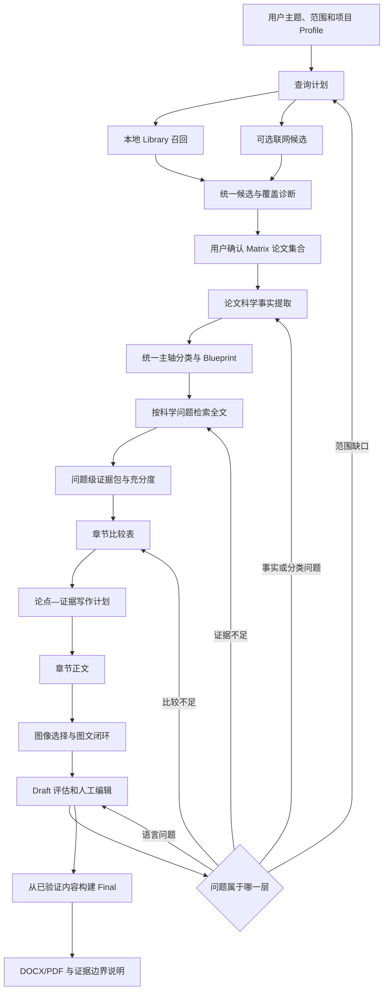

# Review Writer 端到端证据链与综述质量优化方案

## 1. 文档定位

本文基于当前项目代码、现有阶段产物、项目 8180 的实际运行结果以及对应终稿的审稿反馈，整理从“输入主题”到“终稿导出”的统一优化方案。

本文不是针对轴手性联烯主题编写的一套专用规则，也不要求替换现有框架。改造目标是打通以下主链：

```text
主题与范围
  → 检索候选与人工确认
  → 论文科学事实
  → 问题级全文证据
  → 跨论文比较
  → 证据约束写作
  → 问题定向回流
  → 终稿与证据边界说明
```

本文作为后续端到端质量改造的主文档，与以下已有文档互补：

- `paper-agent-retrieval-rag-improvement-plan.zh-CN.md`：保留其多来源搜索、MinerU 切片、PostgreSQL 全文检索和可选向量增强设计；
- `reviewer-driven-quality-optimization-plan.zh-CN.md`：保留其 Metadata 来源追踪与人工修订、分类轴一致性、综合指标、图文闭环和导出 QA 设计；不恢复已取消的自动书目信息联网核验；
- `figure-caption-and-placement-optimization-plan.zh-CN.md`：作为图像角色、段落定位、出版图注和正文解释分层的专项实施契约；
- 本文重点补齐两份文档之间尚未完整连接的“范围—科学事实—证据—比较—写作—回流”逻辑。

如局部实施描述存在冲突，以当前代码复核结果和本文的精简原则为准。

### 1.1 已确认的产品决定

1. 没有有效证据的主论文继续保留在 Matrix，但标记为 `unresolved`，正文不强制引用；只有当前章节状态为 `writeable` 的主论文必须覆盖；
2. 用户点击一次“确认进入 Matrix”后，系统自动等待科学事实提取任务完成并原子发布 Matrix，不增加第二次人工确认；单篇部分失败不阻断整批；
3. 本轮不解决跨项目重复事实提取的 Token 成本问题，不建设用户级论文科学事实缓存；
4. 若全部论文的科学事实提取失败，保存基础书目 Matrix 但不自动开放 Planning；页面提供“重试事实提取”和由用户主动触发的“以有限模式继续”；
5. 用户手工加入但没有证据支持的具体主张不得被系统静默修改；经现有 Draft 评估和人工批准后允许带高风险警告导出，但不得被自动用于 Conclusion、Abstract 或总览图；
6. 首期只开放“叙述性专题综述”。`review_type` 保留扩展能力，但范围综述、系统综述和快速综述在对应方法学流程完成前不显示为可选项。

## 2. 当前结论

### 2.1 当前项目已经具备的基础

项目已有以下能力，不应重复建设：

- FastAPI 服务端接口、身份认证和项目隔离；
- PostgreSQL 业务状态、任务状态和全文索引；
- 用户级 Library 与项目级论文选择；
- MinerU 精确解析及 PDF、Markdown、内容块和图片 Artifact；
- 多来源 Discovery、查询规划、确定性回退和人工确认；
- Matrix、Outline、Blueprint、Evidence Package、Writing Plan、Draft 和 Final 等分阶段产物；
- 项目当前所选文本模型的服务端网关调用、并发控制、用量记录和计费；
- 段落级编辑、候选重写、历史回滚和人工批准；
- 图像选择、重绘、批准和最终插入；
- DOCX/PDF 导出及基础完整性检查；
- Artifact 版本、当前版本指针和下游 stale 传播。

因此，本轮不新建第二套工作流、第二套质量中心或第二套文献真相源。

### 2.2 当前主链的真实断点

目前不是完全没有证据链，而是中间几处连接强度不足：

1. Discovery 能选出论文，但没有充分说明所选论文对声明范围的覆盖情况；
2. Matrix 主要是书目与摘要清单，缺少可用于科学比较的结构化事实；
3. Blueprint 能分配论文，却没有稳定建立同一分类维度下的可比较字段；
4. Section 检索把多个科学问题合成一个长查询，正常命中不足时使用论文首页片段保底；
5. “论文被引用”被当作覆盖成功，但不代表反应条件、数据、机理和局限已经获得原文支持；
6. 写作计划具有 claim/evidence 结构，但输入证据不足时只能形成形式正确、信息较弱的正文；
7. Draft 评估能发现问题，却主要只能重写文字，不能把问题送回 Discovery、Matrix 或 Evidence；
8. Final 主要检查技术完整性，仍可能发布带有学术质量警告的稿件；
9. 新生成的结论和总览图可能引入正文未建立的新概括。
10. 当前章节校验强制每篇 `primary_paper` 都必须被引用，与“无有效证据时不生成具体论点”存在直接冲突；
11. 用户在 Draft Preview 中新增或大幅修改的内容，尚未形成与原始 Section Claim 同等稳定的证据映射。

### 2.3 项目 8180 暴露的代表性问题

项目 8180 不是单一模型偶发失败，而是上游问题逐级传递：

- 本地 69 篇论文中得到 29 个候选，人工选入 20 篇；
- 联网检索关闭，实际范围仅代表所选本地语料；
- Matrix 中 20 篇论文全部仍为 `needs_full_reading`，科学事实字段不足；
- 分类主轴中混合了底物、前体、产品和反应方式；
- 20 篇论文全文索引均为 ready，但章节只得到 19 个正文保底片段；
- 这些片段全部来自第 1 页、相关性得分为 0，却被算作正常证据覆盖；
- Writing Plan 有 52 个论点，其中 16 个仅部分支持，12 个没有证据引用；
- 跨论文比较段落为 0，比较覆盖率为 0；
- Blueprint 计划约 9850 词，实际章节正文约 2521 词；
- Draft 评估已经建议重新生成章节，但人工低分覆盖后仍进入 Final；
- Final 技术校验通过，同时保留成稿语言和图文论证不足警告。

因此，最优先的工作不是增加更多末端评分，而是修复 Matrix 与 Section Evidence 之间的连接。

### 2.4 当前实施状态

项目 8180 的数据用于描述旧链路基线，不等于当前代码仍完全处于该状态。截至 2026-08-24，代码中已经存在部分目标能力，后续实施必须先复核现状，不能按本文重复建设：

| 里程碑 | 当前状态 | 已有主要能力 | 仍需按本文收口 |
|---|---|---|---|
| P0 | 核心语义已打通 | 单篇定向与全局比较召回、`coverage_only`、`neighbor_context`、`writeable/context_only/unresolved`、独立 `support_level`、章节证据诊断 | 继续补齐更细的问题级诊断和跨场景回归 |
| P1 | 核心状态已打通 | Matrix 科学事实任务、逐篇进度与 checkpoint、有限模式、Synthesis State、`source_channel/support_level/review_status` | 继续完善事实人工修订界面和更多学科分类轴回归 |
| P2 | 部分实现 | Draft 问题路由、段落级重写、人工批准和部分证据完整性检查 | 完整的人工编辑 Claim 重映射和问题级回流 |
| P3 | 基础链路已打通 | 图像选择/重绘、图注分层与语义定位、自动摘要/关键词、作者候选与逐字段状态、Final、DOCX/PDF 与 QA | 继续完善出版图注专用人工编辑和投稿模板差异化检查 |

本表是实施审计状态，不替代后续自动测试结果。完成状态只能在对应回归测试通过后更新。

## 3. 改造原则

### 3.1 保留现有技术主栈

继续使用：

- MinerU 作为 PDF 结构解析事实源；
- PostgreSQL 作为业务数据库和首期全文检索引擎；
- 当前 FastAPI、任务执行器和 Artifact 版本体系；
- 当前文本模型网关和用户所选 Luna、Terra、Sol 模型；
- 当前 7 阶段前端外观、主要交互和人工确认节点。

文本任务必须读取项目当前所选模型。任务创建时保存模型快照，运行中的任务不因用户随后切换模型而变化，新任务使用最新选择。不得在科学脚本中固定为 Luna 或其他模型。

### 3.2 不增加平行质量系统

范围、事实、证据、综合和质量信息应扩展现有产物：

| 现有产物 | 推荐扩展 |
|---|---|
| `discovery/review.json` | 检索来源、候选覆盖、缺口和范围声明 |
| `planning/selected_outline.json` | `scope_contract`、主轴/辅轴和覆盖诊断 |
| `matrix/literature_matrix.json` | 每篇论文的科学事实摘要及证据引用 |
| `blueprint/section_blueprint.json` | 科学问题、比较轴和预期证据类型 |
| `sections/evidence_package.json` | 问题级证据、命中类型和证据充分度 |
| `sections/synthesis_state.json` | 比较表、综合覆盖率和证据边界 |
| `sections/writing_plan.json` | claim、evidence、epistemic status 和证据上限 |
| `draft/quality.json` | 问题类型、影响对象和推荐返回阶段 |
| `final/validation.json` | 范围声明、未解决警告和发布说明 |

不新建一套 `/quality/*` API 或独立 Quality Service。必要的可复用逻辑只抽成无状态 helper，由现有阶段服务调用。

### 3.3 不把学术判断变成僵硬控制门

硬阻断只用于确定性的完整性错误：

- 文件或 Artifact 不存在；
- 跨用户、跨项目资源引用；
- 引用未知论文或未知 chunk；
- Markdown 图片语法损坏；
- 当前产物依赖的版本已经失效；
- 模型输出结构无法解析或与任务契约不一致。

以下情况原则上不硬阻断：

- 文献数量偏少；
- 某一分类覆盖不足；
- 机理证据不足；
- 可比较论文不足；
- Metadata 存在未解决冲突；
- 目标字数未达到；
- 部分图片缺少解释；
- 文章评分低于建议目标。

系统应显示证据边界、推荐返回阶段和受影响对象，允许用户继续，但不能把“有警告的有限证据”显示成“证据充分”。

主论文是否必须进入正文由当前章节的证据状态决定，而不是只由 Blueprint 中的 `primary_papers` 名单决定。没有可用证据的主论文可以继续保留在 Matrix 和章节诊断中，但不得为了满足论文覆盖校验而强制使用首页、标题或零分保底片段生成正文。

### 3.4 领域规则只增强，不替代常规召回

执行顺序统一为：

```text
通用主题理解和常规召回
  → 当前项目显式选择的领域 Profile 扩展
  → 合并、去重和可解释排序
  → 人工确认
```

- `general_academic` 不使用化学规则；
- `chemistry_general` 可增加化学别名、底物和反应术语；
- 领域规则不能提前排除没有命中领域标签但文本高度相关的论文；
- 自动项目标签只能用于排序和建议，不能作为论文科学事实；
- 只有人工验证标签或全文事实才能参与强分类依据。

### 3.5 先做词法与结构检索，再评估向量增强

首期继续使用 PostgreSQL 精确短语、全文词法检索、字段检索和相邻块扩展。

只有人工标注评测证明大量正确证据因同义表达无法召回时，才启用 pgvector。当前不引入 Elasticsearch、Milvus、Weaviate、Chroma、知识图谱或新的消息队列。

## 4. 目标流程



## 5. 阶段 1：Library 与 Metadata

### 5.1 目标

保证进入项目的每篇 PDF：

- 原始文件可访问；
- MinerU 解析产物完整；
- 正文块可按页码、章节和内容类型查询；
- 书目信息来源和冲突可解释；
- 索引可从不可变 Artifact 重建。

### 5.2 保持现有入库边界

PDF 只有在 MinerU 精确解析成功并且原始 PDF、Markdown、内容块和资产已安全存储后，才进入 Library。

上传重复论文时不重复解析，应返回明确状态：

- 已存在并复用；
- 已存在但索引需要重建；
- Metadata 已更新；
- 解析失败，可重试；
- 文件相同但书目信息冲突，等待确认。

上传和索引状态继续持久化，刷新页面后从数据库恢复，不保留已结束任务造成的长期假状态。

### 5.3 Metadata 来源与人工修订

规范 Metadata 仍是下游唯一书目真相源。已上传论文默认读取 PDF 首页、MinerU 解析结果、既有 Discovery 导入信息和用户修改，不再为每篇论文自动调用 Crossref、OpenAlex 等来源执行书目信息联网核验。

Crossref、OpenAlex 等外部来源仍可用于 Discovery 联网检索或用户主动发起的期刊检索，但外部返回值不能在后台静默覆盖 Library 中已经保存的规范 Metadata。

每个重要字段保存或展示：

```json
{
  "value": "...",
  "source": "pdf_first_page|mineru|discovery_import|user",
  "confidence": 0.92,
  "human_checked": false
}
```

初次入库时可使用 PDF 与 MinerU 结果填充空字段。入库后的人工修改优先，重新解析不得静默覆盖。单纯修改字段来源、置信度或审核状态不触发下游 stale；规范字段实际改变时才触发现有版本传播。

### 5.4 全文索引

继续复用 MinerU 已切分的内容块，索引需保留：

- `paper_id`；
- 稳定 `chunk_id`；
- `page_start/page_end`；
- `section_path`；
- `content_type`；
- 原始块顺序；
- 前后相邻块；
- 表格、图像和图注关联；
- 是否为 References；
- 来源 Artifact 版本。

索引损坏或规则升级时可以重建，不需要重新调用 MinerU。

## 6. 阶段 2：Discovery 与检索范围

### 6.1 两类候选池

Discovery 明确区分：

1. **本地可用论文**：已在 Library 中完成解析，可被用户直接选入 Matrix；
2. **联网覆盖候选**：用于提示可能缺失的论文，在获得合法 PDF、完成 MinerU 解析并进入 Library 前不能用于正文写作。

联网结果不能仅凭摘要被自动当作正式引用证据。

### 6.2 查询规划

查询规划输出：

- 主题核心实体；
- 综述类型，首期固定为 `narrative_topic_review`；字段继续保留扩展能力，但其他类型暂不显示为可选项；
- 通用同义词；
- 用户显式关键词；
- 子主题或候选分类；
- 年份和排除条件；
- 当前 Profile 允许的领域扩展；
- 查询生成来源：模型或确定性回退。

模型输出年份等字段必须经过类型归一化。无效字段只丢弃对应筛选条件，不让整个检索失败。

每次检索还应保存可复现信息：实际发送到各来源的查询式、筛选条件、来源启停状态、执行时间、检索截止时间、各来源返回数量和错误状态。首期叙述性专题综述只展示必要摘要。未来只有在完整实现数据库级检索式、纳入排除记录、去重流程、筛选审计、PRISMA 类流程和风险偏倚评价后，才开放系统综述或快速综述选项，避免对用户形成错误能力声明。

确认范围至少包含以下语义字段：

```json
{
  "review_type": "narrative_topic_review",
  "topic": "...",
  "target_question": "...",
  "inclusion_criteria": [],
  "exclusion_criteria": [],
  "date_range": {},
  "language_scope": [],
  "coverage_claim": "selected_corpus_only"
}
```

`confirmed_scope_hash` 只计算这些会改变文章含义的语义字段，不包含任务时间、来源响应状态或页面展示文本，避免非内容变化导致后续过期。

### 6.3 范围说明与覆盖诊断

用户确认 Matrix 前，页面显示：

- 当前范围声明；
- 当前综述类型及其允许的覆盖声明；
- 本地候选数、联网候选数和选中数；
- 各子主题候选数量；
- 年份分布和最新论文分布；
- 没有候选或候选过少的主题簇；
- 联网来源失败或关闭状态；
- 当前结果能够支持的 coverage claim。

不得在没有领域基准集时显示“已覆盖全领域 90%”等虚假精确指标。推荐使用：

- 已覆盖；
- 覆盖较弱；
- 暂无本地全文；
- 仅有联网候选；
- 未检索到。

### 6.4 确认与失效规则

- 修改关键词、Profile、筛选条件或联网开关，只更新 Discovery 草稿，不影响后续阶段；
- 用户只查看新候选，不影响 Matrix 和后续内容；
- 只有点击“确认进入 Matrix”后，论文集合或已确认范围的变化才允许影响后续阶段；
- 分别保存 `selected_paper_set_hash`、`confirmed_scope_hash`、`taxonomy_profile_hash` 和 `matrix_fact_schema_version`，不能只比较论文 ID；
- 论文集合变化时构建新的 Matrix；论文集合未变但确认范围变化时复用现有书目与科学事实，只使 Planning 及后续阶段需要复核；
- 只有查询表达式变化、但确认范围与论文集合均未变化时，不触发 downstream stale；
- 论文集合、确认范围和相关 schema hash 均未改变时，不得触发无意义 stale；
- 已运行中的检索任务使用创建时的模型和条件快照。

## 7. 阶段 3：Matrix 科学事实与统一分类

### 7.1 从书目行升级为科学事实行

扩展现有 Matrix 行，不另建平行事实数据库。每篇论文包含通用科学字段：

```json
{
  "paper_id": "P001",
  "document_role": "primary_research|review|perspective|method|unknown",
  "research_object": [],
  "input_or_population": [],
  "method_or_intervention": [],
  "output_or_outcome": [],
  "conditions_or_context": [],
  "quantitative_results": [],
  "mechanism_or_explanation": [],
  "scope": [],
  "limitations": [],
  "author_claims": [],
  "project_relevance": "core|supporting|background|uncertain",
  "extraction_status": "pending|complete|partial|limited|failed",
  "review_status": "not_required|needs_review|human_checked"
}
```

每个事实项包含：

```json
{
  "value": "...",
  "paper_id": "P001",
  "chunk_ids": ["..."],
  "pages": [3, 4],
  "support_excerpt": "与规范化事实直接对应的简短原文",
  "source_channel": "body|table|figure_caption|abstract",
  "support_level": "direct|abstract_limited",
  "epistemic_status": "observed|author_reported|author_proposed|review_inference",
  "confidence": 0.88,
  "human_checked": false
}
```

Matrix 保存紧凑事实和证据引用，不复制大段原文。原文继续由 Library chunk 提供。

只验证 `chunk_id` 存在还不够。程序必须确认 `support_excerpt` 能在对应 chunk 或其规范化文本中定位；无法定位的模型输出不得成为直接事实，只能进入低置信候选或人工确认。复杂语义是否完全蕴含可以对低置信项进行有限模型复核，不为所有字段增加第二次模型调用。

### 7.2 通用字段与领域扩展

通用字段保证跨学科可用，领域 Profile 只增加可选字段映射：

| Profile | 可选领域字段示例 |
|---|---|
| 通用学术 | 研究对象、方法、结果、范围、局限 |
| 化学 | 起始底物、目标产物、反应类型、催化剂、配体、产率、ee/dr、机理依据 |
| 医学 | 人群、干预、对照、结局、样本量、风险偏倚 |
| 计算机 | 任务、模型、数据集、基线、指标、计算成本 |
| 材料 | 组成、制备、结构、性能、测试条件、稳定性 |

未选择对应 Profile 时，不运行该领域专用提取规则。

### 7.3 提取顺序

推荐顺序：

1. 使用结构、关键词和确定性规则定位可能相关章节；
2. 从摘要、方法、结果、表格、图注和结论提取候选事实；
3. 使用项目当前所选文本模型完成语义归一化；
4. 校验每个事实是否有合法 `paper_id/chunk_id/page`；
5. 校验支持原文能够在对应 chunk 中定位，并区分直接观察、作者报告、作者推测和综述推断；
6. 无法定位原文的字段记录字段级 `not_found`，不得创建直接事实；
7. 低置信或冲突字段设置 `review_status=needs_review`，不改变任务是否完成，也不阻断其他论文处理。

任务按论文 checkpoint。单篇失败不重放整批成功论文，用户可以只重试失败项。

### 7.4 分类轴契约

Planning 中必须区分：

```json
{
  "primary_axis": "...",
  "secondary_axes": ["..."],
  "overview_axis": "...",
  "classification_basis": "user|fact_card|verified_tag|metadata|inference",
  "axis_mapping_note": "..."
}
```

分类规则：

- 同一级正文标题原则上使用同一主轴；
- 催化剂、机理、年代或性能可以作为章节内部比较辅轴；
- 论文分类优先使用全文事实，其次使用人工验证标签，再次使用标题/摘要；
- 项目自动标签只能给出建议，不能单独决定主分类；
- 无法确定的论文进入“跨类别与边界案例”，并显示原因；
- 系统检测混合维度，但不自动阻止用户采用特殊结构。

Planning 确认后的主轴、辅轴、映射和论文分类计算独立的 `classification_axis_hash`。它与项目领域规则版本的 `taxonomy_profile_hash` 不是同一个对象：前者变化时复用当前科学事实并重建 Planning 及后续；后者变化时需要重新执行对应领域事实准备。

### 7.5 Matrix 自动准备与一次确认

用户只执行一次“确认进入 Matrix”：

```text
确认当前论文集合与范围
  → 保存不可变的 Discovery 选择快照
  → 提交 matrix.enrich 后台任务
  → Matrix 显示准备进度
  → 按论文提取科学事实并记录 checkpoint
  → 所有论文达到 complete/partial/limited/failed 终态
  → 一次性发布当前 Matrix Artifact
  → 自动开放 Planning
```

不要求用户在事实提取完成后再点击第二次确认。单篇提取失败时，其他论文继续；任务完成后仍发布 Matrix，并把失败论文标记为 `failed`。只有摘要证据的论文标记为 `limited`；存在低置信或冲突事实时另外设置 `review_status=needs_review`。只有任务级基础设施错误导致无法形成任何有效 Matrix 时，才保持 Matrix 未发布并提供重试。

Planning 不得读取仍在逐篇写入的半成品 Matrix。科学事实提取过程中只更新任务/checkpoint状态，全部对象达到终态后再原子发布一个 Matrix 版本，避免每完成一篇就反复使 Blueprint 过期。

每篇论文必须有有限超时、有限重试和租约回收。超过上限后自动进入 `failed` 终态，不能让一个卡住的对象使整个 Matrix 永久停留在处理中。

`matrix.enrich` 任务保存并在发布时校验：

- `discovery_revision`；
- `selected_paper_set_hash`；
- `confirmed_scope_hash`；
- `taxonomy_profile_snapshot`；
- `matrix_fact_schema_version`；
- `model_tier_snapshot`；
- 每篇论文的 `source_lineage_hash`。

如果用户在旧任务运行期间重新确认了论文集合、范围或 Profile，旧任务可以完成并保留审计记录，但不得提升为当前 Matrix。发布必须使用现有原子比较与设置机制，防止旧任务覆盖新确认结果。

若部分论文成功或部分成功，正常发布 Matrix 并自动开放 Planning。若全部论文均为 `failed`、没有任何可用科学事实，则保存可查看的基础书目 Matrix，但不自动开放 Planning；页面提供：

1. “重试事实提取”：只重试失败论文；
2. “以有限模式继续”：由用户主动确认使用标题、摘要和 Metadata 生成受限 Planning。

有限模式必须持续显示来源限制，生成的分类和章节默认标记为低置信，不能被包装成已经完成全文科学判别。这是异常处理选择，不是正常流程中的第二次确认。

## 8. Blueprint：从章节目录升级为科学问题契约

### 8.1 每个章节需要明确的内容

每个正文章节除标题、primary papers 和目标字数外，还应记录：

- 本章的研究问题；
- 主分类值；
- 允许使用的辅轴；
- 必须回答的科学问题；
- 应比较的论文组合；
- 预期证据类型；
- 不允许超出证据生成的结论；
- 单篇代表性案例和支持性论文的角色；
- 图像需求及其论证作用。

通用的科学问题模板为：

1. 研究对象或输入是什么；
2. 使用了什么方法或干预；
3. 得到什么结果；
4. 结果适用于什么范围；
5. 方法有什么限制；
6. 作者提供了什么机制或解释；
7. 与同组其他研究相比有什么相同和不同。

领域 Profile 可以把这些问题映射为化学底物/催化体系/选择性、医学 PICO 或计算机任务/数据集/指标，但不改变通用数据契约。

### 8.2 论文角色

- 一篇论文原则上只有一个 `primary_owner_section`；
- 论文可作为其他章节的 supporting evidence；
- supporting 使用必须服务于明确比较，不能在多个章节重复完整介绍；
- Review/Perspective 默认作为背景或脉络来源，不能替代原始研究支持具体实验事实；
- 一篇论文没有足够全文证据时保留在 Matrix，但 Blueprint 显示其证据风险。

证据状态首先记录到 `paper_id + section_id + question_id`，不能只给整篇论文或整个章节一个总状态。例如：

```text
P001 × S03 × 方法：writeable
P001 × S03 × 定量结果：writeable
P001 × S03 × 适用范围：partial
P001 × S03 × 机理：unresolved
```

在问题级状态基础上，再派生论文在当前章节中的总体写作状态：

| 状态 | 含义 | 章节规则 |
|---|---|---|
| `writeable` | 至少有一个与本章核心问题相关的具体论点得到 `support_level=direct` 的证据支持 | 属于主论文时必须至少覆盖一个经验证的章节相关论点，但不能越过其他问题的证据上限 |
| `context_only` | 只有摘要级或背景性证据 | 可以有限提及，不要求具体数据和机理 |
| `unresolved` | 只有 `coverage_only` 或完全缺失 | 保留诊断，不强制引用，不生成具体论点 |

该总体状态是“论文在当前章节中的派生状态”，不是对整篇论文永久定性，也不能覆盖问题级证据状态。同一篇论文可以在方法方面为 `writeable`、在机理方面为 `unresolved`；正文只能写前者，不能因为论文总体为 `writeable` 就推断后者。

章节完整性校验必须从“所有 `primary_papers` 均被引用”调整为“所有 `writeable` 主论文至少有一个章节相关的经验证论点被覆盖，并且所有论点均遵守对应 question 的证据上限”。`context_only` 论文允许但不强制简短提及；`unresolved` 论文不得为了通过校验而使用首页、标题或零分片段强行进入正文。

若一个章节只有 `context_only` 论文，可以生成明确受限的背景性内容；若所有论文均为 `unresolved`，该章节状态为“暂无可写证据”，不生成虚假正文，其他章节继续。系统提供重新检索、重建索引、调整分类、补充论文或排除空章节的入口。

## 9. 阶段 4：问题级全文证据检索

### 9.1 查询拆分与布尔构造

停止把章节标题、核心论点和全部 must-cover points 合成唯一长查询。按本章科学问题分别查询：

```text
对象/输入查询
方法/条件查询
定量结果查询
范围查询
机制/解释查询
局限查询
```

每个问题同时生成：

- 面向说明和未来可选语义检索的自然语言问题；
- 必须出现的核心概念组；
- 当前问题的术语组；
- 精确术语和短语；
- 同义词及缩写；
- 当前 Profile 允许的领域别名；
- 排除词；
- allowed paper IDs；
- 预期内容类型，例如正文、表格或图注。

首期词法检索不能把自然语言问题或所有字段重新拼成一条长句直接传给 `websearch_to_tsquery` 或整句 `contains`。查询计划应显式表示同义词组：

```json
{
  "question_id": "scope",
  "required_concept_groups": [
    ["propargylic alcohol", "propargyl alcohol"]
  ],
  "question_term_groups": [
    ["substrate scope", "functional group tolerance", "yield", "ee"]
  ],
  "exact_phrases": ["propargylic alcohol", "substrate scope"],
  "excluded_terms": [],
  "allowed_paper_ids": []
}
```

布尔构造规则：

- 同一同义词组内部使用 OR；
- 核心概念组与科学问题组之间使用 AND；
- 每个精确短语分别执行规范化匹配，不要求所有短语在正文中连续出现；
- 缩写、化学名称、数字条件和公式保留独立词法通道；
- 查询放宽时先移除非必要修饰词，再减少 AND 组，不能直接退回任意首页片段。

例如范围查询应接近：

```text
("propargylic alcohol" OR "propargyl alcohol")
AND
("substrate scope" OR "functional group tolerance" OR yield OR ee)
```

跨论文比较原则上不作为原始研究的独立全文查询。系统应先分别检索各论文在相同维度上的方法、结果、范围和局限，再通过比较表建立关系。只有 Review、Perspective 或原始论文明确讨论前人工作的情况下，才额外检索作者已有的比较性表述，并将其标记为来源作者观点，不能替代系统对原始证据的对齐。

### 9.2 两路召回与动态证据预算

单一全局 Top-K 不能承担论文覆盖。若章节有 14 篇主论文而全局 `top_k=12`，即使索引正常，也不可能让每篇论文都获得一次直接命中机会。首期采用两路召回：

#### A. 单篇定向召回

- 先复用 Matrix 事实卡中与当前 question 对应的证据；
- 对每篇 primary paper 在其自身全文范围内执行当前问题查询，默认保留 1～2 个最相关 anchor；
- supporting/context paper 只有在事实卡或全局查询表明与当前问题相关时才执行定向补充；
- 定向召回只是保证每篇论文被真实搜索，不保证每篇论文一定有证据；
- 没有命中的论文进入检索诊断，不使用第一页保底伪装成直接证据。

#### B. 全局比较召回

- 在当前章节全部 `allowed_papers` 中执行同一科学问题查询；
- 选择最适合建立差异、共同点、趋势和边界的高相关证据；
- 执行每篇论文上限，避免单篇论文垄断上下文；
- 全局结果用于补充比较价值，不能替代单篇定向检索结果。

两路结果合并时：

1. 优先保留事实卡已有证据；
2. 每篇 `writeable` 主论文保留至少一个与章节相关的最佳 anchor；
3. 在剩余 Token 预算内加入全局高价值证据；
4. 对重复或高度重叠 chunk 去重；
5. 相邻块只作为 anchor 的上下文，不单独计为论文覆盖或新的直接证据；
6. 表格、图注和正文指向同一结果时建立关联，不机械重复发送；
7. Evidence Package 使用动态证据预算，而不是用固定 Top-K 同时承担相关性、论文覆盖和比较三个目标。

### 9.3 召回顺序

对每个问题和每个适用召回通道，首期顺序为：

1. 事实卡中已定位的证据；
2. 规范化精确短语；
3. PostgreSQL 全文词法检索；
4. 标题、章节路径和内容类型轻量加权；
5. 高分 anchor 的相邻块；
6. 查询缩短和同义词放宽重试一次；
7. 有限范围的全文局部扫描；
8. 摘要作为低等级证据；
9. 仅覆盖或缺失状态。

领域标签可以影响排序，不能制造不存在的全文命中。当前 PostgreSQL GIN 全文索引、稳定 chunk ID、页码和邻接关系继续复用，不更换搜索引擎。

### 9.4 命中类型必须准确

证据的“从哪里召回”和“能支持到什么程度”必须分开记录。`retrieval_pass` 继续表示 `matrix_fact_card/per_paper/global_comparison` 等召回来源；`match_type` 表示命中与上下文关系；最终写作权限只读取 `support_level`。

现有命中类型兼容为：

| `match_type` | 含义 | `support_level` 规则 |
|---|---|---|
| `direct_match` | 直接命中当前科学问题 | 通常为 `direct`，仍需通过来源定位校验 |
| `fact_card_evidence` | 从 Matrix 事实卡复用 | 继承事实卡原始 `support_level`，不能自动视为直接证据 |
| `neighbor_context` | 直接证据的上下文 | `context_only`，不单独承担核心事实 |
| `table_or_figure` | 表格、图注或关联说明 | 根据原始内容判定 `direct` 或 `abstract_limited` |
| `abstract_only` | 只有摘要支持 | `abstract_limited` |
| `coverage_only` | 只能证明论文与主题相关或存在 | `coverage_only` |
| `missing` | 没有找到证据 | `missing` |

写作权限统一读取：

| `support_level` | 可支持内容 |
|---|---|
| `direct` | 与证据对应的具体事实；满足可比性时可参与有限比较 |
| `abstract_limited` | 只概括来源作者报告的主要结果，不扩展条件、数字或机理 |
| `context_only` | 只补充已经存在的直接证据语境，不单独支持 Claim |
| `coverage_only` | 只能说明论文属于相关主题或确实存在 |
| `missing` | 不得写成已知事实 |

不得因为 Evidence Package 中存在 `coverage_only` 行，就把整个章节标记为正常 `lexical` 检索成功。`neighbor_context` 也不能独立提升论文覆盖或证据充分度。事实卡是否可写必须继承其原始证据强度，不能仅凭 `fact_card_evidence` 名称升级。

### 9.5 检索失败诊断

零命中不等于论文没有科学证据。系统必须先区分：

| 诊断状态 | 含义 | 推荐动作 |
|---|---|---|
| `query_miss` | 索引健康，但当前查询未命中 | 缩短查询、检查同义词和布尔组 |
| `index_incomplete` | 索引页数、chunk数或来源版本异常 | 重建当前论文索引 |
| `parse_quality_low` | OCR/MinerU有效文本比例过低 | 检查解析产物或重新解析 |
| `not_in_paper` | 问题级、单篇定向和有限全文扫描后仍未发现 | 标记该论文在当前问题上 `unresolved` |
| `corpus_gap` | 本章全部相关论文都缺少该类证据 | 提示补充论文、缩小主张或调整范围 |

诊断至少记录：索引状态、来源 lineage、chunk 数、页面覆盖、有效字符量、最后索引页、实际执行的查询组、每次放宽结果和失败原因。只有 `not_in_paper` 与 `corpus_gap` 表示当前科学语料确实没有找到对应证据；前三类是检索或解析问题，不能直接写成研究空白。

### 9.6 证据充分度

每个科学问题记录：

- `sufficient`：有足够直接证据；
- `partial`：只有部分字段或部分论文有证据；
- `abstract_limited`：只能基于摘要概括；
- `insufficient`：不足以支持计划论点；
- `not_applicable`：本章不需要该问题。

状态依据必须可解释，例如：

```json
{
  "question_id": "scope",
  "status": "partial",
  "papers_expected": 4,
  "papers_with_direct_evidence": 2,
  "papers_with_abstract_only": 1,
  "papers_missing": 1,
  "suggested_action": "重新检索缺失论文的结果和底物范围章节"
}
```

不设置脱离数据基线的固定论文数量门槛。

### 9.7 Evidence Package

扩展现有 Evidence Package，而不是另建新报告：

```json
{
  "section_id": "S03",
  "queries": [],
  "question_coverage": [],
  "evidence": [
    {
      "evidence_id": "E001",
      "question_id": "quantitative_results",
      "paper_id": "P001",
      "chunk_id": "...",
      "pages": [5],
      "section_path": "Results > Substrate scope",
      "content_type": "table",
      "retrieval_pass": "per_paper|global_comparison|fact_card",
      "match_type": "direct_match",
      "support_level": "direct",
      "source_channel": "body",
      "text": "...",
      "scores": {},
      "artifact_version": "..."
    }
  ],
  "diagnostics": {
    "direct_hit_count": 0,
    "abstract_only_count": 0,
    "coverage_only_count": 0,
    "query_miss_count": 0,
    "index_incomplete_count": 0,
    "parse_quality_low_count": 0,
    "not_in_paper_count": 0,
    "missing_question_ids": []
  }
}
```

## 10. 章节比较表与综合状态

### 10.1 为什么需要比较表

模型不能仅靠“请综合比较这些论文”稳定形成批判性综述。必须先把同一章节内可比较的字段对齐。

比较表扩展到现有 `sections/synthesis_state.json`，不作为新的书目或证据真相源。

### 10.2 通用比较结构

```json
{
  "section_id": "S03",
  "comparison_axes": ["method", "outcome", "scope", "limitation"],
  "rows": [
    {
      "paper_id": "P001",
      "values": {
        "method": {"value": "...", "evidence_ids": ["E01"]},
        "outcome": {"value": "...", "evidence_ids": ["E03"]},
        "scope": {"value": "...", "evidence_ids": ["E05"]},
        "limitation": {"value": null, "status": "missing"}
      }
    }
  ],
  "comparable_groups": [],
  "non_comparable_reasons": []
}
```

### 10.3 综合规则

- 只有同一维度上至少两篇论文有可比较证据，才生成跨论文比较；
- 数据口径、实验条件或研究对象明显不同，必须说明不可直接比较；
- 单篇首报、关键机理或代表性案例可以单独叙述；
- 不能为了提高比较句数量，把不兼容的论文强行放在一起；
- 没有局限性证据时，不能根据模型常识编造局限；
- 作者推测、系统综合推断和直接实验事实必须使用不同 epistemic status；
- 比较不足时先建议回到证据检索，不直接反复改写同一段文字。

### 10.4 可观测指标

在现有 Synthesis State 中记录：

- 每节独立论文数；
- 各科学问题的直接证据覆盖；
- 可比较论文组数量；
- 跨论文比较段落数量；
- 定量比较覆盖；
- one-paper-one-summary 风险段落；
- 论文跨章节重复叙述比例；
- 证据不足而被降低表述强度的论点数量。

这些指标用于诊断，不机械要求每段引用多篇论文。

## 11. 写作计划与章节正文

### 11.1 保留两步写作

继续使用当前两步流程：

```text
Evidence Package + Comparison Table
  → Writing Plan
  → Prose Realization
```

第一步先确定段落和论点，第二步只实现已验证计划，不允许临时增加未建模的新事实。

### 11.2 Claim 契约

每个事实或比较论点记录：

```json
{
  "claim_id": "S03-C04",
  "claim_type": "fact|comparison|trend|limitation|interpretation",
  "text_intent": "...",
  "paper_ids": ["P001", "P002"],
  "evidence_ids": ["E01", "E08"],
  "support_status": "supported|partial|abstract_limited|unsupported",
  "epistemic_status": "observed|author_proposed|review_inference",
  "evidence_ceiling": "specific|qualified|descriptive_only|do_not_write"
}
```

### 11.3 证据上限

| 证据状态 | 写作权限 |
|---|---|
| 多篇直接证据且可比较 | 可以做限定范围的比较和综合 |
| 单篇直接证据 | 可以陈述该论文的具体事实 |
| 部分证据 | 必须使用限定表达并说明差异未完全验证 |
| 仅摘要 | 只允许概括作者报告的主要结果 |
| 仅 coverage | 只允许说明论文属于相关主题，不得生成具体结果 |
| 缺失 | 不写入事实性正文，转为缺口提示 |

程序继续检查引用所有权和 claim/evidence 身份，同时增加：

- `coverage_only` 不能支持 specific claim；
- comparison claim 至少有两个可比较论文的 `support_level=direct` 证据；事实卡只有在其原始支持等级为 `direct` 时才能参与具体比较；
- 数字、化学实体、样本量和指标必须定位到证据；
- 只强制覆盖当前章节中状态为 `writeable` 的主论文；
- `context_only` 论文只能承担概括性、来源归属明确的表述；
- `unresolved` 主论文未被引用不属于章节生成错误，必须保留在章节诊断和范围警告中；
- 模型不得自行生成引用编号；
- 目标字数不足显示完成度和缺失内容，不用空话补足长度。

### 11.4 成稿语言

正文不得出现：

- supplied material；
- provided passage；
- assigned study/source；
- available evidence；
- indexed evidence；
- “由于当前证据包未提供”等内部工作流描述。

证据不足时应该采用正常学术表达，例如“在当前纳入的研究中，关于长期稳定性的直接比较仍然有限”，并确保这句话来自真实覆盖诊断，而不是模型猜测。

## 12. 阶段 5：图像与正文论证闭环

本节只描述端到端边界。字段、回退、迁移和验收细节以 `docs/figure-caption-and-placement-optimization-plan.zh-CN.md` 为专项实施契约；如旧图像逻辑与该文档冲突，以专项文档为准。

### 12.1 选图依据

图片选择必须记录：

- 来源论文；
- source figure identity；
- 图片代表角色：核心转化、机理、范围、关键结果或论文总览；
- 支持它的 evidence IDs；
- 为什么适合当前综述；
- 是否需要重绘；
- 是否存在化学内容人工审核要求。

不能默认每篇论文必须选一张图，也不能仅按图像检测分数自动把局部次要图片当作论文总览。

缺少可靠角色时必须使用 `unknown`，不得默认标记为论文总览。首期角色判断以原始图注、Figure 引用句、全文证据和段落 Claim 为主；视觉模型只作为可关闭的低置信度辅助，不能独立产生科学解释。

### 12.2 放置与解释

论文绑定与段落放置分开，同时区分三类内容：

- `source_caption`：原论文完整图注，只用于溯源；
- `publication_caption`：最终稿显示的简洁出版图注；
- `body_points`：经过证据校验后可供正文使用的详细解释候选。

放置规则为：

1. 图像阶段确认图片来源和代表角色；
2. 根据图像角色、段落 Claim 和直接证据选择语义最匹配的位置，不再仅使用论文第一次被引用的段落；
3. 正文中必须出现可见 Figure/Scheme 调用；
4. 出版图注只负责说明图中是什么，完整原始图注不能直接复制到终稿；
5. 解释说明图像怎样支持当前论点，不能只写“提供视觉背景”；
6. 找不到合适正文位置时显示“等待正文放置”，不随机插入；
7. 详细机理、数据、比较和限制只有在存在合法 Evidence 引用时才进入正文；
8. 图注必须检查异常长度、截断句、OCR 乱码、正文重复和角色错位；
9. 用户可以排除非关键失败图片后继续，不让单张图阻塞全部阶段。

### 12.3 总览图

总览图读取当前 Blueprint 分类契约和已验证比较表：

- 主轴与正文主轴一致，或有明确辅轴映射；
- 标题和标签来自已验证内容；
- “高选择性、广泛范围、低成本、可持续”等判断必须有已验证 claim；
- 图像模型只负责视觉实现，不能创造新的科学标签；
- 可编辑总览图文字继续作为生成前的人工校正入口；
- 用户手工新增或修改的总览标签重新执行 claim 映射。没有证据支持时允许保存为“用户自定义、未验证”文字，但默认不提交图像生成；用户仍坚持生成时必须显示高风险警告，并在 Final 发布摘要中保留记录。

## 13. 阶段 6：Draft 评估、编辑与定向回流

### 13.1 保留现有编辑能力

继续保留：

- Preview 内直接编辑；
- 段落插入和删除；
- 局部重写；
- 版本历史和回滚；
- 批量安全优化；
- 候选对比和人工接受；
- 数字、引用、化学实体和图号完整性保护。

### 13.2 评估结果增加问题路由

扩展 `draft/quality.json`：

```json
{
  "finding_id": "F001",
  "type": "metadata|scope|taxonomy|evidence|comparison|prose|figure|reference",
  "severity": "info|warning|blocking_integrity",
  "affected_papers": [],
  "affected_sections": [],
  "affected_paragraphs": [],
  "recommended_stage": "library|discovery|planning|sections|figures|draft",
  "recommended_action": "...",
  "can_continue": true
}
```

问题路由：

| 问题 | 推荐返回位置 |
|---|---|
| 标题、作者、年份、DOI 错误 | Library Metadata |
| 关键主题或论文缺失 | Discovery |
| 论文分类或主轴混乱 | Matrix/Planning |
| 具体论点缺少原文 | Section Evidence |
| 有证据但没有完成比较 | Comparison Table/Writing Plan |
| 语言重复、表达不自然 | Draft Rewrite |
| 图像与论点无关 | Figures |
| 参考文献格式问题 | Metadata/Final Assembly |

系统只提出和定位返回动作，不静默修改用户已确认的上游范围。

### 13.3 局部再生成

- Evidence 问题只重检受影响的 `section_id/question_id/paper_id`；
- 比较问题只重建受影响章节的比较表和 Writing Plan；
- 章节再生成按 section checkpoint，不重放已成功章节；
- Draft 重新组装时复用未变化章节；
- 用户手工段落修改按 paragraph ID 和 source hash 尽量保留；
- 无法安全迁移的人工修改进入冲突提示，不静默丢弃。

### 13.4 最大迭代轮次

批量优化继续遵守用户设置的最大迭代轮次，并在以下条件之一停止：

- 达到用户设置的轮次上限；
- 已达到目标且没有新增高优先级问题；
- 连续轮次没有质量改善；
- 当前问题属于范围、事实或证据层，继续文字重写没有意义；
- 模型或任务失败达到有限重试上限。

### 13.5 人工编辑后的证据继承

用户在 Preview 中新增、删除或大幅修改段落后，不能继续假定原 Section Claim 与新文字完全一致。处理规则：

```text
保存人工编辑
  → 只使受影响段落的质量和证据映射变为待更新
  → 重新识别该段事实性 claim
  → 在当前 allowed papers 和现有 Evidence Package 中优先匹配证据
  → 必要时提交该段对应问题的局部全文检索
  → 保存当前 Draft 的段落级 claim/evidence 映射
  → 当前版本重新评估并人工批准
```

人工新增但有合法证据的内容可以进入 Final 和结论汇总。无法获得证据的新增具体主张标记为高风险，系统不得静默删除、改写或降低用户已经保存的文字，只能提供定位、证据说明和候选修改。用户完成现有 Draft 评估并人工批准后，仍允许带警告导出正文，但这些未验证主张不得被自动用于 Conclusion、Abstract、Keywords 或总览图。

Final 读取“当前批准 Draft + 当前 Draft 证据映射”，不能只读取最初的 Section Writing Plan，也不能让人工编辑绕过引用所有权和证据完整性检查。未知论文、未知 chunk 或跨项目引用仍属于确定性完整性错误；“用户写入但暂未找到支持”属于高风险学术警告，不自动升级为文件完整性硬阻断。

该流程不增加新的固定确认步骤。当前批准前本来就要求评估当前保存版本，只扩展评估产物中的证据映射。

## 14. 阶段 7：Final 构建与发布说明

### 14.1 Final 自动生成内容只使用已验证内容

Final 不重新发明科学结论。自动生成的 Conclusion、Abstract、Keywords 和总览内容只能使用已验证 Claim；当前批准 Draft 中由用户明确保留的未验证正文可以带高风险警告进入 Final，但不能被自动放大到这些概括性内容中。

- 主体来自当前人工批准 Draft，因此可能包含用户已批准并选择保留的高风险未验证段落；
- 结论优先汇总各章节已验证 claim、comparison findings 以及当前批准 Draft 中重新建立证据映射的人工新增 claim；
- Challenges 来自事实卡局限、证据缺口和覆盖诊断；
- Future Directions 区分论文明确提出与综述作者推断；
- 参考文献读取当前规范 Metadata；
- 总览图读取当前分类契约和已验证标签。

如果 Draft 已有完整结论，Final 不重复追加另一组含义相同的 Conclusion/Challenges/Insights。缺少结论时可以生成可编辑候选；只有用户主动采用时才进入 Final，这不是生成终稿前新增的固定确认步骤。

### 14.2 前置信息

Final 应提供结构化前置信息，而不只是检查是否缺失：

当前代码已经具备 `final/front-matter.json`、Final 页面编辑区，以及 Markdown、DOCX、PDF 对标题、作者、单位、摘要和关键词的渲染能力，但默认前置信息中的作者、摘要和关键词为空；生成 Final 时也不会自动补齐。账号中已经存在 `display_name`，却尚未初始化到项目作者字段。因此当前问题不是缺少导出模板，而是前置信息的自动装配链没有打通。

目标行为如下：

- 首次进入 Final 且项目没有作者信息时，将当前登录账号的 `display_name` 作为第一作者候选值，不使用邮箱地址；该值必须可编辑，也可以增加多位作者；
- 登录显示名称不必然等于正式学术署名，因此只在首次初始化时复制到项目级前置信息，后续不得随着账号名称变化而静默覆盖；
- 已经保存的项目作者信息或用户手工编辑内容优先于账号默认值；模型不得生成作者、单位、通讯作者和联系方式；
- 摘要根据当前批准 Draft 的正文章节自动生成可编辑候选，不能读取旧草稿，也不能只根据主题或 Outline 编写；生成输入明确排除 Conclusion、Challenges、Future Directions、References 和独立发布说明；
- 关键词根据主题、确认范围、分类主轴和当前批准正文生成可编辑候选，默认给出约 5–8 个，避免内部论文 ID、工作流术语和过于宽泛的词；
- 自动摘要和关键词只使用当前 Draft 证据映射中已验证的主张；用户保留在正文中的未验证具体主张不能被自动放大到前置信息；
- 摘要默认包含研究背景与目标、综述范围或组织轴以及正文章节已经建立的主要综合发现，不包含 Conclusion 或未来展望内容，不写成引言复述，也不得虚构系统综述方法、检索完备性或定量结论；
- 摘要默认不带数字引用；如后续期刊模板明确要求，再由导出 Profile 控制，而不是修改摘要语义；
- 摘要长度使用语言和模板相关的软目标，不通过字符截断处理。英文可默认约 150–250 词，中文可默认约 250–400 字，超出时重新概括；
- 日期、单位、通讯作者和联系方式由用户填写或保持为空；
- 摘要和关键词生成使用项目当前选择的文本模型，并在任务创建时保存模型快照，不固定 Luna、Terra 或 Sol；
- 作者、摘要和关键词分别记录 `generated/user_modified/user_omitted` 来源状态以及各自的 `source_draft_artifact_id`，不能只用整个 `front-matter.json` 是否存在判断完整性；
- 摘要、关键词和作者信息修改后只使 Final、DOCX 和 PDF 失效，不要求重新生成 Discovery、Matrix、Blueprint 或章节；
- 当前 Draft 更新后，自动生成但未被用户修改的摘要和关键词标记为 stale 并允许一键重生成；用户已经修改过的内容不得被静默覆盖，只显示“正文已更新，建议检查”，仍可带该警告构建工作稿；
- 点击“生成最终稿”时逐字段补齐：作者为空且未标记 `user_omitted` 时初始化作者候选；摘要或关键词为空且未标记 `user_omitted` 时分别自动生成；不能因为前置信息 Artifact 已存在就跳过仍为空的字段；
- 用户主动清空字段并选择省略后保存为 `user_omitted`，后续构建不得反复自动补回；整个过程不增加新的强制确认步骤，生成后仍可在 Final 页面编辑并重新构建终稿；
- 自动生成失败时允许生成带明确缺失警告的工作稿，不得使用无依据的保底摘要；投稿版状态应显示作者、Abstract 和 Keywords 的完整性警告。

最终稿的固定装配顺序为：

```text
文章标题
→ 作者
→ 作者单位（如有）
→ Abstract / 摘要
→ Keywords / 关键词
→ Introduction / 正文
→ References
```

同一个 `final/front-matter.json` 必须同时作为网页 Preview、Markdown、DOCX 和 PDF 的前置信息来源，避免不同格式内容不一致。

### 14.3 发布前摘要

Final 页面提供简洁发布摘要：

- 当前文献范围和检索截止时间；
- 本地正式论文数和联网未入库候选数；
- 未解决 Metadata 冲突；
- 证据不足的章节或科学问题；
- 人工低分覆盖记录；
- 用户保留的未验证具体主张及其段落位置；
- 尚未闭环的图片；
- Abstract、Keywords、作者信息和参考文献状态；
- DOCX/PDF 技术 QA 状态。

这些信息不是全部硬门槛。用户下载时能够清楚区分“技术可发布”和“学术上仍有警告”。

### 14.4 参考文献完整性

参考文献继续读取当前规范 Metadata 和现有 Bibliography Audit，不引入第二套文献管理系统。Final 分别检查：

- 引用编号与参考文献是否双向匹配；
- 是否存在重复论文；
- 标题、作者、年份和来源是否缺失；
- 年份是否异常或存在来源冲突；
- DOI 是否规范、重复或冲突；
- 当前规范字段是否经过人工确认；
- 哪些条目只能以不完整形式导出。

书目字段不完整通常显示警告并定位到对应 Library 论文；未知论文、引用断裂或跨项目引用仍属于确定性阻断。单纯格式问题在 Final Assembly 中修复，规范书目信息问题返回 Library Metadata。

### 14.5 导出 QA

继续扩展现有 QA：

- DOCX：OOXML、关系、段落、标题样式、目录、表格、图片和引用结构；
- PDF：字体、图片、页码、异常空页、文本越界、裁切、图注跨页和低分辨率风险；
- Markdown：图片路径、标题层级、引用和参考文献映射；
- 仅文件损坏或确定性完整性错误阻止下载；
- 页面美观和学术质量问题显示具体页码或段落警告。

## 15. 版本依赖与局部失效

### 15.1 基本规则

```text
查看、检索草稿或修改未确认配置
  → 不影响后续

确认新的 Matrix 集合或范围
  → 保存 Discovery 选择与范围快照
  → 自动完成 Matrix 科学事实准备
  → 原子发布新 Matrix，或在论文集合未变时复用事实
  → Planning 标记需要复核

确认新的 Blueprint
  → 计算受影响 section IDs
  → 仅这些章节证据和正文需要重建

章节内容变化
  → Draft 组装和 Final 需要更新
  → 未变化章节产物继续复用
```

### 15.2 影响范围判断

- 新增论文：只影响其分配章节及可能的跨章节结论；
- 删除论文：影响其 primary owner、引用它的 supporting 段落和参考文献；
- 论文集合未变但确认范围变化：复用 Matrix 论文和事实，使 Planning 及后续需要复核；
- 仅查询表达式改变但确认范围 hash 未变：不影响 Matrix 和后续；
- Metadata 书目字段变化：参考文献和引用显示需要更新，科学正文不必自动重写；
- 科学事实变化：只影响使用对应 fact/evidence 的章节；
- `taxonomy_profile_hash` 变化，例如从 `general_academic` 改为 `chemistry_general`：领域事实字段和提取规则已经变化，需要重新执行 Matrix 科学事实准备，再影响 Planning；
- 仅 `classification_axis_hash` 变化，例如从按底物改为按催化剂：复用当前科学事实，只影响 Planning、原章节、新章节及总览图；
- 论文 PDF 或 MinerU Artifact 的 `source_lineage_hash` 变化：只重新提取该论文事实、证据以及引用它的章节；
- 仅图像排版变化：重做图像 QA，不重写正文科学解释；
- `publication_caption` 或图片放置变化：只更新受影响的图片调用、Draft 组装、Final 和导出；只有用户选择把新的 `body_points` 写入正文时，才局部更新对应段落；
- `source_caption` 只做机械清理且语义未变时不触发正文 stale；来源语义或 source figure identity 变化时，重新检查该图片角色、位置和引用它的段落；
- 模型选择变化：不使已有产物 stale，只影响后续新任务。

首期如果当前 Artifact 体系不能安全实现段落级依赖，可以先实现章节级 stale，不必一次引入完整依赖图。

## 16. 前端调整

保持当前 7 阶段导航、页面风格和 Preview 编辑方式，只增加必要信息。

### 16.1 Discovery

- 范围说明卡；
- 首期显示“叙述性专题综述”，不展示尚未实现完整方法学流程的系统综述、快速综述或范围综述选项；
- 本地/联网候选区分；
- 子主题与年份覆盖；
- 未入库候选；
- “未确认的修改不会影响后续”提示。

### 16.2 Planning

- 用户确认进入 Matrix 后显示自动准备进度，例如已处理论文数、部分成功数和失败数；
- Matrix 准备完成后自动开放后续内容，不出现第二个确认按钮；
- 全部事实提取失败时不自动开放 Planning，显示“重试事实提取”和“以有限模式继续”，并解释有限模式只使用标题、摘要和 Metadata；
- Matrix 行展开显示科学事实及原文位置；
- 主轴和辅轴说明；
- 混合分类维度警告；
- 低置信事实和待确认字段；
- Blueprint 的科学问题和比较轴默认折叠在高级内容中。

### 16.3 Sections

- 每章显示证据充分度摘要；
- 区分直接命中、摘要、仅覆盖和缺失；
- 可按论文、科学问题、页码查看原文；
- 显示可比较论文组；
- 支持只重检或重写受影响章节。

### 16.4 Figures

- 显示来源论文、代表角色、支持证据、放置章节和正文调用；
- 默认显示简洁 `publication_caption`，原始 `source_caption`、角色依据和正文候选解释放在高级内容；
- 提供“重新概括图注”和“重新匹配段落”，低置信度只提示检查；
- 非关键图片可“排除并继续”；
- 等待正文放置时显示原因；
- 总览图文字只允许选择已验证标签，也可人工修改后再生成。

### 16.5 Draft 与 Final

- 评估问题按推荐返回阶段分组；
- 人工写入但未找到证据的具体主张显示高风险标识和候选修改，不静默改写；
- 一键跳转到受影响论文、章节或段落；
- 区分技术阻断与学术建议；
- Final 页面显示范围和证据边界摘要；
- Final 提供作者、单位、摘要和关键词的生成/编辑区域；
- 参考文献完整性问题可以跳转到对应 Library Metadata；
- 高级诊断默认折叠，避免增加新手负担。

## 17. 任务执行、并发和失败处理

### 17.1 重试职责

```text
Model Gateway
  → Provider 级重试、退避、并发和用量记录

Gateway Client
  → 短暂传输恢复和加入同一幂等请求

Stage Job
  → 按论文、章节、问题或图片 checkpoint
```

外层任务不得因一个对象失败而重复执行整批已经成功且已计费的模型请求。

### 17.2 部分成功

- 一篇论文事实提取失败，其他论文继续；
- 一个科学问题检索失败，保存其他问题结果；
- 一个章节失败，其他章节继续；
- 一张非关键图片失败，用户可以排除后继续；
- 一个联网来源失败，其他来源结果可以保存；
- 所有失败项保存可读原因和可单独重试入口。

### 17.3 隔离和凭据

- 检索始终限制当前 `user_id`；
- Section Evidence 进一步限制在当前 `allowed_papers`；
- 项目标签和项目选择不写回其他用户或其他项目；
- 科学子进程只接收短期任务令牌和内部网关地址；
- 浏览器和子进程不接收长期供应商 API Key；
- MinerU、文本模型和图像模型密钥由服务器配置维护。

## 18. 实施顺序

### P0：修正当前证据语义

状态：部分实现。实施前先运行现有 Sections 回归并列出缺口，只补齐未完成项。

目标：先消除“零分首页片段被当成正常全文证据”的问题。

工作：

1. 拆分章节长查询为问题级查询；
2. 明确词法布尔构造：同义词组内 OR、核心概念与问题组之间 AND，精确短语分别匹配；
3. 禁止把自然语言问题或全部字段重新拼成长句直接提交全文检索；
4. 增加单篇定向召回和全局比较召回，并按动态 Token 预算合并；
5. 增加准确的 match type；
6. 增加独立 `support_level`，事实卡继承原始证据强度，不能因来源为 Matrix 自动升级；
7. `coverage_only` 不再使检索状态变为正常 lexical success；
8. `neighbor_context` 不单独计入论文覆盖或证据充分度；
9. 正常检索失败时加入查询放宽、相邻块和有限全文扫描；
10. 区分 `query_miss/index_incomplete/parse_quality_low/not_in_paper/corpus_gap`；
11. Evidence Package 显示 direct/abstract/coverage/missing 及检索诊断；
12. 写作 Claim 增加 evidence ceiling；
13. 取消“所有 primary papers 必须引用”的旧校验，改为强制覆盖 `writeable` 主论文；
14. 证据状态细化到 `paper_id + section_id + question_id`，论文总体状态只作为派生摘要；
15. `context_only` 和 `unresolved` 论文进入章节诊断，不用弱证据强行写作；
16. 对项目 8180 重跑 Evidence，不重建 Library。

完成标准：系统不会把没有相关科学内容的首页保底片段标记为可以支持具体论点的全文证据；章节论文数超过全局 Top-K 时，每篇主论文仍获得一次真实的单篇全文检索机会；查询或解析故障不会被误写成科学研究空白。

### P1：Matrix 科学事实和比较表

状态：部分实现。保留现有 `matrix.enrich`、checkpoint、有限模式和 Synthesis State，重点统一状态与证据强度，不重建第二套事实流程。

目标：让写作输入从书目列表升级为可比较事实。

工作：

1. 扩展 Matrix 科学事实字段；
2. 统一 `extraction_status`、`review_status`、`source_channel` 和 `support_level`；
3. 建立字段到 `chunk_id/page` 的引用；
4. 保存可在原文中定位的 `support_excerpt` 和 epistemic status；
5. 增加通用字段和可选 Profile 扩展；
6. 将“确认进入 Matrix”改为一次确认后自动执行 `matrix.enrich` 并原子发布；
7. 为逐论文任务增加有限超时、checkpoint、版本 fencing 和发布前 hash 校验；
8. 显示逐论文进度，部分失败不阻断其他论文且不增加第二次确认；
9. 全部失败时提供重试或由用户主动进入有限模式；
10. 区分 Profile 变化、分类轴变化和 source lineage 变化的失效范围；
11. 检查分类主轴一致性；
12. 在 Synthesis State 中生成章节比较表；
13. 支持低置信字段人工修订。

完成标准：每个可用于正文的科学事实能定位到原文；每个多论文章节能说明哪些字段可比较、哪些不可比较。

### P2：写作计划和定向回流

状态：部分实现。复用现有 Draft 路由、段落重写和批准流程，补齐人工编辑后的 Claim/Evidence 重映射。

目标：让证据问题回到正确阶段，而不是反复润色。

工作：

1. Writing Plan 使用比较表和证据充分度；
2. 增加科学问题覆盖和比较覆盖诊断；
3. Draft Quality 输出推荐返回阶段；
4. 实现按章节/问题 checkpoint 重检与重写；
5. 为人工新增或修改的 Draft Claim 重建证据映射；
6. 未验证人工主张只提示、定位和生成候选，不静默改写；经现有批准后允许带警告导出，但排除于自动结论、摘要和总览图；
7. 保留未变化章节和可安全迁移的人工修改；
8. 清除内部工作流语言。

完成标准：评估发现证据不足时，系统可以定位到具体论文、问题和章节，并重新检索证据；语言问题才进入 Draft Rewrite。

### P3：图文闭环和 Final 收口

状态：部分实现。复用现有图像审核、重绘、Final 与导出能力，按专项图注文档补齐语义层。

目标：保证图片、结论和总览图不创造未验证内容。

工作：

1. 图像选择记录代表角色和 evidence IDs，无法可靠识别时使用 `unknown`；
2. 分离 `source_caption`、`publication_caption`、`body_points` 和 `alt_text`；
3. 根据图像角色、段落 Claim 和证据语义派生图片位置，不再使用论文首次引用作为唯一锚点；
4. 增加长图注、截断、OCR 乱码、正文重复和角色错位检查；
5. 生成可追踪的调用和解释；
6. Final 自动生成的 Conclusion 只汇总已验证 claims；
7. 自动 Conclusion、Abstract、Keywords 和总览图排除未验证人工主张；摘要输入另外排除 Conclusion、Challenges 和 Future Directions；
8. 总览图只使用已验证标签，人工未验证标签需要显式高风险继续；
9. 增加作者候选初始化，以及摘要和关键词的逐字段生成/编辑/省略状态；
10. 增加参考文献完整性和冲突定位；
11. 增加范围与证据边界发布摘要；
12. 完善 DOCX/PDF 页面 QA。

完成标准：每张正文图片形成来源—证据—图注—调用—解释闭环；Final 不引入正文外的新科学结论。

### P4：评测后决定可选增强

仅在前述链路稳定后评估：

- pgvector 语义召回；
- 小范围 LLM rerank；
- 更多领域 Profile；
- 引文网络和滚雪球检索；
- 自动开放获取全文补全。
- 完整的范围综述、系统综述和快速综述方法学流程及对应 `review_type` 选项。

这些能力不是首期打通主链的前置条件。

## 19. 测试与验收

### 19.1 单元测试

- 查询规划字段类型归一化；
- `review_type`、确认范围语义字段和 `confirmed_scope_hash` 稳定性；
- 问题级查询拆分；
- 同义词组内 OR、核心概念与问题组之间 AND，精确短语分别匹配；
- 自然语言问题不会被重新拼成长句直接作为词法查询；
- 单篇定向和全局比较结果正确合并、去重并遵守动态证据预算；
- match type 分类；
- `retrieval_pass`、`match_type` 与 `support_level` 不相互越权；
- 摘要级 Matrix 事实不会因标记为 `fact_card_evidence` 而升级为直接证据；
- `coverage_only` 不能支持 specific claim；
- `neighbor_context` 不单独计入论文覆盖或证据充分度；
- `query_miss/index_incomplete/parse_quality_low/not_in_paper/corpus_gap` 诊断正确；
- Matrix 的 `extraction_status` 与 `review_status` 相互独立且使用统一枚举；
- Matrix 事实必须引用合法 chunk；
- Matrix 事实的支持原文必须能在对应 chunk 中定位；
- comparison claim 必须有至少两个 `support_level=direct` 的可比较证据；
- 问题级状态不能因论文总体为 `writeable` 而放宽其他问题的证据上限；
- `writeable` 主论文必须至少覆盖一个章节相关的经验证论点，`unresolved` 主论文不强制引用；
- Profile 未启用时不使用对应领域规则；
- 模型选择使用项目当前快照；
- 局部失效范围计算；
- Final 结论和总览标签来源校验；
- Final 摘要/关键词读取当前批准 Draft 的正文章节，并排除 Conclusion、Challenges、Future Directions、References 和发布说明；
- 前置信息已存在但摘要或关键词为空时仍会逐字段生成；`user_omitted` 字段不会被自动补回；
- 登录 `display_name` 只初始化一次作者候选，作者信息不得由模型虚构或被账号变化静默覆盖；
- `source_caption`、`publication_caption`、`body_points` 和 `alt_text` 相互独立；
- 图像角色未知时不默认成为论文总览，图片按段落 Claim 而不是论文首次引用位置匹配；
- 参考文献缺失字段、重复项、DOI 冲突和引用断裂分类正确。
- 首期 API/Profile catalog 不暴露尚未实现的系统综述、快速综述和范围综述选项。

### 19.2 集成测试

- PDF 入库后可从论文后半部分召回证据；
- 章节主论文数超过全局 Top-K 时，每篇主论文仍执行单篇定向检索；
- 单篇定向结果和全局比较结果在 Evidence Package 中保留明确来源通道；
- 索引不完整或解析质量低不会被误判为论文不存在相关证据；
- 确认进入 Matrix 后自动完成事实提取并只发布一次 Matrix，不要求第二次人工确认；
- 单篇事实提取失败时发布部分成功 Matrix，并准确保留失败状态；
- 卡住的单篇任务在有限超时后进入失败终态，不使 Matrix 永久处理中；
- 新确认发生后，旧 `matrix.enrich` 任务不能提升为当前 Matrix；
- 全部事实提取失败时不自动开放 Planning，用户可重试或主动进入有限模式；
- Profile、分类轴和 source lineage 变化分别触发正确的局部失效范围；
- 外部 Discovery 来源失败不影响已经入库论文的 Metadata、全文索引和证据检索；
- 联网单源失败不影响其他来源；
- 新增 Matrix 论文后只重建受影响章节；
- 章节任务部分失败可以单独恢复；
- Draft 评估能把不同问题路由到正确阶段；
- 人工编辑新增的事实性 Claim 在批准前能够重新建立证据映射；
- 未验证人工主张不被静默修改，经批准可带警告导出，但不会进入自动 Conclusion、Abstract、Keywords 或总览图；
- Final 能导出带警告版本，并清楚展示警告；
- 网页 Preview、Markdown、DOCX 和 PDF 使用同一版前置信息与 `publication_caption`；
- 多用户和多项目不能读取彼此证据块。

### 19.3 8180 回归测试

使用项目 8180 作为化学场景回归集，至少验证：

1. 20 篇 ready 全文索引能够正常参与问题级检索；
2. 20 篇论文分别获得单篇定向全文检索机会，不受全局 Top-K 数量限制；
3. 所有首页保底片段被准确标记为 `coverage_only`，不再显示为直接证据；
4. 对底物、催化剂、结果、范围、机理和局限分别形成证据状态；
5. 查询未命中、索引异常和解析质量问题不会被误标为研究空白；
6. 分类主轴检测能指出底物、产品和反应类型混用；
7. 对确实可比较的论文生成比较组，对不兼容论文说明原因；
8. comparison coverage 不再因为形式引用而虚假通过；
9. 没有有效证据的主论文保留为 `unresolved`，不再触发“必须引用全部主论文”错误；
10. 同一论文的方法、结果、范围和机理分别遵守各自问题级证据状态；
11. 具体数字、选择性和机制能回到页码和原文；
12. 无证据内容被降低表述强度或从正文移除；
13. Draft 不再出现 supplied material、assigned source、visual context 等内部语言；
14. 审核发现证据问题时能定向返回 Section Evidence；
15. 人工编辑内容通过当前 Draft 证据映射进入或退出结论汇总；
16. 未验证人工主张允许带警告保留在正文，但不进入自动概括性产物；
17. 总览图不再使用没有已验证 claim 的宽泛标签；
18. Final 自动生成不包含 Conclusion 内容的可编辑摘要、关键词和作者候选，并提供参考文献完整性提示；
19. Final 清楚说明仅基于当前确认语料，不声称未经证明的全领域覆盖。

不能把 8180 的底物名称、催化剂名称或固定章节写入通用程序。它只作为回归数据验证通用契约。

### 19.4 跨领域回归

至少准备小规模的通用学术、医学或生命科学、计算机或材料主题样本，验证：

- 没有化学 Profile 时不会调用化学扩展；
- 通用事实字段可以表达对应领域研究；
- 问题级证据检索不依赖化学专用字段；
- 比较表能够使用不同领域的可选字段；
- Final 的范围与证据边界说明保持一致。

### 19.5 质量指标

先记录旧链路基线，再比较新链路：

- 人工标注证据的召回率；
- direct evidence 比例；
- coverage-only 被误用的次数；
- 单篇定向检索执行覆盖率；
- 查询、索引或解析问题被误判为科学证据缺失的次数；
- 单篇定向与全局比较结果合并后的重复证据比例；
- 事实到页码的可追踪率；
- 有可比较论文时的比较覆盖；
- 无证据具体主张数量；
- 内部工作语言命中数；
- 引用与参考文献冲突数；
- 单章重试相对整批重试的成本；
- Draft 评估问题的正确路由率。

没有人工标注基线前，不承诺虚假的固定准确率和性能数值。

## 20. 迁移与兼容

### 20.1 旧项目

- 旧 Library 论文复用现有 MinerU Artifact 重建或补齐索引；
- 用户主动重新运行 Planning 前置准备时，Matrix 科学事实可以后台按论文逐步计算，并在全部对象达到终态后一次性发布；
- 未回填论文保持原内容，并设置 `extraction_status=pending`、`review_status=needs_review`，不删除旧内容；
- 旧 Evidence Package 继续可读，但标明旧 schema 和证据模式；
- 旧 Draft 和 Final 保持可查看、可下载；
- 旧项目只有在用户主动重建 Final 时才初始化作者候选、摘要和关键词；用户已经手工保存的前置信息不得被迁移任务覆盖；
- 旧 Figure Artifact 保留完整原始图注；用户主动重建图像或 Final 时才派生 `publication_caption` 并重新检查段落位置；
- 只有用户主动重新运行对应阶段才生成新版本。

### 20.2 灰度

推荐按项目开关灰度：

1. 旧检索与新问题级检索双跑但只展示诊断；
2. 对测试项目启用新 Evidence Package；
3. 使用 8180 和跨领域样本人工核对；
4. 默认切换到新证据链；
5. 保留一个版本周期的旧链路只读回退；
6. 稳定后删除旧固定前缀/首页保底写作路径。

## 21. 明确不做的事项

本轮不做：

- 不替换 MinerU；
- 不重写当前前端视觉风格和 7 阶段导航；
- 不引入另一套工作流框架；
- 不新增 Elasticsearch、Milvus、Weaviate 或 Chroma 服务；
- 不强制部署 pgvector；
- 不新增独立 Quality Service 和重复质量报告；
- 不让模型绕过 Matrix 自由引用联网论文；
- 不自动下载无合法权限的付费 PDF；
- 不为化学、医学、计算机等一次性建立庞大本体；
- 不使用单一总分替代证据诊断；
- 不因非确定性学术警告完全禁止用户导出；
- 不通过反复语言重写掩盖检索和证据缺口；
- 不允许图像模型或结论模型创造正文没有验证的科学结论。
- 本轮不建设跨项目复用的用户级论文科学事实缓存；不同项目按各自 Matrix、范围和 Profile 生成事实快照，暂不为减少重复 Token 增加额外缓存层。
- 首期不开放或宣称支持范围综述、系统综述和快速综述；只保留 `review_type` 扩展字段，待对应方法学流程完整实现后再启用。

## 22. 最终结论

本次优化的核心不是继续增加模型步骤，而是让当前已有阶段之间传递更可靠的信息：

```text
Discovery 传递真实范围
Matrix 传递有原文依据的科学事实
Blueprint 传递统一分类轴和科学问题
Evidence Package 传递问题级原文证据与充分度
Synthesis State 传递可比较关系
Writing Plan 传递受证据上限约束的论点
Draft Quality 传递问题类型和返回位置
Final 只整合已经验证的内容
```

完成 P0～P3 后，项目应从“论文和引用可追踪的工作稿生成器”升级为“范围可解释、事实可核验、比较可复现、问题可回流的证据型综述写作系统”。

这一方案复用当前 MinerU、PostgreSQL、FastAPI、模型网关、Artifact 版本和 7 阶段界面，不依赖过度复杂的新技术，也不针对单一化学主题写死规则。
