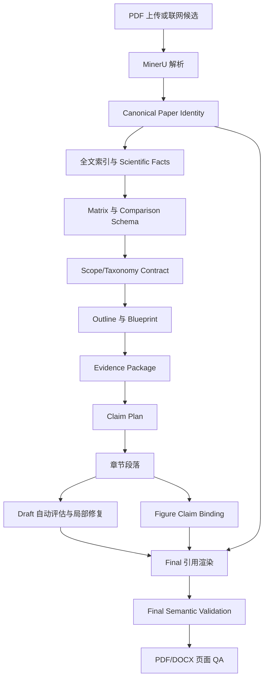

# Review Writer 全项目证据链与终稿准确性优化方案

## 1. 文档定位

本文面向 Review Writer 中所有新建项目和历史项目，覆盖 Discovery、Matrix、Outline、Blueprint、Evidence Package、Sections、Draft、Figures、Final 和导出阶段。项目 `818` 及其审稿意见只作为本次审计样本和回归测试案例，不构成本方案的功能边界。

本方案不针对某个主题、学科、反应、材料或研究对象硬编码写作规则，也不通过增加大量人工确认或严格控制门来提高质量。核心目标是打通以下稳定链路：

```text
文献身份
  → 可定位科学事实
  → Claim
  → 段落
  → 引用
  → 图像
  → 终稿与导出
```

当系统发现错误时，默认处理顺序为：

```text
自动核验
  → 自动重新取证
  → 自动修正或缩小陈述
  → 自动局部重写
  → 自动重新检查
  → 仍无法判断时才提示用户
```

检索覆盖不足是唯一需要用户主动决定是否扩大主题语料范围的情况。系统只自动诊断和提示，不在后台静默开启联网主题检索。极少数经过自动核验仍无法确定的文献身份或科学歧义，也可以进入用户异常列表，但它们不是新增语料范围的操作。

### 1.1 与现有优化文档的关系

本文作为当前全项目准确性改造的跨阶段实施基线，统一规定文献身份、Scope、Claim、引用、图像和 Final 之间的衔接。现有 Metadata、检索 RAG、端到端证据写作、Draft 一键优化、图注与排版等专题文档继续作为模块实现参考，不再各自建立平行的数据真相或重复的阶段服务。

如果专题文档与本文在以下事项上存在冲突，以本文为准：

- 稳定身份和 `paper_id` 别名；
- 检索覆盖是否需要用户开启；
- Blueprint 自动重构和分类契约；
- Claim 到最终引文的映射；
- 自动修复与 release-ready 的边界；
- Figure 与正文放置关系；
- Artifact 失效范围。

## 2. 审计案例与通用问题映射

### 2.1 已确认的阶段事实

| 检查项 | 审计样本 `818` 的阶段产物表现 | 暴露的通用问题 |
|---|---|---|
| 联网检索执行 | 查询计划请求 Crossref、OpenAlex、Semantic Scholar、arXiv，但四个来源实际均为 `disabled` | 终稿不能声称已经组合使用这些联网来源 |
| 查询覆盖 | EATA、Cu、Zn、Cd、Ti 五个查询组没有结果，`online_search_suggested` 仍为 `false` | 明确缺口没有转化为补检提示 |
| Matrix 范围 | 16 篇论文，年份分布为 2009–2021，另有 2 篇年份未知 | 该分布只能描述当前语料，不能自动成为正式纳入时间范围 |
| 书目身份 | 部分 DOI 与题名正确，但期刊字段错误；部分记录缺年份、DOI、作者或正式来源 | 错误书目信息进入正文和参考文献 |
| Outline | 初始大纲按反应类型组织，并要求区分 racemic ATA 与 EATA | 与用户 Topic 基本一致 |
| Blueprint | 自动重路由后出现笼统的 `allenation of terminal alkyne` 和 `Cross-category evidence` | 用户确认的主分区被弱化，但分类诊断没有报警 |
| 比较性写作 | 已生成结构化比较表，但 `comparison_paragraph_count = 0` | 正文仍偏向逐篇复述和重复免责声明 |
| Draft 评估 | 23 个段落中记录 18 个阻断级段落问题，54 个 Claim 被降级 | 评估发现问题，但没有形成完整自动修复闭环 |
| 引文装配 | Draft 和 Final 的参考文献 1–16 全部发生重新排序，正文数字没有同步映射 | 形成系统性正文—参考文献错配 |
| Final 验证 | 只验证正文和文后都存在 `[1]` 至 `[16]`，没有验证每个编号对应的 `paper_id` | 形式完整但科学语义错误仍被判定为通过 |
| 图像 | 多张图缺少稳定的正文放置字段，部分图被归到结论章节 | 图片远离首次讨论位置或集中到结论之后 |
| PDF QA | 使用 `pypdf-structural-only`，`page_visuals` 为空 | 大片空白、图文错位、低清图和模板残留没有被发现 |

### 2.2 根因判断

本次问题不是单一提示词或模型能力问题，而是五类阶段断链：

1. **检索计划与实际执行状态断链**：计划记录了来源，但方法部分没有读取实际执行日志。
2. **科学事实与书目身份断链**：正文事实有页码和 chunk，文献作者、期刊、日期却可能来自错误 Metadata。
3. **用户确认大纲与 Blueprint 重构断链**：允许重构是合理的，但重构后没有回查原分类契约。
4. **Claim 与最终数字引文断链**：写作计划中已有 `paper_id`，终稿却继续把旧数字当成权威引用。
5. **图像 Artifact 与正文论证、页面排版断链**：知道图片来自哪篇论文，不等于知道图片应该支持哪个 Claim、放在哪个段落。

## 3. 优化目标与非目标

### 3.1 优化目标

- 文献书目字段可以追溯到 PDF 首页、DOI 记录或人工修改来源；
- 每条科学陈述可以追溯到 `paper_id + fact_id + 原文位置`；
- 写作、评估和终稿阶段始终使用稳定身份，不依赖可变化的数字编号；
- Blueprint 可以自动重构，但不能静默违背用户确认的分类轴和章节分区；
- 比较矩阵必须真正转化为跨论文综合，而不是只生成中间 JSON；
- 评估发现的问题默认自动修复到受影响 Claim 和段落；
- 图像与来源论文、Claim、正文调用、图注和放置位置形成闭环；
- Final Methods、参考文献和 PDF QA 只报告实际发生的工作；
- 用户正常使用流程不增加逐条确认步骤。

### 3.2 非目标

本轮不实施以下内容：

- 不新建独立向量数据库或知识图谱；
- 不新建第二套书目数据库；
- 不新建跨阶段通用 Issue 平台；
- 不把化学专用金属和机理词硬编码进通用核心；
- 不要求用户逐篇确认 Metadata、逐段确认 Claim 或逐图确认放置位置；
- 不因一般性质量警告阻止用户查看和继续后续阶段；
- 不用 LLM 代替可以由确定性代码完成的编号、哈希和身份一致性检查。

## 4. 目标证据链



### 4.1 稳定身份原则

阶段内部使用以下稳定标识：

- `paper_id`：论文身份；
- `fact_id`：从论文中提取的科学事实；
- `evidence_id/evidence_key`：原文证据块；
- `claim_id`：准备写入综述的最小可审查陈述；
- `paragraph_id`：段落；
- `figure_id`：来源图或综述图；
- `artifact_id`：不可变阶段产物版本。

`[1]`、`[2]` 等数字只是一种最终显示格式，不能作为阶段间传输的稳定身份。

## 5. 分阶段功能改进

### 5.1 Library 与 Metadata：建立规范文献身份

#### 5.1.1 字段级来源

在现有 Library Metadata 中扩展字段来源，不新增平行数据库：

```json
{
  "paper_id": "P001",
  "canonical_paper_id": "P001",
  "paper_aliases": [],
  "canonical_bibliography": {
    "title": {
      "value": "...",
      "source": "doi_registry|pdf_front_matter|user|llm_extraction",
      "confidence": 0.99,
      "human_checked": false
    },
    "journal": {},
    "first_publication_date": {},
    "bibliographic_year": {},
    "doi": {},
    "authors": {},
    "volume": {},
    "issue": {},
    "pages": {}
  },
  "identity_status": "verified|resolved_with_warning|unresolved",
  "conflicts": []
}
```

`paper_id` 在正常 Metadata 修正中保持不变。发现重复论文需要合并时，保留一个 `canonical_paper_id`，并把被合并记录写入 `paper_aliases` 和合并审计记录；所有旧 Artifact 仍可通过别名解析到规范论文。不能直接删除旧身份并让已有 Claim、Figure 和引用失去来源。

#### 5.1.2 自动核验顺序

1. 从 MinerU 解析的首页、版权行、页眉页脚提取书目信息；
2. 识别 DOI 候选，并确认它来自本文而不是本文参考文献列表；
3. PDF 首页信息完整且内部一致时，直接保存为规范候选，不额外启动联网主题检索；
4. 首页字段缺失、互相冲突，或 DOI 与本地期刊/年份明显不一致时，才使用出版社/Crossref 等规范记录校验题名、期刊、年份和卷页；
5. DOI 不存在且首页信息不可靠时，使用标题、作者、期刊组合进行书目核验；
6. PDF 首页和规范书目来源仍无法确认时，才进入异常列表；
7. 用户人工保存的字段优先级最高，后台只能提示冲突，不能静默覆盖。

这里的 DOI/书目核验只校准已经入库论文，不新增主题候选，不等同于 Discovery 的联网补检。

#### 5.1.3 日期语义

必须区分：

- `first_publication_date`：用于 Scope 时间范围判断；
- `bibliographic_year`：用于正式参考文献；
- `publication_status`：`online_first|early_view|issue_assigned|unknown`。

不得使用下载日期、PDF 创建日期、上传时间、网页访问时间或项目当前年份代替出版日期。

#### 5.1.4 跨字段一致性

增加确定性检查：

- DOI 对应期刊与本地期刊是否一致；
- DOI 对应年份与本地年份是否一致；
- DOI 对应题名与当前论文是否一致；
- 期刊类型是否合理，例如 Organic Syntheses 不能被写成 Green Chemistry；
- 参考文献是否缺作者、正式来源、年份和 DOI/卷页中的关键字段；
- OCR 抓取的单位、机构地址和网页按钮不能进入作者列表。

系统先自动修复，再把无法判断的少量记录列为异常。身份尚未可靠确定的论文可以继续用于内部预览和草稿下载，但不能被标记为“可正式发布的规范引用”，包含该记录的 Final 也不能标记为 `release-ready`。该状态不阻止用户返回其他阶段、继续修复或重新核验。

以上发布边界已经确认：不因书目身份异常阻断普通工作流，但不能把未解决的书目身份问题包装成正式可发布版本。

### 5.2 Discovery：覆盖诊断与真实方法记录

#### 5.2.1 查询执行状态是真实来源

Discovery 必须区分：

- `requested_sources`：查询计划希望使用的来源；
- `enabled_sources`：用户或服务器允许使用的来源；
- `executed_sources`：本次实际执行成功的来源；
- `failed_sources`：本次请求失败的来源。

Final 的 Review Methods 只能从 `executed_sources` 生成，不能根据 `requested_sources` 写“已组合使用”。

#### 5.2.2 泛化查询扩展

查询不应只使用完整表面短语。根据 Topic 自动形成查询格：

```text
核心对象/转化
  × 底物或研究对象
  × 产物/结果
  × 方法、催化剂、干预或学科同义词
  × 时间、文献类型等过滤条件
```

对于任意学科，查询计划应保存：

- 原始 Topic 概念；
- 同义词和缩写展开；
- 组合查询式；
- 查询来源和日期；
- 初检数量；
- 去重数量；
- 排除数量和原因；
- 最终选入数量；
- 前向/后向追踪是否执行。

化学规则只在化学 Taxonomy Profile 启用时参与术语扩展，不能影响其他学科项目。

#### 5.2.3 覆盖不足提示

以下任一条件满足时显示非阻断提示：

- 用户明确要求的主要查询组为空；
- 某个大纲主分区没有候选论文；
- 最新纳入年份明显早于用户要求或当前投稿范围；
- 用户请求了联网来源但本次没有任何来源实际执行；
- 文献高度集中于少数年份、期刊或团队；
- 多篇论文年份未知，无法确认时间覆盖。

用户操作保持简单：

- `开启补充联网检索`；
- `保持当前语料继续`。

保持当前语料时，不使 Matrix 失效，只把覆盖声明改为“基于当前确认语料的代表性综述”。开启补检且新增选中文献后，才使 Matrix 及真实依赖的下游产物过期。

#### 5.2.4 时间范围分层

Scope 中分开保存：

- `core_window`：核心纳入时间范围；
- `historical_background`：范围外奠基工作；
- `latest_update_cutoff`：投稿前补充检索截止日期；
- `observed_corpus_range`：当前语料实际最早和最晚年份。

`observed_corpus_range` 不能静默覆盖 `core_window`。历史论文可以进入 Introduction，但不能计入核心时间范围覆盖统计。

### 5.3 Matrix：统一比较字段和干预角色

#### 5.3.1 保留现有科学事实结构

项目当前已经能保存：

- 规范化事实；
- 原文摘录；
- 页码、章节和 chunk；
- 证据强度；
- `evidence_ceiling`。

该结构继续作为事实真相，不新建另一套事实数据库。

#### 5.3.2 增加通用比较字段

核心字段：

- 研究对象/输入；
- 方法或干预；
- 条件和关键变量；
- 定量结果；
- 适用范围；
- 局限性；
- 验证证据；
- 规模和可重复性；
- 安全性、成本或可持续性，仅在原文有证据时填写；
- 学科 Profile 扩展字段。

缺失字段保持空值，模型不能补猜。

#### 5.3.3 角色不能由名称推断

在化学 Profile 中，基于原文用量和作者描述抽取：

- `catalyst`；
- `co_catalyst`；
- `promoter`；
- `stoichiometric_reagent`；
- `chiral_auxiliary_or_reagent`；
- `amine_role`；
- `reported_loading_or_equiv`。

标题、大纲和比较表使用归一化角色，不能因为出现某个金属名称就统一称为催化策略。

其他学科使用自己的 `intervention_role` 扩展，不把化学枚举写入通用数据核心。

### 5.4 Outline 与 Blueprint：允许重构，但保持分类契约

#### 5.4.1 分类契约

Selected Outline 保存：

- 用户明确要求的主分类轴；
- 二级比较轴；
- 必须保留的 Topic 分区；
- 是否允许兜底章节；
- 时间和证据边界。

#### 5.4.2 Blueprint 重构规则

Blueprint 可以根据证据重新组织章节，因为初始大纲可能存在证据不足、重复或论证顺序问题。但重构完成后必须自动回查：

1. 是否仍保留用户要求的主分类轴；
2. 必须保留的分区是否仍然存在；
3. 是否生成了分类契约禁止的兜底章节；
4. 同级章节是否混用对象、方法、结果和时间等不同逻辑；
5. 每篇论文的移动是否有事实依据；
6. 新结构是否降低了跨章节重复；
7. 新结构是否能形成至少一个可写的比较问题。

如重构违反分类契约，系统应继续自动调整，而不是只在页面显示警告。只有多个结构都合理且会显著改变用户意图时，才展示候选差异让用户选择。

#### 5.4.3 重构版本和影响范围

- 保存旧 Blueprint Artifact；
- 记录章节映射和论文迁移原因；
- 未进入 Matrix 时，修改 Outline 不应使后续内容失效；
- 已有章节但无人工编辑时，只重建受影响章节；
- 存在人工编辑时，保留人工段落，生成迁移候选；
- 普通单段证据问题不能触发整份 Blueprint 重构。

### 5.5 Evidence Package 与 Claim：建立稳定引用账本

#### 5.5.1 Claim 数据结构

```json
{
  "claim_id": "S02-p1-C01",
  "paragraph_id": "S02-p1",
  "claim": "...",
  "claim_kind": "reported_finding|comparison|mechanism|review_inference",
  "paper_ids": ["P001", "P002"],
  "evidence_refs": [
    {
      "fact_id": "MF-001",
      "evidence_id": "EV-001",
      "paper_id": "P001",
      "relationship": "supports|contradicts|limits|context",
      "page_start": 3,
      "page_end": 3,
      "section_path": ["Results"]
    }
  ],
  "epistemic_status": "direct_report|author_interpretation|review_inference",
  "evidence_ceiling": "...",
  "repair_status": "clean|repaired|unresolved"
}
```

每条 Claim 的 `paper_ids` 必须由 `evidence_refs` 推导，不能由模型单独生成一个没有对应证据的引用列表。

摘要级证据可以支持摘要中明确陈述的事实，包括摘要明确给出的有限数值或条件，但不能推断摘要未提供的底物细节、完整条件或机制证明；存在可获得全文时，详细科学陈述应优先回到全文定位。来源角色取决于综述类型：对于原始研究结论，综述、专著和会议材料默认作为背景或引文追踪入口，不能替代可获得的原始研究；对于指南、共识、历史和方法学问题，则可以按 Scope Contract 被定义为目标证据类型。

#### 5.5.2 数字引用只在终稿渲染

章节 Markdown 内部保存稳定占位：

```text
... reported result ... {cite:P001,P002}
```

或者在结构化段落中保存：

```json
{"claim_id":"C01","citation_paper_ids":["P001","P002"]}
```

Final 装配时执行：

1. 按最终引用顺序生成 `paper_id → reference_number`；
2. 把稳定引用渲染成数字编号；
3. 生成规范参考文献；
4. PDF、DOCX 和 Preview 共用同一映射；
5. 参考文献重新排序时重新渲染全部 callout，不修改 Claim 身份。

段落编辑器和 Preview 可以继续向用户显示 `[1]`、`[2]` 等格式，但保存时必须转换或保持为 `paper_id`。用户手动插入引用时，应从当前项目文献列表选择来源；如果用户输入现有数字编号，保存服务先根据当前引用账本解析为 `paper_id`。无法解析的手工编号标记为待修复，不能作为稳定引用继续传到 Final。

#### 5.5.3 语义一致性验证

Final 验证不能只比较数字集合，必须逐 Claim 检查：

- 数字编号能否反向映射到 `paper_id`；
- 该 `paper_id` 是否在 Claim 的证据列表中；
- 对应 `fact_id/evidence_id` 是否仍属于当前论文版本；
- 页码和 chunk 是否仍有效；
- 已被降级或删除的 Claim 是否仍残留引用；
- 参考文献是否使用当前规范 Metadata。

系统先自动重新渲染引用。仍然无法映射时，只把当前 Final 标记为“未达到 release-ready”，不阻止用户返回 Preview 或继续修复。

### 5.6 比较性综合与机制证据

#### 5.6.1 比较表必须转化为正文任务

当主体章节存在两篇及以上可比较研究时，至少创建一个明确的比较段落计划：

- 引用至少两篇可比较论文；
- 指定共享比较字段；
- 区分可直接比较、条件不同和未报告；
- 形成“相同点—差异—适用边界—实际选择依据”；
- 不要求所有指标做简单排名。

`comparison_table` 已生成但没有任何比较段落时，Sections 阶段应自动补建段落计划，而不是继续进入 Draft。

只有一篇直接研究或研究之间没有共享比较字段时，不制造虚假比较；章节改为单研究综合，并明确记录“当前确认语料不足以形成跨研究比较”。单篇方法首报、关键机制实验或代表性案例仍可以单独成段，避免机械要求每段都引用多篇论文。

#### 5.6.2 降低模板化免责声明

同一证据边界在章节开头或比较段落中集中说明一次。后续正文直接写清楚：

- 哪项结果由原文直接报告；
- 哪项机理由作者提出；
- 哪项是本综述的跨论文推断；
- 为什么两个体系不能直接比较，以及仍然可以比较哪些维度。

不能用反复出现的“不能直接排名”代替实际综合。

#### 5.6.3 解释性与机制证据矩阵

通用核心不把解释性结论按“整篇论文已证明/未证明”二分，而是按具体命题记录直接观察、干预验证、统计或计算支持、作者解释和综述推断。不同 Taxonomy Profile 再提供本领域的证据类型。

例如化学 Profile 可记录：

- 中间体分离或独立合成；
- 中间体转化实验；
- 同位素标记或 KIE；
- 时间过程、消旋或动力学实验；
- 计算化学；
- 催化剂形态、价态或原位表征；
- 立体决定步骤；
- 绝对构型依据；
- 仅作者提出的反应循环。

临床、材料、环境、社会科学等 Profile 可以分别扩展试验设计、外部验证、测量方法、因果识别和偏倚风险等字段。跨论文解释或机制归纳必须比较证据签名，不能只因为不同论文使用相似术语就合并为同一个已证实过程。

### 5.7 Draft 评估与自动修复

#### 5.7.1 评估结果必须可执行

每个问题保存：

- `issue_id`；
- `claim_id/paragraph_id`；
- 涉及的 `paper_id`；
- 不支持或冲突的具体陈述；
- 缺失的证据类型；
- 修复路径；
- 修复前后版本。

评估状态拆分为两层，避免把“建议自动修复”误解成“整个项目不能继续”：

- `repair_required`：需要进入自动取证或局部重写；
- `release_integrity_failure`：确定性的引用身份错配、来源不存在或文件损坏，修复前不能标记为 release-ready。

普通写作质量问题只进入 `repair_required`，不能因为字段名中出现 `blocking` 就停止整个阶段。

#### 5.7.2 一键优化处理顺序

```text
定位受影响 Claim
  → 在允许论文中使用实体、数值、图表编号重新取证
  → 必要时修复该章节 Evidence Package
  → 找到证据：修正陈述和引用
  → 只有部分证据：缩小范围或降低解释强度
  → 证据冲突：按原文纠正
  → 无直接证据：删除精确陈述，保留可支持的较弱结论
  → 只重写受影响段落
  → 重新做完整性和语义检查
```

不应把几乎所有段落都显示为同一句“返回章节重新生成”。用户点击优化后，系统应自动完成证据包修复和局部重写。

#### 5.7.3 主论文与证据不足

找不到原 Claim 证据时不直接删除整篇论文：

1. 查找同一论文中与章节问题相关的其他直接事实；
2. 找到后降低解释强度并重新组织 Claim；
3. 找不到时把论文从 `primary` 降为 `supporting/context`；
4. 如论文属于错误章节，重新分配到更合适章节；
5. 不为满足“主论文必须引用”而生成空泛引用。

#### 5.7.4 自动修复边界

- 锁定用户人工编辑内容；
- 锁定已经核验的数字、化学式、专有名词和引用身份；
- 默认最多两轮局部修复；
- 只在原文存在科学歧义或多个合理解释时提示用户；
- 不重新生成无关章节和图片。

### 5.8 Figures：建立图像—论证闭环

#### 5.8.1 Figure Manifest 扩展

```json
{
  "figure_id": "P001-F01",
  "paper_id": "P001",
  "source_figure_label": "Scheme 2",
  "source_locator": {"page": 4, "section": "Results"},
  "representative_role": "core_transformation|mechanism|scope|comparison",
  "claim_ids": ["S02-p1-C01"],
  "target_paragraph_id": "S02-p1",
  "first_discussion_paragraph_id": "S02-p1",
  "caption_fact_ids": ["MF-001"],
  "rights_status": "source_attributed|license_verified|permission_unknown|original_synthesis",
  "transformation_history": [],
  "caption_status": "verified|bounded|unresolved",
  "placement_status": "ready|waiting_for_discussion|stale"
}
```

#### 5.8.2 图像选择与放置

- 图像选择阶段确认来源论文和代表性角色；
- 正文放置由当前章节中对该论文的实际讨论派生；
- 找不到正文讨论位置时显示“等待正文放置”，不能自动塞到结论；
- 图片默认放在首次实质讨论之后；
- 一张 Figure 在终稿中只有一个主要放置位置，但可以被多个章节调用；不能无理由复制多份，也不能因为放置计算失败而集中堆积到 Conclusion；
- 图片更换论文后，相关图注、引用和放置位置全部重新计算；
- 已重绘且人工确认的图片不会被“全部保留原图”操作覆盖。

#### 5.8.3 图注生成和语义检查

图注应短而准确，只包含：

- 图中反应或对象；
- 与当前段落有关的关键条件或意义；
- 来源编号和改编状态。

详细机理、底物范围和研究意义放入正文。自动清理：

- 原论文内部 `Scheme X`、`Table X`；
- 网页抓取残片；
- 未解析 LaTeX/HTML；
- 与图像无关的原论文长标题；
- “failed reaction”与图中实际产物矛盾；
- 正文和图注中的金属、条件、产物不一致。

#### 5.8.4 总览图

总览图只允许读取当前已确认的：

- Front Matter 生成标题；
- Blueprint 主分类轴；
- Matrix 实际有证据的类别；
- 结构化比较结果；
- Review Methods 真实范围。

禁止把以下内容作为图内标题或分类来源：

- 用户完整任务指令；
- 模板名称；
- Prompt 原文；
- 没有论文支持的默认金属、方法或评价；
- 没有数据支持的成本、可持续性或性能排名。

### 5.9 Final：真实方法、规范引用和语义审计

#### 5.9.1 Review Methods

方法部分从 Discovery 实际运行日志生成，至少包含：

- 实际使用的数据库或本地 Library；
- 检索日期；
- 完整查询式或可追溯查询组；
- 初检、去重、排除和最终纳入数量；
- 纳入和排除标准；
- 全文、摘要、综述、专著章节等文献类型处理规则；
- 前向/后向追踪是否执行；
- 核心范围、历史背景和最新补检截止日期。

若联网源没有执行，不能在 Methods 中写为已使用。

#### 5.9.2 参考文献生成

1. 收集终稿实际使用的 `paper_id`；
2. 读取规范 Metadata；
3. 清除网页按钮、机构地址、作者符号和 OCR 残片；
4. 按最终首次引用顺序编号；
5. 统一作者、期刊、年份、卷、页和 DOI 格式；
6. 生成并保存唯一 `paper_id → final_number` 映射；
7. 使用该映射渲染 Preview、PDF 和 DOCX；
8. 参考文献变更后重新渲染全部正文 callout。

#### 5.9.3 Final Semantic Validation

在现有验证产物中增加：

- `claim_citation_mapping_issues`；
- `bibliography_identity_conflicts`；
- `methods_execution_mismatch`；
- `scope_statement_mismatch`；
- `blueprint_contract_drift`；
- `figure_claim_mapping_issues`；
- `overview_unsupported_labels`；
- `template_residue`。

这些问题先触发确定性自动修复或局部模型修复。只有仍无法修复的引用身份错配、引用目标不存在等确定性问题，才取消 `release-ready` 状态；页面浏览、阶段返回和问题修复仍保持可用。

### 5.10 PDF/DOCX：真实页面级 QA

PDF 生成后必须渲染每一页，并把结果写入现有 `final/pdf-qa.json`，不能只做 pypdf 结构检查。

自动检查：

- 空页和异常大面积空白；
- 图片集中在结论或参考文献之前；
- 图片与首次正文调用距离过远；
- 图注和图片跨页分离；
- 图片越界、裁切、重叠和低分辨率；
- 叠加框、编辑标记和明显残片；
- 标题、作者、摘要、Keywords 缺失或解析错误；
- 图注中的 HTML、Markdown、LaTeX 和 Unicode 异常；
- 模板名、项目名和内部工作流文字；
- 参考文献编号不连续或正文未调用。

自动排版修复优先采用：

- 单栏/双栏宽度重新选择；
- 图片与调用段落重新锚定；
- 缩短图注；
- 调整浮动图队列；
- 移除孤立调用和孤立图注；
- 重新分页。

普通版面警告不阻止下载。文件损坏、正文不可见或引用目标不存在等确定性问题只限制对应的“正式发布”状态。

## 6. 最小数据改造

本方案优先扩展现有产物：

| 现有产物 | 新增或强化字段 |
|---|---|
| Library Metadata | 字段来源、置信度、冲突、规范书目身份 |
| Discovery Review | requested/enabled/executed/failed sources、查询日志、覆盖提示 |
| Matrix | 规范书目快照、干预角色、比较字段完整度 |
| Selected Outline | 分类契约、时间分层、必须保留分区 |
| Blueprint | 契约回查、重构映射、论文迁移原因 |
| Evidence Package | fact/claim/paper/locator 稳定绑定 |
| Writing Plan | 明确的 comparison paragraph 和 mechanism evidence plan |
| Draft Quality | 可执行修复路径、修复状态和剩余问题 |
| Figure Manifest | Claim、正文放置、图注事实、权利和变换记录 |
| Final Manuscript State | `paper_id → final_number`、语义验证结果 |
| PDF QA | 页面缩略图和 page findings |

不新增与这些产物平行的第二份“质量真相文件”。

## 7. 依赖和失效边界

| 变化 | 应失效的范围 |
|---|---|
| 修正文献期刊、卷页或年份，且不改变纳入边界 | 参考文献、Methods、依赖书目字段的局部文字和 Final 导出 |
| 年份、文献类型或身份修正导致论文跨越 Scope 纳入边界 | 先重算 Discovery/Matrix 选择状态；只有纳入状态实际变化时，才使相关 Blueprint、Evidence、段落、图片和 Final 过期 |
| 重复论文合并 | 保留 `paper_aliases`，重映射引用和产物；不直接删除旧 `paper_id` |
| 确认原 `paper_id` 实际指向另一篇论文 | 该论文 Facts、Evidence、Claims、相关段落、图片和 Final |
| 开启补检但没有新增选中文献 | 更新覆盖诊断，不使 Matrix 失效 |
| 补检后新增选中文献 | Matrix 及真实依赖的后续内容 |
| Blueprint 重构 | 只影响被移动论文和相关章节 |
| Claim 缩小或删除 | 对应段落、相关图注和 Final |
| 只调整图片排版 | Figure Manifest、Final 和导出，不重写正文事实 |
| 更换图片来源论文 | 图注、Claim 绑定、正文调用、放置位置和 Final |
| 参考文献排序变化 | 重新渲染引用，不使 Evidence 或 Draft 内容失效 |

所有修改继续发布新的 ArtifactVersion，不直接覆盖旧产物，并保留历史回滚能力。

## 8. 前端交互调整

### 8.1 Discovery

- 显示实际使用的数据源，而不是计划来源；
- 显示缺失查询组、年份范围和主题分区；
- 提供一次“补充联网检索”操作；
- 用户不补检时清楚显示“当前确认语料范围”。

### 8.2 Matrix

- 显示书目身份异常数量；
- 支持筛选 DOI/期刊/年份冲突、缺失字段；
- 显示干预角色及原文用量依据；
- 显示比较字段完整度，不要求用户逐项填写。

### 8.3 Blueprint

- 显示“原大纲 → 当前 Blueprint”结构差异；
- 标出自动移动的论文及原因；
- 标出分类契约是否仍满足；
- 正常自动重构不增加新的确认页面。

### 8.4 Draft

- 一键优化显示当前步骤：修复证据包、重写段落、复检；
- 只显示真正受影响的段落；
- 问题详情可查看 Claim、论文和原文位置；
- 暂时保持正文编辑锁定策略，不引入复杂自动合并。

### 8.5 Figures 与 Final

- 图像详情显示来源论文、支持 Claim、放置段落和图注状态；
- “等待正文放置”的图不进入 Final；
- Final 显示引用映射、书目异常、Methods 真实性和页面 QA 摘要；
- 普通警告允许下载，确定性错误取消 release-ready 标记。

## 9. 实施顺序

### P0：先消除确定性科学错误

1. 终稿稳定引用账本：`paper_id → final_number`；
2. Final 重排参考文献时同步重新渲染正文 callout；
3. Claim—paper—evidence 语义验证；
4. DOI、题名、期刊、年份跨字段一致性与规范 Metadata；
5. Review Methods 改为读取实际执行日志；
6. 为现有 Final 增加自动重建功能，不要求重新走全部阶段。

### P1A：提高覆盖、结构和综合质量

1. 覆盖不足提示和手动联网补检；
2. Scope 时间分层；
3. Blueprint 重构后的分类契约回查；
4. 干预/催化/促进角色结构化；
5. 比较表强制派生比较段落计划；
6. 解释性与机制证据矩阵；
7. Draft 问题驱动的自动重新取证和局部重写。

### P1B：完善图文与导出

1. Figure—Claim—段落放置绑定；
2. 短图注与图文语义一致性；
3. 总览图只使用已支持类别；
4. 全页 PDF 渲染 QA；
5. 自动浮动图、空白页和低分辨率修复。

### P2：历史项目修复和体验优化

1. 历史 Library 书目批量核验；
2. 历史 Draft/Final 引用账本重建；
3. 历史图片重新计算正文放置；
4. 异常列表的批量自动修复与结果摘要；
5. 更清晰的阶段修复进度和失败重试。

## 10. 历史项目增量修复路径

本方案实施后，任意历史项目都不需要默认从上传 PDF 重新走完整流程。系统根据 Artifact 依赖做增量修复。以审计样本 `818` 为回归示例：

```text
批量核验 16 篇文献身份
  → 对缺口给出补检建议，由用户选择是否联网
  → 更新 Matrix 规范书目快照和干预角色
  → 回查并必要时重构 Blueprint
  → 重新生成受影响章节的 comparison/mechanism plans
  → 自动修复 18 个问题段落
  → 重建 Figure Claim Binding 和放置位置
  → 从 paper_id 重建全部数字引用和参考文献
  → 重新生成 Methods、Final、PDF
  → 执行页面级 QA
```

如果用户开启补检并加入新论文，需要更新 Matrix 和受影响章节；如果用户保持现有语料，只修正范围声明、书目、正文、图像和终稿，不强制扩大语料。

## 11. 测试方案

### 11.1 单元测试

- 参考文献重排后所有正文编号同步变化；
- 任何数字编号都能反向映射到 Claim 允许的 `paper_id`；
- 段落编辑器中手工插入的显示编号会保存为稳定 `paper_id`；
- 重复论文合并后旧 `paper_id` 仍能通过别名解析；
- DOI 与错误期刊组合可以被识别并自动纠正；
- 下载日期不会覆盖出版日期；
- 出版年份修正跨越 Scope 边界时会重新判断纳入状态；
- requested source 未执行时 Methods 不会声称已使用；
- Blueprint 重构丢失必须保留分区时能够被发现；
- 禁止兜底章节时不能静默生成 `Cross-category`；
- 比较表存在但 comparison paragraph 为 0 时自动补建计划；
- 图像找不到正文讨论位置时不会被放到 Conclusion；
- 总览图不会读取完整 Prompt 作为标题；
- PDF QA 实际产生每页检查结果。

### 11.2 集成测试

构造一个包含以下情况的多学科项目：

- 一篇 DOI 正确但期刊错误的论文；
- 一篇出版年份未知的论文；
- 一篇范围外历史文献；
- 一个用户要求但没有结果的主题分区；
- 一次参考文献重排；
- 一个证据不足 Claim；
- 一张来源正确但放置章节错误的图片；
- 一张低分辨率图片；
- 一个联网源禁用场景。

验证系统能够自动修复确定性错误、正确提示覆盖缺口，并只重新生成真实受影响的产物。

### 11.3 回归测试

- 现有段落编辑、插入、删除、历史回滚不受影响；
- 用户模型选择和网关调用不受影响；
- 批量上传、自动排队和任务状态保持不受影响；
- Matrix、Blueprint、章节、图片、Draft、Final 的现有页面结构保持；
- 已人工编辑的正文和 Metadata 不被静默覆盖；
- PDF 和 DOCX 使用同一 Final 语义源。

## 12. 验收标准

### 12.1 文献与引用

- 100% 正式正文引文 callout 可映射到 `paper_id`；
- 100% Claim 引文属于其允许的证据论文，或被明确标记为背景/限制/反证关系；
- 参考文献排序变化不会产生正文错配；
- DOI、题名、期刊和年份不存在未解释冲突；
- 不完整书目不会被标记为 release-ready。

### 12.2 检索和范围

- Methods 只报告实际执行的数据源；
- 空查询组和年份缺口有明确非阻断提示；
- 历史背景与核心时间范围统计分开；
- 用户未开启补检时不会发生后台主题联网搜索；
- 当前语料不足时自动降低覆盖声明。

### 12.3 写作与综合

- 存在两篇及以上可比较研究的主体章节至少有一个真实的跨论文比较单元；只有单篇研究或无共享字段时，明确记录比较证据缺口，不制造虚假比较；
- 解释性或机制陈述能区分直接证据、作者解释和综述推断；
- Evidence Package 中存在定位信息的事实可以追踪到页码和 chunk；
- 评估问题能够定位到 Claim，并通过局部流程自动修复；
- 无证据 Claim 不会为了满足论文引用数量而保留。

### 12.4 图像与导出

- 每张正文图片都有来源论文、Claim、正文调用和放置段落；
- 总览图没有 Prompt、模板名和无证据分类；
- 图注不残留原论文 Scheme/Table 编号或未解析标记；
- 图片不会无理由集中到 Conclusion；
- PDF QA 对每页产生可定位结果；
- 大面积空白、越界、裁切、低分辨率和孤立图注可被发现并优先自动修复。

## 13. 风险与控制

| 风险 | 控制方式 |
|---|---|
| DOI 匹配到参考文献中的其他论文 | DOI 必须同时满足题名和作者一致性后才能确认为本文身份 |
| 自动 Metadata 覆盖人工修改 | 人工字段最高优先级，只显示冲突 |
| Blueprint 自动重构改变用户意图 | 重构后执行分类契约回查并保存差异版本 |
| 自动修复改变科学含义 | 只重写受影响 Claim，锁定数字、引用和人工内容，修复后复检 |
| 过度增加控制门 | 先自动修复；普通警告不阻止流程，只影响 release-ready 状态 |
| 页面 QA 环境不一致 | 在部署镜像固定 PyMuPDF 或 Poppler 版本，不依赖本机 Office |
| 引入重复技术 | 扩展现有 Artifact 和服务，不新增平行平台 |

## 14. 最终建议

项目下一轮优化应首先修复 `paper_id → Claim → 数字引用` 的确定性链路和规范书目身份。这两项可以直接消除本次最严重的系统性引文错配和参考文献失真。

随后再实现覆盖提示、Blueprint 契约回查、比较段落、解释性/机制证据矩阵和图文闭环。这样可以同时提高所有新建项目和历史项目的准确性，适用于不同主题和学科，不依赖为某一篇论文增加特殊规则。
