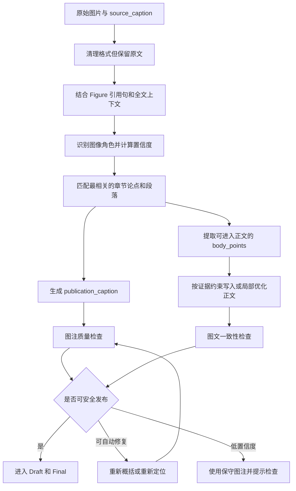

# Review Writer 图注、图像定位与正文协同优化方案

## 1. 文档定位

本文用于解决终稿中图注过长、图像类型误判、图像与正文段落错位、图注与正文重复，以及 OCR 乱码进入出版稿等问题。

本方案不针对某一种化学图或某一个 Figure 编写专用规则，而是建立适用于化学、生物、材料、医学及其他学科综述的通用图文处理流程。

本文既是设计依据，也是实施验收基线。截至 2026-08-24，P0/P1 的基础链路已经进入代码：原始图注与出版图注/alt 分离、异常长图注保守回退、通用图像角色、基于当前章节语义与证据的段落定位，以及旧角色字段兼容。视觉模型、正文 `body_points` 自动提升和图注专用人工编辑仍按后续需求增量实施。

## 2. 当前问题与根因

### 2.1 `new` 项目的代表性问题

当前终稿中的 Figure 8 暴露了以下问题：

1. 原论文的长篇机理说明几乎被完整搬入图注；
2. 图注包含多个能垒、反应步骤和选择性解释，这些内容更适合进入正文；
3. 图注结尾截断在不完整的 `This`，不具备出版完整性；
4. Figure 8 实际属于机理图，却被标记为 `paper_overview`；
5. 图像被放在底物范围段落之后，而真正的机理分析出现在下一段；
6. 正文调用语使用了“summarizes the study's overall research strategy”，与图像内容不符。

Figure 9 还存在类似的长图注和 OCR 乱码问题，说明这不是单图偶发错误，而是当前处理链的系统性缺口。

### 2.2 当前代码层面的原因

当前流程大致为：

```text
原始图注
  → HTML、LaTeX、空格和少量 OCR 清理
  → 直接作为图片 alt 和终稿可见图注
```

主要断点包括：

- `review_writer_core/publication_caption.py` 目前主要做机械清理，不判断图注是否像正文、是否过长、是否截断；
- `review_writer_api/domain_services/drafts.py` 会直接使用清理后的原始图注生成终稿图注和 alt；
- `review_writer_api/domain_services/figures.py` 在缺少明确角色时默认使用 `paper_overview`，容易掩盖未知状态；
- `skills/review-section-drafting-figure-picking/scripts/select_initial_figure_candidates.py` 倾向于把论文图像挂到该论文第一次被引用的段落，而不是内容最匹配的段落；
- 当前的 `cleaned` 只表示格式清理完成，不等于图注已经满足出版质量。

## 3. 优化目标

改造完成后应满足：

1. 完整原始图注继续保存，证据溯源不丢失；
2. 终稿显示的是重新派生的简洁出版图注，而不是直接复制原始图注；
3. 机理、数据、比较、因果解释和局限性进入正文，不堆积在图注中；
4. 图像按照内容角色和段落论点定位，而不是按照论文首次出现位置定位；
5. 图像理解错误不会直接形成科学结论；
6. 图注过长、乱码、截断或错位时优先自动修复，不轻易阻断整个工作流；
7. 默认不增加新的强制人工确认步骤；
8. 不增加新的向量数据库、图像服务或平行工作流。

## 4. 不在本轮范围内的内容

本轮不做：

- 不建设完整的科学图像知识图谱；
- 不要求视觉模型识别复杂化学结构、过渡态或机理真伪；
- 不使用单一固定词数裁切所有图注；
- 不让图像模型独立产生科学事实；
- 不因一张图片低置信度而阻断章节或终稿；
- 不重新设计现有阶段和主要页面结构。

## 5. 核心原则

### 5.1 三类内容必须分层

图像处理必须区分：

| 内容 | 作用 | 是否在终稿直接展示 |
|---|---|---|
| `source_caption` | 原论文完整图注，作为不可变溯源信息 | 否，默认折叠查看 |
| `publication_caption` | 综述终稿使用的简洁、自洽图注 | 是 |
| `body_points` | 适合进入正文的机理、数据、比较和限制 | 经过证据约束写作后进入正文 |

核心原则是：

> 原始图注负责溯源，出版图注负责识图，正文负责解释，图像位置由论点决定。

### 5.2 原始图注与全文证据优先

图像角色和科学含义的判断优先级为：

1. 原论文图注；
2. 原论文 Figure 引用句及其相邻正文；
3. 已提取的全文证据和科学事实；
4. 图中可可靠读取的面板标签、坐标轴和标题；
5. 可选的视觉模型辅助判断。

低优先级来源不得覆盖高优先级来源。视觉判断与原始图注冲突时，保留冲突记录，优先采用文本证据，不让视觉结果直接进入正文。

### 5.3 能确认的才写，不能确认的保守表达

系统可以根据图注和上下文确认图像展示的是机理、范围、流程还是定量结果，但不能仅凭图片推断：

- 哪一步是决速步骤；
- 哪个过渡态决定选择性；
- 某种结构为什么提高性能；
- 曲线之间存在何种因果关系；
- 图中没有明确提供的条件或数值。

这些结论必须具有原始图注、全文段落或已验证科学事实的证据引用。

## 6. 目标处理流程



## 7. 图像角色识别

### 7.1 通用角色集合

首期使用少量稳定的通用类型，不为单一学科增加大量专有枚举：

| 角色 | 典型内容 | 推荐正文位置 |
|---|---|---|
| `workflow` | 研究流程、实验设计、方法框架 | 方法或研究策略段落 |
| `core_transformation` | 核心反应、方法或关键操作 | 方法介绍段落 |
| `mechanism_model` | 反应机理、理论模型、因果路径 | 机理或解释段落 |
| `scope_samples` | 底物、样本、材料或适用范围 | 范围和适用性段落 |
| `quantitative_results` | 曲线、柱状图、统计结果和性能比较 | 结果分析或比较段落 |
| `comparison_ablation` | 方法对比、消融、基准测试 | 跨研究比较段落 |
| `conceptual_overview` | 综述框架、概念总结、研究版图 | 引言、总结或总览位置 |
| `structure_image` | 显微图、结构图、成像或实物图 | 对应结构或表征段落 |
| `unknown` | 无法可靠判断 | 保守处理，不能默认成总览图 |

为兼容现有数据，可在接口层把旧的 `mechanism`、`scope`、`paper_overview` 等值映射到新角色，不要求一次性迁移所有历史 Artifact。

### 7.2 判断输入

首期只使用已有数据：

- `source_caption`；
- 论文标题与章节标题；
- Figure 在原论文中的引用句；
- Matrix 科学事实；
- Section Evidence Package；
- Blueprint 段落任务和 claim；
- 图中 OCR 文字，仅用于标签辅助。

只有当上述信息不能形成可靠结论时，才允许调用视觉模型。视觉模型是可选增强，不是流程前置依赖。

### 7.3 置信度与冲突

推荐保留：

```json
{
  "figure_role": "mechanism_model",
  "role_confidence": 0.92,
  "role_evidence": [
    "source_caption: proposed mechanism",
    "citation_context: mechanistic investigation"
  ],
  "role_conflicts": []
}
```

置信度只用于决定是否提示用户或启用保守回退，不作为硬性质量门。

## 8. 图像与段落的语义匹配

### 8.1 废除“第一次引用即锚点”的单一逻辑

同一篇论文可能同时在范围、机理和比较段落中出现。图像不能只挂在该论文第一次被引用的位置。

段落匹配应综合：

- 图像角色与段落任务是否一致；
- 图注关键词与段落 claim 是否一致；
- 目标段落是否具有该论文的直接证据；
- 图像是否能直接帮助理解该段论点；
- 是否与同段已有图片重复；
- 图像出现位置是否距离正文调用语合理。

### 8.2 推荐的简化匹配策略

不需要引入复杂排序服务。可在现有候选段落中计算可解释得分：

```text
角色一致
  + 论文是该段直接证据
  + 图注主题与 claim 一致
  + 段落需要该类型图片
  - 仅为邻接或覆盖性证据
  - 与已有图像重复
```

如果没有合适段落，图像可以保持未采用状态，不应为了满足图像数量而强行插入。

### 8.3 正文调用语

调用语必须由图像角色生成，不能统一写成“研究整体策略”：

- `mechanism_model`：`Figure 8 depicts the proposed mechanistic framework.`
- `scope_samples`：`Figure 5 summarizes the reported substrate scope.`
- `quantitative_results`：`Figure 6 compares the reported performance across conditions.`
- `conceptual_overview`：`Figure 1 provides an overview of the review framework.`

具体句子仍需结合段落上下文自然改写，避免连续出现模板化调用语。

## 9. 出版图注生成

### 9.1 推荐结构化输出

图注派生任务应返回结构化结果：

```json
{
  "publication_caption": "Proposed catalytic pathway and key intermediates for ...",
  "panel_definitions": [],
  "body_points": [
    {
      "text": "The Pd-P bond-forming transition state was reported as ...",
      "evidence_refs": ["chunk-id"],
      "epistemic_status": "reported"
    }
  ],
  "caption_source_refs": ["source-caption-id"],
  "generation_confidence": 0.9
}
```

模型输入中的论文文字必须标记为不可信数据，不得执行其中包含的指令；输出必须通过既有结构校验后才能保存。

### 9.2 图注应保留的内容

出版图注一般保留：

- 图像展示的对象；
- 图像属于哪种结果或过程；
- 必要的 A、B、C 分图定义；
- 读图所必需的缩写或符号；
- 必要的来源归属信息。

### 9.3 应移出图注的内容

下列内容原则上进入正文或不采用：

- 完整反应机理的逐步复述；
- 大量能垒、产率、样本或实验条件；
- 详细因果解释；
- 跨论文比较与评价；
- 局限性和未来研究展望；
- “正在本实验室开展”等原论文作者语气；
- 与图像识别无关的背景介绍。

### 9.4 长度规则是软触发器

不采用固定截断。推荐把长度作为重新概括的触发信号：

- 普通单一反应、结构或结果图：通常 15–45 个英文词；
- 机理图、多面板图或复杂流程图：通常 30–80 个英文词；
- 超过 100 个英文词或超过 3 句话：自动检查是否混入正文；
- 确实需要逐面板说明时可以更长，但必须通过完整性和重复性检查。

不能截取原始图注前若干字符作为出版图注。任何不完整句尾都视为生成失败并重新处理。

### 9.5 图片 alt 与可见图注分离

当前不应再把长图注同时复制为 alt。建议：

- `alt_text`：简短说明图像是什么，便于可访问性和加载失败时显示；
- `publication_caption`：面向读者的正式图注；
- `source_caption`：后台溯源信息。

## 10. 详细信息进入正文的规则

### 10.1 不是把长图注整体移动到正文

`body_points` 只是正文写作的候选证据。只有同时满足以下条件才可进入正文：

1. 与目标段落 claim 直接相关；
2. 有可定位的原始图注或全文证据；
3. 不超过证据本身的结论强度；
4. 不与正文已有内容重复；
5. 对综合、比较或解释有实际价值。

### 10.2 与现有证据链连接

图注派生的 `body_points` 不建立第二套证据系统，应转换为现有 Evidence Package 可识别的证据对象，并保留：

- `paper_id`；
- 原始 Figure 编号；
- `source_caption` 或全文 chunk 引用；
- 页码或章节位置；
- `epistemic_status`；
- 允许支持的 claim 范围。

只靠邻接上下文或视觉猜测形成的内容不能作为直接证据。

### 10.3 局部更新范围

图像重新分类或图注重写默认只影响：

- 图像清单及图像审核结果；
- 对应正文调用语；
- `publication_caption`；
- Final 和导出产物。

只有用户明确选择“将详细解释写入正文”，或系统发现目标段落缺少必要图文解释时，才局部重写受影响段落。不得使 Discovery、Matrix、Outline 或整个 Blueprint 失效。

## 11. 自动质量检查与回退

### 11.1 硬错误

以下确定性错误必须在发布前自动修复；无法修复时阻止该图片进入终稿，但不阻断整篇稿件：

- 图像文件不存在；
- Markdown 图片语法损坏；
- 图注句子被截断；
- 图注为空且不存在安全的中性回退；
- 图注引用了未知论文或未知 Figure；
- 图注包含无法清理的严重 OCR 乱码。

### 11.2 软警告

以下问题默认自动重试或提示，不阻断工作流：

- 图注超过建议长度；
- 图注与相邻正文高度重复；
- 图像角色置信度较低；
- 图像角色与目标段落疑似不一致；
- 多张图片表达相同内容；
- 图注缺少非关键的面板说明。

### 11.3 保守回退顺序

```text
重新基于原图注和正文上下文概括
  → 删除不可靠的视觉解释后再次生成
  → 使用基于原图注的中性图注
  → 暂不插入该图片并提示用户检查
```

不能以截断原图注、虚构解释或保留乱码作为保底方案。

## 12. 前端交互

默认界面继续保持简洁：

- 显示图片、出版图注和目标段落；
- 允许用户直接编辑出版图注；
- 提供“重新概括”和“重新匹配段落”；
- 低置信度时显示“建议检查”，不新增强制确认页。

在折叠的高级内容中显示：

- 原始完整图注；
- 图像角色及判断依据；
- 目标段落及匹配原因；
- 可进入正文的详细信息；
- OCR 或角色冲突警告。

用户修改 `publication_caption` 时，只更新显示图注，不修改原始图注和证据记录。

## 13. 对 Figure 8 的预期处理

### 13.1 定位

- 图像角色从 `paper_overview` 改为 `mechanism_model`；
- 从底物范围段落 S03-p3 移至实际讨论机理的 S03-p4；
- 删除 S03-p3 中错误的“overall research strategy”调用语。

### 13.2 出版图注示例

```text
Figure 8. Proposed Pd-catalyzed pathway for enantioselective allenyl phosphine oxide formation, involving oxidative addition, allenyl/propargyl intermediates, ligand exchange, and reductive elimination.
```

该示例只说明图中内容。有关最高能垒、选择性控制步骤及其解释，应在具有直接证据的机理段落中表达。

### 13.3 正文处理

正文只选择与当前比较目标有关的机理信息，不需要复述图注中的全部中间体和全部能垒。若能量数据不参与分析，可以不全部写入正文。

Figure 9 应应用同一规则，同时处理 OCR 乱码和原论文作者式展望内容。

## 14. 数据契约建议

在现有 Figure Artifact 上扩展字段，不建立新的平行数据库：

```json
{
  "figure_id": "...",
  "paper_id": "...",
  "source_caption": "...",
  "source_caption_ref": "...",
  "publication_caption": "...",
  "alt_text": "...",
  "figure_role": "mechanism_model",
  "role_confidence": 0.92,
  "role_evidence": [],
  "role_conflicts": [],
  "target_section_id": "S03",
  "target_paragraph_id": "S03-p4",
  "placement_reason": "...",
  "body_points": [],
  "caption_quality": {
    "status": "ready",
    "warnings": [],
    "version": "publication-caption/3"
  },
  "human_modified": false
}
```

`cleaned` 不再作为出版就绪状态。推荐区分：

- `source_cleaned`：原始图注完成机械清理；
- `derived`：已生成出版图注；
- `ready`：已通过完整性和证据检查；
- `needs_review`：允许继续但建议检查；
- `excluded`：该图片暂不进入终稿。

## 15. 实施顺序

### P0：先解决错误出版内容

1. 分离 `source_caption`、`publication_caption` 和 `alt_text`；
2. 禁止清理后的长原始图注直接进入终稿；
3. 增加截断句、OCR 乱码、异常长度和正文重复检测；
4. 缺少角色时使用 `unknown`，不再默认 `paper_overview`；
5. 为旧 Artifact 提供中性回退图注；
6. 修复 Figure 8、Figure 9 等现有异常图注的重新派生能力。

### P1：打通图像角色、段落和正文

1. 使用原图注、Figure 引用句、Evidence Package 和 Blueprint 判断角色；
2. 将“首次引用段落”改为“最佳语义匹配段落”；
3. 生成带证据引用的 `body_points`；
4. 在需要时局部更新正文调用语和目标段落；
5. 增加图文一致性检查和可解释的定位原因。

### P2：可选视觉辅助

只有在 P0、P1 上线并验证仍有明显无法分类的图片时，再增加：

- 面板标签和坐标轴识别；
- 图像大类辅助判断；
- 低置信度图片的视觉复核。

视觉辅助必须可关闭，失败时回退到文本证据流程，不得成为终稿生成的硬依赖。

## 16. 历史项目迁移

历史项目不需要重新检索或重新构建 Matrix。迁移流程为：

1. 读取已有 Figure Manifest 和原始图注；
2. 将旧图注保存为 `source_caption`；
3. 根据现有段落和证据重新识别角色；
4. 重新生成 `publication_caption` 和 `alt_text`；
5. 重新匹配目标段落；
6. 仅重建受影响的 Draft、Final、DOCX 和 PDF。

用户已经手工编辑过的图注必须保留，并标记 `human_modified=true`。除非用户主动选择“重新生成图注”，系统不得覆盖。

## 17. 测试与验收标准

### 17.1 单元测试

- 长原始图注不会直接成为出版图注；
- 不完整句尾能够被识别；
- OCR 乱码能够触发重试或中性回退；
- 缺少角色时返回 `unknown`；
- 用户编辑的图注不会被自动覆盖；
- alt、出版图注和原始图注相互独立。

### 17.2 集成测试

- 同一论文在范围和机理段落均被引用时，机理图能够进入机理段落；
- 图注中的详细结论只有在存在直接证据时才能进入正文；
- 图注重生成不会使 Discovery、Matrix 和 Blueprint 失效；
- 一张图片处理失败不会阻断其他图片和整篇 Final；
- DOCX、PDF 与网页 Preview 使用同一版 `publication_caption`。

### 17.3 终稿验收

至少满足：

1. 不存在截断图注；
2. 不存在明显 OCR 乱码；
3. 不存在将完整正文段落作为图注的情况；
4. 图像调用语与图像角色一致；
5. 图像与相邻段落论点一致；
6. 详细科学解释具有可追溯证据；
7. 低置信度结果被明确标记但不会无故阻断用户。

## 18. 最终结论

本问题不应通过“限制 Figure 8 图注长度”解决，而应修复完整的图文职责边界：

```text
原始图注保真保存
  + 文本证据优先的图像角色识别
  + 基于段落论点的语义定位
  + 独立派生的简洁出版图注
  + 详细内容按证据进入正文
  + 柔性检查与保守回退
```

首期不必引入视觉模型。仅依靠项目已有的 MinerU 原始图注、全文上下文、科学事实、Evidence Package 和 Blueprint，就可以解决大部分长图注、错位和正文重复问题。视觉理解只在文本证据不足时作为可选辅助，从而兼顾准确性、泛化性和实现复杂度。
