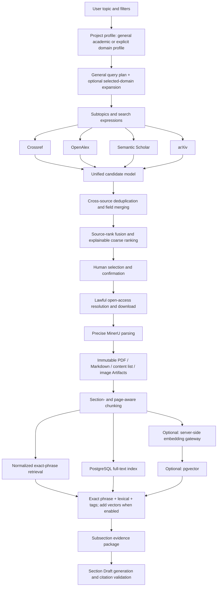

# Complete Improvement Plan for Online Paper Search and Hybrid Document Retrieval

> Document status: Second technical review completed; incorporates the confirmed model-selection and taxonomy-profile invalidation rules; pending implementation  
> Date: 2026-08-18  
> Target branch: `dy-launch`  
> Reference project: Paper-Agent `main` branch commit `c68778fdb96b15025b86d45cbcd7fc9f20e52a43`  
> Implementation principle: Preserve the existing frontend visual design, nine-stage workflow, human confirmation gates, FastAPI, JobService/scientific subprocesses, MinerU, PostgreSQL, server-side model gateway, and usage-metering system. Improve only online paper search, local document indexing, evidence retrieval, and citation tracing. This plan does not add any new orchestration responsibility to Prefect.

## 1. Executive Summary

The project already provides a user-level Library, precise MinerU parsing, domain taxonomy rules, Topic query planning, project-level paper selection, staged writing, and citation numbering. However, the retrieval path still has two clear gaps:

1. Online search in the deployed interface depends mainly on Crossref, so source coverage is limited.
2. During Section Draft generation, the system reads each paper's MinerU Markdown but uses a fixed prefix of the document. It does not retrieve the passages most relevant to the current subsection question.

This plan does not migrate the whole project to Paper-Agent and does not introduce a second workflow framework. The target capability is:

```text
Query plan and domain rules
→ Crossref / OpenAlex / Semantic Scholar / arXiv multi-source search
→ Unified candidates, safe deduplication, source-rank fusion, and explainable ranking
→ Human confirmation and lawful open-access download
→ Precise MinerU parsing
→ Full-text indexing by section, page, and content block
→ PostgreSQL lexical retrieval + optional pgvector + domain-tag fusion explicitly enabled by the current project
→ Evidence retrieval for the current subsection
→ Body text and citations generated with paper_id, page, section, and chunk_id
```

Core technical decisions:

| Decision | Choice |
|---|---|
| Frontend and nine stages | Keep the current design; add only inline status, source, and evidence displays |
| Online sources | Crossref, OpenAlex, Semantic Scholar, and arXiv |
| PDF parsing | Continue using MinerU; do not replace it with pypdf |
| Query planning | Retain the current LLM plan and deterministic fallback; domain rules are explicitly selected per project and must not affect other disciplines by default |
| Project taxonomy profile | New projects default to `general_academic`; chemistry expansion and tag weighting are enabled only when the user selects `chemistry_general` |
| Structured database | Continue using PostgreSQL |
| First-release full-text retrieval | PostgreSQL `tsvector` plus normalized exact-phrase retrieval; no new search service |
| Later vector storage | Enable pgvector in the existing PostgreSQL instance only after evaluation proves a benefit; do not deploy a separate ChromaDB |
| First-release boundary | Complete phases A, B, and C first, then roll out lexical mode through phase E; phase D vector capability is not a prerequisite for launch |
| Workflow orchestration | Continue using FastAPI, JobService, and scientific subprocesses; do not create new Prefect flows |
| Model calls | Text tasks use the model currently selected for the project; embedding capability and a separate concurrency slot are added only in phase D |
| Document sources of truth | PDF, MinerU Markdown, content list, images, and metadata Artifacts |
| Full-text index role | Deletable and rebuildable derived data, never the source of truth for the original paper |

## 2. Conclusions from the Paper-Agent Source Code

### 2.1 Parts Worth Adopting

Paper-Agent's online retrieval flow is:

1. `SearchAgent` uses an LLM to split a topic into subtopics and English keyword expressions.
2. Each subtopic queries arXiv, OpenAlex, and Semantic Scholar concurrently.
3. Results from different sources are normalized into `PaperDocument`.
4. Candidates are filtered and deduplicated by year, excluded terms, unique identifiers, and title.
5. Title/abstract keyword overlap provides coarse ranking.
6. `ReadAgent` reads abstracts and assesses relevance across the research question, research object/context, and method/technical approach.
7. Full-text download, Markdown conversion, chunking, structured extraction, and vectorization run only for selected papers.

The most useful ideas for this project are:

- multi-source connectors and a unified candidate model;
- concurrent subtopic search;
- retaining results from healthy sources when one source fails;
- abstract-first screening to reduce unnecessary full-text downloads and parsing;
- stable `chunkId` values and page-level evidence tracing;
- cacheable and recoverable parsing, chunking, extraction, and vectorization outputs.

### 2.2 Parts That Should Not Be Copied Directly

The current Paper-Agent source has these boundaries:

- Its parser primarily uses pypdf text extraction and should not replace MinerU, which this project already uses in production.
- It chunks by page by default and further splits long pages at roughly 1,200 characters, making limited use of section structure.
- ChromaDB vector writes and low-level vector queries exist, but the writing agent's `get_chunk_by_embed` remains `pass`. Therefore, “index writing” has not yet formed a complete “semantic retrieval during writing” loop.
- Chroma records do not include the complete user, project, and authorization boundaries required by this project's production multi-user deployment.
- SQLite, local-file sessions, and LangGraph overlap with the project's existing PostgreSQL, JobService, scientific subprocess, and nine-stage state-management responsibilities.

The project should therefore adopt only the retrieval ideas and data contracts, not Paper-Agent's entire runtime framework.

## 3. Current Retrieval Path in This Project

### 3.1 Library Page Search

The current Library list search performs a case-insensitive substring match over:

- title;
- authors;
- keywords;
- tag JSON.

It does not search the full paper Markdown and does not provide relevance ranking.

### 3.2 Query Planning in the Topic Stage

Current Topic retrieval already includes:

- a constrained query plan generated by an LLM;
- a deterministic fallback when the model is unavailable;
- merging of user-supplied keywords;
- year-range parsing;
- a project taxonomy profile;
- eight categories of structured tags;
- an `unclassified` route when safe classification is not possible;
- protection against treating text in the user's topic as system instructions.

This layer is more robust than Paper-Agent's LLM-only planning and must be retained.

#### 3.2.1 Boundary Problem in the Current Project Taxonomy Configuration

The project-creation interface currently offers only `chemistry_general` (General Chemistry). The frontend, API schema, repository, and taxonomy defaults also use `chemistry_general`. `suggest_taxonomy_profile()` likewise falls back to General Chemistry when it cannot match a more specific profile. As a result, non-chemistry projects in medicine, computer science, social science, and other fields may load the eight chemistry categories, chemistry aliases, and chemistry tag weights.

This is not a general retrieval capability; it is the absence of a “no domain rules” option. A genuine `general_academic` profile must be added, with a clear distinction between General Academic and General Chemistry:

| Profile | Meaning | Domain-rule behavior |
|---|---|---|
| `general_academic` | General academic retrieval | Do not load the chemistry taxonomy or run chemistry tag retrieval/weighting |
| `chemistry_general` | General chemistry retrieval | Add chemistry alias expansion, structured-tag retrieval, and small ranking boosts on top of general retrieval |
| Future profiles | Medicine, computer science, materials, and others | Load only the corresponding domain rules explicitly selected by the user |

`unclassified` remains only a temporary route for a query term that cannot be mapped within the current taxonomy. It cannot replace `general_academic` and cannot be stored as a project taxonomy profile.

### 3.3 Local Recall in the Topic Stage

Current local recall does not examine only titles. Its scoring inputs include:

- structured tags;
- title;
- the first 12,000 characters of MinerU Markdown;
- year;
- domain-classification aliases;
- tag-field weights.

Its advantage is relatively high precision in configured domains such as chemistry. Its limitations are:

- it remains rule-based and uses short-text substring matching;
- it reads only the beginning of the Markdown;
- it has weak support for synonymous expressions and cross-disciplinary semantic recall;
- it cannot accurately return the matched page and original passage.

### 3.4 Online Recall in the Topic Stage

The script layer already includes Crossref and optional SciAtlas adapters, but the deployed server currently enables only `--web-search` and in practice relies mainly on Crossref. OpenAlex, Semantic Scholar, and arXiv are not enabled in the Dashboard path.

### 3.5 PDF Parsing and Library Storage

An uploaded paper must pass precise MinerU parsing before admission to the Library. The system stores:

- the original PDF;
- MinerU Markdown;
- metadata;
- the content list;
- the extracted directory;
- images and other parsed assets;
- Artifact ID, content hash, and version path.

These assets are a major existing strength. All later indexing must be built from them without changing their source-of-truth status.

#### 3.5.1 Structural Segmentation Already Completed by MinerU

The current MinerU pipeline does not merely produce one continuous Markdown file. It already performs layout-level segmentation suitable for downstream processing. Three concepts must be distinguished:

| Layer | Current status | Purpose |
|---|---|---|
| Oversized-PDF batching | Complete | When a PDF exceeds the provider's per-task page limit, split it into parsing jobs of at most 200 pages and merge them afterward |
| MinerU layout content blocks | Complete | `content_list.json` organizes text, lists, tables, images, and other layout blocks |
| RAG retrieval chunks | Not yet built | Semantic units for full-text search, embeddings, ranking, and writing-time evidence recall |

Oversized-PDF batching exists only to meet the MinerU provider's per-task limit. During merging, the project:

- offsets each part's `page_idx/page_id` to the original page numbers;
- merges all content blocks;
- rewrites image and other asset paths;
- retains the original page range represented by each part;
- emits the same final Markdown, `full.md`, and `content_list.json` contract as a normal single-file parse.

Therefore, a 200-page batch is not a final retrieval chunk, and “pages 1–200” must not become a single RAG chunk.

MinerU's `content_list.json` can already provide or preserve:

- `page_idx/page_id`;
- block types such as `type=text/list/table/image/chart`;
- `text/content`;
- image titles or captions;
- image and other asset paths;
- original block order;
- page-level relationships among tables, images, and body text.

The metadata-preparation stage already reads these blocks to extract title, authors, keywords, abstract, and block counts. The Library publication stage also copies the complete `content_list.json` and extracted asset directory into an immutable Artifact.

#### 3.5.2 What Is Still Missing

Although MinerU already segments layout blocks, downstream processing does not turn all blocks into a queryable full-text index:

- metadata preparation mainly uses the first few pages to identify title, authors, keywords, and abstract;
- Topic local recall still mainly reads the first 12,000 characters of Markdown;
- Section Draft still uses a fixed prefix from each paper's Markdown;
- there is no stable retrieval-oriented document-chunk table;
- there is no full-text inverted index, embedding index, or vector index;
- the writing stage cannot return the most relevant pages and blocks for the current subsection question.

Accordingly, “document chunking” in this change does not mean reparsing or physically resplitting the PDF. It means lightweight semantic organization of existing MinerU content blocks and construction of a retrieval index.

### 3.6 Evidence Use in Section Draft

The current writing stage reads the Markdown of every paper in `allowed_papers`, removes image syntax and code blocks, collapses whitespace, and keeps only a fixed-length prefix as evidence.

Main problems:

- methods, results, limitations, and conclusions in the latter half of a paper may never enter the model context;
- the fixed prefix from each paper consumes tokens even when unrelated to the current subsection;
- more papers create larger contexts, higher cost, and a higher failure rate;
- citations can generally be traced to a paper, but not reliably to a page and passage;
- recall becomes noticeably weaker for other disciplines when no matching domain rules exist.

This is the highest-priority problem in this plan.

## 4. Improvement Goals and Scope

### 4.1 Required Capabilities

1. Online search must support Crossref, OpenAlex, Semantic Scholar, and arXiv concurrently.
2. Every source must return a unified candidate structure while preserving original source identity and diagnostics.
3. Sources must execute concurrently; a single-source failure must not fail the whole search.
4. Automatically deduplicate by DOI, arXiv ID, and trustworthy cross-source external IDs; weak title similarity should only prompt human confirmation.
5. Retain the existing LLM query plan, deterministic fallback, and user-keyword logic; enable a taxonomy only when the project explicitly selects the corresponding profile.
6. Support filtering by title, abstract, year, source, excluded terms, and open-access status.
7. Rank candidates explainably, with score components and sources visible in the frontend.
8. Download and run MinerU only for confirmed papers; LLM abstract screening is an optional post-evaluation enhancement and must not block the first release.
9. Build a stable paragraph-level full-text index for every valid MinerU Artifact, prioritizing reuse of existing structured blocks in `content_list.json`.
10. Preserve paper, section, page, original block, neighboring blocks, and asset references in the full-text index.
11. In the first release, use PostgreSQL exact-phrase retrieval, lexical full-text search, and active-domain tag recall behind one retrieval interface; enable pgvector only after a separate phase D evaluation.
12. Section Draft must retrieve only evidence needed by the current subsection and stop sending a fixed prefix from every paper.
13. Preserve a `paper_id + chunk_id + page` evidence chain while generating text, while continuing to emit the project's compatible numeric citation format.
14. Search, parsing, indexing, and rebuild state must recover from the database after a page refresh.
15. Strictly isolate all retrieval and index data by user; a project may retrieve only its selected papers.
16. Once vector retrieval is enabled, all embedding calls must pass through the server gateway and record tokens, model, cost, and task ownership.
17. Keep the old retrieval and writing-evidence logic behind a short-term fallback switch for gradual rollout and safe rollback.
18. Add `general_academic` to project creation and make it the new-project default; chemistry expansion and tag weighting apply only to projects that explicitly select `chemistry_general`.

### 4.2 Unchanged Behavior

- names, order, and human confirmation logic of the nine stages;
- overall page layout, colors, card style, and Preview editing experience;
- the requirement that a PDF pass precise MinerU parsing before entering the Library;
- the Library as a user-level shared paper collection reusable across that user's projects;
- Discovery selections as project-level data that must not leak into other projects;
- the external FastAPI interface structure and existing authentication;
- PostgreSQL as the main business database;
- server-managed models and keys, with no provider credentials exposed to the browser;
- existing Draft editing, history rollback, evaluation and rewriting, image redraw, and Final Draft features.

### 4.3 Out of Scope for Now

- scraping Google Scholar pages or bypassing anti-bot verification;
- downloading paywalled PDFs without lawful authorization;
- integrating Sci-Hub;
- replacing MinerU;
- introducing Elasticsearch, Milvus, Weaviate, a standalone Chroma service, or a new message queue;
- introducing LangGraph into the existing nine-stage workflow;
- complex citation-network expansion or automated snowball search in the first release;
- building all medical, computer-science, materials, and other taxonomies in the first release; those disciplines initially use `general_academic`, with separate profiles added later based on evaluation;
- allowing the model to cite papers outside `allowed_papers`.

## 5. Target Architecture



### 5.1 Data Boundaries

```text
User level: LibraryPaper, parsing Artifacts, document chunks, vectors
Project level: taxonomy profile, Topic, query plan, Discovery selections, project tag overrides, allowed_papers
Task level: search progress, source status, retrieval diagnostics, evidence package, model usage
```

Document chunks are stored once in the user-level Library. Different projects reuse the same chunks through `allowed_papers` and project tag overrides, avoiding duplicate vectorization and duplicate billing.

## 6. Online Search Design

### 6.1 Source Adapters

Define a unified `PaperSourceConnector` contract:

```python
async def search(request: PaperSearchRequest) -> SourceSearchResult:
    ...
```

Each connector is responsible for:

- translating a unified request into provider parameters;
- handling authentication, timeouts, HTTP 429 responses, and provider errors;
- normalizing responses into unified fields;
- preserving provider IDs, original ranks, and original relevance scores;
- not deciding the final global ranking directly;
- never including keys, request headers, or sensitive errors in results.

First-release source responsibilities:

| Source | Primary use | Authentication |
|---|---|---|
| Crossref | DOI, journal metadata, license, and publication information | Usually no key; configure a contact email |
| OpenAlex | Cross-disciplinary coverage, abstracts, citation counts, and open-access information | Optional server-side key |
| Semantic Scholar | Abstracts, citations, external IDs, and supplemental open PDF links | Optional server-side key |
| arXiv | Recent preprints and direct PDFs | No key |

### 6.2 Query Planning

Continue using the current query-planning flow:

1. Pass the user's Topic and explicit keywords to the planner as untrusted data.
2. Use the project's currently selected text model (Luna, Terra, or Sol) to generate a structured query plan; capture the effective model-tier snapshot when the job starts.
3. Force-merge explicit user keywords.
4. Output year range, excluded terms, grouping dimensions, resolved concepts, and unresolved concepts.
5. A `general_academic` project generates only general keywords, subject phrases, and filters and loads no chemistry rules.
6. Only a project with an explicitly selected domain profile generates the corresponding domain keywords and aliases; an individual term that cannot be classified may use the temporary `unclassified` route.
7. If the model fails, use the existing deterministic plan and continue the search.

Add these optional fields to the query plan:

```json
{
  "subtopics": [
    {
      "name": "Subtopic name",
      "query": "English search expression",
      "required_terms": [],
      "optional_terms": [],
      "excluded_terms": []
    }
  ],
  "sources": ["crossref", "openalex", "semantic_scholar", "arxiv"],
  "filters": {
    "year_from": null,
    "year_to": null,
    "open_access_only": false,
    "document_types": ["journal-article", "proceedings-article", "preprint"]
  }
}
```

#### 6.2.1 Execution Order for Domain Profiles and General Recall

Domain rules are not a hard filter that runs before general recall. The unified order is:

```text
Project profile + Topic + user keywords
→ General query plan
→ If the profile is not general_academic, add the selected domain's canonical terms and aliases
→ General exact-phrase / full-text lexical / optional vector recall runs in parallel with domain-tag recall
→ Merge, deduplicate, and apply RRF
→ Apply only a small domain-match boost
→ Return candidate papers or evidence chunks
```

Behavior matrix:

| Capability | `general_academic` | `chemistry_general` |
|---|---:|---:|
| General LLM/deterministic query plan | Enabled | Enabled |
| Multi-source online search | Enabled | Enabled |
| Exact-phrase and full-text lexical recall | Enabled | Enabled |
| Optional vector recall | Enabled | Enabled |
| Chemistry taxonomy alias expansion | Disabled | Enabled |
| Chemistry structured-tag recall and weighting | Disabled | Enabled |

The following constraints apply to project profiles:

- A profile explicitly selected during project creation or in project settings has the highest priority. The system may suggest a more suitable profile but may not switch it automatically.
- New projects default to `general_academic`. Existing projects saved as `chemistry_general` are not automatically migrated, avoiding changes to existing retrieval results.
- Even if chemistry base tags exist in the Library, a `general_academic` project must ignore them. Only tags compatible with the selected profile may enter the domain recall channel.
- Papers not matched by domain rules may still enter through general recall. They must not be removed early merely because the taxonomy does not cover a new term.
- Domain tags participate only in query expansion, grouping, and ranking. They cannot replace body-text chunks as citation evidence.
- Changing a project profile always regenerates the query plan, Discovery results, and project-level tag assessment, but does not reparse PDFs or rebuild Library base metadata or general full-text chunks.
- Whether downstream stages become invalid depends on the server-side fact that Discovery has been confirmed and the project has entered Matrix, not on whether the browser opened a page.
- Before Matrix entry is confirmed: refresh only retrieval-related data and do not change Matrix or any downstream stage state.
- After Matrix entry is confirmed: explicitly warn the user before saving; mark Matrix, Blueprint, Section, Image, Draft, Final, and all other downstream states as `stale`, while retaining the original Artifacts for viewing or rollback.

### 6.3 Concurrency and Degradation

- Search different sources concurrently.
- Search different subtopics concurrently, subject to global and per-user source semaphores.
- Apply an independent rate limit to each source; do not serialize all sources behind one global lock.
- Give every Discovery Job budgets for maximum subtopics, total outbound requests, total candidates, and wall-clock time. Once a budget is reached, stop creating new requests and retain all completed source results.
- Configure connection timeout, total timeout, maximum retries, and backoff per source.
- Retry HTTP 429, 502, 503, 504, and network timeouts a limited number of times.
- Do not blindly retry configuration or request errors such as HTTP 400, 401, or 403.
- If one or more sources fail but usable results remain, retain the existing final Job state `succeeded`; write `completion_state="partial"`, `degraded=true`, and `source_errors` to `result_json`, and show “Partially completed” in the frontend.
- Mark the task `failed` only if every source fails.
- After cancellation, stop creating new requests; cancel in-flight requests when supported by the client, otherwise discard their results.

### 6.4 Unified Candidate Model

```json
{
  "candidate_id": "stable internal candidate ID",
  "identifiers": {
    "doi": "",
    "arxiv_id": "",
    "openalex_id": "",
    "semantic_scholar_id": ""
  },
  "title": "",
  "abstract": "",
  "authors": [],
  "year": null,
  "publication_date": "",
  "journal": "",
  "document_type": "",
  "citation_count": null,
  "landing_url": "",
  "pdf_url": "",
  "open_access": {
    "is_oa": null,
    "license": "",
    "source": ""
  },
  "sources": [
    {
      "name": "openalex",
      "provider_id": "",
      "provider_rank": 1,
      "provider_score": null
    }
  ],
  "score": {
    "total": 0.0,
    "title_abstract": 0.0,
    "source_rank_rrf": 0.0,
    "source_rank_normalized": 0.0,
    "citation": 0.0,
    "recency": 0.0,
    "metadata_quality": 0.0,
    "abstract_relevance": null
  },
  "abstract_decision": {
    "status": "not_run",
    "reason": "",
    "model_tier_snapshot": "terra"
  },
  "selected_for_download": false
}
```

### 6.5 Cross-Source Deduplication

Deduplication priority:

1. identical normalized DOI;
2. identical arXiv ID;
3. identical trustworthy cross-source external IDs returned by providers;
4. identical normalized title, same first author or strongly overlapping author set, and publication years no more than one year apart;
5. records with only similar title and year but insufficient author evidence are marked “possible duplicate” and are not merged automatically;
6. highly similar title, same first author, and close year also remains “possible duplicate” unless a DOI or trustworthy cross-ID is later obtained.

Field-merging rules:

- take the union of identifiers;
- retain all `sources`;
- prefer a complete, non-empty abstract of reasonable length;
- prefer a URL explicitly identified as open access and returning a PDF;
- retain citation-count source and retrieval time; never simply sum counts from different providers;
- when title or author fields conflict materially, keep the primary record and record diagnostics;
- every automatic merge must be explainable from the result.

### 6.6 Candidate Coarse Ranking

The first release uses deterministic, explainable scoring and does not replace provider search with vector search. Because raw relevance scores from different providers are not comparable, retain them only for diagnostics and never add them across providers. First derive `provider_rank` from each source's internal order, then compute source-rank fusion:

```text
source_rank_rrf(candidate) = Σ 1 / (60 + provider_rank)
```

Within the same Discovery Job, compute:

```text
source_rank_normalized = source_rank_rrf / max(source_rank_rrf)
```

If there is no valid provider rank, this component is 0. The later 15% weight uses `source_rank_normalized`; raw RRF remains diagnostic only, preventing a scale mismatch with other 0–1 components.

Reference coarse-ranking weights:

```text
Total score =
  title/abstract topical match 65%
  normalized source rank       15%
  normalized citation count    10%
  year and recency              5%
  metadata completeness         5%
```

Rules:

- A title match weighs more than an abstract match.
- Citation counts use logarithmic normalization so older papers do not overwhelm newer papers indefinitely.
- Recency is only a small weight and cannot replace topical relevance.
- Papers without abstracts remain visible and are not zeroed solely because the abstract is missing.
- A source failure or missing field must not automatically zero a candidate.
- The frontend displays the primary positive signals and exclusion reasons.

### 6.7 Optional Abstract-Relevance Screening (Post-Evaluation)

The first release does not depend on LLM abstract screening. First evaluate multi-source recall, deduplication, and deterministic coarse ranking against a human-labeled set. Enable abstract screening only if coarse-ranking precision is insufficient and its benefit is measurable. It is disabled by default and runs only for the top N coarse-ranked candidates to control cost and latency.

When enabled, use the project's currently selected text model for batched assessment and meter usage against the model-tier and price snapshot captured at task start:

- research question: match, partial match, or no match;
- research object/context: match, partial match, or no match;
- method/technical approach: match, partial match, or no match;
- evidence level: abstract or metadata only;
- one-sentence rationale;
- the model must not assign the final total score.

The program computes the score from a fixed table. A mismatch on the core research question lowers rank or excludes the paper by default, but users can still review and restore it from an “Excluded” area.

This output is an optional signal after baseline coarse ranking. It does not modify the deterministic 100% weight formula in section 6.6. When disabled, `abstract_relevance` remains null and ranking is entirely deterministic.

### 6.8 Download and Legality

- Search results may display metadata for paywalled papers, but automatic download uses only lawful open-access locations.
- Prefer open PDF URLs explicitly supplied by a source.
- Continue using the existing lawful Crossref, Unpaywall, Europe PMC, Semantic Scholar, and related resolution paths.
- Before download, validate protocol, final redirect, Content-Type, file signature, and maximum size.
- A failed download must not create a fictitious Library record.
- User-uploaded PDFs continue through the existing upload and MinerU flow.

## 7. MinerU Post-Processing and Document Chunking

### 7.1 Relationship Between Sources of Truth and Indexes

The following are sources of truth:

- original PDF Artifact;
- MinerU Markdown Artifact;
- MinerU content-list Artifact;
- extracted image and table assets;
- Library metadata Artifact.

The following are derived indexes:

- document chunks;
- PostgreSQL full-text index;
- embeddings;
- vector index;
- retrieval cache.

If a derived index is corrupted or a model changes, it must be rebuildable from the sources of truth. The index must never be required to recover the PDF or Markdown.

### 7.2 Chunking Input Priority

1. MinerU content list: page numbers, block types, original block order, and asset associations.
2. MinerU Markdown: section structure, formulas, table text, headings, and context.
3. Current Library metadata: join title, authors, year, DOI, and structured tags at retrieval time; do not copy them into the chunk source of truth or include them in the content-lineage hash.

The implementation must directly reuse MinerU outputs already published to the Library Artifact:

- do not upload the PDF again;
- do not call MinerU again;
- do not repeat the physical 200-page batching;
- do not copy image binaries into the chunk table;
- do not discard original MinerU block IDs, page numbers, order, or asset paths;
- after an indexing failure, retry from the same MinerU Artifact.

### 7.3 Producing Retrieval Chunks from MinerU Blocks

MinerU content blocks are the base units. Post-processing performs only necessary merging, splitting, and structural enrichment:

```text
MinerU content_list block
→ Associate with a Markdown section path
→ Remove headers, footers, and repeated watermarks
→ Merge adjacent short text blocks in the same section
→ Split long text or table blocks that exceed model limits
→ Add stable chunk_id, neighbor relationships, and asset references
→ Build lexical and vector indexes
```

Processing rules:

- A normal MinerU text block of suitable length may become one retrieval chunk without pointless secondary splitting.
- Consecutive short blocks on the same page and in the same section may be merged, but the included original block range must be recorded.
- Oversized text, table, or formula-description blocks are split at the token limit, with all child chunks inheriting the page and asset relationships.
- Image blocks do not store image binaries. Index only the title, caption, available OCR text, and Artifact path already supplied by MinerU; do not add a separate OCR pipeline in this change.
- Preserve table title, headers, and text. Split an oversized table by logical row groups, not by arbitrary character count.
- Use Markdown to enrich section hierarchy and neighboring context, but never overwrite the more precise page and block-type data in the content list.
- Every retrieval chunk must retain its source MinerU block index or block range for reverse lookup.

### 7.4 Retrieval-Chunk Rules

- Prefer Markdown heading and MinerU page boundaries.
- The 500–800 token range is only a target when merging short blocks or splitting oversized text. Do not repeatedly split a normal, complete MinerU block merely to reach that range.
- Retain an 80–120 token overlap only when splitting one oversized text block. Do not duplicate content between ordinary neighboring blocks; use `previous_chunk_id/next_chunk_id` to expand context after recall when needed.
- Short neighboring paragraphs may be merged within the same section.
- Continue splitting oversized tables, formula regions, or experimental passages according to original block boundaries.
- Include a section path such as `Results > Catalyst scope` on every chunk.
- Preserve `page_start`, `page_end`, `block_start`, and `block_end`.
- Preserve neighboring `chunk_id` values so context can be expanded after retrieval.
- Do not write image binaries into embeddings. Put only the MinerU-provided title, caption, available OCR text, and asset path into image chunks.
- Preserve table title, headers, row/column text, and corresponding asset references.
- Do not physically delete references. Mark them `section_type=references`, exclude them from body retrieval by default, and enable them separately for citation tracing.
- Remove headers, footers, and repeated watermarks before chunking.

### 7.5 Stable Chunk IDs

Recommended form:

```text
chunk_id = paper_id + document version + page/block range + short content hash
```

Requirements:

- IDs remain stable when the same PDF, MinerU version, and chunker version are rebuilt;
- changed Markdown creates a new document version and does not overwrite historical evidence locations;
- write `chunker_version` and MinerU version to document-index metadata; write embedding-model information only to separate vector records;
- old-version chunk citations must still resolve to the corresponding Artifact version.

## 8. PostgreSQL Data Design

### 8.1 PostgreSQL Retrieval and Optional Extension

Phase B first uses built-in PostgreSQL `tsvector`, GIN indexes, and normalized exact-phrase matching without any database extension. Scientific terms, chemical names, and identifiers may use the `simple` configuration, but a normalized raw-text match path must remain because `simple` has limited tokenization for continuous Chinese text, special symbols, and some chemical expressions.

In phase D, a database administrator may enable `pgvector` separately:

```sql
CREATE EXTENSION IF NOT EXISTS vector;
```

The required phase B migration chain contains no table that depends on the `vector` type. In phase D, run an administrator preflight and install the extension first; apply the separate vector-table migration and enable the feature flag only after successful installation. If installation fails, do not apply the optional migration and keep the application in `lexical_only` mode. Do not create vector tables in a required migration and then try to ignore an error.

### 8.2 Document-Index Version Table

Add `library_document_indexes`:

| Field | Description |
|---|---|
| `id` | UUID primary key |
| `user_id` | User-isolation key |
| `paper_id` | Library paper ID |
| `source_lineage_json` | MinerU and Markdown Artifact IDs, content hashes, and versions used by this index |
| `source_lineage_hash` | Stable hash of canonicalized lineage JSON |
| `chunker_version` | Chunker version |
| `status` | pending/running/ready/failed/stale |
| `chunk_count` | Number of chunks |
| `error_code` | Stable error code |
| `error_message` | Redacted error description |
| `created_at/updated_at` | Timestamps |

Recommended unique constraint:

```text
(user_id, paper_id, source_lineage_hash, chunker_version)
```

### 8.3 Document-Chunk Table

Add `library_document_chunks`:

| Field | Description |
|---|---|
| `id` | UUID primary key |
| `index_id` | Document-index version |
| `user_id` | User-isolation key, enabling mandatory filtering in every query |
| `paper_id` | Paper ID |
| `chunk_id` | Stable business ID |
| `ordinal` | Document order |
| `content` | Chunk text |
| `normalized_content` | Normalized text for exact matching of Chinese text, formulas, abbreviations, and identifiers |
| `content_type` | text/table/figure_caption/formula/references |
| `section_path` | Section path |
| `page_start/page_end` | Page range |
| `block_start/block_end` | MinerU block positions |
| `previous_chunk_id/next_chunk_id` | Neighboring chunks |
| `asset_refs_json` | Image, table, and other asset references |
| `content_sha256` | Chunk content hash |
| `search_vector` | `tsvector` |
| `metadata_json` | Other rebuildable metadata |
| `created_at` | Timestamp |

Indexes:

- B-tree on `(user_id, paper_id)`;
- B-tree on `(index_id, ordinal)`;
- unique index on `(user_id, chunk_id)`;
- GIN on `search_vector`;
- only the current document version with `status=ready` participates in retrieval.

### 8.4 Optional Chunk-Embedding Table

In phase D, add `library_chunk_embeddings`. Do not duplicate document chunks and full-text indexes when the embedding model changes:

| Field | Description |
|---|---|
| `id` | UUID primary key |
| `user_id` | User-isolation key |
| `paper_id` | Paper-scope filter key |
| `chunk_row_id` | Corresponding `library_document_chunks.id` |
| `content_sha256` | Chunk content hash |
| `embedding_profile` | Logical embedding tier |
| `embedding_model_snapshot` | Effective model snapshot |
| `dimension` | Vector dimension |
| `embedding` | Fixed-dimension `vector(N)` |
| `status` | pending/ready/failed/stale |
| `created_at/updated_at` | Timestamps |

Use `(chunk_row_id, embedding_model_snapshot)` as the unique constraint and add a B-tree on `(user_id, paper_id)`. Phase D initially performs exact cosine queries constrained to `user_id` and `allowed_papers`. Add HNSW only if real data and benchmarks demonstrate unacceptable latency, avoiding unsupported index parameters and maintenance cost in the first release.

### 8.5 Embedding-Model Constraints

In phase D, an administrator configures one fixed `retrieval_embedding` tier. Ordinary users do not choose the underlying embedding model.

- When the embedding model changes, create new vector records; do not rebuild or copy document chunks.
- When dimensions change, create a compatible vector column/table through database migration, backfill it, and then switch the active snapshot.
- Never query one index with vectors of different dimensions.
- Cache document embeddings by `content_sha256 + model_snapshot`.
- Cache query embeddings briefly by normalized query.
- If the model is unavailable, lexical retrieval continues and the status is explicitly marked `lexical_only`.

## 9. Hybrid Retrieval Design

### 9.1 Retrieval Scope

Every Section Draft retrieval must satisfy all of the following:

```text
user_id = current user
paper_id IN current section.allowed_papers
LibraryPaper.status = active
index version = current ready version
```

Project tags are ranking overrides only; they do not duplicate user-level chunks.

### 9.2 Query Construction

Construct the retrieval request from the current subsection task:

- subsection title;
- central argument;
- must-cover points;
- comparison axes;
- Topic subject;
- taxonomy tags and aliases corresponding to the currently selected project profile, only when explicitly enabled;
- explicit user keywords;
- excluded terms.

The query planner outputs:

```json
{
  "semantic_query": "Natural-language question for vector retrieval",
  "lexical_terms": ["exact term", "abbreviation", "chemical name"],
  "required_tags": {},
  "optional_tags": {},
  "excluded_terms": [],
  "allowed_paper_ids": []
}
```

### 9.3 Staged Recall

1. **Metadata and optional domain-tag recall:** title and keywords always participate. Structured domain tags and project tags participate only when the current profile explicitly enables them and their profile identity is compatible.
2. **Normalized exact-phrase recall:** run phrase/substring matching on raw and normalized text to preserve continuous Chinese text, chemical names, abbreviations, formulas, and numbered conditions. In the first release, scan only the bounded chunks for the current `user_id` and `allowed_papers`; do not introduce `pg_trgm` or a new search service. Evaluate index optimization only after a measured performance bottleneck.
3. **Lexical full-text recall:** use `ts_rank_cd` over chunks for general lexical ranking.
4. **Optional vector semantic recall:** in phase D, use pgvector cosine distance to supplement synonyms, paraphrases, and cross-disciplinary concepts.
5. **Neighbor evidence expansion:** add previous/next chunks for high-scoring hits when needed to complete split sentences, tables, and context.

The first release does not claim that PostgreSQL's native full-text ranking is BM25. If later evaluation shows `ts_rank_cd` is insufficient, assess a BM25 extension separately; do not add a new search service in this change.

### 9.4 Rank Fusion

Use Reciprocal Rank Fusion:

```text
RRF(chunk) = Σ 1 / (60 + rank_i)
```

Then apply limited business weighting:

- small boost for a direct title/tag match;
- small boost for the current subsection's primary paper;
- keep supporting papers retrievable but limit detailed discussion;
- downrank or exclude `references` chunks from body retrieval by default;
- deduplicate and neighbor-merge consecutive chunks from the same paper;
- configure a per-paper maximum number of evidence chunks so one paper cannot monopolize the context.

### 9.5 Optional LLM Reranking (After Evaluation)

The first release does not use LLM reranking. If a human-labeled dataset shows deterministic fusion is insufficient, rerank only the top 20–30 fused chunks using the project's currently selected text model. The model outputs:

- relevant;
- partially relevant;
- irrelevant;
- corresponding must-cover point;
- one-sentence rationale.

If reranking fails, continue with deterministic fusion ranking and do not fail the writing task.

### 9.6 Evidence Package

Generate 8–12 core evidence chunks by default, adjusted dynamically to the context budget:

```json
{
  "retrieval_id": "",
  "query": {},
  "mode": "hybrid",
  "evidence": [
    {
      "paper_id": "",
      "chunk_id": "",
      "section_path": "",
      "page_start": 1,
      "page_end": 1,
      "content_type": "text",
      "content": "",
      "asset_refs": [],
      "scores": {
        "lexical": null,
        "vector": null,
        "rrf": 0.0,
        "rerank": null
      }
    }
  ],
  "diagnostics": {
    "lexical_hit_count": 0,
    "vector_hit_count": 0,
    "selected_count": 0,
    "excluded_by_scope": 0
  }
}
```

Store the evidence package as a stage Artifact to support:

- reproducing a writing run;
- auditing citation sources;
- comparing old and new retrieval;
- retrying model generation without retrieving again;
- measuring recall quality and token cost.

## 10. Writing and Citation Validation

### 10.1 Section Draft Input Change

Old logic:

```text
A fixed prefix from every paper in allowed_papers
```

New logic:

```text
Subsection task
→ Hybrid retrieval within allowed_papers
→ Bounded evidence package
→ Write using only the evidence package
```

### 10.2 Model Output Contract

Every paragraph must return:

```json
{
  "text": "Paragraph body",
  "evidence": [
    {
      "paper_id": "P001",
      "chunk_ids": ["P001:..."],
      "claim": "Specific conclusion supported by this evidence"
    }
  ]
}
```

### 10.3 Programmatic Validation

Before saving a draft, verify that:

- `paper_id` belongs to the current `allowed_papers`;
- `chunk_id` belongs to that paper and the current user;
- `chunk_id` appears in this evidence package or in an explicitly expanded neighbor;
- primary-paper coverage still satisfies the current Section Blueprint;
- a supporting paper is not incorrectly presented as the subsection's main detailed subject;
- there are no unknown papers, unknown chunks, or cross-user citations;
- the existing citation map generates final numeric citations; the model cannot assign citation numbers itself;
- Final Draft continues to use the existing layout and image-path conventions.

### 10.4 Insufficient Evidence

When evidence is insufficient:

1. retry once with broader retrieval terms;
2. add neighboring blocks for high-scoring chunks as needed;
3. if still insufficient, show “Insufficient evidence” in the subsection status;
4. do not allow the model to fabricate conditions, yields, selectivity, sample sizes, mechanisms, or conclusions;
5. let the user return to Discovery to add papers or adjust the Section Blueprint.

## 11. Frontend Features and State

### 11.1 General Requirements

- Do not change the nine-stage structure.
- Do not change the existing overall visual design.
- Do not add blocking modal dialogs as the primary editing or status interface.
- Display search, parsing, and indexing state inside the current card/Preview area.
- Restore state from the database after refresh; do not depend on frontend memory.

### 11.2 Project Creation and Taxonomy Profile

Keep the current project-creation layout and provide at least these options under “Taxonomy profile”:

```text
General Academic (default)  general_academic
General Chemistry           chemistry_general
```

Show a short description beside each option: General Academic does not use chemistry domain rules; General Chemistry adds chemistry expansion and tag weighting on top of general recall. The profile may be changed later in project settings. Before Matrix entry has been confirmed, changing it refreshes retrieval only; after Matrix entry, warn that downstream stages will become `stale`. Neither case reparses PDFs.

The backend returns the available profile list, Chinese and English names, and capability descriptions. The frontend must not hard-code all future domain options. Existing projects continue to display their stored profile.

### 11.3 Topic Stage

Display these states in the existing retrieval-progress area:

```text
Generating query plan
Searching Crossref
Searching OpenAlex
Searching Semantic Scholar
Searching arXiv
Merging and deduplicating
Evaluating abstracts (shown only when optional abstract screening is enabled)
Completed / Partially completed / Failed
```

Candidate cards add:

- source badges;
- merged sources after deduplication;
- DOI/arXiv ID;
- year, citation count, and open-access state;
- total score;
- primary match reasons;
- abstract-decision state, only when the feature is enabled or previously ran;
- download and Library state;
- source-failure or field-conflict notices.

### 11.4 Library Page

Display independent document and semantic index states for each paper, alongside MinerU parsing:

```text
MinerU parsing: waiting / running / completed / failed / duplicate reused
Full-text index: not built / waiting / building / ready / failed / rebuild required
Semantic index: disabled / waiting / building / ready / failed / rebuild required
```

Features:

- view index status;
- rebuild the index for one failed paper;
- let an administrator or user start a batch rebuild for missing indexes in the current Library;
- clearly show “Already exists; parsing and index reused” for a duplicate PDF instead of pretending to process it again;
- support Metadata and Full Text search modes, with combined ranking as the default;
- let search results jump to the corresponding Markdown page or evidence passage.

The Library list endpoint directly returns `document_index_status`, `embedding_status`, and derived `retrieval_mode`, avoiding one status request per paper in the list. The per-paper `index-status` endpoint provides only diagnostic details such as errors, versions, and lineage.

### 11.5 Section Draft Stage

Add non-blocking state for every subsection:

```text
Constructing retrieval question
Searching allowed papers
Found N evidence passages across M papers
Generating subsection
Validating citations
Completed / Insufficient evidence / Failed
```

An optional “View evidence” drawer or inline area shows:

- paper title;
- page number;
- section;
- original passage;
- match reason;
- paragraph supported by the passage.

This area is for viewing and verification only. It does not change the existing in-Preview editing behavior.

## 12. API and Task Design

### 12.1 Existing Endpoints Retained

Continue using:

- `POST /api/v1/projects/{project_id}/discovery/jobs`
- `GET /api/v1/projects/{project_id}/discovery`
- `PUT /api/v1/projects/{project_id}/discovery`
- `POST /api/v1/projects/{project_id}/discovery/confirm`
- `POST /api/v1/library/search-jobs`
- `POST /api/v1/library/download-jobs`
- existing Library upload, PDF, Markdown, metadata, and asset endpoints.

Any new optional Discovery request field must have a server-side default to preserve compatibility with old frontends and requests.

### 12.2 Endpoint Changes

Extend the existing Library list endpoint; do not add a duplicate-responsibility `/api/v1/library/search`:

```text
GET  /api/v1/taxonomy-profiles
GET  /api/v1/library/papers?q=...&mode=metadata|fulltext|hybrid
GET  /api/v1/library/papers/{paper_id}/index-status
POST /api/v1/library/papers/{paper_id}/reindex
POST /api/v1/library/reindex-jobs
GET  /api/v1/library/reindex-jobs/current
GET  /api/v1/projects/{project_id}/sections/{section_id}/evidence
```

`GET /api/v1/taxonomy-profiles` returns stable IDs, Chinese and English names, whether domain rules are enabled, and a short capability description. Project creation and settings store the stable ID and do not submit a rule-file path.

Change a project's taxonomy profile through:

```text
PATCH /api/v1/projects/{project_id}/taxonomy-profile
```

The request includes the target profile and, after Matrix entry, `confirm_downstream_invalidation=true`. Within one database transaction, the server locks the project, rechecks Discovery/Matrix state, and determines the invalidation scope. Do not add a new project revision field.

The hybrid-retrieval execution interface is internal to server domain services by default and does not expose arbitrary cross-paper queries to the browser. The evidence-view endpoint may read only evidence Artifacts already generated and authorized for the current project.

When `mode=hybrid` is requested while vector capability is disabled or temporarily unavailable, return lexical/exact-phrase results with `retrieval_mode="lexical_only"`; do not return HTTP 500.

### 12.3 Task Types

| Task type | Purpose |
|---|---|
| `discovery.search` | Multi-source online search and local candidate recall |
| `library.upload` | Existing upload and MinerU parsing |
| `library.index` | Chunk and lexically index one paper; after phase D is enabled, embeddings may be added at the tail of the same task |
| `library.reindex` | Batch rebuild missing or stale indexes |
| `sections.generate` | Retrieve evidence, save `section_evidence.json`, and generate and validate a subsection within one task |

`library.upload` must commit the Library record and MinerU Artifact and end the upload task before asynchronously submitting an independent `library.index` task. The upload task must not synchronously wait for the index subtask, which could deadlock parent and child tasks in a single-worker deployment. Indexing failure must not roll back a successfully stored PDF and MinerU outputs.

Subsection evidence retrieval is an internal step of `sections.generate`; do not add a separate `section.retrieve` Job. This retains existing polling, cancellation, retry, and Stage Run version boundaries and prevents evidence packages from becoming mismatched with draft versions.

### 12.4 Task Progress

Expand `discovery.search` from four fixed steps into persistent milestones and source substates:

```json
{
  "stage": "source_search",
  "completed": 2,
  "total": 4,
  "sources": {
    "crossref": {"status": "completed", "count": 20},
    "openalex": {"status": "running", "count": 0},
    "semantic_scholar": {"status": "retrying", "count": 0},
    "arxiv": {"status": "completed", "count": 12}
  }
}
```

Write this state to the Job database so the frontend can resume polling after refresh.

## 13. Model Gateway, Concurrency, and Metering

Query planning, optional abstract screening, and optional reranking are all text-model calls and always use the model tier currently saved for the project. When a Job is created, write its Luna/Terra/Sol tier to the task token and usage snapshot. A running task must not switch models if the user later changes the project selection; new tasks use the latest selection. No retrieval script may hard-code Luna.

### 13.1 Embedding Gateway

Scientific subprocesses receive no embedding-provider key. They receive only:

- internal gateway address;
- short-lived task token;
- logical tier `retrieval_embedding`;
- idempotency key.

The gateway handles:

- model mapping;
- credential injection;
- batch-size limits;
- token-usage recording;
- price snapshots;
- retry and idempotency;
- user, task, and paper ownership;
- content-hash caching.

### 13.2 Concurrency Isolation

Embeddings use a separate semaphore and do not consume existing text- or image-generation slots:

```text
text_generation_semaphore
image_generation_semaphore
embedding_semaphore
mineru_parse_semaphore
paper_source_semaphores
```

This prevents a bulk Library-index rebuild from blocking stage-six evaluation/rewriting or image redraw.

### 13.3 Metering

When the corresponding capability is enabled, record:

- document-embedding input tokens;
- query-embedding input tokens;
- abstract-screening input/output tokens;
- optional-reranking input/output tokens;
- cache hits;
- user, project, task, paper, and stage;
- model and price snapshots;
- actual provider usage.

A cache hit for the same `content_sha256 + embedding_model_snapshot` does not call the provider again and does not charge provider cost again. Whether the platform later charges a service fee is a separate billing-policy decision.

## 14. Multi-User and Project Isolation

### 14.1 Mandatory Conditions

- Every index table must contain `user_id`.
- Every retrieval SQL query must explicitly filter by `user_id`.
- Project retrieval must additionally filter by `allowed_papers`.
- Browser-supplied `paper_id`, `chunk_id`, and `project_id` values are untrusted; the server revalidates ownership.
- A task token may access only its bound user, project, task, and capabilities.
- Logs must not expose another user's paper content or complete query results.

### 14.2 Different Projects Under the Same User

- Library papers and indexes are reusable.
- Display upload state and search jobs by operation key/project context, and remove completed operations promptly from the active-operation area.
- Project A's Discovery selections and project tags must not enter project B.
- Project B may select the same Library paper without repeating parsing or vectorization.

### 14.3 Deletion and Updates

- Immediately exclude a deleted Library paper from retrieval scope.
- Derived indexes may be cleaned asynchronously, but Library-state filtering must prevent recall even before cleanup finishes.
- A metadata update affects only rankings that use the changed field. Only a Markdown or MinerU Artifact change makes the document index `stale`.
- When reparsing produces a new version, build its new index and disable the old index only after a successful switch.

## 15. Configuration Design

Keep only source credentials, the source list, and three feature flags as server environment variables:

```text
CROSSREF_MAILTO
OPENALEX_API_KEY
SEMANTIC_SCHOLAR_API_KEY

REVIEW_DISCOVERY_SOURCES=crossref,openalex,semantic_scholar,arxiv
REVIEW_DISCOVERY_MULTI_SOURCE_ENABLED
REVIEW_DOCUMENT_RETRIEVAL_ENABLED
REVIEW_VECTOR_RETRIEVAL_ENABLED
```

Place tuning parameters—source concurrency, per-source result counts, maximum subtopics, per-Job request/candidate/time budgets, chunk size, Top K, RRF constant, embedding batch size, and others—in one centralized server configuration object with conservative defaults. Do not add one environment variable per parameter. Control the old fixed-prefix fallback uniformly through `REVIEW_DOCUMENT_RETRIEVAL_ENABLED=false`; do not add another switch.

The taxonomy profile is project-level business configuration stored in the project record, not a new environment-controlled setting. In hosted mode, a global server `REVIEW_TAXONOMY_PROFILE` must not override a profile explicitly saved by a project.

The ordinary user settings page must not display API keys, base URLs, or the actual embedding model. It shows only whether the relevant services are available.

## 16. Implementation Phases

### Phase A: Multi-Source Online Search

Work:

- extract a unified connector interface;
- add a no-domain-rules `general_academic` profile and make it the new-project default;
- offer General Academic and General Chemistry on the project-creation page, with option metadata supplied by the backend profile catalog;
- enable chemistry expansion and the chemistry-tag channel only under `chemistry_general`;
- integrate Crossref, OpenAlex, Semantic Scholar, and arXiv;
- implement the unified candidate structure;
- implement cross-source deduplication and field merging;
- fuse provider-internal ranks with RRF instead of directly mixing raw provider scores;
- implement concurrency, per-source rate limits, and graceful degradation;
- extend per-source Job state;
- display sources, merged results, and partial failures in the frontend;
- preserve compatibility with current Discovery save and confirmation contracts.

Completion criterion: all four sources can be enabled or disabled independently, and results from other sources remain usable when any one source fails.

### Phase B: Paragraph Chunking and Lexical Full-Text Retrieval

Work:

- add index-version and chunk tables;
- build section/page chunks from existing MinerU Artifacts;
- build normalized exact-phrase retrieval, PostgreSQL `tsvector`, and a GIN index;
- add Library full-text search;
- implement a resumable batch-backfill tool and trial it only on a test user's Library;
- provide a subsection-scoped lexical retrieval domain service for phase C;
- retain old fixed-prefix logic as a short-term fallback.

Completion criterion: relevant original text from the latter half of a long paper can be retrieved and displayed with page numbers.

### Phase C: Evidence-Constrained Writing and Citation Tracing

Work:

- construct subsection queries;
- build evidence-package Artifacts from phase B lexical results;
- define the paragraph-level `paper_id/chunk_id` output contract;
- validate citation ownership and evidence integrity;
- add frontend evidence viewing;
- build evaluation and regression datasets.

Completion criterion: every factual paragraph resolves to a specific page and chunk in an allowed paper, creating a complete writing loop without requiring vector capability.

### Phase D: Optional pgvector and Hybrid Recall

Work:

- deploy the pgvector extension only after lexical-evidence evaluation confirms a need for semantic supplementation;
- add embedding capability to the model gateway;
- implement batched embeddings, caching, and usage metering;
- add the independent `library_chunk_embeddings` table;
- initially use exact cosine queries limited to the user and paper scope;
- fuse lexical, vector, and tag ranks with RRF;
- automatically fall back to lexical mode on failure.

Completion criterion: synonyms and differently worded expressions supplement recall with correct evidence without affecting text, image, or MinerU concurrency.

### Phase E: Gradual Rollout, Evaluation, and On-Demand Enhancements

Work:

- batch-backfill existing users' Libraries in the background;
- compare old and new retrieval in shadow runs;
- monitor quality, latency, tokens, and error rate;
- enable the feature for a limited user group;
- switch the new evidence-retrieval path to the default; vector capability participates only if phase D has already been validated and enabled;
- retain the old fallback switch for one release cycle.

After the baseline is reached, separately evaluate LLM abstract screening, reranking with the project-selected model, and HNSW. Enable them only when quality or performance data proves a benefit; none is a first-release dependency.

## 17. Migration Plan

### 17.1 Database Migration

1. Back up PostgreSQL.
2. Create index-version and chunk tables; phase B does not require pgvector.
3. In phase D, a database administrator installs and verifies pgvector. Only then run the separate vector-table migration and enable its feature flag. If installation fails, skip this optional migration and retain `lexical_only`.
4. Do not change the existing `library_papers` uniqueness constraints or Artifact paths.
5. Create or complete `library_document_indexes(status=pending)` records for all existing valid papers. Do not add a duplicate `index_status` field to `library_papers`.
6. Rebuild in the background in user/paper batches with bounded concurrency.
7. Record a per-paper error without terminating the entire batch.
8. Rebuild from existing PDF, Markdown, content list, and extracted directories without calling MinerU again.
9. After a new upload successfully commits its Library record and Artifact, enqueue indexing asynchronously; the upload Job does not wait for the index Job.
10. Change frontend, API schema, repository, and taxonomy fallback defaults for new projects to `general_academic`.
11. Preserve the existing `taxonomy_profile` values of existing projects; do not batch-migrate them to `general_academic`.
12. `general_academic` performs no chemistry classification. Historical chemistry structured tags may remain for compatibility with the existing Library metadata schema, but retrieval and ranking for that project ignore them.

### 17.2 Dual-Path Operation

During gradual rollout, retain both:

- old domain-rule recall;
- new multi-source candidate recall;
- old fixed-prefix writing evidence;
- new lexical/hybrid evidence packages.

Use new results only for designated test users while other users remain on the old path. Shadow-run diagnostics must not send the same writing request to the model twice, avoiding duplicate charges.

### 17.3 Rollback

If a problem occurs:

1. disable the multi-source or hybrid-retrieval feature flag;
2. restore Crossref and the old local score;
3. restore the fixed-prefix evidence fallback for Section Draft;
4. retain new tables and index data rather than deleting them immediately;
5. do not roll back successfully parsed Library Artifacts;
6. do not use a destructive database reset.

## 18. Test Plan

### 18.1 Unit Tests

- request construction and response normalization for each source;
- automatic DOI, arXiv ID, and trustworthy cross-ID deduplication;
- only mark a possible duplicate when title/year are similar but author evidence is insufficient;
- source-field conflict merging;
- year, excluded-term, and document-type filters;
- query-plan model failure fallback;
- query planning, optional abstract screening, and optional reranking use the project's selected model tier, with no hard-coded Luna;
- model-tier snapshot remains stable after a Job starts, and project model changes affect only later Jobs;
- a `general_academic` query plan produces no chemistry taxonomy expansion;
- a `chemistry_general` query plan correctly generates canonical chemistry terms and aliases;
- an explicitly saved project profile takes priority over automatic topic suggestions and server defaults;
- MinerU Markdown/content-list chunking;
- preservation of tables, images, formulas, pages, and sections;
- stable chunk IDs;
- `tsvector` queries;
- pgvector queries;
- RRF fusion and per-paper limits;
- source RRF is correctly normalized before entering the weighted total score;
- a Discovery Job stops creating new requests when its subtopic, outbound-request, candidate, or time budget is reached;
- `allowed_papers` and user isolation;
- citation and chunk ownership validation;
- embedding cache and idempotent metering.

### 18.2 Integration Tests

- concurrent four-source search with mocked responses;
- one source timing out, one returning 429, and the others succeeding;
- when some sources fail, final Job state remains `succeeded` and results contain `completion_state=partial`;
- all sources failing;
- the same paper returned with different IDs by three sources;
- a non-chemistry project using `general_academic` does not read Library chemistry tags as recall or ranking signals;
- a chemistry project using `chemistry_general` runs general recall and chemistry-tag recall in parallel;
- query planning and other optional retrieval LLM calls use the selected project model and generate matching model/price-snapshot usage;
- before Matrix entry is confirmed, changing the profile refreshes only the query plan, Discovery, and project tag assessment without altering downstream state;
- after Matrix entry is confirmed, changing the profile marks Matrix and all downstream stages `stale` without rerunning MinerU or rebuilding general full-text chunks;
- after a PDF upload, MinerU succeeds but indexing fails, and the Library paper remains usable;
- in a single-worker deployment, indexing is submitted asynchronously only after upload ends, with no parent-child wait;
- index retry succeeds;
- lexical mode succeeds when embeddings are unavailable;
- user A cannot retrieve user B's chunks;
- project A cannot retrieve an unselected paper;
- task state recovers after page refresh;
- a deleted paper immediately stops being retrievable.

### 18.3 End-to-End Tests

Prepare at least:

- a chemistry topic;
- a medical or life-science topic;
- a computer-science topic;
- a Chinese Topic with English papers;
- a PDF longer than 100 pages;
- a PDF containing many tables, formulas, and images;
- a candidate without an abstract;
- duplicate DOI, preprint, and formally published versions.

Validate the complete path:

```text
Project profile → Topic → Multi-source search → Human selection → Download/upload → MinerU
→ Index → Confirm Discovery and enter Matrix → Blueprint → Section Draft
→ Citation validation → Draft editing → Final Draft
```

### 18.4 Quality Evaluation

Build a small human-labeled set of 30–50 queries with relevant papers and evidence pages. Metrics:

- candidate Recall@20;
- evidence Recall@10;
- precision of the top 10;
- cross-source deduplication accuracy;
- invalid-citation rate;
- paragraph traceability rate;
- average evidence tokens per subsection;
- model cost per subsection;
- retrieval latency;
- partial source-failure rate;
- indexing and rebuild success rates.

## 19. Acceptance Criteria

### 19.1 Online Search

- New projects default to General Academic, while migration does not alter existing project taxonomy profiles.
- A `general_academic` project generates no chemistry expansions and applies no chemistry-tag weighting.
- A `chemistry_general` project retains general recall and adds chemistry alias and tag channels.
- Candidates not matched by the taxonomy can still enter through general recall and are not prematurely filtered by domain rules.
- Retrieval-support LLM calls use the project's currently selected Luna, Terra, or Sol. A running Job uses its creation-time snapshot; a new selection affects only new Jobs.
- Changing the profile before Matrix entry does not alter downstream state; changing it after Matrix entry shows an explicit warning and marks Matrix and downstream stages `stale`.
- The Dashboard actually requests and displays the state of all four sources.
- If Crossref fails, OpenAlex, Semantic Scholar, and arXiv results can still be saved.
- A paper with the same DOI appears once and retains complete source badges.
- If query planning fails, deterministic fallback still completes the search.
- Year and exclusion filters work at every source or are applied uniformly at the aggregation layer.
- Errors never include API keys or sensitive request headers.

### 19.2 Document Index

- Every MinerU-successful paper has a queryable index state.
- Existing papers can rebuild indexes without reparsing PDFs.
- A relevant passage near page 80 of a 100-page paper can be recalled.
- A chunk resolves to its paper, section, page, and original Artifact version.
- A corrupted index can be fully rebuilt from Artifacts.

### 19.3 Hybrid Retrieval

- Exact chemical names, abbreviations, and numeric conditions match through lexical retrieval.
- Synonymous expressions match through vector retrieval.
- Domain tags may affect ranking but cannot invent body-text evidence.
- On embedding-service failure, retrieval automatically falls back to `lexical_only` and clearly displays that state.
- Results are strictly limited to the current user and current `allowed_papers`.

### 19.4 Writing and Citations

- Section Draft no longer sends a fixed prefix from every paper by default.
- Every factual paragraph links to at least one valid `paper_id/chunk_id`.
- An unauthorized paper or unknown chunk cannot be saved as a valid citation.
- Users can view the page and original passage behind a citation.
- Final numeric citations, image display, and Final Draft formatting do not regress.

### 19.5 Performance and Cost

First record baselines for latency, evidence recall, tokens, and cost on the old fixed-prefix path and the phase B lexical path. The values below are optimization targets, not mandatory launch commitments before baseline and deployment-hardware data exist:

- Aim for P95 below two seconds for hybrid retrieval without LLM reranking; calibrate the final threshold to data volume and deployment hardware.
- Batch indexing must not consume text- or image-generation concurrency slots.
- Aim to reduce subsection evidence-input tokens by 30% relative to the fixed-prefix approach without reducing evidence recall on the labeled set; confirm the actual target after baseline testing.
- A cache-hit document must not incur duplicate embedding-provider cost.

## 20. Risks and Controls

| Risk | Control |
|---|---|
| External source rate limits or instability | Independent connectors, per-source semaphores, bounded retry, partial success |
| Incorrect multi-source duplicate merge | Prefer strong identifiers, flag weak similarity only, retain source records |
| Chemistry rules incorrectly used for a non-chemistry project | Default new projects to `general_academic`, prioritize explicit project profile, verify profile identity in the tag channel |
| Growing embedding cost | Content-hash cache, batched calls, background rate limits, usage metering |
| Vector model change | Separate vector records and model snapshots; do not duplicate lexical chunks or mix dimensions in place |
| General tokenization damages Chinese or chemical names | Keep normalized exact-phrase matching and domain tags alongside the `simple` lexical index |
| No permission to install pgvector | Detect capability at startup, retain `lexical_only`, and let an administrator install it separately in phase D |
| Long tables or formulas are distorted by chunking | Preserve content-list block boundaries, content types, and asset references |
| Cross-user data leakage | Redundant `user_id` isolation key, server-side ownership validation, isolation tests |
| New retrieval returns insufficient evidence | Lexical/vector/tag fusion, neighbor expansion, old-logic fallback |
| Index failure affects upload | Separate parsing and index state; indexes are rebuildable derived data |
| Batch indexing affects existing features | Independent worker/semaphore, low priority, pausable batches |
| Unstable LLM reranking | Rerank only a small candidate set; use deterministic RRF on failure |
| Frontend state lost on refresh | Persist all task and source state in the Job database |

## 21. Code Change Scope

### 21.1 Backend

Primary files and areas:

- `review_writer_api/native_handlers.py`
- `review_writer_api/schemas.py`
- `review_writer_api/repositories.py`
- `review_writer_api/workflow_schemas.py`
- `review_writer_api/workflow_models.py`
- `review_writer_api/domain_services/discovery.py`
- `review_writer_api/domain_services/library.py`
- `review_writer_api/domain_services/sections.py`
- `review_writer_api/routers/discovery.py`
- `review_writer_api/routers/library.py`
- `review_writer_api/job_service.py`
- `review_writer_core/taxonomy.py`
- `review_writer_core/project_config.py`
- taxonomy-profile catalog endpoint and no-domain-rules `general_academic` configuration;
- model gateway, usage ledger, and database migration modules.

Recommended additions:

```text
review_writer_core/paper_sources/
  base.py
  crossref.py
  openalex.py
  semantic_scholar.py
  arxiv.py
  normalize.py
  deduplicate.py
  rank.py

review_writer_core/retrieval/
  chunker.py
  indexer.py
  lexical.py
  evidence.py

# Add only after phase D passes evaluation
  vector.py
  hybrid.py
```

### 21.2 Scientific Scripts

Primary changes:

- `skills/review-topic-paper-discovery/scripts/discover.py`
- `skills/review-literature-acquisition/scripts/literature_acquisition.py`
- `skills/review-section-drafting-figure-picking/scripts/generate_section_drafts.py`

Move reusable retrieval logic into `review_writer_core`. Scripts should retain only argument parsing, Artifact input/output, and compatibility entry points so individual files do not continue to grow.

### 21.3 Frontend

Primary changes:

- `view/assets/dashboard/review-ui.js`
- `view/assets/dashboard/review-i18n.js`
- `frontend/src/features/projects/ProjectsPage.tsx`
- corresponding Dashboard style files.

Add only project taxonomy options, status, sources, index, and evidence displays. Do not redesign the nine-stage layout.

## 22. Recommended Implementation Order

Follow this order strictly:

1. Add `general_academic`, correct the new-project default profile, and complete multi-source online search and persistent source state.
2. Complete MinerU-based document chunking and PostgreSQL lexical full-text retrieval.
3. Replace fixed-prefix evidence with lexical retrieval, complete evidence packages, citation validation, and frontend evidence viewing, and establish the quality baseline.
4. Add the embedding gateway and pgvector only if the lexical baseline proves insufficient for synonymous-expression recall.
5. Complete full backfill and gradual rollout last, then use evaluation results to decide whether abstract screening, reranking with the project-selected model, or HNSW is warranted.

Each step produces value independently, and the project remains fully functional with lexical full-text retrieval while pgvector or embeddings are not yet ready.

## 23. Final Conclusion

This project does not need to be replaced with Paper-Agent and does not need a separately deployed ChromaDB for RAG. The most appropriate approach is to:

- retain current query planning and domain rules while explicitly limiting domain-rule activation through the project profile; also retain MinerU, PostgreSQL, the model gateway, multi-user isolation, and the nine-stage interface;
- adopt Paper-Agent's multi-source connectors and stable evidence IDs, while keeping abstract screening as an optional post-evaluation enhancement;
- first add a rebuildable paragraph-level lexical index to the existing PostgreSQL database, and enable independent vector records later only if evaluation supports them;
- upgrade Section Draft from “use a fixed prefix of each paper” to “retrieve evidence for the current subsection”;
- make every body citation traceable to a specific paper, page, and original passage.

This design improves precision for chemistry topics and significantly strengthens general retrieval for medicine, computer science, materials science, life sciences, and other disciplines without disrupting the completed frontend, stage states, model gateway, MinerU pipeline, or Draft editing features.

## 24. Source References

- Paper-Agent query planning: <https://github.com/Tswoen/Paper-Agent/blob/c68778fdb96b15025b86d45cbcd7fc9f20e52a43/src/agents/searchAgent.py>
- Paper-Agent multi-source retrieval service: <https://github.com/Tswoen/Paper-Agent/blob/c68778fdb96b15025b86d45cbcd7fc9f20e52a43/src/paper_retrieval/service.py>
- Paper-Agent candidate coarse ranking: <https://github.com/Tswoen/Paper-Agent/blob/c68778fdb96b15025b86d45cbcd7fc9f20e52a43/src/graph/search_node.py>
- Paper-Agent document chunking: <https://github.com/Tswoen/Paper-Agent/blob/c68778fdb96b15025b86d45cbcd7fc9f20e52a43/src/utils/read_utils/chunkers.py>
- Paper-Agent Chroma ingestion: <https://github.com/Tswoen/Paper-Agent/blob/c68778fdb96b15025b86d45cbcd7fc9f20e52a43/src/repositories/chroma/read_vector_store.py>
- Paper-Agent writing-time vector tool that is not yet implemented: <https://github.com/Tswoen/Paper-Agent/blob/c68778fdb96b15025b86d45cbcd7fc9f20e52a43/src/agents/writingAgent.py#L614-L655>
