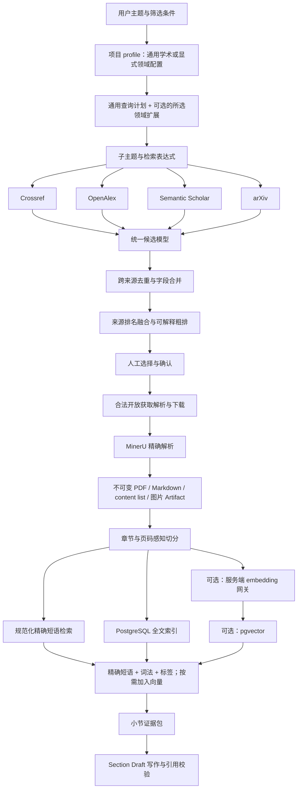

# 论文联网检索与文档混合检索完整改进方案

> 文档状态：已完成技术审查与精简，待确认后实施
> 编写日期：2026-08-18
> 适用分支：`dy-launch`
> 参考项目：Paper-Agent `main` 分支提交 `c68778fdb96b15025b86d45cbcd7fc9f20e52a43`
> 实施原则：保持现有前端视觉样式、九阶段工作流、人工确认节点、FastAPI、JobService/科学子进程、MinerU、PostgreSQL、服务端模型网关和用量计量体系不变；只改进论文联网检索、本地文档索引、证据召回和引用追踪。本方案不为 Prefect 增加新的编排职责。

## 1. 执行摘要

本项目当前已经具备用户级 Library、MinerU 精确解析、领域分类规则、Topic 查询计划、项目级论文选择、分阶段写作和引用编号等能力，但检索链路仍有两个明显缺口：

1. 上线界面的联网检索主要依赖 Crossref，来源覆盖不足。
2. Section Draft 写作阶段会读取每篇论文的 MinerU Markdown，但目前使用固定的文档开头片段，没有真正按当前小节问题检索论文中最相关的段落。

本方案不整体迁移 Paper-Agent，也不引入第二套工作流框架。最终目标是形成以下能力：

```text
查询计划与领域规则
→ Crossref / OpenAlex / Semantic Scholar / arXiv 多源搜索
→ 统一候选、安全去重、来源排名融合和可解释排序
→ 人工确认与合法开放获取下载
→ MinerU 精确解析
→ 按章节、页码和内容块建立全文索引
→ PostgreSQL 词法检索 + 可选 pgvector + 当前项目显式启用的领域标签融合
→ 按当前小节召回证据
→ 携带 paper_id、page、section、chunk_id 生成正文和引用
```

核心技术决策如下：

| 决策项 | 选择 |
|---|---|
| 前端和九阶段 | 保持现状，只补充内联状态、来源和证据展示 |
| 联网来源 | Crossref、OpenAlex、Semantic Scholar、arXiv |
| PDF 解析 | 继续使用 MinerU，不替换为 pypdf |
| 查询规划 | 保留现有 LLM 规划和确定性回退；领域规则由项目显式选择，不能默认污染其他学科 |
| 项目分类配置 | 新项目默认 `general_academic`；用户选择 `chemistry_general` 时才启用化学扩展和标签加权 |
| 结构化数据库 | 继续使用 PostgreSQL |
| 首期全文检索 | PostgreSQL `tsvector` + 规范化精确短语检索，不部署新搜索服务 |
| 后续向量存储 | 评测确认有收益后，在现有 PostgreSQL 中启用 pgvector，不独立部署 ChromaDB |
| 工作流编排 | 继续使用现有 FastAPI、JobService 和科学子进程；不新建 Prefect 流程 |
| 模型调用 | 继续统一经过服务端网关；新增 embedding 能力和独立并发槽 |
| 文档事实源 | PDF、MinerU Markdown、content list、图片和 metadata Artifact |
| 全文索引定位 | 可删除、可重建的派生数据，不作为论文原文件的事实源 |

## 2. Paper-Agent 源码结论

### 2.1 值得借鉴的部分

Paper-Agent 的联网检索流程为：

1. `SearchAgent` 使用 LLM 将主题拆成多个子主题和英文关键词表达式。
2. 每个子主题并行请求 arXiv、OpenAlex 和 Semantic Scholar。
3. 不同来源统一为 `PaperDocument`。
4. 根据年份、排除词、唯一标识和标题进行过滤、去重。
5. 使用标题与摘要关键词重叠进行粗排。
6. `ReadAgent` 阅读摘要，从研究问题、研究对象/场景、方法/技术路线三个维度判断相关性。
7. 只对入选论文执行全文下载、Markdown 转换、切分、结构化提取和向量化。

上述设计中最值得本项目采用的是：

- 多来源连接器与统一候选模型；
- 子主题并行搜索；
- 单个来源失败时保留其他来源结果；
- 摘要优先筛选，减少无效全文下载和解析；
- 稳定 `chunkId` 与页码证据追踪；
- 文档解析、切分、提取和向量化结果可缓存恢复。

### 2.2 不应直接照搬的部分

Paper-Agent 当前源码存在以下边界：

- 解析器以 pypdf 文本提取为主，不适合替换本项目已经投入使用的 MinerU。
- 默认按页切分，长页按约 1200 字符继续切分，章节结构利用不足。
- ChromaDB 已经实现向量写入和底层向量查询，但写作 Agent 的 `get_chunk_by_embed` 仍为 `pass`，即“写入索引”尚未形成“写作时语义检索”的完整闭环。
- Chroma 记录没有本项目所需的完整用户、项目和权限边界，不宜直接用于生产多用户部署。
- SQLite、本地文件会话和 LangGraph 与本项目已有 PostgreSQL、JobService、科学子进程和九阶段状态管理职责重叠。

因此，本项目只吸收检索思想和数据契约，不复制 Paper-Agent 的整套运行框架。

## 3. 本项目当前检索链路

### 3.1 Library 页面搜索

当前 Library 列表搜索为大小写不敏感的字符串包含匹配，搜索范围为：

- 标题；
- 作者；
- 关键词；
- 标签 JSON。

它不会搜索论文 Markdown 全文，也没有相关性排名。

### 3.2 Topic 阶段查询计划

当前 Topic 检索已经具备：

- LLM 生成受约束的查询计划；
- 模型不可用时的确定性回退；
- 用户关键词合并；
- 年份范围解析；
- 项目 taxonomy profile；
- 八类结构化标签；
- 无法安全分类时的 `unclassified` 路由；
- 防止把用户主题中的文字当成系统指令。

这一层比 Paper-Agent 单纯依赖 LLM 计划更稳，必须保留。

#### 3.2.1 当前项目分类配置的边界问题

当前项目创建界面只提供 `chemistry_general`（通用化学），前端、API Schema、Repository 和 taxonomy 默认值也都是 `chemistry_general`。`suggest_taxonomy_profile()` 在没有命中特定 profile 时同样回退到通用化学。因此，医学、计算机、社会科学等非化学项目也可能加载化学八分类、化学别名和化学标签权重。

这不是常规召回能力，而是领域配置缺少“无领域规则”选项。后续必须增加真正的 `general_academic`，并将“通用学术”和“通用化学”明确区分：

| profile | 含义 | 领域规则行为 |
|---|---|---|
| `general_academic` | 通用学术检索 | 不加载化学 taxonomy，不执行化学标签召回或加权 |
| `chemistry_general` | 通用化学检索 | 在常规召回基础上增加化学别名扩展、结构化标签召回和小幅排序加权 |
| 未来其他 profile | 医学、计算机、材料等 | 只加载用户明确选择的对应领域规则 |

`unclassified` 仍只是某个查询词无法归入当前 taxonomy 时的临时路由，不能代替 `general_academic`，也不能作为项目分类配置保存。

### 3.3 Topic 阶段本地召回

当前本地召回不是只看标题。评分输入包括：

- 结构化标签；
- 标题；
- MinerU Markdown 的前 12000 个字符；
- 年份；
- 领域分类别名；
- 标签字段权重。

它的优势是化学等已配置领域的精确性较高，缺点是：

- 仍然属于规则和短文本包含匹配；
- Markdown 只取开头部分；
- 同义表达和跨学科语义召回能力不足；
- 不能准确返回命中的页码和原文段落。

### 3.4 Topic 阶段联网召回

脚本层已经存在 Crossref 和可选 SciAtlas 适配，但当前上线服务端只启用 `--web-search`，实际主要使用 Crossref。当前链路没有在 Dashboard 中启用 OpenAlex、Semantic Scholar 和 arXiv。

### 3.5 PDF 解析与 Library 存储

当前上传论文必须经过 MinerU 精确解析才能进入 Library，并保存：

- 原始 PDF；
- MinerU Markdown；
- metadata；
- content list；
- extracted 目录；
- 图片和其他解析资产；
- Artifact ID、内容哈希和版本路径。

这些是本项目现有的重要优势，后续索引必须基于这些产物建立，不能改变其事实源地位。

#### 3.5.1 当前 MinerU 已经完成的结构切分

当前 MinerU 链路并不是只生成一份连续 Markdown，而是已经完成了可供后处理使用的版面结构切分。需要区分以下三层概念：

| 层次 | 当前状态 | 作用 |
|---|---|---|
| 超长 PDF 分批 | 已完成 | 超过供应商单次页数限制时，按最多 200 页拆成解析任务，完成后重新合并 |
| MinerU 版面内容块 | 已完成 | `content_list.json` 已按文本、列表、表格、图片等版面块组织内容 |
| RAG 检索切片 | 尚未建立 | 面向全文检索、embedding、排序和写作证据召回的语义单元 |

超长 PDF 的分批只用于满足 MinerU 供应商单次任务限制。合并时项目会：

- 将各分片 `page_idx/page_id` 加上原始页码偏移；
- 合并所有内容块；
- 重写图片和其他资产路径；
- 保留每个分片对应的原始页码范围；
- 输出与普通单文件解析相同的最终 Markdown、`full.md` 和 `content_list.json` 契约。

因此，200 页分批不是最终的检索切片，后续也不能把“第 1～200 页”当作一个 RAG chunk。

MinerU 的 `content_list.json` 已经能够提供或保留：

- `page_idx/page_id`；
- `type=text/list/table/image/chart` 等块类型；
- `text/content`；
- 图片标题或说明；
- 图片和其他资产路径；
- 内容块的原始顺序；
- 表格、图片和正文之间的页级关系。

metadata 准备阶段已经会读取这些块，用于标题、作者、关键词、摘要和内容块数量提取。Library 发布阶段也会将完整 `content_list.json` 和 extracted 资产目录复制到不可变 Artifact 中。

#### 3.5.2 当前仍然缺少的部分

虽然 MinerU 已经完成版面块切分，但当前下游没有把全部块变成可查询的全文索引：

- metadata 准备主要使用前几页内容块识别标题、作者、关键词和摘要；
- Topic 本地召回仍主要读取 Markdown 前 12000 个字符；
- Section Draft 仍使用每篇论文 Markdown 的固定开头片段；
- 没有面向检索的稳定文档切片表；
- 没有全文倒排索引、embedding 和向量索引；
- 写作阶段不能根据当前小节问题返回最相关的页码和内容块。

所以，本次改造中的“文档切分”不是重新解析或重新切割 PDF，而是对现有 MinerU 内容块执行轻量语义整理并建立索引。

### 3.6 Section Draft 证据使用

当前写作阶段按照 `allowed_papers` 读取每篇论文的 Markdown，删除图片语法和代码块、合并空白，然后仅保留固定长度的开头内容作为证据。

主要问题是：

- 论文后半部分的方法、结果、局限性和结论可能完全未进入模型上下文；
- 每篇论文都传一段固定前缀，与当前小节不相关的内容占用 Token；
- 论文越多，上下文越大，费用和失败率越高；
- 当前引用主要能追踪到论文，不能稳定追踪到具体页码和段落；
- 对其他学科主题，缺少领域规则时召回明显变弱。

这是本次改造优先级最高的问题。

## 4. 改造目标与范围

### 4.1 必须实现

1. 联网搜索同时支持 Crossref、OpenAlex、Semantic Scholar 和 arXiv。
2. 所有来源返回统一候选结构，并保留原始来源身份和诊断信息。
3. 多来源并行执行；单一来源失败不得使整个搜索失败。
4. 按 DOI、arXiv ID 和可信交叉外部 ID 自动去重；弱标题相似只提示人工确认。
5. 保留现有 LLM 查询计划、确定性回退和用户关键词逻辑；taxonomy 只在项目显式选择对应 profile 时启用。
6. 支持标题、摘要、年份、来源、排除词和开放获取状态过滤。
7. 对候选进行可解释排序，前端能够展示分数组成和来源。
8. 只对确认后的论文执行下载和 MinerU 解析；LLM 摘要筛选作为评测后的可选增强，不阻塞首期上线。
9. 对所有有效 MinerU Artifact 建立稳定的段落级全文索引，优先复用 `content_list.json` 中已有的结构块。
10. 全文索引必须保留论文、章节、页码、原始块、前后相邻块和资产引用。
11. 首期使用 PostgreSQL 精确短语、词法全文检索和当前领域标签召回；评测后再按需加入 pgvector 语义检索。
12. Section Draft 只检索当前小节真正需要的证据，不再固定发送每篇论文的开头片段。
13. 生成正文时保留 `paper_id + chunk_id + page` 证据链，最终仍输出当前项目兼容的数字引用格式。
14. 用户刷新页面后，搜索、解析、索引和重建状态必须从数据库恢复。
15. 所有检索和索引数据必须严格按用户隔离；项目只允许检索已选论文。
16. 启用向量阶段后，embedding 调用统一经过服务端网关，并记录 Token、模型、成本和任务归属。
17. 保留旧检索和旧写作证据逻辑作为短期回退开关，确保可灰度上线和安全回滚。
18. 项目创建增加 `general_academic`，并设为新项目默认值；只有显式选择 `chemistry_general` 的项目才使用化学规则扩展和标签加权。

### 4.2 保持不变

- 九阶段名称、顺序和人工确认逻辑；
- 当前页面整体布局、颜色、卡片风格和 Preview 编辑体验；
- PDF 必须通过 MinerU 精确解析后才能进入 Library；
- Library 属于用户级公共论文库，同一用户的项目可以复用论文；
- Discovery 选择结果属于项目，不能自动污染其他项目；
- FastAPI 对外接口体系和现有身份认证；
- PostgreSQL 为主要业务数据库；
- 服务端固定维护模型和密钥，浏览器不接触供应商凭据；
- 当前 Draft 编辑、历史回滚、评估重写、图像重绘和 Final Draft 功能。

### 4.3 暂不包含

- 不接入 Google Scholar 页面爬虫或绕过反机器人验证；
- 不下载无合法权限的付费 PDF；
- 不接入 Sci-Hub；
- 不替换 MinerU；
- 不引入 Elasticsearch、Milvus、Weaviate、独立 Chroma 服务或新的消息队列；
- 不把 LangGraph 引入现有九阶段工作流；
- 不在第一期实现复杂的引文网络扩展和自动滚雪球检索；
- 不要求第一期一次性建立医学、计算机、材料等所有领域 taxonomy；这些学科先使用 `general_academic` 的常规召回，后续按评测需求增加独立 profile；
- 不允许模型绕过 `allowed_papers` 自由引用其他论文。

## 5. 目标架构



### 5.1 数据边界

```text
用户级：LibraryPaper、解析 Artifact、文档切片、向量
项目级：taxonomy profile、Topic、查询计划、Discovery 选择、项目标签覆盖、allowed_papers
任务级：搜索进度、来源状态、检索诊断、证据包、模型用量
```

文档切片在用户级 Library 中只保存一份。不同项目通过 `allowed_papers` 和项目标签覆盖复用同一份切片，避免重复向量化和重复计费。

## 6. 联网搜索功能设计

### 6.1 来源适配器

建立统一 `PaperSourceConnector` 契约：

```python
async def search(request: PaperSearchRequest) -> SourceSearchResult:
    ...
```

每个连接器负责：

- 将统一请求转换成来源参数；
- 处理认证、超时、429 和来源错误；
- 将响应转换成统一字段；
- 保留来源原始 ID、原始排名和原始相关性分数；
- 不直接决定最终全局排名；
- 不把 Key、请求头或敏感错误写入结果。

第一期来源职责：

| 来源 | 主要用途 | 认证 |
|---|---|---|
| Crossref | DOI、期刊元数据、许可证和出版信息 | 通常无需 Key，配置联系邮箱 |
| OpenAlex | 跨学科覆盖、摘要、引用量、开放获取信息 | 服务器可选 Key |
| Semantic Scholar | 摘要、引用信息、外部 ID、开放 PDF 补充 | 服务器可选 Key |
| arXiv | 最新预印本和直接 PDF | 无 Key |

### 6.2 查询规划

继续使用当前查询计划流程：

1. 用户 Topic 和显式关键词作为不可信数据传入规划器。
2. Luna 默认生成结构化查询计划。
3. 强制合并用户显式关键词。
4. 输出年份、排除词、分组维度、已解析概念和未解析概念。
5. `general_academic` 项目只生成通用关键词、主题短语和过滤条件，不加载任何化学规则。
6. 显式选择领域 profile 的项目才生成对应领域关键词和别名；无法分类的单个查询词可使用 `unclassified` 临时路由。
7. 模型失败时使用现有确定性计划，不中止搜索。

查询计划中新增可选字段：

```json
{
  "subtopics": [
    {
      "name": "子主题名称",
      "query": "英文检索表达式",
      "required_terms": [],
      "optional_terms": [],
      "excluded_terms": []
    }
  ],
  "sources": ["crossref", "openalex", "semantic_scholar", "arxiv"],
  "filters": {
    "year_from": null,
    "year_to": null,
    "open_access_only": false,
    "document_types": ["journal-article", "proceedings-article", "preprint"]
  }
}
```

#### 6.2.1 领域配置与常规召回的执行顺序

领域规则不是常规召回之前的硬过滤器。统一顺序为：

```text
项目 profile + Topic + 用户关键词
→ 通用查询计划
→ 如果 profile 不是 general_academic，再补充对应领域规范词和别名
→ 常规精确短语 / 全文词法 / 可选向量召回，与领域标签召回并行
→ 合并、去重和 RRF
→ 领域匹配只做小幅加权
→ 返回候选论文或证据切片
```

行为矩阵：

| 能力 | `general_academic` | `chemistry_general` |
|---|---:|---:|
| 通用 LLM/确定性查询计划 | 开启 | 开启 |
| 多来源联网搜索 | 开启 | 开启 |
| 精确短语和全文词法召回 | 开启 | 开启 |
| 可选向量召回 | 开启 | 开启 |
| 化学 taxonomy 别名扩展 | 关闭 | 开启 |
| 化学结构化标签召回和加权 | 关闭 | 开启 |

项目 profile 适用以下约束：

- 用户在项目创建或设置中明确选择的 profile 优先级最高；系统可以提示更合适的 profile，但不能擅自切换。
- 新项目默认 `general_academic`。已有项目保存的 `chemistry_general` 不自动迁移，避免改变现有检索结果。
- Library 中即使存在化学 base tags，`general_academic` 项目也必须忽略这些标签；只有 profile 身份兼容的标签才能进入领域召回通道。
- 领域规则没有命中的论文仍可通过常规召回进入候选集，不能因 taxonomy 未覆盖新术语而提前删除。
- 领域标签只参与查询扩展、分组和排序，不能替代正文切片成为引用证据。
- 修改项目 profile 后，使查询计划、Discovery 结果和项目级标签评估变为 stale 并重新生成；PDF、MinerU Artifact、Library 基础 metadata 和全文切片不重新解析。

### 6.3 并发与降级

- 不同来源并发搜索。
- 不同子主题可并发，但受全局和用户级来源信号量限制。
- 同一来源必须执行独立速率限制，不能使用一个全局锁串行所有来源。
- 每个来源配置连接超时、总超时、最大重试和退避时间。
- 429、502、503、504 和网络超时执行有限重试。
- 400、401、403 等配置或请求错误不盲目重试。
- 一个或多个来源失败、但仍有可用结果时，沿用现有 Job 终态 `succeeded`；在 `result_json` 中写入 `completion_state="partial"`、`degraded=true` 和 `source_errors`，前端显示“部分完成”。
- 所有来源都失败时任务才标记为 `failed`。
- 任务取消后停止创建新请求，已在途请求按客户端能力取消或丢弃结果。

### 6.4 统一候选模型

```json
{
  "candidate_id": "稳定内部候选ID",
  "identifiers": {
    "doi": "",
    "arxiv_id": "",
    "openalex_id": "",
    "semantic_scholar_id": ""
  },
  "title": "",
  "abstract": "",
  "authors": [],
  "year": null,
  "publication_date": "",
  "journal": "",
  "document_type": "",
  "citation_count": null,
  "landing_url": "",
  "pdf_url": "",
  "open_access": {
    "is_oa": null,
    "license": "",
    "source": ""
  },
  "sources": [
    {
      "name": "openalex",
      "provider_id": "",
      "provider_rank": 1,
    "provider_score": null
    }
  ],
  "score": {
    "total": 0.0,
    "title_abstract": 0.0,
    "source_rank_rrf": 0.0,
    "citation": 0.0,
    "recency": 0.0,
    "metadata_quality": 0.0,
    "abstract_relevance": null
  },
  "abstract_decision": {
    "status": "not_run",
    "reason": "",
    "model_tier": "luna"
  },
  "selected_for_download": false
}
```

### 6.5 跨来源去重

去重优先级：

1. 规范化 DOI 完全一致；
2. arXiv ID 完全一致；
3. 来源返回的交叉外部 ID 一致；
4. 规范化标题完全一致、第一作者一致或作者集合高度重合，且年份相差不超过一年；
5. 只有标题与年份接近、但作者证据不足的记录，仅标记为“疑似重复”，不自动合并；
6. 标题高相似、第一作者一致且年份接近，也先标记为“疑似重复”，除非后续取得 DOI 或可信交叉 ID。

字段合并规则：

- 标识符执行并集；
- 保留所有 `sources`；
- 摘要优先保留完整、非空、长度合理的版本；
- PDF URL 优先选择明确开放获取且返回 PDF 的地址；
- 引用量保留来源和抓取时间，不把不同来源数字简单相加；
- 标题和作者发生明显冲突时保留主记录并记录诊断；
- 任何自动合并都必须可从结果中解释。

### 6.6 候选粗排

第一期使用确定性、可解释分数，不直接使用向量搜索替代来源检索。不同供应商的原始相关性分数口径不同，只保留为诊断信息，不直接跨来源相加。每个来源先按内部顺序生成 `provider_rank`，再计算来源排名融合：

```text
source_rank_rrf(candidate) = Σ 1 / (60 + provider_rank)
```

粗排参考权重：

```text
总分 =
  标题/摘要主题匹配 65%
  来源排名融合      15%
  引用量归一化      10%
  年份与新近度       5%
  元数据完整度       5%
```

规则说明：

- 标题命中权重高于摘要命中。
- 引用量使用对数归一化，避免老论文无限压制新论文。
- 新近度只能作为小权重，不得取代主题相关性。
- 没有摘要的论文仍可展示，不能仅因摘要缺失而归零。
- 来源失败或缺字段不能直接导致候选归零。
- 前端展示主要加分项和排除原因。

### 6.7 可选的摘要相关性筛选（后置）

首期不依赖 LLM 摘要筛选，先以人工标注集验证多源召回、去重和确定性粗排。只有当粗排精度不足且收益可量化时，才启用摘要筛选；默认关闭，并只对粗排前 N 条执行，避免成本和延迟失控。

建议使用 Luna 批量判断：

- 研究问题：匹配、部分匹配、不匹配；
- 研究对象/场景：匹配、部分匹配、不匹配；
- 方法/技术路线：匹配、部分匹配、不匹配；
- 证据等级：摘要或仅元数据；
- 一句理由；
- 不允许模型直接给最终总分。

程序根据固定表计算分数。核心研究问题不匹配时默认降低排序或排除，但用户仍可在“已排除”区域查看和手动恢复。

### 6.8 下载与合法性

- 搜索结果可以展示付费论文元数据，但自动下载只使用合法开放获取地址。
- 优先使用来源明确提供的开放 PDF。
- 继续使用现有 Crossref、Unpaywall、Europe PMC、Semantic Scholar 等合法解析链路。
- 下载前验证协议、最终跳转、Content-Type、文件头和最大体积。
- 下载失败不创建虚假的 Library 记录。
- 用户手动上传的 PDF 按现有上传和 MinerU 流程处理。

## 7. MinerU 后处理与文档切分

### 7.1 事实源与索引的关系

以下内容是事实源：

- 原始 PDF Artifact；
- MinerU Markdown Artifact；
- MinerU content list Artifact；
- extracted 图片和表格资产；
- Library metadata Artifact。

以下内容是派生索引：

- 文档切片；
- PostgreSQL 全文索引；
- embedding；
- 向量索引；
- 检索缓存。

派生索引损坏或模型变更时必须能够从事实源重新构建，不能依赖索引恢复 PDF 或 Markdown。

### 7.2 切分输入优先级

1. MinerU content list：获取页码、块类型、原始块顺序和资产关联。
2. MinerU Markdown：获取章节结构、公式、表格文本、标题和上下文。
3. metadata：补充论文标题、作者、年份、DOI 和结构化标签。

实现时必须直接复用已经发布到 Library Artifact 的 MinerU 结果：

- 不重新上传 PDF；
- 不重新调用 MinerU；
- 不重新执行 200 页物理分批；
- 不复制图片二进制到切片表；
- 不丢弃 MinerU 原始块 ID、页码、顺序和资产路径；
- 索引失败后仍从同一份 MinerU Artifact 重试构建。

### 7.3 从 MinerU 块生成检索切片

MinerU 内容块作为基础单元，后处理只执行必要的合并、拆分和结构补充：

```text
MinerU content_list block
→ 关联 Markdown 章节路径
→ 清理页眉、页脚和重复水印
→ 合并同章节中过短的相邻文本块
→ 拆分超过模型限制的长文本或长表格块
→ 补充稳定 chunk_id、相邻关系和资产引用
→ 建立词法及向量索引
```

处理规则：

- 普通且长度适中的 MinerU 文本块可一对一成为检索切片，不做无意义的二次切割。
- 同一章节、同一页面中连续且过短的文本块可以合并，但必须记录包含的原始块范围。
- 超长文本块、表格块或公式说明按 Token 上限拆分，所有子块继承原页码和资产关系。
- 图片块不存储图片二进制，只索引 MinerU 已提供的图片标题、说明、可用 OCR 文本和 Artifact 路径；本次不新增独立 OCR 流程。
- 表格块保留表题、表头和文本内容；过长时按逻辑行组拆分，而不是直接按字符截断。
- Markdown 用于补充章节层级和邻近上下文，不能覆盖 content list 中更精确的页码和块类型。
- 每个检索切片必须保存其来源 MinerU 块索引或块范围，确保可以反向定位。

### 7.4 检索切片规则

- 优先沿 Markdown 标题和 MinerU 页面边界切分。
- 单块目标 500～800 tokens，硬上限由 embedding 模型确定。
- 相邻块重叠 80～120 tokens。
- 短小相邻段落可在同一章节中合并。
- 超长表格、公式区或实验段落按原始块继续拆分。
- 每个切片携带章节路径，例如 `Results > Catalyst scope`。
- 每个切片保留 `page_start`、`page_end`、`block_start`、`block_end`。
- 每个切片保留前后相邻 `chunk_id`，召回后可按需扩展上下文。
- 图片二进制不写入 embedding；只将 MinerU 已提供的图片标题、说明、可用 OCR 文本和资产路径写入图片类切片。
- 表格保留标题、表头、行列文本和对应资产引用。
- 参考文献不物理删除，标记为 `section_type=references`，默认正文检索排除，需要引文追踪时单独启用。
- 页眉、页脚和重复水印在切分前清理。

### 7.5 稳定切片 ID

推荐：

```text
chunk_id = paper_id + 文档版本 + 页码/块范围 + 内容哈希短值
```

要求：

- 相同 PDF、相同 MinerU 版本、相同切分版本重复构建时 ID 稳定；
- Markdown 内容变化后生成新文档版本，不覆盖历史证据定位；
- `chunker_version` 和 MinerU 版本写入文档索引元数据；embedding 模型信息只写入独立向量记录；
- 引用旧版本切片时仍能定位到对应 Artifact 版本。

## 8. PostgreSQL 数据设计

### 8.1 PostgreSQL 检索能力与可选扩展

阶段 B 先使用 PostgreSQL 自带 `tsvector`、GIN 索引和规范化精确短语匹配，不依赖数据库扩展。科学术语、化学名称和编号可使用 `simple` 配置，但必须同时保留规范化原文匹配路径，因为 `simple` 对中文连续文本、特殊符号和部分化学表达式的分词能力有限。

阶段 C 再由数据库管理员启用 `pgvector`：

```sql
CREATE EXTENSION IF NOT EXISTS vector;
```

应用迁移必须先检测扩展是否可用。缺少扩展权限或安装失败时不得阻止应用启动，也不得影响 Library 和词法检索；系统进入 `lexical_only`，由管理员完成扩展后再启用向量功能。

### 8.2 文档索引版本表

建议新增 `library_document_indexes`：

| 字段 | 说明 |
|---|---|
| `id` | UUID 主键 |
| `user_id` | 用户隔离键 |
| `paper_id` | Library 论文 ID |
| `source_artifact_id` | 对应 MinerU/Markdown 事实源版本 |
| `source_sha256` | 源内容哈希 |
| `chunker_version` | 切分器版本 |
| `status` | pending/running/ready/failed/stale |
| `chunk_count` | 切片数量 |
| `error_code` | 稳定错误码 |
| `error_message` | 脱敏错误说明 |
| `created_at/updated_at` | 时间 |

唯一约束建议：

```text
(user_id, paper_id, source_sha256, chunker_version)
```

### 8.3 文档切片表

建议新增 `library_document_chunks`：

| 字段 | 说明 |
|---|---|
| `id` | UUID 主键 |
| `index_id` | 文档索引版本 |
| `user_id` | 用户隔离键，便于所有查询强制过滤 |
| `paper_id` | 论文 ID |
| `chunk_id` | 稳定业务 ID |
| `ordinal` | 文档顺序 |
| `content` | 切片文本 |
| `normalized_content` | 用于中文、化学式、缩写和编号精确匹配的规范化文本 |
| `content_type` | text/table/figure_caption/formula/references |
| `section_path` | 章节路径 |
| `page_start/page_end` | 页码 |
| `block_start/block_end` | MinerU 块位置 |
| `previous_chunk_id/next_chunk_id` | 相邻块 |
| `asset_refs_json` | 图片、表格等资产引用 |
| `content_sha256` | 切片内容哈希 |
| `search_vector` | `tsvector` |
| `metadata_json` | 其他可重建元数据 |
| `created_at` | 时间 |

索引：

- `(user_id, paper_id)` B-tree；
- `(index_id, ordinal)` B-tree；
- `(user_id, chunk_id)` 唯一索引；
- `search_vector` GIN；
- 只对 `status=ready` 的当前文档版本参与检索。

### 8.4 可选的切片向量表

阶段 C 新增 `library_chunk_embeddings`，不要因为 embedding 模型变化而复制文档切片和全文索引：

| 字段 | 说明 |
|---|---|
| `id` | UUID 主键 |
| `user_id` | 用户隔离键 |
| `paper_id` | 论文范围过滤键 |
| `chunk_row_id` | 对应 `library_document_chunks.id` |
| `content_sha256` | 切片内容哈希 |
| `embedding_profile` | embedding 逻辑档位 |
| `embedding_model_snapshot` | 实际模型快照 |
| `dimension` | 向量维度 |
| `embedding` | 固定维度 `vector(N)` |
| `status` | pending/ready/failed/stale |
| `created_at/updated_at` | 时间 |

唯一约束为 `(chunk_row_id, embedding_model_snapshot)`，并为 `(user_id, paper_id)` 建立 B-tree。阶段 C 先使用限定 `user_id` 和 `allowed_papers` 范围的精确余弦查询；只有实际数据量和基准测试证明延迟不可接受时，才增加 HNSW，避免首期引入无依据的索引参数与维护成本。

### 8.5 embedding 模型约束

阶段 C 由管理员配置一个固定 `retrieval_embedding` 档位，普通用户不选择实际 embedding 模型。

- embedding 模型变更时创建新的向量记录，不重建或复制文档切片；
- 向量维度变更时通过数据库迁移建立兼容的新向量列/表，完成回填后切换活动快照；
- 不允许使用不同维度的向量查询同一个索引；
- 文档 embedding 按 `content_sha256 + model_snapshot` 缓存；
- 查询 embedding 按规范化查询短期缓存；
- 模型不可用时允许词法检索继续工作，但状态明确标记 `lexical_only`。

## 9. 混合检索设计

### 9.1 检索范围

每次 Section Draft 检索必须同时满足：

```text
user_id = 当前用户
paper_id IN 当前 section.allowed_papers
LibraryPaper.status = active
索引版本 = 当前 ready 版本
```

项目标签只是排序覆盖，不复制用户级切片。

### 9.2 查询构造

从当前小节任务构造检索请求：

- 小节标题；
- 核心论点；
- must-cover points；
- comparison axes；
- Topic 主体；
- 当前项目 profile 已显式启用时，对应的 taxonomy 标签和别名；
- 用户显式关键词；
- 排除词。

查询规划器输出：

```json
{
  "semantic_query": "用于向量检索的自然语言问题",
  "lexical_terms": ["精确术语", "缩写", "化学名称"],
  "required_tags": {},
  "optional_tags": {},
  "excluded_terms": [],
  "allowed_paper_ids": []
}
```

### 9.3 分阶段召回

1. **元数据与可选领域标签召回**：标题和关键词始终参与；结构化领域标签和项目标签只在当前 profile 显式启用且身份兼容时参与。
2. **规范化精确短语召回**：对原始文本和规范化文本执行短语/子串匹配，保障中文连续文本、化学名称、缩写、公式和编号条件。
3. **词法全文召回**：使用 `ts_rank_cd` 检索切片，提供通用词法排序。
4. **可选向量语义召回**：阶段 C 使用 pgvector 余弦距离，补充同义表达、问题改写和跨学科概念。
5. **相邻证据扩展**：对高分块按需加入前后相邻块，补足被切分的句子、表格和上下文。

第一期不声称 PostgreSQL 原生全文排序就是 BM25。若后续评测证明 `ts_rank_cd` 不足，再单独评估 BM25 扩展，不在本次引入新的搜索服务。

### 9.4 排名融合

使用 Reciprocal Rank Fusion：

```text
RRF(chunk) = Σ 1 / (60 + rank_i)
```

然后执行有限业务加权：

- 标题/标签直接命中：小幅加权；
- 当前小节 primary paper：小幅加权；
- supporting paper：保持可召回但限制详细讨论；
- references 类型：正文检索默认降权或排除；
- 同一论文连续块：执行去重和相邻合并；
- 单篇论文最多进入证据包的块数可配置，避免单篇垄断上下文。

### 9.5 可选 LLM 重排（评测后）

首期不调用 LLM 重排。若人工标注集证明确定性融合不足，才允许对融合后的前 20～30 个切片使用 Luna 重排，输出：

- relevant；
- partially relevant；
- irrelevant；
- 对应 must-cover point；
- 一句理由。

重排失败时使用确定性融合排名继续执行，不使写作任务失败。

### 9.6 证据包

默认生成 8～12 个核心证据块，并根据上下文预算动态调整：

```json
{
  "retrieval_id": "",
  "query": {},
  "mode": "hybrid",
  "evidence": [
    {
      "paper_id": "",
      "chunk_id": "",
      "section_path": "",
      "page_start": 1,
      "page_end": 1,
      "content_type": "text",
      "content": "",
      "asset_refs": [],
      "scores": {
        "lexical": null,
        "vector": null,
        "rrf": 0.0,
        "rerank": null
      }
    }
  ],
  "diagnostics": {
    "lexical_hit_count": 0,
    "vector_hit_count": 0,
    "selected_count": 0,
    "excluded_by_scope": 0
  }
}
```

证据包作为阶段 Artifact 保存，便于：

- 复现一次写作；
- 审计引用来源；
- 对比旧检索和新检索；
- 在不重新检索的情况下重试模型生成；
- 统计召回质量和 Token 成本。

## 10. 写作与引用校验

### 10.1 Section Draft 输入变化

旧逻辑：

```text
allowed_papers 中每篇论文的固定开头片段
```

新逻辑：

```text
小节任务
→ 在 allowed_papers 中混合检索
→ 形成有限证据包
→ 只使用证据包写作
```

### 10.2 模型输出契约

每个段落必须返回：

```json
{
  "text": "段落正文",
  "evidence": [
    {
      "paper_id": "P001",
      "chunk_ids": ["P001:..."],
      "claim": "该证据支持的具体判断"
    }
  ]
}
```

### 10.3 程序校验

保存草稿前必须检查：

- `paper_id` 属于当前 `allowed_papers`；
- `chunk_id` 属于对应论文和当前用户；
- `chunk_id` 出现在本次证据包或显式相邻扩展中；
- primary paper 覆盖规则仍满足当前 Section Blueprint；
- supporting paper 没有被错误写成该小节的主要详细对象；
- 不存在未知论文、未知切片或跨用户引用；
- 最终数字引用由现有 citation map 生成，模型不能自行决定编号；
- Final Draft 继续使用现有排版和图片路径规范。

### 10.4 证据不足

证据不足时：

1. 使用更宽松的检索词重试一次；
2. 按需加入高分切片相邻块；
3. 仍不足时在小节状态中显示“证据不足”；
4. 不允许模型编造条件、产率、选择性、样本量、机制或结论；
5. 用户可以返回 Discovery 增加论文，或调整 Section Blueprint。

## 11. 前端功能与状态

### 11.1 总体要求

- 不改变九阶段结构。
- 不改变现有整体视觉设计。
- 不新增阻挡式弹窗作为主要编辑或状态界面。
- 搜索、解析和索引状态在当前卡片/Preview 区域内展示。
- 页面刷新后从数据库恢复，不依赖前端内存。

### 11.2 项目创建与分类配置

项目创建页保持现有布局，在“分类配置”下拉框中至少提供：

```text
通用学术（默认）  general_academic
通用化学          chemistry_general
```

选择项旁显示简短说明：通用学术不使用化学领域规则；通用化学在常规召回基础上增加化学扩展和标签加权。创建后在项目设置中允许修改，但保存前提示“将重新生成查询计划、Discovery 和项目标签，不会重新解析 PDF”。

后端返回可用 profile 列表、中文/英文名称和能力说明，前端不硬编码未来所有领域选项。旧项目继续显示其已保存的 profile。

### 11.3 Topic 阶段

在现有检索进度区域显示：

```text
正在生成查询计划
正在搜索 Crossref
正在搜索 OpenAlex
正在搜索 Semantic Scholar
正在搜索 arXiv
正在合并和去重
正在评估摘要
已完成 / 部分完成 / 失败
```

候选卡片增加：

- 来源徽标；
- 去重后合并来源；
- DOI/arXiv ID；
- 年份、引用量和开放获取状态；
- 总分；
- 主要命中原因；
- 摘要判断状态；
- 下载和 Library 状态；
- 来源失败或字段冲突提示。

### 11.4 Library 页面

每篇论文展示两个独立状态：

```text
MinerU 解析：等待 / 运行中 / 已完成 / 失败 / 重复文件复用
全文索引：未建立 / 等待 / 建立中 / 已就绪 / 仅词法 / 失败 / 需重建
```

功能：

- 查看索引状态；
- 对单篇失败论文重建索引；
- 管理员或用户启动当前 Library 缺失索引的批量重建；
- 重复 PDF 明确显示“已存在并复用解析和索引”，不能假装重新处理；
- Library 搜索支持“元数据”和“全文”模式，默认综合排序；
- 搜索结果可跳转到 Markdown 对应页码或证据片段。

### 11.5 Section Draft 阶段

每个小节增加非阻挡式状态：

```text
正在构造检索问题
正在检索已允许论文
已找到 N 个证据片段，覆盖 M 篇论文
正在生成小节
正在校验引用
完成 / 证据不足 / 失败
```

可选“查看证据”抽屉或内联区域展示：

- 论文标题；
- 页码；
- 章节；
- 原文片段；
- 命中原因；
- 该片段支持的段落。

这一区域只用于查看和核对，不改变现有 Preview 内编辑方式。

## 12. API 与任务设计

### 12.1 保留现有接口

继续使用：

- `POST /api/v1/projects/{project_id}/discovery/jobs`
- `GET /api/v1/projects/{project_id}/discovery`
- `PUT /api/v1/projects/{project_id}/discovery`
- `POST /api/v1/projects/{project_id}/discovery/confirm`
- `POST /api/v1/library/search-jobs`
- `POST /api/v1/library/download-jobs`
- 现有 Library 上传、PDF、Markdown、metadata 和资产接口。

Discovery 请求新增可选字段时必须提供服务端默认值，保持旧前端和旧请求兼容。

### 12.2 接口调整

扩展现有 Library 列表接口，不新增职责重复的 `/api/v1/library/search`：

```text
GET  /api/v1/taxonomy-profiles
GET  /api/v1/library/papers?q=...&mode=metadata|fulltext|hybrid
GET  /api/v1/library/papers/{paper_id}/index-status
POST /api/v1/library/papers/{paper_id}/reindex
POST /api/v1/library/reindex-jobs
GET  /api/v1/library/reindex-jobs/current
GET  /api/v1/projects/{project_id}/sections/{section_id}/evidence
```

`GET /api/v1/taxonomy-profiles` 返回可用 profile 的稳定 ID、中英文名称、是否启用领域规则和简短能力说明。项目创建和设置保存稳定 ID，不提交规则文件路径。

混合检索执行接口默认只供服务端领域服务调用，不直接暴露任意跨论文查询给浏览器。证据查看接口只能读取当前项目已经生成并授权的证据 Artifact。

当 `mode=hybrid` 但向量能力未启用或暂时不可用时，接口返回词法/精确短语结果并标记 `retrieval_mode="lexical_only"`，不返回 500。

### 12.3 任务类型

| 任务类型 | 作用 |
|---|---|
| `discovery.search` | 多来源联网检索和本地候选召回 |
| `library.upload` | 现有上传和 MinerU 解析 |
| `library.index` | 单篇论文切分、词法索引和向量化 |
| `library.reindex` | 批量重建缺失或过期索引 |
| `sections.generate` | 在同一任务内检索证据、保存 `section_evidence.json`、生成并校验小节 |

`library.upload` 必须先提交 Library 记录和 MinerU Artifact 并结束上传任务，再异步提交独立的 `library.index`。上传任务不能同步等待索引子任务，避免单 worker 部署发生父子任务互相等待。索引失败不能回滚已经成功入库的 PDF 和 MinerU 产物。

小节证据检索是 `sections.generate` 的内部步骤，不新增 `section.retrieve` Job。这样沿用现有轮询、取消、重试和 Stage Run 版本边界，也避免证据包与草稿版本错配。

### 12.4 任务进度

`discovery.search` 从固定 4 步扩展为可持久化里程碑和来源子状态：

```json
{
  "stage": "source_search",
  "completed": 2,
  "total": 4,
  "sources": {
    "crossref": {"status": "completed", "count": 20},
    "openalex": {"status": "running", "count": 0},
    "semantic_scholar": {"status": "retrying", "count": 0},
    "arxiv": {"status": "completed", "count": 12}
  }
}
```

状态写入 Job 数据库，前端刷新后继续轮询当前任务。

## 13. 模型网关、并发和计量

### 13.1 embedding 网关

科学子进程不接收 embedding 供应商 Key，只接收：

- 内部网关地址；
- 任务短期令牌；
- 逻辑档位 `retrieval_embedding`；
- 幂等请求键。

网关负责：

- 模型映射；
- 凭据注入；
- 批量大小限制；
- Token 用量记录；
- 价格快照；
- 重试和幂等；
- 用户、任务和论文归属；
- 内容哈希缓存。

### 13.2 并发隔离

embedding 使用独立信号量，不占用现有文本生成和图像生成并发槽：

```text
text_generation_semaphore
image_generation_semaphore
embedding_semaphore
mineru_parse_semaphore
paper_source_semaphores
```

这样批量重建 Library 索引不会阻塞第六阶段评估重写或图像重绘。

### 13.3 计量

启用对应能力时记录：

- 文档 embedding 输入 Token；
- 查询 embedding 输入 Token；
- 摘要筛选输入/输出 Token；
- 可选重排输入/输出 Token；
- 缓存命中；
- 用户、项目、任务、论文和阶段；
- 模型与价格快照；
- 供应商实际 usage。

同一 `content_sha256 + embedding_model_snapshot` 缓存命中时不重复调用供应商，也不重复计算供应商成本；是否收取平台服务费由后续计费策略决定。

## 14. 多用户与项目隔离

### 14.1 强制条件

- 所有索引表必须含 `user_id`。
- 所有检索 SQL 必须显式过滤 `user_id`。
- 项目检索必须再过滤 `allowed_papers`。
- 浏览器提交的 `paper_id`、`chunk_id` 和 `project_id` 不可信，服务端重新校验所有权。
- 任务令牌只能访问其绑定用户、项目、任务和能力。
- 日志不得输出其他用户的论文内容或完整查询结果。

### 14.2 同一用户不同项目

- Library 论文和索引可以复用。
- 上传状态和搜索任务按 operation key/项目上下文展示，完成后及时从当前操作区清理。
- 项目 A 的 Discovery 选择和项目标签不能进入项目 B。
- 项目 B 可以重新选择同一篇 Library 论文，无需重复解析和向量化。

### 14.3 删除和更新

- 删除 Library 论文后立即从可检索范围排除。
- 派生索引可异步清理；清理前也必须因 Library 状态过滤而不可召回。
- metadata 更新只影响需要该字段的排序；Markdown 或 MinerU Artifact 变化才使文档索引变为 `stale`。
- 重新解析产生新版本时建立新索引，切换成功后再停用旧索引。

## 15. 配置设计

服务器环境变量只保留来源凭据、来源列表和三个功能开关：

```text
CROSSREF_MAILTO
OPENALEX_API_KEY
SEMANTIC_SCHOLAR_API_KEY

REVIEW_DISCOVERY_SOURCES=crossref,openalex,semantic_scholar,arxiv
REVIEW_DISCOVERY_MULTI_SOURCE_ENABLED
REVIEW_DOCUMENT_RETRIEVAL_ENABLED
REVIEW_VECTOR_RETRIEVAL_ENABLED
```

来源并发、单源条数、切片大小、Top K、RRF 常数、embedding 批量大小等调优参数放在一个服务端集中配置对象中并提供保守默认值，不为每个参数新增环境变量。旧固定前缀回退由 `REVIEW_DOCUMENT_RETRIEVAL_ENABLED=false` 统一控制，不再增加独立开关。

taxonomy profile 是项目级业务配置，存储在项目记录中，不使用新增环境变量控制。Hosted 模式下，服务器全局 `REVIEW_TAXONOMY_PROFILE` 不能覆盖项目已经明确保存的 profile。

普通用户设置页面不显示 API Key、Base URL 或真实 embedding 模型，只显示相关服务是否可用。

## 16. 实施阶段

### 阶段 A：多来源联网搜索

工作内容：

- 抽取统一连接器接口；
- 增加 `general_academic` 无领域规则 profile，并设为新项目默认值；
- 项目创建页提供“通用学术”和“通用化学”，由后端 profile catalog 提供选项元数据；
- 化学扩展和化学标签通道只在 `chemistry_general` 下启用；
- 接入 Crossref、OpenAlex、Semantic Scholar 和 arXiv；
- 统一候选结构；
- 跨来源去重与字段合并；
- 基于来源内部排名的 RRF，不直接混合供应商原始分数；
- 并发、来源限流、错误降级；
- 扩展 Job 来源状态；
- 前端展示来源、合并结果和部分失败；
- 保持现有 Discovery 保存和确认契约兼容。

完成标准：四源可独立启停，任一来源失败时其他结果仍可使用。

### 阶段 B：段落切分与词法全文检索

工作内容：

- 增加索引版本和切片表；
- 使用现有 MinerU Artifact 构建章节/页码切片；
- 建立规范化精确短语检索、PostgreSQL `tsvector` 和 GIN 索引；
- Library 全文搜索；
- 为现有论文批量回填切片；
- Section Draft 先接入词法证据召回；
- 保留旧固定前缀逻辑作为短期回退。

完成标准：可以从长论文后半部分召回与小节问题相关的原文，并显示页码。

### 阶段 C：pgvector 与混合召回

工作内容：

- 部署 pgvector 扩展；
- 模型网关增加 embedding 能力；
- 批量 embedding、缓存和用量计量；
- 独立 `library_chunk_embeddings` 表；
- 先使用限定用户和论文范围的精确余弦查询；
- 词法、向量、标签 RRF 融合；
- 失败时自动回退到词法模式。

完成标准：跨同义词和不同表达能够召回正确证据，且不影响文本、图像和 MinerU 并发。

### 阶段 D：证据约束写作与引用追踪

工作内容：

- 小节查询构造；
- 证据包 Artifact；
- 段落级 `paper_id/chunk_id` 输出契约；
- 引用所有权和证据完整性校验；
- 前端证据查看；
- 评估与回归数据集。

完成标准：每个事实性段落都能定位到允许论文中的具体页码和切片。

### 阶段 E：灰度、评测和按需增强

工作内容：

- 现有用户 Library 后台批量回填；
- 旧、新检索双跑对比；
- 质量、延迟、Token 和错误率监控；
- 小范围用户启用；
- 默认切换到混合检索；
- 保留一个版本周期的旧回退开关。

达到基线后再分别评估 LLM 摘要筛选、Luna 重排和 HNSW。只有质量或性能数据证明有收益时才启用，不把这些能力作为首期上线依赖。

## 17. 迁移方案

### 17.1 数据库迁移

1. 备份 PostgreSQL。
2. 创建索引版本和切片表，阶段 B 不要求 pgvector。
3. 阶段 C 由数据库管理员安装并验证 pgvector；迁移先检测权限，失败时保持 `lexical_only`，不得阻止应用启动。
4. 不修改现有 `library_papers` 的唯一约束和 Artifact 路径。
5. 将所有现有有效论文标记为 `index_status=pending`。
6. 后台按用户和论文分批重建，限制并发。
7. 单篇失败记录错误，不中断整个批次。
8. 重建可从已有 PDF、Markdown、content list 和 extracted 目录恢复，不重新调用 MinerU。
9. 新上传论文在 Library/Artifact 提交成功后异步入队索引；上传 Job 不等待索引 Job 完成。
10. 将新建项目的前端、API Schema、Repository 和 taxonomy fallback 默认值改为 `general_academic`。
11. 已有项目的 `taxonomy_profile` 原值保持不变，不批量改成 `general_academic`。
12. `general_academic` 不执行化学分类；为兼容现有 Library metadata Schema，历史化学结构化标签可以保留，但在该项目的检索与排序中被忽略。

### 17.2 双轨运行

灰度期间同时保留：

- 旧的领域规则召回；
- 新的多来源候选召回；
- 旧的固定前缀写作证据；
- 新的词法/混合证据包。

只将新结果用于指定测试用户，其他用户继续走旧链路。双跑诊断不向模型重复发送同一份写作请求，避免重复收费。

### 17.3 回滚

出现问题时：

1. 关闭多来源或混合检索功能开关。
2. 恢复 Crossref 和旧本地评分。
3. Section Draft 恢复固定前缀证据回退。
4. 保留新增表和索引数据，不立即删除。
5. 不回滚已经成功解析的 Library Artifact。
6. 不使用破坏性数据库重置。

## 18. 测试方案

### 18.1 单元测试

- 各来源请求构造和响应规范化；
- DOI、arXiv ID 和可信交叉 ID 自动去重；
- 标题/年份相似但作者证据不足时只标记疑似重复；
- 来源字段冲突合并；
- 年份、排除词和文档类型过滤；
- 查询计划模型失败回退；
- `general_academic` 查询计划不产生化学 taxonomy 扩展；
- `chemistry_general` 查询计划正确生成化学规范词和别名；
- 明确保存的项目 profile 优先于主题自动建议和服务器默认值；
- MinerU Markdown/content list 切分；
- 表格、图片、公式、页码和章节保留；
- 稳定 chunk ID；
- `tsvector` 查询；
- pgvector 查询；
- RRF 融合和每篇论文上限；
- `allowed_papers` 和用户隔离；
- 引用与 chunk 所有权校验；
- embedding 缓存和幂等计量。

### 18.2 集成测试

- 使用模拟响应并发搜索四个来源；
- 一个来源超时、一个 429、其他成功；
- 部分来源失败时 Job 终态仍为 `succeeded`，并在结果中标记 `completion_state=partial`；
- 所有来源失败；
- 同一论文在三个来源返回不同 ID；
- 非化学项目选择 `general_academic` 时，不读取 Library 中的化学标签作为召回或加权信号；
- 化学项目选择 `chemistry_general` 时，常规召回与化学标签召回并行执行；
- 修改 profile 后只使查询计划、Discovery 和项目标签评估失效，不重新运行 MinerU 或重建通用全文切片；
- PDF 上传后 MinerU 成功、索引失败，Library 仍可用；
- 单 worker 下上传任务结束后再异步执行索引，不发生父子任务等待；
- 索引重试成功；
- embedding 不可用时词法模式成功；
- 用户 A 无法检索用户 B 的切片；
- 项目 A 无法检索未被选择的论文；
- 页面刷新后任务状态恢复；
- 删除论文后立即不再被召回。

### 18.3 端到端测试

至少准备：

- 化学主题；
- 医学或生命科学主题；
- 计算机科学主题；
- 中文 Topic、英文论文；
- 100 页以上长 PDF；
- 包含大量表格、公式和图片的 PDF；
- 无摘要候选；
- 重复 DOI、预印本和正式发表版本。

验证完整链路：

```text
Topic → 多源搜索 → 人工选择 → 下载/上传 → MinerU
→ 索引 → Discovery 确认 → Blueprint → Section Draft
→ 引用校验 → Draft 编辑 → Final Draft
```

### 18.4 质量评测

建立 30～50 个查询的小型人工标注集，记录相关论文和相关证据页码。指标：

- 候选 Recall@20；
- 证据 Recall@10；
- 前 10 条精确率；
- 跨来源去重正确率；
- 无效引用率；
- 段落可追溯率；
- 每小节平均证据 Token；
- 每小节模型费用；
- 检索延迟；
- 来源部分失败率；
- 索引成功率和重建成功率。

## 19. 验收标准

### 19.1 联网搜索

- 新建项目默认选择“通用学术”，已有项目的分类配置不被迁移改变。
- `general_academic` 项目不生成化学扩展词，也不使用化学标签加权。
- `chemistry_general` 项目保留常规召回，并额外启用化学别名和标签通道。
- taxonomy 未命中的候选仍可通过常规召回进入结果，不被领域规则提前过滤。
- Dashboard 实际请求并展示四个来源状态。
- Crossref 失败时 OpenAlex、Semantic Scholar 和 arXiv 结果仍可保存。
- 同 DOI 论文只显示一条，来源徽标完整。
- 查询计划失败时确定性回退仍能完成搜索。
- 年份和排除词在所有来源上有效，或在聚合层统一补充过滤。
- 所有错误不包含 API Key 和敏感请求头。

### 19.2 文档索引

- 每篇 MinerU 成功论文都有可查询索引状态。
- 对已有论文可不重新解析 PDF 直接重建索引。
- 100 页长论文可召回第 80 页附近的相关内容。
- 切片可以定位到论文、章节、页码和原始 Artifact 版本。
- 索引损坏后可以从 Artifact 完整重建。

### 19.3 混合检索

- 精确化学名、缩写和数字条件能通过词法检索命中。
- 同义表达能通过向量检索命中。
- 领域标签能影响排序但不能制造不存在的全文证据。
- embedding 服务故障时自动回退为 `lexical_only`，并明确显示状态。
- 检索结果严格限制在当前用户和当前 `allowed_papers`。

### 19.4 写作与引用

- Section Draft 不再默认发送每篇论文的固定开头片段。
- 每个事实性段落至少关联一个有效 `paper_id/chunk_id`。
- 未授权论文和未知 chunk 无法保存为有效引用。
- 用户可以查看引用对应页码和原文片段。
- 最终数字引用、图片显示和 Final Draft 排版不回退。

### 19.5 性能与成本

先记录旧固定前缀链路和阶段 B 词法链路的延迟、证据召回率、Token 与费用基线。以下数值是优化目标，不是在缺少基线和部署硬件信息时强制承诺的上线门槛：

- 无 LLM 重排的混合检索争取达到 P95 小于 2 秒，最终阈值按数据量和部署硬件校准。
- 批量索引不占用文本生成和图像生成并发槽。
- 相比旧固定前缀方案，小节证据输入 Token 争取降低 30%，前提是不降低人工标注集的证据召回率；实际目标在基线测试后确认。
- 缓存命中的文档不重复计算 embedding 供应商成本。

## 20. 风险与控制

| 风险 | 控制措施 |
|---|---|
| 外部来源限流或不稳定 | 独立连接器、来源信号量、有限重试、部分成功 |
| 多源重复合并错误 | 强标识优先、弱相似仅提示、保留来源记录 |
| 非化学项目误用化学规则 | 新项目默认 `general_academic`，项目 profile 显式优先，标签通道校验 profile 身份 |
| embedding 成本增长 | 内容哈希缓存、批量调用、后台限速、用量计量 |
| 向量模型变更 | 独立向量记录和模型快照，不复制词法切片、不原地混用维度 |
| 中文或化学名称被普通分词破坏 | `simple` 词法索引之外保留规范化精确短语匹配和领域标签 |
| 数据库无 pgvector 安装权限 | 启动时能力检测，保持 `lexical_only`，由管理员在阶段 C 单独安装 |
| 长表格或公式切分失真 | content list 块边界、内容类型和资产引用 |
| 跨用户数据泄露 | `user_id` 冗余隔离键、服务端所有权复核、隔离测试 |
| 新检索证据不足 | 词法/向量/标签融合、相邻扩展、旧逻辑回退 |
| 索引失败影响上传 | 解析与索引状态分离，索引是可重建派生数据 |
| 批量索引影响现有功能 | 独立 worker/信号量、低优先级、可暂停批次 |
| LLM 重排不稳定 | 只重排小候选集，失败使用确定性 RRF |
| 前端状态刷新丢失 | 所有任务和来源状态持久化到 Job 数据库 |

## 21. 代码改动范围

### 21.1 后端

重点涉及：

- `review_writer_api/native_handlers.py`
- `review_writer_api/schemas.py`
- `review_writer_api/repositories.py`
- `review_writer_api/workflow_schemas.py`
- `review_writer_api/workflow_models.py`
- `review_writer_api/domain_services/discovery.py`
- `review_writer_api/domain_services/library.py`
- `review_writer_api/domain_services/sections.py`
- `review_writer_api/routers/discovery.py`
- `review_writer_api/routers/library.py`
- `review_writer_api/job_service.py`
- `review_writer_core/taxonomy.py`
- `review_writer_core/project_config.py`
- taxonomy profile catalog 接口及 `general_academic` 无领域规则配置；
- 模型网关、用量流水和数据库 migration 模块。

建议新增：

```text
review_writer_core/paper_sources/
  base.py
  crossref.py
  openalex.py
  semantic_scholar.py
  arxiv.py
  normalize.py
  deduplicate.py
  rank.py

review_writer_core/retrieval/
  chunker.py
  indexer.py
  lexical.py
  vector.py
  hybrid.py
  evidence.py
```

### 21.2 科学脚本

重点调整：

- `skills/review-topic-paper-discovery/scripts/discover.py`
- `skills/review-literature-acquisition/scripts/literature_acquisition.py`
- `skills/review-section-drafting-figure-picking/scripts/generate_section_drafts.py`

原则是将可复用检索逻辑下沉到 `review_writer_core`，脚本只保留参数解析、Artifact 输入输出和兼容入口，避免继续扩大单文件。

### 21.3 前端

重点调整：

- `view/assets/dashboard/review-ui.js`
- `view/assets/dashboard/review-i18n.js`
- `frontend/src/features/projects/ProjectsPage.tsx`
- 对应 Dashboard 样式文件。

只增加项目分类选项、状态、来源、索引和证据展示，不重新设计九阶段布局。

## 22. 推荐实施顺序

推荐严格按以下顺序执行：

1. 先增加 `general_academic`、修正新项目默认 profile，并完成多来源联网检索和来源状态持久化。
2. 再完成 MinerU 文档切分和 PostgreSQL 词法全文检索。
3. 先用词法检索替换固定开头证据，验证写作证据闭环。
4. 然后接入 embedding 网关和 pgvector。
5. 最后完成证据查看和全量回填，再依据评测决定是否增加摘要筛选、Luna 重排或 HNSW。

这样每一步都能独立产生价值，并且在 pgvector 或 embedding 尚未准备好时，项目仍可依靠词法全文检索正常运行。

## 23. 最终结论

本项目不需要替换成 Paper-Agent，也不需要为了 RAG 单独部署一套 ChromaDB。最合理的改进方式是：

- 保留现有查询规划和领域规则，但用项目 profile 明确限制领域规则的启用范围；同时保留 MinerU、PostgreSQL、模型网关、多用户隔离和九阶段界面；
- 借鉴 Paper-Agent 的多来源连接器和稳定证据 ID；摘要筛选只作为评测后的可选增强；
- 在现有 PostgreSQL 中先增加可重建的段落级词法索引，再按评测结果启用独立的向量记录；
- 将 Section Draft 从“固定截取论文开头”升级为“针对当前小节检索证据”；
- 所有正文引用都能够回到具体论文、页码和原文片段。

这套方案既能提高化学主题的精确检索，也能明显增强医学、计算机、材料、生命科学等其他学科的通用检索能力，同时不破坏已经完成的前端、阶段状态、模型网关、MinerU 和 Draft 编辑功能。

## 24. 参考源码

- Paper-Agent 查询规划：<https://github.com/Tswoen/Paper-Agent/blob/c68778fdb96b15025b86d45cbcd7fc9f20e52a43/src/agents/searchAgent.py>
- Paper-Agent 多源检索服务：<https://github.com/Tswoen/Paper-Agent/blob/c68778fdb96b15025b86d45cbcd7fc9f20e52a43/src/paper_retrieval/service.py>
- Paper-Agent 候选粗排：<https://github.com/Tswoen/Paper-Agent/blob/c68778fdb96b15025b86d45cbcd7fc9f20e52a43/src/graph/search_node.py>
- Paper-Agent 文档切分：<https://github.com/Tswoen/Paper-Agent/blob/c68778fdb96b15025b86d45cbcd7fc9f20e52a43/src/utils/read_utils/chunkers.py>
- Paper-Agent Chroma 入库：<https://github.com/Tswoen/Paper-Agent/blob/c68778fdb96b15025b86d45cbcd7fc9f20e52a43/src/repositories/chroma/read_vector_store.py>
- Paper-Agent 尚未实现的写作向量工具：<https://github.com/Tswoen/Paper-Agent/blob/c68778fdb96b15025b86d45cbcd7fc9f20e52a43/src/agents/writingAgent.py#L614-L655>
