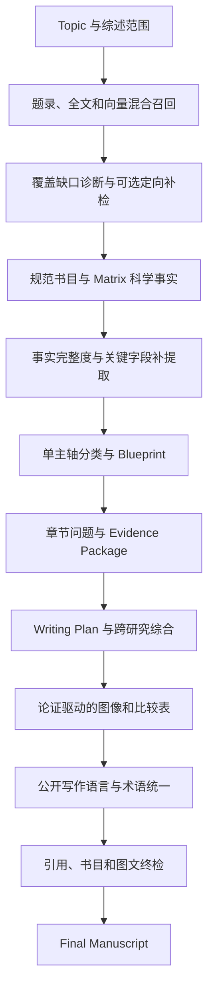

# 审稿意见驱动的泛化内容质量优化方案

## 1. 文档定位

本文基于 `last` 项目的实际阶段产物及对应审稿意见，提出一套面向不同综述主题和不同学科的内容质量改进方案。

本方案只解决以下问题：

- 检索范围与稿件范围不一致；
- 书目信息不可靠；
- 科学事实提取完成但关键字段缺失；
- Matrix、Outline、Blueprint 和正文之间的分类路由不一致；
- 章节过度拆分，缺少跨研究综合；
- 内部工作语言进入公开稿件；
- 图像选择、图注、正文论证和来源信息不一致；
- 参考文献和最终稿未使用同一份规范数据。

本方案暂不讨论任务重试、超时恢复、断点续跑、服务降级和其他运行健壮性问题，也不增加新的工作流阶段。

本方案不针对 ATA、联烯、Cu、Zn 或 Cd 写死规则。领域差异由 Topic、项目分类配置、Taxonomy Profile 和当前论文事实动态表达。

## 2. 对 `last` 项目的阶段产物复核结论

### 2.1 核心证据链已经存在

当前系统已经具备以下基础能力，不需要重新建设第二套证据平台：

- MinerU 全文解析与正文定位；
- PostgreSQL 全文索引和向量索引；
- Matrix 科学事实及来源片段；
- Blueprint、问题级 Evidence Package 和 Writing Plan；
- Claim、论文身份、证据键与引用组绑定；
- Final 引用账本与发布检查。

因此，本轮重点不是增加知识图谱、新向量数据库或新的质量中心，而是修复现有产物之间的内容传递和质量判定。

### 2.2 已确认的主要断点

1. `last` 共选择 16 篇论文，但正文结构被拆成大量单论文章节。15 篇主论文对应的正文主题中，有 8 个章节只有 1 篇主论文，跨研究比较天然不足。
2. Matrix 已将一篇论文识别为 ZnI₂ 体系，但旧 Outline/Blueprint 没有随事实刷新重新路由，最终章节标题仍是 Cadmium systems。
3. Writing Plan 已经发现该章节标题与证据不一致，却只能在正文中解释“实际为 Zn”，不能修正上游章节标题。
4. Matrix 的“科学事实完整”主要表示提取任务已完成，不代表综述所需字段完整。16 篇论文中，组分作用类事实明显不足，无法支持催化剂、促进剂、胺和添加剂角色的系统比较。
5. Discovery 已检测到部分查询组无结果，并建议联网补检，但本次使用了限定本地语料；该范围事实没有被转换成适合公开发表的范围说明。
6. 当前书目核验把“能关联到本地 PDF”误当成“全部字段已经准确”，导致错误期刊、污染作者字段和缺失卷页仍进入参考文献。
7. 图像选择接近“一篇论文一张图”，装置照片、表格截图、损坏图注和非代表性图片也进入候选或终稿。
8. 正文中出现 `locally bounded Matrix`、`available excerpt`、`indexed evidence` 等项目内部术语，不符合正式综述的公开写作语体。

## 3. 总体改进原则

### 3.1 单一事实来源

书目信息、科学事实、章节归属、证据身份和图像来源分别只保留一个规范来源。下游只能读取规范字段，不能重新从 OCR 原文或旧阶段产物拼装另一份事实。

### 3.2 一个主分类轴，多个比较轴

正文标题只使用一个主要分类轴。其他维度通过小节、段落、比较表和综合章节表达，不能把多个轴直接交叉组合成大量章节。

### 3.3 Agent 负责语义判断，代码负责事实约束

- Agent 可以判断字段角色、提出章节组织、归纳跨论文关系和改善公开写作语言；
- 代码负责 DOI、年份、论文身份、证据键、引用编号、章节归属条件和图像来源的一致性；
- Agent 输出不能直接成为规范事实，必须绑定来源并通过确定性检查。

### 3.4 自动修正优先，不增加常规人工确认

本轮不增加新的用户确认阶段。只有“是否扩大联网检索范围”以及“是否覆盖人工编辑过的 Outline”继续由用户决定，其他质量改进在现有阶段内部完成。

## 4. 目标内容流程



## 5. 详细功能改进

### 5.1 Discovery：把覆盖诊断转化为可执行的范围决策

保留当前“检索覆盖不足时由用户决定是否联网补检”的原则，不把联网检索设为硬性步骤。

在现有 `coverage_diagnostics` 中补充：

- Topic 明确要求的时间、对象、方法和独立讨论维度；
- 每个 Topic 分区的候选论文数量；
- 无结果或证据稀疏的查询组；
- 代表性综述、奠基研究和近期研究是否有候选；
- 当前语料更适合完整综述、选择性综述还是限定语料综述。

页面只增加一个现有范围内的动作：`定向补检缺失主题`。用户不启用时，后续稿件不得宣称系统性或完整覆盖。

终稿不增加独立的内部“Review Method”章节，但应在 Introduction 中生成 2–4 句公开可读的 `Scope and literature selection` 说明，只描述真实执行过的数据库、检索截止日期、时间范围和纳入原则，不出现 Matrix、索引、模型或工作流名称。

### 5.2 Library/Matrix：建立字段级规范书目

书目核验从论文级 `verified=true` 改为字段级状态：

```json
{
  "bibliography_fields": {
    "title": {"value": "...", "status": "verified", "source": "doi_registry"},
    "authors": {"value": [], "status": "conflict", "source": "pdf_front_matter"},
    "journal": {"value": "...", "status": "verified", "source": "publisher"},
    "publication_year": {"value": 2021, "status": "verified", "source": "publisher"},
    "volume": {"value": "...", "status": "verified", "source": "doi_registry"},
    "pages_or_article_number": {"value": "...", "status": "missing", "source": null},
    "doi": {"value": "...", "status": "verified", "source": "pdf_and_registry"}
  }
}
```

规范字段处理顺序：

1. 从 PDF 首页和明确书目信息区域抽取候选；
2. DOI 与标题、作者一致时，采用出版社或 DOI 注册机构的规范记录；
3. 自动清除 `Received`、`Accepted`、`Cite This`、网页按钮、HTML 标签、卷期提示和脚注符号等污染；
4. 仍无法确认时，调用一次 Agent 阅读限定区域并判断字段角色；
5. Final References 只读取规范字段，不读取原始 OCR 字符串。

“找到了本地 PDF”只能证明论文身份可追踪，不能直接把全部书目字段标记为已核验。

### 5.3 Matrix：把“提取完成”与“事实足够”分开

科学事实状态调整为：

- `extraction_complete`：提取任务已完成；
- `review_fields_complete`：当前 Topic 和比较任务所需字段完整；
- `review_fields_partial`：存在可写事实，但部分关键比较字段缺失；
- `source_not_established`：原文没有提供或无法确认。

关键字段不固定为化学字段，而由通用比较角色组成：

- 研究对象或输入；
- 方法、干预或反应体系；
- 各组成部分的作用；
- 条件；
- 结果和定量指标；
- 适用范围；
- 局限；
- 机制或因果证据；
- 验证方式；
- 实用性、安全性、成本或可持续性。

化学 Taxonomy Profile 可把这些角色映射为底物、催化剂、促进剂、胺、添加剂、产物、产率、ee/dr 和机理证据；其他学科使用自己的字段映射。

当 Topic 或 Blueprint 要求比较某个字段，而现有事实卡缺失时，只对相关论文执行一次定向事实补提取。Agent 必须返回 `fact_id`、规范字段、原文片段和位置；无法定位原文的内容不能进入事实卡。

### 5.4 Outline/Blueprint：修复分类轴交叉和旧路由残留

#### 5.4.1 主轴选择

根据以下条件选择唯一主轴：

- Topic 是否明确要求按该轴组织；
- 分类是否互斥或具有稳定主归属；
- 每类是否有足够论文形成综合；
- 该轴能否贯穿标题、正文、比较表和总览图。

辅助轴可以是催化/干预体系、年代、机制、结果等级或立体化学模式，但默认不直接与主轴交叉生成章节。

Topic 中的“分别讨论”不等于必须生成独立一级章节。该要求可以通过一级章节、小节、比较表或明确的综合段落满足，并在 contract 中记录其可追踪位置。

#### 5.4.2 防止单论文碎片章节

系统不设置机械的最少论文硬门槛，但应计算：

- 每节主论文数量；
- 与相邻章节的对象和问题重合度；
- 同一论文跨章节重复承担主要论证的比例；
- 章节是否只有方法复述而没有比较任务。

只有具有独立科学问题的代表性研究才保留为单论文案例。其他单论文章节优先合并到同一主轴章节中作为方法分支、历史节点或例外。

#### 5.4.3 事实变化后的路由更新

当规范事实中的分类字段发生变化时，系统必须重新计算受影响论文的章节建议，例如：

- 体系或干预对象变化；
- 输入、产物或研究对象变化；
- 立体选择性模式变化；
- 论文类型由原始研究变为综述或方法说明；
- Topic partition 发生变化。

系统生成的 Outline/Blueprint 可自动更新相关归属；用户人工编辑过的结构只生成差异建议。Writing Plan 不得通过正文解释来容忍已经确定的错误章节标题。

#### 5.4.4 Agent 的使用位置

只在 Blueprint 组织阶段增加一次受约束的语义判断：

1. Agent 根据 Matrix 事实提出主轴、辅助轴、章节合并和论文归属；
2. 代码检查每个标题和归属是否能被规范事实支持；
3. 不受支持的金属、方法、对象或性能标签被删除或退回待分类；
4. 生成最终 Blueprint。

不为每个分类轴分别创建 Agent，也不增加新的分类服务。

### 5.5 Evidence Package：围绕科学问题组织证据

Blueprint 中的每个科学问题应声明所需的事实角色，例如：

```json
{
  "question": "不同体系中的组分分别承担什么作用？",
  "required_fact_roles": [
    "system_component",
    "component_role",
    "mechanism_evidence",
    "reported_limitation"
  ]
}
```

证据构建时：

- 只要求与该问题有关的论文回答该问题；
- 不要求所有主论文回答章节内所有问题；
- 直接事实、作者解释和综述层推断保持不同证据等级；
- 向量和全文命中只负责发现候选片段，事实卡和 Claim 必须使用可定位原文；
- 缺失某个比较字段时，不得把“未提取到”写成“原论文没有报告”。

这样可以避免把检索能力不足误写成科学结论。

### 5.6 写作：增加一个通用跨研究综合 Skill

本轮最多增加一个 `cross-study-synthesis` Skill，并确保 Blueprint 根据项目类型实际加载该规则。该 Skill 不保存事实，不产生新的引用，只使用 Writing Plan 中已经批准的 Claim 和证据。

每个综合单元优先形成：

```text
共同趋势
  → 可比较的差异
  → 差异对应的条件、机制证据或研究设计
  → 例外和适用边界
  → 对方法选择或后续研究的意义
```

约束包括：

- 一篇论文不能生成跨研究排名；
- 不同口径的产率、选择性或指标不能直接比较；
- 可以指出证据层级不同，但不能连续重复免责声明；
- 不用“证据不足”替代对已知差异的分析；
- 结论只综合正文中已经成立的关系；
- 不得新增证据包外的数字、实体、机理或性能评价。

### 5.7 公开写作语言与术语统一

在现有 Draft 评估中增加 `publication_voice`，清理：

- Matrix、Evidence Package、indexed evidence；
- available excerpt、provided material、locally bounded；
- 模型任务、内部阶段、提示词和系统状态；
- 重复的防御性模板句。

内部限制需要转换为科学表达。例如：

```text
内部：The available excerpt does not specify the catalyst loading.
公开：The reported study does not provide a sufficiently detailed basis for comparing catalyst loading across the selected systems.
```

同时建立由项目领域配置提供的术语表，统一对象名称、缩写、取代模式、指标和符号。通用代码只执行一致性检查，不写死某个化学主题词表。

摘要采用固定内容结构：研究对象、范围、组织主轴、主要讨论内容和本文增量，不罗列系统限制，不写成 Conclusion 的重复版本。

### 5.8 图像：从“按论文选图”改为“按论证选图”

每张图必须声明 `argument_role`：

- 核心转化或研究框架；
- 代表性底物/对象范围；
- 机制证据；
- 跨研究比较；
- 总览分类。

默认排除：

- 装置照片；
- 表格截图和优化条件截图；
- 与当前章节主张无关的局部图；
- OCR 图注严重损坏的候选；
- 重复表达同一研究结论的图片；
- 无法确认来源或公开使用条件的图片。

图注不直接复用 MinerU 原始文字，应根据以下结构生成：

```text
图中展示的科学对象或转化
  + 本图在当前论证中的作用
  + 来源论文身份
  + Adapted/Reproduced/Source 状态
```

催化剂、促进剂、底物、产物和性能描述必须与 Matrix 规范事实一致。版权或许可未确认时，不能自动写 `Reproduced with permission`。

### 5.9 总览图：先生成受控内容，再生成视觉

总览图不能直接把完整 Topic 交给图像模型自由发挥。应先生成结构化内容：

```json
{
  "title": "概括性标题",
  "primary_axis": "...",
  "modules": [],
  "comparison_dimensions": [],
  "approved_labels": [],
  "evidence_bindings": {}
}
```

处理规则：

- 标题是对综述内容的概括，不复制用户提示词；
- 中性分类标签可以来自 Blueprint；
- `high ee`、`broad scope`、`sustainable` 等评价必须绑定定量或明确原文证据；
- 未进入正文的体系、金属和方法不得进入总览图；
- 生成后提取可见文字，与 `approved_labels` 对照；
- 总览图优先采用统一的二维反应与分类结构，不把装饰性球棍模型作为无归属的漂浮元素。

### 5.10 Final：引用、参考文献和内容状态使用同一身份链

终稿继续按论文身份而不是模型生成的临时编号建立引用账本：

```text
Claim
  → evidence_key / fact_id
  → paper_id
  → 终稿首次引用顺序
  → 正文编号
  → 规范参考文献条目
```

Final 检查至少包括：

- 正文引用的论文是否存在于规范参考文献；
- 参考文献是否真的在正文中被使用；
- 作者、期刊、年份、卷页和 DOI 是否来自规范字段；
- 图注引用与图像来源论文是否一致；
- 标题、摘要、Introduction 和 Conclusion 的范围声明是否一致；
- 是否残留内部术语、原论文 Scheme 编号、网页抓取文字和损坏 LaTeX。

界面应区分：

- 结构和文件可生成；
- 证据身份一致；
- 书目字段完整；
- 图像来源和内容绑定完整；
- 可正式发布。

不能用一个笼统的 `valid=true` 表示稿件已经具备学术发表质量。

## 6. Agent、Skill 与确定性代码的职责

| 能力 | 推荐实现 | 原因 |
|---|---|---|
| DOI、年份、期刊、卷页一致性 | 确定性代码和权威书目来源 | 必须可复核，不能依赖写作判断 |
| OCR 字段角色仍无法确定 | 限定区域 Agent | 需要理解版面和语义角色 |
| 主轴选择、章节合并建议 | 一次 Blueprint Agent | 属于全局语义组织问题 |
| 论文最终归属合法性 | 确定性事实校验 | 防止 Agent 引入不存在的类别 |
| 组分作用与机理证据补提取 | 定向 Agent + 原文定位 | 需要理解上下文，但必须有来源 |
| 跨论文综合写作 | 一个通用 Skill | 需要稳定的综述写作策略 |
| 引用编号与参考文献映射 | 确定性代码 | 不能交给模型 |
| 图像候选过滤 | 确定性规则 | 可按类型、清晰度、来源和重复度判断 |
| 图像科学意义和图注 | Agent 生成，代码核对事实 | 兼顾语义质量与事实约束 |
| 总览图内容 | Blueprint/Matrix 结构化生成 | 防止视觉模型自由添加结论 |

不建议为书目、分类、写作、图像分别新增多个 Agent 或多个 Skill。当前项目只需要复用现有阶段服务，并补充一个跨研究综合 Skill。

## 7. 对现有七阶段的影响

| 当前阶段 | 主要改动 | 是否增加页面步骤 |
|---|---|---|
| 文献库 | 字段级规范书目和污染清理 | 否 |
| Topic 检索 | 覆盖缺口与定向补检建议 | 否 |
| Matrix/Blueprint | 事实完整度、单主轴分类、事实变化重路由 | 否 |
| 章节生成 | 问题所需字段、跨研究综合 Skill | 否 |
| 图像 | 论证驱动选图、受控图注和总览内容 | 否 |
| 初稿评估与重写 | publication voice、术语和综合质量 | 否 |
| Final | 规范参考文献、范围一致性和图文终检 | 否 |

## 8. 实施优先级

### P0：先消除事实性错误的传播

1. 书目字段级规范化，Final 禁止读取原始 OCR 书目；
2. Matrix 分类事实变化后重新计算论文路由；
3. Blueprint 采用单主轴，避免多个轴交叉生成章节；
4. 组分作用、研究对象、结果类型和立体选择性等关键事实按 Topic 补提取；
5. 引用、图注和参考文献统一使用 `paper_id` 身份链。

### P1：提高综述逻辑和批判性综合

1. 增加一个通用跨研究综合 Skill；
2. 合并没有独立科学问题的单论文碎片章节；
3. 增加公开写作语言检查；
4. 生成比较表所需的统一事实字段；
5. Introduction 中加入简短、真实的公开范围与文献选择说明。

### P2：提高图表和最终呈现质量

1. 按论证选择图片并减少图片数量；
2. 优先统一重绘核心反应图；
3. 总览图采用证据绑定的结构化内容；
4. 清理原论文编号、OCR 损坏文字和未经确认的版权措辞；
5. 检查标题、摘要、正文、图表和参考文献的范围与术语一致性。

## 9. 验收标准

### 9.1 检索与范围

- Topic 要求的每个重要分区都有明确的候选数量或缺口说明；
- 没有执行联网补检时，稿件不会宣称系统性完整覆盖；
- 稿件中的范围说明只包含真实执行过的检索信息，不暴露系统内部实现。

### 9.2 书目与事实

- 本地 PDF 存在不再等价于全部书目字段已核验；
- DOI、期刊、年份、卷页和作者污染能够定位到具体字段；
- 参考文献不再出现网页按钮、Received/Accepted、HTML 标签等抓取残片；
- “未提取到事实”不会被写成“原论文没有报告”。

### 9.3 分类与章节

- 每篇论文的主归属能由规范事实解释；
- Blueprint 标题中的对象、体系和方法与 Matrix 一致；
- Topic 的辅助维度可以在小节或比较表中追踪，不需要全部成为一级章节；
- 不再因多个分类轴交叉产生大量重复、单论文章节；
- 系统不得在正文中解释并保留已经确定错误的章节标题。

### 9.4 写作

- 章节整体能呈现趋势、差异、例外、边界和意义，而不是逐篇摘要；
- 比较结论能回溯到至少两项口径可比的研究证据；
- 正文和图注不出现 Matrix、indexed evidence、available excerpt 等内部术语；
- 摘要能够概括对象、范围、组织方式、主要内容和综述增量。

### 9.5 图像与终稿

- 每张图片有明确论证作用、来源论文和正文调用；
- 装置照片、表格截图和损坏图注不会被默认选入综述正文；
- 总览图不包含未经证据支持的体系、性能标签或 Topic 原始提示词；
- 正文引用、图注来源和规范参考文献使用同一个 `paper_id`；
- `valid`、书目完整和可正式发布是不同状态，不再混为一个结果。

## 10. 明确不做的内容

- 不新增工作流阶段；
- 不新建第二套向量数据库或知识图谱；
- 不建立独立于现有阶段的质量中心；
- 不为某个主题硬编码金属、底物、产物或章节名称；
- 不要求用户逐篇、逐段重复确认；
- 不让 Skill 决定 DOI、年份、引用编号或论文身份；
- 不用更多免责声明替代科学比较；
- 本轮不处理任务重试、服务超时、断点恢复和运行故障降级。

## 11. 预期效果与边界

按照本方案实施，可以泛化改善审稿意见中的以下大部分问题：

- 分类错位和重复；
- 催化剂、促进剂和研究对象的事实错误；
- 章节缺少横向比较；
- 参考文献字段污染和来源错配；
- 图像与正文不一致；
- 总览图出现无证据内容；
- 内部工作语言和过度防御性表述；
- 标题、摘要、正文和结论的范围不一致。

自动系统不能证明某个主题的全球文献已经绝对完整，也不能自动取得原论文图片的版权许可。系统应准确诊断这两类边界并提供可执行操作，但不能伪造“完整覆盖”或“已获许可”。

本方案的核心不是增加更多技术，而是让现有事实、分类、证据、写作、图像和参考文献使用同一套规范身份和内容契约，并只在确实需要语义判断的位置使用 Agent。
