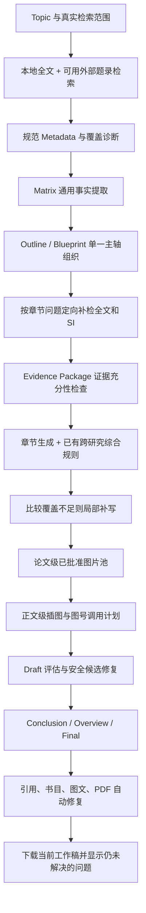

# 审稿意见驱动的证据链与内容质量优化实施方案

## 1. 文档定位

本文依据 `zzz` 项目的真实阶段产物、最终 PDF 以及审稿意见，对当前综述生成流程进行复核，并给出可直接落到现有代码结构中的通用优化方案。

方案不针对联烯、ATA、Cu、Zn、Cd 等当前主题写死规则。主题差异继续由 Topic、Taxonomy Profile、Outline、Blueprint 和论文事实表达；通用代码只负责身份、证据、依赖和一致性约束。

本轮目标不是再建一套质量系统，而是解决一个核心问题：

> 项目已经能够发现许多问题，但诊断结果没有稳定地驱动上游补检、重路由、重写、图像重排和导出修复，导致错误仍可一路传播到最终稿。

### 1.1 本轮优化范围

- 如实表达检索范围，禁止把工作流时间写成文献检索截止日期；
- 修复全文已索引但关键证据未进入 Evidence Package 的召回断点；
- 区分“来源没有报告”和“系统没有检索/提取到”；
- 让 Outline、Blueprint、章节标题和总览图使用同一主分类轴；
- 强制执行项目已有的跨研究综合要求，减少逐篇摘要；
- 从规范 Metadata 重建参考文献，禁止继续修补污染字符串；
- 将候选图片池与最终插图计划分开，修复图文错位和强制全插入；
- 让现有 Draft、Final 和 PDF QA 诊断触发自动修复，而不只生成报告；
- 保持现有七阶段、现有阶段接口和现有人工编辑能力。

### 1.2 明确不做

- 不新增工作流阶段；
- 不新增质量中心、通用修复巨型接口或新的领域服务；
- 不新建第二套 Metadata、Matrix、Manifest 或稿件就绪真相；
- 不新增“投稿模式”“质量模式”或新的用户可见发布状态；
- 不新建跨研究综合 Skill，复用现有 `review-cross-study-synthesis`；
- 不要求用户逐篇确认事实或逐图确认默认操作；
- 不静默接受模型改写，保留现有候选比较与人工接受；
- 不把“选中的论文代表图”永久绑定到某一个正文段落。

## 2. `zzz` 项目的事实复核

### 2.1 检索范围并非稿件所宣称的范围

`zzz` 的 Discovery 产物显示：

- `selection_mode=explicit`；
- Crossref、OpenAlex、Semantic Scholar 和 arXiv 均未实际执行；
- 外部命中数为 0；
- 本地初始候选 39 篇，去重并选择后为 16 篇；
- 实际文献年份范围为 1979–2021；
- 覆盖类型为 `local_bounded`。

但 Final 公开文字把工作流运行日期拼接成了“筛选截至 2026-08-28”，并使用了容易让读者理解为系统检索的表述。这不是文献不足本身造成的，而是范围生成逻辑把“运行时间”错误解释成“检索截止日期”。

审稿人列出的三篇关键文献在当前用户文献库中也不存在：

- `10.1021/acs.accounts.9b00023`；
- `10.1021/acsomega.1c03092`；
- `10.1002/anie.202112427`。

因此，系统可以生成“基于当前本地语料的选择性综述”，但不能自动宣称已经完成系统、全面或截至某日的外部检索。

### 2.2 Matrix 的“完成”不等于科学事实足够

本次 Matrix 有 16 行，顶部统计为 16 篇完成，但 16 篇的 `review_readiness` 实际均为 `partial`。在 176 个字段状态中：

- `supported`：63；
- `retrieval_not_found`：58；
- `not_requested`：55。

其中方法条件仅 4/16 有充分支持，研究对象/输入 6/16，定量结果 6/16，范围信息 11/16。当前“提取任务完成”被界面和后续流程误读成“已具备完整综述写作条件”。

### 2.3 关键机理证据存在于全文索引，却没有进入章节证据包

对于审稿人指出的 CuI/ZnBr₂/Ti(OEt)₄ 体系，PostgreSQL 已索引到明确证据：

- Ti(OEt)₄ 和 CuI 参与炔丙胺形成；
- ZnBr₂ 更有效地促进炔丙胺向丙二烯转化；
- Ti(OEt)₄ 并不负责第二步转化。

这些关键 chunk 没有进入 `sections/evidence_package.json`。章节生成器于是把“证据包没有召回”写成“原论文没有分配各组分功能”。根因是：

```text
全文已索引
  → 章节检索未召回关键片段
  → Evidence Package 缺项
  → 写作模型把检索缺项误写成来源事实缺失
```

这是证据链中最需要优先修复的通用问题。

### 2.4 章节分类轴交叉，导致重复与错位

Outline 声明主轴为 `reaction_type`，辅助轴为金属和立体化学，但实际章节同时使用：

- 亲电试剂/底物类别；
- 推测机理类型；
- 金属平台；
- 手性控制方式。

同一级标题因此出现 Aldehyde ATA、Isomerization/Rearrangement、Gold-catalyzed、Ketone ATA 和泛化的 Terminal Alkyne Allenation 等不同维度，同一反应也可能在不同章节重复承担主论证。

### 2.5 已有综合规则，但没有成为生成门槛

项目已有：

- `skills/review-cross-study-synthesis/SKILL.md`；
- Blueprint 中的 synthesis requirements；
- Sections 中的 synthesis state 和 diagnostics。

然而 `zzz` 的 27 个规划段落中，比较段落为 0，比较覆盖率为 0.0，流程仍继续完成。因此缺口不是“没有综合 Skill”，而是已有规则只被记录，没有参与生成后的自动补写和质量判定。

### 2.6 书目身份和字段没有完成规范化

最终参考文献仅 4/16 完成身份核验，12/16 仍未解决。多篇文献期刊字段错误地继承为 `Green Chemistry`，作者字段还混入页眉和稿件流程文字。当前系统将“本地 PDF 可关联”过度解释为“书目信息已验证”。

### 2.7 图像选择、插入与论证没有分层

当前 Manifest 保留 16 张所选来源图，并倾向于全部插入。结果包括：

- 来源论文身份基本可追踪，但图片不一定支撑所在章节的当前论点；
- 3 张图角色未知；
- 部分图注退化为通用候选名称；
- 正文缺少可见的图号调用和解释；
- 图片漂移到 Conclusion、References 或空白页附近；
- 来源身份、科学作用、版权状态和排版位置混在同一个“已选”状态中。

用户对图片的业务定义是合理的：Stage 5 人工选择的图片代表该论文总体反应或核心贡献，不必在选择时绑定某一个段落。但“属于某篇论文”不等于“必须全部插入全文”。最终插入仍需要独立的编辑计划。

### 2.8 总览图通过了形式校验，却没有科学内容

总览图结构数据中的 `labels=[]`，实际图片仍出现 Cu、Au、Fe、Others 等模板分类，其中 Fe 并未被正文系统支持，Selectivity、Supported feature 等区域为空。现有语义检查主要拦截提示词残留和超长标签；空标签集合会因为没有可比较项而被错误视为通过。

### 2.9 终审发现了问题，但没有驱动修复

现有产物已经发现：

- Draft 评分 82.21，目标 90；
- 15 个阻断性段落问题；
- bibliography 未完全解析；
- figure evidence binding 和 rights 未解决；
- PDF 有替代字符、低 DPI、图文错位和过度空白页。

但人工 `below_goal_override` 之后仍可构建并下载一个被界面称作 Final 的文件。问题不在于“需要增加更多阻断”，而在于：可自动修复的问题没有被自动修复，内部的结构 `valid=true` 又容易被误解为学术内容已经可靠。

## 3. 优化后的总体逻辑



核心原则：

1. 范围表述只描述真实执行过的动作；
2. 事实缺失先补检，不能直接变成论文缺点；
3. 一级结构只有一个分类主轴；
4. 论文级代表图和段落级插入计划分开；
5. 诊断优先触发既有阶段内的局部修复；
6. 无法自动解决的问题仍可随工作稿导出，但不得被隐藏或伪装成已验证事实。

## 4. 分阶段功能优化

### 4.1 Library 与 Discovery：真实范围和可恢复的补检

复用现有 Discovery 产物，不新增 `review_scope.json`。

需要修改：

1. `coverage_diagnostics` 明确记录每个 provider 的 `requested/executed/succeeded/failed/disabled`；
2. 只有实际成功执行的来源才能进入公开方法说明；
3. 检索截止日期来自用户范围或成功检索的明确时间边界，不得使用工作流 `retrieved_at`；
4. 外部来源不可用时，自动降为 `local_bounded`，继续允许工作，但公开文字必须说明“基于当前纳入语料”；
5. 对缺失主题生成定向补检建议，联网失败不清空已有结果；
6. 对 DOI、引用网络和代表性综述只做候选补充，不把“未找到全球全部文献”变成程序阻断。

建议公开文字由同一个纯函数生成，输入仅为真实执行记录和用户范围，禁止在 `final.py` 中临时拼接日期。

### 4.2 Metadata：规范值和审计过程分开

复用现有 Library Metadata 和 bibliography audit，不新增第二套书目真相。

规范顺序：

1. DOI/出版社或 Crossref/OpenAlex 的匹配记录；
2. PDF 首页和明确书目信息区域；
3. 本地文件名与全文线索；
4. 限定区域模型判别仅用于处理仍有冲突的字段。

每个字段保留来源、置信度和冲突信息，但下游只读取 `canonical_metadata`。原始 OCR 书目不能直接进入 References。

外部核验失败时保留当前规范值并标记字段未核验；不能把整个文献处理任务判定失败，也不能伪造期刊、作者、卷页或 DOI。

### 4.3 Matrix 与事实状态：统一使用现有 readiness helper

复用 `review_writer_core/review_fact_readiness.py` 中已有的事实状态，不在各脚本重复判断逻辑。

需要明确区分：

- `supported`：有可定位原文支持；
- `reported_but_incomplete`：来源涉及该事实，但不足以完成比较；
- `retrieval_not_found`：当前检索未找到，不能公开写成来源未报告；
- `source_verified_not_reported`：已核查相关正文、图表和必要 SI，可谨慎写成来源未报告；
- `not_requested`：当前问题不需要该字段。

新增一个共享的确定性函数 `negative_claim_eligibility(fact_state, checked_sources)`，由章节生成、Draft 重写和 Final 清洗共同调用。只有 `source_verified_not_reported` 可以形成公开否定性结论。

### 4.4 Blueprint：单一主轴和自动修复 catch-all 章节

复用现有 scope contract、classification basis 和 taxonomy diagnostics。

生成顺序调整为：

1. 从 Topic 提取一级主轴候选；
2. 用论文事实评估互斥性、覆盖率和章节可综合性；
3. 选择一个一级主轴；
4. 金属、机制、手性、年代等作为二级比较轴；
5. 对 `Others`、`Miscellaneous`、`Terminal alkyne allenation` 等 catch-all 章节自动提出可辩护名称或合并建议；
6. 在 Blueprint 按钮前自动应用不涉及用户人工结构的安全修复，而不是只显示错误并禁用按钮；
7. 用户人工修改过的标题/顺序不被静默覆盖，但确定性的事实冲突必须显式提示并给出一键修复。

每篇论文原则上只有一个主章节归属。允许在其他章节作为比较证据被调用，但不应再次用逐篇摘要方式完整介绍。

### 4.5 Evidence Package：关键证据缺失时定向补召回

Evidence Package 构建不只按段落相似度取 top-k，还要结合 Blueprint 的 `required_fact_roles`。

对于每个计划 Claim：

1. 先检索该论文的规范事实卡；
2. 再在主文、表格、图注和已关联 SI 中按事实角色检索；
3. 对 catalyst role、conditions、quantitative results、scope、limitations、mechanism evidence 等关键字段做覆盖检查；
4. 关键字段为 `retrieval_not_found` 时，执行一次目标明确的全文补召回；
5. 找到证据则更新 Evidence Package；仍找不到则删除或降级该 Claim，而不是生成“原文未报告”的句子。

这一步应直接修复 `zzz` 中“全文有证据、章节包没证据”的根因。

### 4.6 Sections：让已有综合 Skill 真正生效

不新增 Skill。继续使用：

- `skills/review-cross-study-synthesis/SKILL.md`；
- Blueprint synthesis requirements；
- `sections/synthesis_state.json`；
- 已有 synthesis diagnostics。

修改为生成后的局部闭环：

1. 多论文主体章节必须至少有一个承担横向比较的段落；
2. 比较段落必须包含共同点、差异、对应条件/证据、适用边界或意义中的至少三项；
3. `comparison_coverage=0` 时，只补写相应章节的综合段，不重生成全部章节；
4. 不能比较的定量结果不得强行排名；
5. 单论文案例可以没有跨论文比较，但需要说明其为何承担独立科学问题；
6. 同一论文在多个章节重复承担主介绍时，保留最符合主轴的一处，其他位置改成简短交叉比较。

### 4.7 Draft：修复内部语言和“缺证据即否定”

复用现有 paragraph evaluation、candidate rewrite、integrity gate 和用户接受流程。

增加/强化以下规则：

- 清除 `supplied evidence`、`available excerpt`、`indexed evidence`、Matrix、工作流状态等内部语言；
- 将 `retrieval_not_found` 句子返回上游补检或删除，不用语言润色掩盖；
- 保护数字、化学式、引用身份、图片元数据；
- 批量安全优化继续逐段执行，失败段落不停止后续段落；
- 接受候选后只复评该段，并增量更新总分；
- 自动修复后仍达不到目标分数时保留候选差异，不静默覆盖用户文本。

### 4.8 Figures：论文级图片池与正文插入计划分离

Stage 5 人工选择的图片表示“该图可以代表这篇论文”，形成 `approved_asset_pool`。该选择只锁定：

- `source_paper_id`；
- 原始 Figure/Scheme 身份；
- 当前来源文件和版本哈希；
- 人工选择/重绘/编辑状态。

Final 插图计划再根据正文论证选择其中一部分图片，并确定：

- 插入章节与相邻论点；
- 正文可见调用，例如“如图 4 所示”；
- 当前图在论证中的作用；
- 图注、来源和版权措辞；
- 不插入时的 `skip_reason`。

因此：选图不需要先绑定段落；正文也不再默认插入所有已选图。

图像保存逻辑继续使用来源/输出哈希，避免候选图变化后误用旧重绘。图像科学来源和版权状态分开记录；版权未验证不妨碍内部预览，但不得自动生成 `Reproduced with permission`。

### 4.9 Overview：空语义和模板漂移必须被拒绝并自动回退

复用现有 overview 结构和生成脚本，不新增总览图服务。

生成前必须形成非空结构：

```json
{
  "primary_axis": "与 Blueprint 相同的一级主轴",
  "modules": [],
  "approved_labels": [],
  "evidence_bindings": {}
}
```

校验要求：

- `modules` 和 `approved_labels` 不得为空；
- 每个模块能映射到 Blueprint 的实际章节或综合分支；
- Fe、metal-free、high ee、broad scope 等未被正文和事实支持的标签不得出现；
- 空面板、占位文字和模板分类不是合法结果；
- 视觉模型失败时，回退到确定性的结构化 SVG/HTML 图，而不是输出空模板；
- 总览图插入 Introduction 正文之前或 Introduction 开头的约定位置，不放在 Conclusion/References 之后。

### 4.10 Final、References 与 PDF：让现有诊断触发局部修复

不增加新的 `manuscript_readiness_report.json` 或用户可见“投稿状态”。继续复用：

- Draft quality；
- Final validation；
- bibliography audit；
- figure validation；
- PDF QA 与 render manifest；
- 现有 manuscript/release 内部字段。

生成 Final 时依次执行：

1. 从规范 Metadata 重建 References，不读取 OCR 拼接串；
2. 用 `paper_id` 对齐正文 callout、图注来源和参考文献；
3. 自动清除 HTML、MinerU LaTeX 残留、XML 非法字符和内部标记；
4. 检查图片是否有正文调用和解释，没有则自动补写调用或移出插入计划；
5. 检查总览图位置、Figure 浮动、低 DPI、空白页和文字越界；
6. 可确定修复的问题只重建相应产物；
7. 无法确定修复的问题继续在现有问题明细中展示。

保持用户可以生成和下载当前工作稿，避免大量人工阻断；但文件界面必须如实显示仍未解决的引用、图像或事实问题，不能只显示笼统的“成功”。是否继续将这种文件称为“最终稿”，见文末待确认问题。

## 5. 自动修复路由：复用阶段接口，不建通用修复巨石

不实现通用 `/quality/issues/{id}/repair` 动作分发服务。问题项只携带：

```json
{
  "issue_type": "evidence_role_missing",
  "target_type": "paragraph",
  "target_id": "S06-p2",
  "source_stage": "sections",
  "recommended_action": "targeted_evidence_refresh"
}
```

前端或 Job orchestrator 根据 `source_stage + recommended_action` 调用现有阶段接口：

| 问题 | 调用现有能力 |
|---|---|
| 检索范围不实 | Discovery coverage/method refresh |
| 书目字段冲突 | Library metadata resolve |
| 关键事实未召回 | Matrix/Sections targeted evidence refresh |
| 分类标题冲突 | Planning Blueprint repair |
| 缺少横向比较 | Sections local synthesis rewrite |
| 内部语言残留 | Draft paragraph candidate rewrite |
| 图文不匹配 | Figures insertion-plan refresh |
| References 缺项 | Final bibliography rebuild |
| 页面空白/图漂移 | Final render/PDF rebuild |

这和子 Agent 不同：它不是创建自治智能体，而是把问题路由到拥有该数据的原阶段服务，继续通过统一模型网关调用模型。FastAPI 仍负责权限、项目隔离、请求校验和 Job 创建；Worker 执行实际任务；模型网关只负责模型协议、密钥、限流、重试和 provider 路由。

## 6. 代码复用与冗余控制

### 6.1 只扩展现有产物

| 需求 | 复用/扩展位置 | 不采用的重复方案 |
|---|---|---|
| 检索范围 | Discovery `coverage_diagnostics` | 新建 `review_scope.json` |
| 分类一致性 | classification basis、scope contract、taxonomy diagnostics | 新建 taxonomy 服务和第二份 contract |
| 事实状态 | `review_writer_core/review_fact_readiness.py` | 各脚本复制状态判断 |
| 综合覆盖 | Blueprint synthesis requirements、Sections synthesis state | 新建综合 Skill/报告 |
| 图像关系 | 当前 selection/manifest 行 | 新建 figure relevance 真相文件 |
| 书目核验 | canonical metadata + bibliography audit | Final 再解析 OCR 书目 |
| 终稿问题 | Draft quality、Final validation、PDF QA | 新建 readiness 报告和质量中心 |
| 修复动作 | 现有阶段 API/Job | 通用 repair 巨型端点 |

### 6.2 建议抽出的共享纯函数

只抽取无状态、可测试的 helper，不拆新的领域服务：

- `public_scope_statement(execution_record, user_scope)`；
- `negative_claim_eligibility(fact_state, checked_sources)`；
- `canonical_bibliography_entry(metadata)`；
- `classification_axis_consistency(outline, blueprint, matrix)`；
- `comparison_coverage(section_plan, paragraphs)`；
- `figure_argument_binding(manifest_row, manuscript)`；
- `overview_semantic_coverage(overview_spec, blueprint)`；
- `sanitize_publication_text(text)`。

这些 helper 应放入现有 `review_writer_core` 的相应模块，由 API、Skill 脚本和 Worker 共同导入，避免在 `final.py`、章节脚本和导出脚本中分别实现。

### 6.3 代码改动落点

| 代码位置 | 主要调整 |
|---|---|
| `review_writer_api/domain_services/final.py` | 删除工作流日期冒充检索截止日；methods execution 读取真实 provider 执行记录；强化 overview 空语义校验；现有诊断驱动局部重建 |
| `review_writer_core/review_fact_readiness.py` | 统一否定性 Claim 资格与事实状态判断 |
| `review_writer_core/bibliography_audit.py` | 字段级规范化和冲突来源；为 Final 提供唯一书目入口 |
| `skills/review-section-drafting-figure-picking/scripts/generate_section_drafts.py` | required fact roles 定向补召回；比较覆盖为 0 时局部补写；保底输出不伪造事实 |
| `skills/review-cross-study-synthesis/SKILL.md` | 原则基本保留，只补充可检测的输出约束，不复制成新 Skill |
| `review_writer_api/domain_services/figures.py` | 区分 approved asset pool 与 insertion plan；不默认全插入 |
| `skills/review-figure-style-redraw/scripts/generate_overview_figure.py` | 非空结构约束、Blueprint 标签白名单和确定性回退 |
| Final 导出与 PDF QA 代码 | 清洗、图文调用、空白页、低 DPI 和漂浮体自动修复闭环 |

## 7. 实施顺序

### P0：先阻止错误事实继续传播

1. 修复范围说明和 methods execution 的真实来源；
2. 统一事实 readiness，并禁止 `retrieval_not_found` 生成公开否定结论；
3. 为关键 fact roles 增加定向全文/SI 补召回；
4. Final References 只从 canonical metadata 重建；
5. 已有综合诊断为 0 时执行章节局部补写；
6. Draft/Final 的现有问题列表能够定位到具体段落、图片或文献。

### P1：修复结构、图文和总览图

1. Blueprint 单主轴校验和 catch-all 自动修复；
2. 同一论文的主介绍去重，保留跨章节比较引用；
3. 图片池与插入计划分离；
4. 自动生成正文图号调用和论证性图注；
5. 总览图非空语义校验、正文范围白名单和确定性回退。

### P2：形成最终呈现的自动修复闭环

1. PDF 页面级空白、低 DPI、越界和浮动体修复；
2. References、图注和正文 callout 的统一身份重排；
3. 对历史项目执行兼容迁移，不强制重建未受影响的阶段；
4. 增加覆盖典型失败链路的回归测试。

## 8. 验收标准

### 8.1 范围与证据

- 未执行外部检索时，公开稿件不会声称系统筛选至工作流运行日期；
- 当前语料不足时可以继续生成限定语料工作稿；
- 全文索引中存在的关键 catalyst role 证据能进入对应 Evidence Package；
- `retrieval_not_found` 不再被写成“原论文没有报告”；
- SI 未上传时只描述“当前证据未包含 SI”，不评价原文没有条件数据。

### 8.2 结构与写作

- 一级章节使用同一分类轴；
- 多论文主体章节的比较覆盖率不再为 0；
- 同一论文不会在多个章节被重复完整介绍；
- 正文不出现 supplied evidence、available excerpt、Matrix 等内部语言；
- 关键机制、条件和定量结论可以回溯到可定位原文。

### 8.3 References 与图片

- References 不再从 OCR 污染串直接生成；
- DOI、期刊、作者、年份、卷页按字段展示核验状态；
- Stage 5 选图只形成论文级已批准资产池；
- Final 只插入有明确论证作用、正文调用和来源身份的图片；
- 图片不会漂移到 References，图注不再使用候选文件名或损坏 OCR；
- 总览图没有空模块、模板占位和正文未支持的类别。

### 8.4 自动闭环与兼容性

- 诊断能定位到具体目标并调用原阶段的局部修复；
- 不新增用户必须经过的确认阶段；
- 单项失败不会清空已有产物或强制全流程重跑；
- SVG/Ketcher 编辑、人工图像审核、段落候选接受和 Word/PDF 下载继续可用；
- 旧项目在未迁移新字段时使用兼容默认值，不误读为空结果。

## 9. 文档逻辑与代码冗余自审

### 9.1 已修正的逻辑矛盾

1. **“允许下载”与“保证科学正确”并不冲突**：继续允许生成工作文件，但不得把未验证内容描述成已验证事实；自动可修复问题应先修复，剩余问题明确显示。
2. **图片是论文级代表图，但插入是稿件级编辑行为**：选择时只绑定论文，终稿时再决定是否插入以及放在哪里，避免强制段落绑定和强制全插入两个极端。
3. **外部检索失败不应阻断全部流程**：降级为限定本地语料并如实表述，同时保留定向补检能力。
4. **人工接受不能改变科学事实状态**：人工可以接受写作候选或版式结果，但不能把未核验书目、缺失证据自动变成 verified。
5. **结构 `valid=true` 不等于学术内容正确**：保留内部字段，但界面必须展示其具体含义，不增加新的投稿模式。
6. **缺少比较不需要新 Skill**：现有 Skill 已覆盖写法，真正需要的是强制执行和局部补写。

### 9.2 已删除的冗余设计

- 删除新建 `review_scope.json`、`taxonomy_contract.json`、`section_synthesis_report.json`、`figure_relevance_report.json` 和 `manuscript_readiness_report.json` 的提议；
- 删除新增五个 domain service 的提议；
- 删除新增跨研究综合 Skill 的提议；
- 删除通用 `/quality/issues/{id}/repair` 巨型动作接口；
- 删除三种质量模式和用户可见 `draft_ready/publication_ready` 双状态方案；
- 不重复建设向量数据库、知识图谱、证据中心或书目真相文件。

### 9.3 仍需注意的实现风险

- 外部书目服务可能失败，因此核验必须支持缓存、多来源和非破坏性降级；
- SI 并非每篇论文都有，不能把缺少 SI 设为统一阻断；
- 比较覆盖率不能只按关键词统计，需要结合 Blueprint 的比较任务和论文数量；
- 自动调整 Outline 时必须保护用户人工编辑；
- 自动图文调用不能虚构图中不存在的内容；
- PDF 自动排版修复必须回归测试 Word、SVG、Ketcher 和不同图片尺寸。

## 10. 已确认的产品决策

### 10.1 图片默认策略

Stage 5 的“已选择/已审核”只表示图片进入论文级图片池。系统在 Final 根据正文论证自动选取必要子集；未插入图片继续保留在项目中，不丢失人工选择、AI 重绘或 SVG/Ketcher 编辑结果。

### 10.2 终稿生成与待处理问题

- 按钮继续使用“生成最终稿”；
- Word/PDF 文件继续正常生成和下载，不因普通待处理问题阻断；
- 没有问题时显示“终稿已生成”；
- 仍有问题时显示“终稿已生成 · 还有 N 项待处理”；
- 点击数量可查看具体段落、图片、书目或导出问题；
- 下载文件名保持现有 Final Draft 命名，不新增“工作稿/投稿稿”等流程状态。

这只是完善结果说明，不改变第六阶段初稿、第七阶段终稿或现有导出接口。

### 10.3 联网补检默认关闭

创建项目和普通本地检索时不自动调用 Crossref、OpenAlex、Semantic Scholar 等外部来源。联网补检仅在用户主动点击相应操作时执行。

未执行联网补检时：

- 系统继续使用当前本地语料；
- 不阻断 Matrix、Blueprint、章节和终稿生成；
- 公开范围说明必须标记为基于当前纳入语料；
- 不得声称已完成系统性外部检索，也不得把工作流运行日期写成检索截止日期。

用户主动补检后，只有实际成功执行的来源和结果才能进入覆盖记录及公开方法说明。外部请求失败时保留原有本地候选和后续产物，不清空、不自动过期。

以上决策不增加新的常规人工审核步骤。
