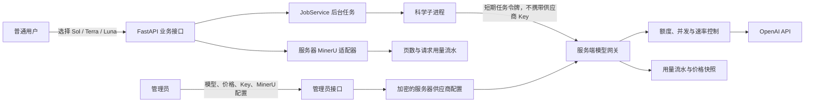

# 服务器统一模型网关、MinerU 与用量计费改造计划

> 文档状态：阶段 A–E 已实现；阶段 F 的代码与计量已实现，待配置 MinerU 服务器令牌后完成真实解析验证；阶段 G 的余额账本、冻结结算、管理员额度调整与用户界面已实现，日/月限额和阶段 H 压力测试仍待完成
> 编写日期：2026-08-18
> 适用分支：`dy-launch`
> 实施原则：保持现有前端视觉样式、九阶段工作流和人工审核节点不变，仅调整模型配置、调用入口、并发控制与用量计费基础设施。

## 当前实施状态（2026-08-20）

当前已完成统一模型网关、其余生产模型调用迁移和只记录用量闭环：

- 已完成服务器环境变量统一管理文本、图像和 MinerU 凭据；运行时不再读取用户级供应商凭据。
- 已完成 Sol、Terra、Luna 固定目录、项目默认模型档位和现有项目 Terra 数据迁移。
- 已完成 FastAPI 内部文本模型网关、任务绑定短期令牌、模型白名单、全局/用户并发限制、供应商重试、幂等请求和价格快照。
- 已完成第六阶段评估与重写迁移；子进程只接收任务令牌和内部网关地址，原跨进程供应商文件锁已移除。
- 已完成 Topic 查询计划、参考综述结构分析、Section Draft、Final Conclusion、图像重绘和最终概览图迁移。生产科学子进程不再接收文本或图像供应商 Key；独立 CLI 中保留的直连兼容分支在生产任务环境中没有凭据，不能绕过内部网关。
- 文本和图像使用不同的并发信号量，避免耗时图像生成长期占用评估与重写的文本请求槽。
- 任务令牌增加文本/图像能力范围；文本任务令牌不能调用图像端点，图像任务令牌也不能调用文本端点。
- 已完成 Token、图像生成次数、MinerU 页数与成本汇总，并接入余额正式结算。
- 图像结果保存在服务器网关缓存文件中，数据库只保存幂等状态、供应商请求标识和计量数据，避免在数据库长期保存大体积 Base64 图片。
- 已完成 MinerU 单用户文件哈希去重、并发解析限制、成功/失败/待对账状态、页数和缓存命中计量；重复文件不重复调用或计费。
- 普通用户设置页已改为服务器配置状态，只读且不再提交 API Key。
- 历史 `provider_credentials` 表和数据暂时保留但生产运行时不读取；由于当前部署尚未配置 MinerU 服务器令牌，等真实 MinerU 验证完成后再执行可审计清理。
- 已完成用户余额账户、逐次外部调用冻结、实际成本结算、失败释放、不可变资金流水、管理员人工增减额度、用户状态/角色管理和全站用量后台。在线充值与第三方支付不在本阶段范围内。

本次部署状态：

- PostgreSQL schema 已升级到 `20260820_0014`，已创建余额账户、调用冻结和不可变资金流水表。
- FastAPI 在容器内监听 `0.0.0.0:8770`，局域网通过 `http://192.168.0.5:5175/` 访问。
- 因 Docker Desktop 旧端口代理占用 `192.168.0.5:8770`，科学子进程的内部网关固定使用 `http://127.0.0.1:8770/api/internal/v1/model-responses`，避免误入旧服务；这不改变用户访问地址。
- 后端完整测试 412 个通过、16 个按环境跳过；前端 77 个测试通过，生产构建通过。
- 当前服务器未配置 MinerU Token，因此 MinerU 真实 PDF 解析与供应商页数对账尚未执行；文本与图像 Key 配置状态正常，但本次验证未主动发起会产生供应商费用的真实模型请求。

管理员后台现已覆盖服务器 Provider、用户状态、用户角色、额度调整和全站用量；普通用户设置页显示可用余额、任务冻结额和资金流水。

## 1. 背景

当前项目已经具备多用户账号、PostgreSQL 工作流状态、用户隔离目录、后台任务、文本/图像/MinerU 供应商配置和科学子进程执行能力，但模型调用方式仍以“用户分别配置供应商”为主，部分科学脚本会直接访问模型供应商。

当前与本次改造相关的事实如下：

- 文本、图像和 MinerU 凭据目前按用户存储在 `provider_credentials` 中。
- 凭据在数据库中加密保存，并通过 `secret_env` 传给科学子进程。
- 评估与重写脚本会直接调用文本模型供应商。
- 评估批次在单个任务内顺序执行，段落重写也按段落顺序执行。
- 反馈循环目前使用跨子进程文件锁串行化供应商请求，以降低并发饱和和 HTTP 503 风险。
- 后台任务默认全服务器同时运行 2 个，可由 `REVIEW_WRITER_JOB_WORKERS` 调整。
- 当前没有完整、统一、不可变的 Token 用量流水和用户计费账本。

本次改造希望把模型与 MinerU 统一为服务器资源，由管理员维护，普通用户只选择允许使用的模型档位，并能按照实际用量计算成本、额度和用户价格。

## 2. 改造目标

### 2.1 必须实现

1. 普通用户只能从管理员启用的模型中选择，不再输入 API Key、Base URL 或任意模型 ID。
2. 数据库不再保存用户级 OpenAI、文本模型、图像模型或 MinerU 供应商凭据；现有用户级 `provider_credentials` 在迁移完成后停用并安全清理。
3. 第一版提供三个固定文本模型档位：
   - 高质量：`gpt-5.6-sol`
   - 均衡：`gpt-5.6-terra`
   - 经济：`gpt-5.6-luna`
4. OpenAI 和 MinerU 凭据只存在于服务器端，不出现在浏览器响应、前端状态、任务普通日志或项目产物中。
5. 所有 LLM 调用统一经过服务端模型网关，由网关完成：
   - 模型白名单校验；
   - 服务器凭据注入；
   - 用户、项目、任务身份绑定；
   - 并发和速率限制；
   - 超时与瞬时错误重试；
   - 实际 Token 用量记录；
   - 成本和用户应付金额结算。
6. MinerU 使用服务器统一配置，并记录请求次数、页数、处理状态和可计费数量。
7. 管理员能够更新模型启停状态、供应商配置、价格、用户倍率和 MinerU 配置。
8. 价格变化只影响新调用，历史账单保留调用发生时的价格快照。
9. 保持当前九阶段工作流、Draft 历史、人工确认和项目文件格式兼容。

### 2.2 暂不包含

- 本阶段不接入第三方支付渠道。
- 本阶段不实现发票、税率和财务结算。
- 本阶段不把后台任务改造成多节点 Celery/Prefect 集群。
- 本阶段不并行修改同一份 Draft；重写候选的并行生成可作为后续优化。
- 本阶段不改变论文检索和 RAG 架构。

## 3. 总体架构



### 3.1 部署形态

第一阶段把模型网关作为现有 FastAPI 应用中的内部模块和受保护内部路由，不新增独立服务，降低部署复杂度。科学子进程通过环回地址访问内部网关。

后续需要多 API 副本或更高并发时，再把网关拆成独立服务，并使用 Redis/消息队列进行分布式限流。

## 4. 用户和管理员体验

### 4.1 普通用户

普通用户只能看到：

- 模型显示名称；
- 模型用途说明；
- 预计速度和价格级别；
- 当前余额、项目累计用量和本次任务预估范围；
- 管理员是否启用该模型。

普通用户不能看到：

- API Key；
- 供应商 Base URL；
- 服务器加密密钥；
- 管理员采购成本和内部倍率规则；
- 其他用户的用量。

模型选择建议保存为项目默认配置。每个后台任务启动时，将当时选择的模型档位和实际模型 ID 快照写入任务载荷，任务运行中管理员修改模型映射不能改变已启动任务。

### 4.2 管理员

管理员页面至少提供：

1. 文本供应商配置：Base URL、API Key、Wire API、连接测试和启用状态。
2. MinerU 配置：服务地址、API Key、超时、并发上限、单页或单次成本。
3. 模型目录：显示名、真实模型 ID、档位、启停状态和默认 reasoning effort。
4. 价格版本：输入、缓存输入、输出、工具调用和特殊计价规则。
5. 用户计费规则：成本倍率、服务费、免费额度、日/月上限。
6. 用量查询：按用户、项目、任务、阶段、模型和时间范围统计。
7. 配置审计：记录修改人、修改时间和修改前后版本，不记录明文密钥。

API Key 更新接口必须是只写接口。读取接口只返回 `configured=true` 和脱敏提示，不返回明文。

### 4.3 用户级凭据存储决策

采用服务器统一模型与 MinerU 后，数据库不再按用户保存以下信息：

- OpenAI、文本模型、图像模型和 MinerU API Key；
- 用户自定义供应商 Base URL；
- 用户自定义 Wire API；
- 用户提交的任意真实模型 ID；
- 用户级供应商启用状态。

数据库仍然保存与用户有关但不属于供应商凭据的信息：

- 项目默认模型档位；
- 每次调用的 Token 和费用流水；
- 用户余额、额度、冻结金额；
- 项目、任务和阶段关联；
- 用户操作和管理员调整审计。

服务器供应商 Key 采用以下两种模式之一：

1. **推荐模式：外部 Secret。** Key 存在 Docker Secret、云密钥管理服务或服务器环境变量中，数据库只保存 `configured`、`secret_hint`、`secret_ref` 和配置版本。该模式安全边界最清晰，但更新后可能需要重新加载配置或重启服务。
2. **在线更新模式：全局加密 Secret。** 如果必须通过管理员后台立即更新，则只在服务器级 `system_provider_configs` 中保存一份加密 Key，使用现有 `CredentialCipher` 加密。记录没有业务 `user_id` 所有者，只记录执行修改的管理员 `updated_by_user_id`。

无论采用哪一种模式，普通用户接口都不能创建、读取、修改或删除供应商凭据。用户登录 Session、账号认证令牌不属于模型供应商凭据，仍按现有认证机制保存。

## 5. 模型网关设计

### 5.1 请求契约

科学子进程不再接收 `OPENAI_API_KEY`，只接收短期任务令牌和内部网关地址。例如：

```json
{
  "job_id": "...",
  "user_id": "...",
  "project_id": "...",
  "stage": "draft.feedback.rewrite",
  "model_tier": "terra",
  "request_key": "job-id:paragraph-id:attempt-1",
  "payload": {
    "input": "...",
    "reasoning": {"effort": "medium"}
  }
}
```

网关必须根据任务数据库记录重新确认 `user_id`、`project_id` 和允许的模型，不信任子进程自行提交的身份和真实模型 ID。

### 5.2 幂等与重试

- `request_key` 在一个任务中必须唯一。
- 相同 `request_key` 和相同请求摘要重复提交时，返回已有结果或已有结算状态。
- 相同 `request_key` 携带不同请求内容时，返回冲突错误。
- 429、502、503、504 和网络超时由网关统一执行有限次数的指数退避重试。
- 业务脚本不再执行多层 HTTP 重试，只保留一次业务级恢复或延后处理。
- 每次真正到达供应商的尝试都必须单独记录，避免重试导致漏记或重复计费。

### 5.3 凭据与安全

- 优先使用 Docker Secret、云密钥管理服务或服务器环境变量。
- 如果需要管理员在线更新，则复用当前 `CredentialCipher`，将全局供应商凭据加密存入 PostgreSQL。
- 内部网关使用短期签名任务令牌，令牌只允许指定任务、阶段和模型档位。
- 供应商密钥不得写入命令行参数、任务载荷、标准输出、异常正文或 Artifact。
- 继续使用 `ScientificRunner` 的秘密环境分离与日志脱敏机制。
- 对模型输入、输出和错误日志设置保存策略；计费流水默认不保存完整 Prompt 和完整模型输出，只保存摘要、哈希和必要诊断字段。

### 5.4 科学子进程接入网关的稳定性设计

科学子进程不再接收供应商 API Key 后，会增加一次本机内部 HTTP 转发。相对于数十秒到数分钟的模型调用，该转发耗时可以忽略；稳定性主要取决于令牌寿命、异步实现、幂等、重试归属和用量持久化。

#### 5.4.1 任务令牌寿命

“短期令牌”指受任务范围约束的令牌，不等于固定几分钟过期。当前科学任务包含约 15 分钟的普通 LLM 任务、约 20 分钟的图像任务、最长约 35 分钟的 MinerU 解析，以及最长约 300 秒的单次供应商请求。

令牌有效期应按任务截止时间动态生成：

```text
令牌过期时间 = 任务最大执行截止时间 + 重试和结算缓冲时间
```

第一版建议使用 45～60 分钟，并满足：

- 只能用于指定 `job_id`、用户、项目、阶段和模型档位；
- 任务取消后拒绝发起新的模型请求；
- 令牌到期不强制中断已经建立的供应商响应，只阻止新的请求；
- 任务需要延长时由 JobService 续发受同一任务约束的新令牌，不允许子进程自行延长；
- 数据库中的任务状态不是 `running` 时，网关拒绝新调用。

#### 5.4.2 异步与连接管理

第一阶段网关位于同一个 FastAPI/Uvicorn 实例中，必须使用异步路由、异步供应商客户端和连接池。禁止在事件循环中使用阻塞式 `urllib` 或同步 SDK 等待长响应。

数据库事务只用于快速完成额度预留、幂等状态和用量流水写入，不能覆盖整个供应商网络请求周期。推荐执行顺序为：

```text
快速验证任务和额度
→ 创建幂等请求记录
→ 结束数据库事务
→ 异步调用供应商
→ 快速持久化结果与 usage
→ 返回子进程
```

数据库连接池、内部 HTTP 连接池和 Uvicorn 连接上限必须高于配置的模型网关在途请求数，并保留普通用户接口所需容量。

#### 5.4.3 内部访问路径

科学子进程只访问环回地址或受保护的容器内部地址，例如：

```text
http://127.0.0.1:8770/internal/v1/model-responses
```

内部调用不得经过公网域名、Cloudflare、外部 Nginx 入口或用户浏览器可访问的公开 Origin。子进程环境应设置：

```text
NO_PROXY=127.0.0.1,localhost
```

容器部署时将实际内部服务名加入 `NO_PROXY`，避免系统代理把内部模型请求转发到外部网络。

#### 5.4.4 幂等结果与断线恢复

每次业务调用都必须带稳定的 `request_key`：

```text
request_key = job_id + stage + target_id + logical_attempt
```

网关处理规则：

- 相同请求正在执行：返回进行中状态或等待原请求，不再次调用供应商；
- 相同请求已经完成：返回已持久化结果和用量；
- 相同键但请求摘要不同：返回冲突错误；
- 供应商尝试失败且满足重试条件：在同一业务请求下新增 `attempt_number`；
- 网关已收到供应商结果但子进程连接中断：子进程重试时返回原结果，禁止重复调用和重复计费。

网关必须在调用供应商前创建幂等记录。供应商请求 ID、最终结果摘要和 Token 用量要与该记录关联。

#### 5.4.5 单层重试

429、502、503、504、连接重置和供应商超时统一由模型网关处理。接入网关后，科学脚本移除现有多次 HTTP 重试，只保留业务级恢复，例如把失败段落标记为待重试或把过大的评估批次拆小。

禁止形成：

```text
科学脚本多次重试 × 网关多次重试
```

网关默认最多执行 3 次供应商网络尝试，每次尝试分别记录，但用户费用只能根据供应商实际返回或可对账的用量结算。

#### 5.4.6 用量持久化失败

模型调用成功后，应在返回子进程前持久化供应商请求 ID、幂等键、Token、模型、价格版本和结算状态。如果供应商已经完成调用但 PostgreSQL 暂时不可用，则写入权限受限的本地待对账日志或持久化消息队列，并将请求标记为 `reconciliation_required`。

待对账记录必须具备防篡改校验、唯一请求标识和重放幂等性；恢复后补写数据库流水。不能因为用量数据库暂时不可用而静默按零费用处理，也不能为了记账失败再次调用模型。

#### 5.4.7 与当前单实例任务系统的关系

当前 JobService 和科学子进程本身运行在单个 API 实例内，API 进程停止时，运行中的任务会进入中断恢复流程。因此第一阶段把网关部署在同一 FastAPI 实例中，不会引入新的跨节点一致性问题，但网关会成为该实例内所有模型调用的关键依赖。

当未来需要多个 API 副本时，必须先把 JobService 和网关限流状态迁移为跨实例共享机制，再进行水平扩容，不能简单增加 Uvicorn Worker 或 API 容器数量。

#### 5.4.8 第一版推荐运行参数

```text
网关部署：同一个 FastAPI 实例的受保护内部路由
模型网关全局在途请求：2
单用户在途请求：1
内部等待队列上限：20
任务令牌有效期：按任务截止时间生成，默认 60 分钟
单次供应商请求超时：300 秒
网关供应商网络尝试：最多 3 次
科学脚本供应商 HTTP 重试：关闭
幂等请求和 usage：必须持久化
```

上述参数在完成 2、4、8 用户压力测试后再调整，不能仅通过增大并发数提升表面吞吐。

## 6. 评估和重写并发方案

### 6.1 当前行为

- 一个评估任务内部按批次顺序执行。
- 一个重写任务内部按段落顺序生成、验证并应用候选。
- 不同任务的反馈模型请求通过全局文件锁串行执行。

### 6.2 第一阶段目标

移除反馈脚本中的全局供应商文件锁，把并发控制移到网关，但暂时保持单个评估/重写任务内部的顺序不变。

推荐初始配置：

```text
JobService 全局任务并发：2
模型网关全局在途请求：2
单用户在途请求：1
单项目同类任务：1
MinerU 同时解析任务：2
```

稳定运行并完成压力测试后可以调整为：

```text
JobService 全局任务并发：4
模型网关全局在途请求：4
单用户在途请求：2
单项目同类任务：1
```

### 6.3 限流算法

网关同时执行：

- 全局并发信号量；
- 单用户并发信号量；
- 按模型的 RPM/TPM Token Bucket；
- 用户日/月额度检查；
- 公平排队，避免单个用户长期占满全部请求槽位。

数据库写入不得覆盖整个模型网络请求周期。调用前只做快速额度预留，调用后快速写不可变流水，报表聚合异步完成。

### 6.4 后续并行优化

评估批次相互独立，后续可并行评分后确定性合并。重写不应直接并行修改 Draft，可采用：

```text
并行生成各段候选
        ↓
并行进行引用和格式校验
        ↓
按Draft版本串行应用通过的候选
```

该优化必须保留 Draft revision 冲突检测和段落历史，不能让后完成的任务覆盖先完成的人工修改。

## 7. Token 与费用计算

### 7.1 计费数据来源

最终结算必须使用供应商响应返回的实际 `usage`，本地 Token 估算只用于任务启动前的额度预留和价格提示。

至少记录：

- `input_tokens`
- `cached_input_tokens`
- `output_tokens`
- `reasoning_tokens`
- `total_tokens`
- 供应商请求 ID
- 模型 ID 和模型档位
- 是否使用工具及工具调用次数

Reasoning Token 作为输出 Token 的明细保存时，不能再次重复加入总费用。

### 7.2 成本公式

```text
未缓存输入 Token = input_tokens - cached_input_tokens

供应商成本 =
  未缓存输入 Token / 1,000,000 × 输入单价
  + 缓存输入 Token / 1,000,000 × 缓存输入单价
  + output_tokens / 1,000,000 × 输出单价
  + 工具调用费用
  + 其他供应商特殊费用
```

金额计算使用 PostgreSQL `NUMERIC`/Python `Decimal`，禁止使用浮点数。数据库建议同时保存美元微单位整数，避免累积误差。

### 7.3 当前官方价格仅作为初始参考

以下为编写文档时的 OpenAI 官方页面参考价格，单位为美元/百万 Token，最终必须由管理员价格版本表维护：

| 模型 | 输入 | 缓存输入 | 输出 |
|---|---:|---:|---:|
| `gpt-5.6-sol` | 5.00 | 0.50 | 30.00 |
| `gpt-5.6-terra` | 2.00 | 0.20 | 12.00 |
| `gpt-5.6-luna` | 0.20 | 0.02 | 1.20 |

官方参考：

- <https://developers.openai.com/api/docs/models/gpt-5.6-sol>
- <https://developers.openai.com/api/docs/models/gpt-5.6-terra>
- <https://developers.openai.com/api/docs/models/gpt-5.6-luna>

还必须支持长上下文倍率、缓存写入、工具调用等特殊计价规则，不能只用简单输入/输出公式永久硬编码。

### 7.4 用户售价

供应商成本和用户售价必须分开保存：

```text
用户应付金额 = 供应商成本 × 成本倍率 + 固定服务费 + 特殊任务费用
```

如果以人民币展示，还需要保存调用发生时采用的汇率版本。历史账单不能因汇率或价格更新而重新计算。

### 7.5 额度预留与结算

1. 任务提交前根据输入长度、模型和最大输出估算金额。
2. 从用户可用额度中冻结预估金额。
3. 每次模型调用结束后按实际 `usage` 结算。
4. 任务结束后释放未使用冻结金额。
5. 任务失败时仍结算已经实际发生并返回用量的调用。
6. 网关崩溃或供应商响应不完整时标记为 `reconciliation_required`，不得静默按零费用处理。

## 8. MinerU 用量设计

MinerU 不使用文本 Token 公式，单独按供应商合同配置计费单位：

- 按页；
- 按文件；
- 按请求；
- 或固定月度成本下的内部额度。

每次解析至少记录：

- 用户、项目和任务；
- 文件哈希和页数；
- 供应商请求 ID；
- 成功、失败、重复文件或缓存命中状态；
- 实际计费页数；
- 当时的单价版本和金额。

相同文件哈希命中现有 Library 时不应再次调用 MinerU，也不应重复收费。供应商已处理但本地发布失败的情况需要进入对账状态。

## 9. 数据库变更建议

### 9.1 `system_provider_configs`

保存服务器全局供应商配置：

- `provider_kind`
- `base_url`
- `wire_api`
- `secret_storage_mode`：`external` 或 `database_encrypted`
- `secret_ref`：外部 Secret 引用，可为空
- `encrypted_secret`：仅在线更新模式使用，可为空
- `secret_hint`
- `enabled`
- `config_version`
- `updated_by_user_id`
- `created_at`、`updated_at`

只有管理员可以修改。

### 9.2 `ai_model_catalog`

- `tier_key`：`sol`、`terra`、`luna`
- `display_name_zh`、`display_name_en`
- `provider_model_id`
- `default_reasoning_effort`
- `enabled`
- `sort_order`
- `config_version`
- `effective_from`

### 9.3 `ai_price_versions`

- `model_catalog_id`
- `currency`
- `input_per_million`
- `cached_input_per_million`
- `output_per_million`
- `tool_prices_json`
- `special_rules_json`
- `effective_from`、`effective_to`
- `created_by_user_id`

价格版本只追加，不原地覆盖已经生效的历史记录。

### 9.4 `ai_usage_events`

不可变调用流水：

- `id`
- `request_key`
- `attempt_number`
- `provider_request_id`
- `user_id`、`project_id`、`job_id`
- `stage`
- `model_tier`、`provider_model_id`
- Token 明细
- `price_version_id`
- `provider_cost`
- `billable_amount`
- `status`
- `request_sha256`
- 时间字段

对 `(job_id, request_key, attempt_number)` 建唯一约束，防止重复记账。

### 9.5 `user_credit_accounts` 与 `credit_transactions`

分别保存用户余额汇总和不可变资金流水。余额变化必须在数据库事务中完成，并使用行锁防止并发超扣。

### 9.6 `mineru_usage_events`

保存 MinerU 文件、页数、供应商请求和费用流水，与 LLM Token 账本分开。

### 9.7 现有 `provider_credentials` 迁移

现有 `provider_credentials` 是按用户保存的供应商配置。迁移完成后的目标状态是：

- 普通用户不能再创建或修改该表记录；
- 生产任务不再读取该表；
- 服务器统一配置验证通过后，安全删除其中的用户级加密供应商 Key；
- 如需保留迁移审计，只保留不含密钥、Base URL 和可恢复密文的迁移结果；
- 表结构可在一个兼容发布周期后删除，不能在仍有运行中任务依赖时直接删除。

禁止把历史加密 Key 解密后导出为迁移备份。需要回滚时使用管理员重新配置的服务器 Secret，而不是恢复用户级 Key。

## 10. API 调整

### 10.1 普通用户接口

建议增加：

```text
GET  /api/v1/ai/models
PUT  /api/v1/projects/{project_id}/model-preference
GET  /api/v1/usage/summary
GET  /api/v1/usage/events
GET  /api/v1/balance
```

现有任务提交接口只接受 `model_tier`，不得接受任意 `base_url`、`api_key` 或 `provider_model_id`。

### 10.2 管理员接口

```text
GET/PUT  /api/v1/admin/providers/text
GET/PUT  /api/v1/admin/providers/mineru
GET/POST /api/v1/admin/models
GET/POST /api/v1/admin/prices
GET      /api/v1/admin/usage
POST     /api/v1/admin/credits/adjustments
```

管理员更新需要权限校验、CSRF 防护、审计日志和幂等键。

### 10.3 内部网关接口

```text
POST /internal/v1/model-responses
```

该接口不使用普通用户 Cookie，只接受短期任务令牌。生产环境应限制为环回地址或内部网络访问。

## 11. 前端调整

保持现有页面布局、颜色和九阶段导航，只做以下功能调整：

1. 将普通用户“API 设置”页面改成只读的服务可用状态和模型选择。
2. 在项目设置或任务启动区域增加三种模型卡片。
3. 默认选择 Terra；管理员可修改默认值。
4. 显示任务预估额度、实际 Token 和实际扣费。
5. 任务进度栏增加 `排队中 / 额度检查 / 模型调用 / 结算中` 状态。
6. 新增管理员模型、MinerU、价格和用量页面，普通用户路由不可见且后端必须拒绝访问。

前端显示名称与真实模型 ID 分离，以便以后替换供应商模型而不破坏用户选择和历史记录。

## 12. 后端修改位置

第一轮预计涉及：

- `review_writer_api/credentials.py`：增加服务器全局配置服务，保留现有加密能力。
- `review_writer_api/workflow_models.py`：增加模型目录、价格、用量、余额和 MinerU 流水模型。
- `migrations/`：新增 PostgreSQL 迁移和索引。
- `review_writer_api/native_handlers.py`：不再向子进程传供应商 API Key，改传内部网关地址和任务令牌。
- `review_writer_api/scientific_runner.py`：令牌脱敏、内部网关环境和调用状态上报。
- `review_writer_api/job_service.py`：额度预留、任务结束结算和排队状态。
- `skills/**/scripts/*.py`：逐步把所有直接模型 HTTP 调用迁移到统一网关客户端。
- `skills/review-first-draft-feedback-loop/scripts/feedback_loop.py`：移除供应商全局文件锁和脚本级多层 HTTP 重试。
- `frontend/src/features/settings/SettingsPage.tsx`：普通用户设置页调整。
- 新增管理员前端模块和用量页面。

## 13. 分阶段实施计划

### 阶段 A：调用清单与基线

- 枚举所有文本、图像和 MinerU 调用点。
- 记录当前评估、重写、初稿、图片和解析任务的耗时、并发、失败率和供应商错误。
- 建立包含多用户、重试和任务取消的测试基线。

完成标准：所有供应商调用点都有文件、函数、任务类型和当前重试策略记录。

### 阶段 B：全局配置与模型目录

- 新增全局供应商配置、模型目录和价格版本表。
- 增加管理员权限和配置接口。
- 普通用户设置页停止接收 API Key。
- 普通用户供应商配置接口改为只读停用状态，禁止新增用户级凭据。
- 项目保存模型档位，现有项目默认迁移为 Terra。

完成标准：用户不能提交任意供应商参数，管理员可以安全更新服务器配置。

### 阶段 C：模型网关与只记录模式

- 实现内部网关、任务令牌、模型白名单和用量解析。
- 保留现有调用结果，同时以 `shadow_metering` 模式记录用量，不实际扣费。
- 比较本地流水与供应商 Usage 页面，验证误差和遗漏。

完成标准：所有测试调用均能关联到用户、项目、任务和阶段；没有 API Key 泄漏。

### 阶段 D：迁移评估与重写

- 先迁移 `review-first-draft-feedback-loop`。
- 网关接管重试与并发；移除全局文件锁。
- 保持单任务内部评估和重写顺序不变。
- 验证两个用户同时评估/重写不会相互覆盖，也不会重复记账。

完成标准：评估和重写结果与改造前兼容，多用户受控并发达到配置值。

### 阶段 E：迁移其余 LLM 与图像调用

- 迁移 Topic 查询计划、Planning、Section Draft、Final Draft、Audit 和图像相关模型调用。
- 对文本 Token、图像生成、工具调用分别记录计价单位。
- 删除子进程中的供应商 API Key 依赖。
- 确认所有生产调用不再读取用户级 `provider_credentials` 后，安全清理其中的用户供应商密文。

完成标准：代码库中不存在绕过网关的生产模型调用。

实施结果：生产任务已全部通过文本或图像内部网关；参考综述分析使用内部隐藏任务记录关联用户、项目、任务和用量。Final Audit/导出本身为确定性处理，不向子进程传任何模型凭据。独立维护脚本中的直连代码只作为离线 CLI 兼容路径保留，不属于 Web 生产调用入口。

### 阶段 F：MinerU 全局配置与用量

- 普通用户不再配置 MinerU Key。
- 实现按文件哈希去重、页数计量和管理员价格版本。
- 与 Library 入库事务和失败恢复对接。

完成标准：重复文件不重复解析或扣费，失败和已处理未发布状态可对账。

实施结果：数据库流水、文件哈希去重、页数/缓存命中/费用只记录、失败与 `reconciliation_required` 状态已经实现并通过测试。当前部署缺少服务器 MinerU Token，真实供应商请求、实际页数和供应商账单对账仍待配置令牌后验证，因此尚不清理历史凭据表。

### 阶段 G：额度与正式结算

- [x] 启用余额、逐次外部调用冻结、实际结算和失败释放流程。
- [x] 增加管理员人工增减额度、幂等调整和不可变资金流水。
- [x] 在外部请求发起前阻止余额不足的调用；缓存命中不重复扣费。
- [x] 增加用户余额/流水页面，以及管理员用户/全站用量页面。
- [ ] 增加可配置的日/月消费限额和主动低余额提醒。

完成标准：并发任务不能超扣，历史金额不随新价格变化。

### 阶段 H：压力测试与上线

- 进行 2、4、8 用户并发场景测试。
- 覆盖长响应、429、503、超时、取消、服务重启和数据库断连。
- 建立供应商费用与本地账本每日对账。
- 灰度开放真实扣费。

完成标准：达到既定吞吐、错误率、账单一致性和恢复要求后再全量上线。

## 14. 测试计划

### 14.1 单元测试

- 模型白名单与禁用模型。
- 价格版本选择。
- Decimal 金额计算。
- 缓存 Token 和 Reasoning Token 不重复计费。
- 幂等请求与重复响应。
- 额度冻结、结算和释放。
- MinerU 重复文件和页数计费。

### 14.2 集成测试

- 子进程只持有短期任务令牌。
- 网关正确关联用户、项目和任务。
- 供应商 429/503/超时的单层重试。
- 任务取消后停止新请求并结算已发生用量。
- 两个用户同时评估和重写。
- 管理员更新价格不改变运行中任务和历史账单。
- 任务执行超过普通短令牌窗口时能够按 JobService 规则续发令牌。
- 令牌到期或任务取消后不能发起新请求，但已经建立的供应商响应可以完成并结算。
- 网关收到供应商结果后模拟子进程断线，使用同一 `request_key` 重试不得再次调用供应商。
- PostgreSQL 在供应商完成后暂时不可用时生成待对账记录，恢复后只能补写一次流水。
- 内部网关请求不经过公开 Origin 和系统外部代理。

### 14.3 安全测试

- 普通用户不能访问管理员接口。
- 用户不能修改请求调用未启用模型。
- 用户不能伪造其他用户或项目的任务令牌。
- API Key 不出现在前端、日志、错误、任务结果和 Artifact。
- 内部网关不能从公网直接访问。

### 14.4 压力测试指标

- 网关队列等待时间；
- 模型首字节和总耗时；
- 各模型 RPM/TPM；
- 429/503/超时率；
- 每用户公平性；
- Token 流水与供应商账单差异；
- 数据库流水写入延迟。

## 15. 监控与告警

至少监控：

- 当前排队任务和在途模型请求；
- 按模型、用户和阶段的 Token；
- 供应商费用与用户应付金额；
- 429、5xx、超时、重试和对账异常；
- 配置变更和 Key 轮换；
- 余额不足、日/月额度和异常突增；
- MinerU 页数、失败率和重复文件节省量。

告警中不得包含完整 Prompt、论文正文或 API Key。

## 16. 迁移与回滚

### 16.1 迁移

- 新表先上线但不开启扣费。
- 旧的用户供应商设置保持只读一段时间，仅用于紧急回退。
- 通过功能开关按任务类型逐步切换到网关。
- 每个切换阶段都进行结果和用量对比。

### 16.2 回滚

- 网关故障时关闭对应任务入口，不自动把服务器 Key 重新下发给用户或子进程。
- 允许通过功能开关将尚未正式计费的任务临时切回旧调用路径。
- 一旦启用正式扣费，回滚不得删除用量流水；异常记录进入人工对账。
- 数据库迁移采用向前兼容方案，先停止写入再删除旧字段，不在首轮迁移中破坏旧数据。

## 17. 主要风险与处理

| 风险 | 处理方式 |
|---|---|
| 共享 Key 达到供应商并发或 TPM 上限 | 网关统一限流、公平排队、按模型分池并设置消费告警 |
| 网关成为单点瓶颈 | 异步转发、短事务记账、先单实例压测，后续可拆分服务 |
| 双层重试产生大量重复调用 | 重试统一归网关，业务脚本只保留业务恢复 |
| Token 漏记或重复记账 | 请求幂等键、唯一约束、供应商请求 ID 和每日对账 |
| 价格更新影响历史账单 | 不可变价格版本和调用时价格快照 |
| 管理员误配模型或 Key | 连接测试、分阶段生效、审计日志和回滚版本 |
| 一个用户占满并发 | 单用户并发上限与公平队列 |
| 论文内容或密钥进入日志 | 日志脱敏、最小化保存、密钥只写接口和安全测试 |
| 网关调用同一 FastAPI 造成阻塞 | 使用异步 HTTP 客户端，不在事件循环中执行阻塞供应商请求 |
| 任务令牌在长任务中途过期 | 按任务截止时间签发并保留缓冲，由 JobService 受控续发 |
| 供应商已完成但子进程断线导致重复调用 | 持久化 `request_key`、请求摘要和结果，重试返回原结果 |
| PostgreSQL 暂时不可用导致 usage 丢失 | 使用防篡改待对账日志或持久化队列，恢复后幂等补写 |
| 内部请求被系统代理转发到公网 | 使用环回/容器内部地址并配置 `NO_PROXY` |

## 18. 最终验收标准

以下条件全部满足后才视为改造完成：

1. 普通用户无法查看或提交任何供应商 Key、Base URL 和任意模型 ID。
2. 数据库中不存在生产任务仍会读取的用户级模型或 MinerU 供应商凭据。
3. 三种模型可以由管理员启停和更新价格，用户只能选择启用项。
4. 所有生产 LLM 调用均经过网关，没有脚本绕过路径。
5. 所有调用都能追溯到用户、项目、任务、阶段和价格版本。
6. Token、成本和用户金额使用不可变流水记录，并通过幂等测试。
7. 评估和重写支持配置范围内的多用户并发，不再依赖全局供应商文件锁。
8. 任务取消、失败、重试和服务重启不会造成静默漏费或重复收费。
9. MinerU 由服务器统一配置，重复文件不会重复解析或收费。
10. API Key 不出现在浏览器、日志、任务结果、Git 和项目 Artifact 中。
11. 现有九阶段页面样式、工作流状态、历史记录和最终输出保持兼容。
12. 科学子进程只持有任务令牌，不持有任何供应商 Key；长任务、断线重试和记账故障均通过稳定性测试。

## 19. 推荐实施顺序

建议优先顺序为：

```text
全局配置和模型目录
→ 内部模型网关
→ 只记录不扣费
→ 评估/重写迁移与并发控制
→ 其余模型调用迁移
→ MinerU 用量
→ 用户额度和正式结算
→ 压力测试与灰度上线
```

不建议一开始同时修改所有科学脚本和启用真实扣费。先让评估与重写成为第一个完整闭环，验证网关、并发、用量和历史兼容后，再逐阶段扩大范围。
