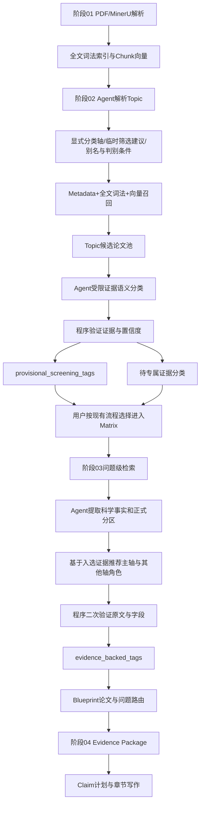

# Review Writer 阶段02–04 Agent语义分类与证据传递优化方案

> 文档状态：P0/P1核心功能已实施并完成自动化验证  
> 编写日期：2026-08-27  
> 适用范围：所有学科、所有Topic、所有新建与历史项目  
> 核心阶段：阶段02 Discovery、阶段03 Matrix与Blueprint、阶段04章节写作  
> 核心原则：Agent负责理解科学语义、推荐分类结构，程序负责检索范围、证据合法性、身份和发布一致性；不新增用户确认步骤，不把ATA、金属、化学反应或其他具体领域词写死在通用核心。

> 实施说明（2026-08-27）：阶段02分类契约与受限Agent筛选、阶段03正式事实Tag与差异化Matrix更新、Blueprint正式路由、阶段04 Claim—Evidence—Assertion Ceiling 约束以及对应前后端状态展示均已落地。混合检索补召回的词法/向量分区仍只作为候选提示，不会越过Agent证据分类形成正式Tag。

## 1. 文档定位

本文解决以下跨阶段问题：

1. 阶段02能够召回相关论文，但具体分组可能过宽、过严或只匹配表面词；
2. 题名、摘要中的背景介绍可能被误认为论文的主要贡献；
3. 同一科学对象存在缩写、全称、材料牌号、化合物形式或不同学术命名时容易漏分；
4. 阶段02的初步Project Tag可能过早进入Matrix并干扰Blueprint；
5. 阶段03虽然已经提取科学事实，但初步分组、正式分类和人工修改之间缺少清晰优先级；
6. 阶段04需要只消费正式证据分类，不能把阶段02的相关性提示直接当作Claim证据。

本文不是重新设计整个九阶段流程，也不替换现有PostgreSQL全文索引、pgvector、MinerU、FastAPI、科学任务Worker或模型网关。

### 1.1 与现有文档的关系

- 阶段02的候选召回继续遵循《Review Writer 第02阶段 Topic 混合语义检索功能优化方案》；
- 全项目身份、Claim、引用和终稿验证继续遵循《Review Writer 全项目证据链与终稿准确性优化方案》；
- 本文新增的重点是：在“论文已被召回”和“论文进入正式写作证据链”之间，建立可泛化的Agent语义分类层，并严格区分初步Tag与正式Tag。

## 2. 当前问题与根因

### 2.1 向量相关不等于具体分组成立

向量模型可以判断一篇论文与整个Topic相关，但不能单独证明它属于某个具体分区。例如一篇论文与“终端炔丙二烯化”高度相关，不代表它同时属于Cu、Zn、外消旋和对映选择性等全部分区。

当前已经采用以下正确边界：

```text
向量语义 → 召回Topic候选
专属证据 → 决定具体分组
```

后续仍需解决“专属证据如何理解”的问题。

### 2.2 完整短语匹配会漏掉科学同义表达

用户或Agent生成的分组标签可能是完整概念名，而论文使用的是缩写、具体试剂、材料型号或其他命名。通用系统不能预先枚举所有学科的别名。

因此需要由Agent根据当前Topic实时生成：

- 规范标签；
- 同义表达；
- 缩写和全称；
- 必须出现的判别词；
- 容易产生误判的共享词；
- 互斥分区之间的区别条件。

### 2.3 “原文提到”不等于“本文贡献”

题名和摘要经常同时包含：

- 领域背景；
- 对已有工作的评价；
- 本文实际报告的对象、方法和结果；
- 对未来工作的推测。

仅凭关键词出现位置无法可靠判断论文应归入哪个主要类别。系统需要明确区分：

```text
primary_contribution     本文主要贡献
secondary_contribution   本文次要但真实报告的贡献
comparison_context       用于比较的上下文
background_mention       背景或相关工作提及
uncertain                现有证据无法判断
```

只有前两类可以形成正式分类候选；背景提及不能让论文进入对应主要分组。

### 2.4 初步Tag与正式Tag职责混淆

阶段02的目标是筛选论文，不是完成正式科学阅读。阶段02生成的Tag应当是可解释的筛选提示，而阶段03基于全文事实和原文定位生成的Tag才可以参与Blueprint和写作。

## 3. 优化目标与非目标

### 3.1 优化目标

- 保持阶段02较高召回率，同时减少跨分组污染；
- 用Agent理解同义表达、论文主要贡献和互斥分类差异；
- 每个Agent分类都绑定当前论文的受限原文证据；
- 由确定性程序验证原文、证据键、论文身份和置信度；
- 阶段02分组只用于候选筛选和覆盖诊断；
- 阶段03生成正式、可定位的科学事实和`evidence_backed_tags`；
- Blueprint的章节组织尊重人工确认分类，Claim路由则只接受阶段03正式事实和问题级证据；
- 阶段04只使用问题级Evidence Package支持Claim；
- 不增加逐篇Tag确认、逐条事实确认或新的控制门；
- Agent或语义服务不可用时可以安全降级，不强行分类。

### 3.2 非目标

本轮不实施：

- 不新建向量数据库或知识图谱；
- 不让Agent自行扩大用户选择的论文范围；
- 不让Agent绕过`paper_id`、`evidence_key`和原文定位；
- 不把阶段02片段直接作为正文Claim证据；
- 不要求所有论文回答所有章节问题；
- 不要求每篇论文必须属于用户声明的每个分类轴；
- 不把某个化学反应、金属、疾病、材料或算法名称写死到通用核心；
- 不因一般性低置信度提示阻止用户继续使用项目。

已经确认的交互决策：

- Topic包含多个分类轴时，由Agent推荐一个主章节轴，其他轴作为二级组织、横向比较或筛选维度，并在现有Blueprint确认步骤中由用户统一确认；
- Topic没有明确分类方式时，Agent可以根据当前入选论文的证据提出推荐分类，但该分类必须标记为系统推荐，不能伪装成用户要求；
- 用户点击“更新科学事实”即代表授权生成并采用新的Matrix版本；系统只将真实受影响的依赖产物标记为`stale`，不增加第二次采用确认。

## 4. 总体目标流程



分类信息分成两套优先级，不能混为一个排序。

用于章节组织和用户界面分组时：

```text
human_confirmed_tags
  > evidence_backed_tags
  > provisional_screening_tags
  > 旧Library Metadata Tag
```

用于判断某个Claim是否允许写入正文时：

```text
问题级直接科学事实与Evidence Package
  > evidence_backed_tags所指向的事实
  > 其他信息不得单独授予Claim写作资格
```

因此，人工确认Tag可以决定文章如何组织以及论文优先显示在哪个章节，但不能替代正文Claim所需的原文证据；如果人工分类与正式证据暂时不一致，保留人工组织意图，同时将对应问题标记为待补证据，而不是依据人工Tag直接成文。

### 4.1 覆盖阶段边界

本方案直接改造三个业务阶段：

1. 阶段02：Topic解析、混合召回、Agent初步分类和论文筛选；
2. 阶段03：Matrix科学事实、正式分类和Blueprint路由；
3. 阶段04：Evidence Package、Claim计划和章节写作。

阶段01只提供MinerU正文、题录、全文Chunk和向量索引，不增加新的用户操作。阶段05至阶段09不重新设计流程，而是继续消费阶段04形成的稳定Claim、引用和证据身份；评估重写、图像、初稿与终稿可以因此继承更准确的上游输入。

## 5. 阶段02：Topic检索、Agent初步分类与候选选择

### 5.1 Agent生成查询与分类契约

当前查询计划在`keywords`和`group_by`之外增加可泛化结构：

```json
{
  "classification_axes": [
    {
      "axis_id": "axis_01",
      "label": "用户要求的分类维度",
      "source_surface": "Topic中的原始表达",
      "source_type": "explicit_topic|agent_recommended",
      "axis_role": "primary_organization|required_independent_discussion|comparison_dimension|scope_filter",
      "role_status": "explicit|provisional|evidence_confirmed",
      "mutual_exclusivity": "exclusive|non_exclusive|partially_overlapping",
      "heading_requirement": "primary_heading|secondary_heading|comparison_only|no_heading",
      "recommendation_rationale": "为什么采用这一组织角色",
      "partitions": [
        {
          "partition_id": "partition_01",
          "label": "规范分区名称",
          "aliases": ["同义词", "缩写", "常见写法"],
          "positive_discriminators": ["能支持该分区的表达"],
          "negative_or_ambiguous_signals": ["不能单独完成分类的共享词"],
          "reason": "为什么Topic要求单独讨论该分区"
        }
      ]
    }
  ]
}
```

要求：

1. Topic已经明确给出分类方式时，相关分类轴和分区必须来自用户Topic或用户补充关键词，标记为`explicit_topic`；
2. Topic没有明确分类方式时，阶段02只生成用于召回和筛选的临时分类建议；用户选入Matrix并完成事实提取后，再由Agent结合正式证据提出`agent_recommended`章节分类，不能把推荐分类表述为用户要求；
3. Agent可以规范化表达，但不能新增与Topic和当前证据均无关的章节分类；
4. 同义词由当前模型实时生成，不写入通用代码常量；
5. 用户明确要求的对象类型、方法类型或独立讨论分区必须可追溯到`source_surface`；
6. 多个分类轴同时存在时，Agent必须明确一个`primary_organization`主章节轴，并把其他轴标为独立讨论、比较维度或范围过滤条件；
7. `scope_filter`只决定纳入边界，不自动生成章节；`comparison_dimension`优先进入统一比较表或跨章节综合，不机械复制为一级章节；
8. Agent推荐的大纲结构在现有Blueprint确认步骤中统一确认，不增加新的确认页面；
9. 查询计划失败时使用确定性回退，但回退结果只生成候选，不强制形成精细分类。

阶段02由Topic直接确定的角色标为`explicit`，缺少入选证据时的系统建议标为`provisional`；只有阶段03结合正式事实复核后的组织角色才能标为`evidence_confirmed`。

这里采用两步契约，避免“先假设分类，再只检索符合该分类的论文”形成循环偏差：

```text
阶段02 Topic契约
  = 用户明确轴 + 宽召回查询 + 临时筛选建议

阶段03 Blueprint契约
  = 用户明确轴 + 入选论文正式事实 + Agent推荐组织轴
```

用户明确提出的分类轴在两个契约中都必须保留；Agent推荐轴只能补充未明确的组织方式，不能覆盖用户明确要求。

### 5.2 候选召回保持混合检索

召回继续使用：

- Library Metadata与已核验基础字段；
- PostgreSQL全文词法检索；
- pgvector Chunk语义召回；
- 当前taxonomy profile的领域别名；
- 用户手动开启时的联网补检。

向量结果只回答：

> 这篇论文是否可能属于当前Topic？

向量结果不能单独回答：

> 这篇论文属于哪个具体分区？

### 5.3 Agent进行一次“论文级多标签初步分类”

对召回的每篇本地论文，系统准备受限输入：

- 题名；
- 摘要；
- 作者关键词；
- 首页和结论/结果中的少量高相关Chunk；
- Agent生成的分类轴、别名和判别条件；
- 当前论文自己的证据键，不包含其他论文内容。

每篇论文建立一个逻辑Agent分类任务，一次返回所有分类轴，而不是按“论文×分区”重复调用。Provider临时错误仍按Worker策略重试；返回内容仅有Schema错误时允许最多一次结构修复，但不能因为不满意语义结论而反复调用模型。

建议输出：

```json
{
  "paper_id": "P001",
  "topic_relevance": {
    "status": "relevant|uncertain|out_of_scope",
    "confidence": 0.93,
    "evidence_refs": ["P001:C003"]
  },
  "assignments": [
    {
      "axis_id": "axis_01",
      "partition_id": "partition_02",
      "relation_to_paper": "primary_contribution",
      "confidence": 0.91,
      "support_excerpt": "原文连续引文",
      "evidence_key": "P001:C003",
      "rationale": "该段明确说明这是本文报告的对象，而非背景提及",
      "evidence_ceiling": "该段未证明的内容"
    }
  ],
  "unresolved_axes": [
    {
      "axis_id": "axis_02",
      "reason": "现有证据不能区分两个分区"
    }
  ]
}
```

### 5.4 程序验证初步分类

程序必须验证：

- `paper_id`属于当前用户和当前候选池；
- `axis_id/partition_id`来自已验证查询计划；
- `evidence_key`属于当前论文；
- `support_excerpt`能在对应Chunk中连续定位；
- 置信度是合法数值；
- `relation_to_paper`属于允许枚举；
- 背景提及不能生成正式分组；
- 语义相似但没有专属证据时进入“Topic相关、待专属证据分类”。

阶段02最终只生成：

```json
{
  "provisional_screening_tags": [],
  "classification_status": "evidence_backed_screening|pending_evidence",
  "stage_boundary": "paper_screening_only"
}
```

这些Tag不能直接支持正文Claim。

尚未下载和解析的联网候选没有本地`paper_id`和可验证全文证据，只能保留题名/摘要语义筛选结果，不能生成`provisional_screening_tags`中的证据分区。PDF入库、MinerU解析并建立本地身份后，才进入本节的论文级分类；完成阶段03事实提取后，才可能生成正式`evidence_backed_tags`。

### 5.5 阶段02界面

保留当前分组和论文选择界面，但调整术语：

- “检索分组”：用于覆盖检查和筛选；
- “初步证据分组”：显示已经通过阶段02受限证据验证的候选分组；
- “语义候选分区”：折叠显示，仅说明向量可能相关；
- “Topic相关、待专属证据分类”：保留论文，不强制分类；
- “进入Matrix”：仍由用户现有按钮决定。

不新增Tag确认按钮。

## 6. 阶段03 Matrix：正式科学事实与证据分类

### 6.1 只处理用户选入Matrix的论文

阶段03不读取阶段02未选论文，也不因为阶段02分组变化自动扩大Matrix。

正式提取输入包括：

- 当前论文全文索引；
- Topic、Scope和声明的独立分区；
- 当前学科的通用科学问题模板；
- 阶段02初步Tag，仅作为检索提示，不作为答案；
- 每个问题对应的词法与语义候选Chunk。

### 6.2 Agent提取科学事实

Agent继续生成：

- 研究对象与主要转化/研究设计；
- 方法或干预角色；
- 关键条件；
- 主要结果；
- 数值、指标和选择性；
- 范围和限制；
- 机理或解释证据；
- 安全、成本、可持续性等有明确原文支持的事实；
- Topic正式分区判断；
- Agent建议的`evidence_ceiling`。

每条事实必须绑定：

```text
必需：paper_id + fact_id + evidence_key + 原文连续引文
可用时补充：页码 + 章节 + 图表/方案编号
```

MinerU未能可靠恢复页码、章节或图表编号时，不得因此丢弃已经能通过`evidence_key + 原文连续引文`定位的事实；页面只需显示定位精度有限。

### 6.3 正式Topic分区

Agent只有在证据正面建立分区时才能分类：

- 不能用“没有报告A”推断“属于B”；
- 不能用一个指标替代另一个科学含义不同的指标；
- 不能把背景段落中的方法归给本文；
- 一篇论文可以在不同分类轴下拥有多个Tag；
- 同一互斥分类轴默认只设置一个主要路由；若论文确实独立研究多个分区，可以保留多个正式Tag，但每个Tag都必须有各自的事实与证据；
- 证据无法完成分区判断时使用`insufficient_evidence`；
- 原文明确定义或比较跨类别对象时才使用`cross_category`；
- 论文不满足Topic范围时使用`out_of_scope`；
- 以上状态都不能自动生成名为“Boundary cases”的正文章节。

### 6.4 程序二次验证

程序继续负责：

- 原文引文逐字定位；
- Evidence Key与论文身份检查；
- `field_id`是否属于该证据允许回答的问题；
- 数字、化学实体、样本量和指标的证据核验；
- 根据事实类型、证据来源等级、全文/摘要状态和定位结果计算程序侧`assertion_ceiling`；
- 置信度阈值；
- 摘要证据上限；
- 无效事实丢弃或降级；
- `complete/partial/limited/failed`和`needs_review`状态计算。

Agent给出的`evidence_ceiling`只作为解释性建议，不能自行授予更高写作资格。最终Claim允许写到什么程度，以程序计算的`assertion_ceiling`为准；无法完全确定性验证的规范化实体或跨句关系可以保留为降级事实和复核提示，但不应仅因程序无法解析就阻断整个Matrix。

### 6.5 生成正式Tag

阶段03输出：

```json
{
  "evidence_backed_tags": {
    "axis_01": [
      {
        "partition_id": "partition_02",
        "relation_to_paper": "primary_contribution",
        "fact_ids": ["F001"],
        "evidence_refs": ["P001:C003"],
        "confidence": 0.91
      }
    ]
  }
}
```

正式Tag覆盖阶段02同轴的初步Tag，但保留两者和差异记录，便于审计。对于Topic未明确分类方式的项目，Agent在这里根据入选论文的正式事实推荐主章节轴和其他轴角色；该推荐进入Blueprint候选结构，并在现有Blueprint确认步骤中由用户统一确认。

## 7. 阶段03 Blueprint：章节与论文路由

### 7.1 Blueprint输入优先级

Blueprint分别处理“章节组织”和“Claim证据路由”：

1. 章节组织优先尊重用户当前项目中明确确认的分类；
2. Claim证据路由优先读取章节问题与科学事实之间的直接证据匹配；
3. 阶段03`evidence_backed_tags`用于辅助正式路由，但不能替代对应事实；
4. 阶段02`provisional_screening_tags`只能作为找候选的提示；
5. 旧Metadata Tag仅作为最低优先级兼容信息；
6. 人工分类缺少问题级证据时，可以保留章节位置，但该论文不能因此获得直接Claim资格。

### 7.2 论文路由规则

- 每篇论文至少有一个主要科学对象或保留“未正式分类”状态；
- 不要求每篇主要论文回答本章所有问题；
- 论文只进入它有证据回答的问题包；
- 背景证据可以用于引言或比较上下文，但不能承担主要Claim；
- 多标签论文可以支持跨章节比较，但必须指定一个主要路由；
- Topic明确要求的分类轴必须在Blueprint中可追溯；
- 如果证据表明原大纲不适合，允许Agent重构Blueprint，但必须输出重构理由、受影响章节和证据覆盖变化；
- 不在后台静默改变用户已确认的章节结构。

### 7.3 未决与跨类别状态处理

`insufficient_evidence`、`cross_category`和`out_of_scope`是不同的内部状态，不能合并为一个含义不清的`boundary`。处理顺序：

1. `insufficient_evidence`：尝试使用其他有证据的分类轴路由；仍不能分类时保留为未决，不直接承担分区Claim；
2. `cross_category`：只有正面证据成立时，才可作为跨类别比较证据；
3. `out_of_scope`：不能作为当前Scope内的主要研究证据；如果用户明确保留且原文事实有效，可以降级进入历史背景或边界说明包，但必须标明范围例外，不能混入Scope内覆盖统计；
4. 若论文确实讨论跨类别科学问题，可由Agent提出有科学含义的标题；
5. 无法形成科学问题时不单独建章。

## 8. 阶段04：Evidence Package与章节写作

### 8.1 写作输入

章节写作只读取：

- 当前Blueprint章节问题；
- 阶段03科学事实；
- `evidence_backed_tags`；
- 问题级Evidence Package；
- 稳定`paper_id/fact_id/evidence_key`；
- 已验证图像信息。

阶段02初步Tag不能直接进入Claim计划。

### 8.2 Claim计划

每个Claim必须包含：

```json
{
  "claim_id": "C-S02-01",
  "question_id": "Q02",
  "paper_ids": ["P001"],
  "fact_ids": ["F001"],
  "evidence_keys": ["P001:C003"],
  "allowed_assertion": "证据允许写出的结论",
  "assertion_ceiling": "程序根据证据等级计算的写作上限",
  "ceiling_explanation": "Agent提供、供用户理解的边界说明"
}
```

写作Agent可以组织语言、比较和综合，但不能：

- 新增未在计划中的科学事实；
- 把背景提及写成论文贡献；
- 把低一级证据扩展成定量或机理结论；
- 用阶段02Tag代替正式证据；
- 为了满足“主论文必须引用”而写入证据不足的Claim。

证据不足时优先缩小陈述、改为背景语气或删除该Claim，不强制整篇论文退出综述。

## 9. Agent与确定性程序的职责边界

| 工作 | Agent | 程序 |
|---|---|---|
| 理解Topic分类要求 | 主责 | 校验输出结构和来源 |
| 生成同义词、缩写和判别词 | 主责 | 去重、长度和安全过滤 |
| 判断论文主要贡献或背景提及 | 主责 | 验证引文来自当前论文 |
| 判断互斥分区 | 主责 | 校验正面证据和置信度 |
| 科学事实归纳 | 主责 | 验证Evidence Key和原文定位 |
| 描述事实的证据边界 | 提供解释建议 | 根据来源等级和定位结果计算写作上限 |
| 全文/向量召回 | 不参与 | 主责 |
| 用户、项目和论文权限 | 不参与 | 主责 |
| DOI、年份和稳定身份 | 不参与 | 主责 |
| 数字、实体和引用账本 | 不参与 | 主责 |
| 任务缓存、重试和费用 | 不参与 | 主责 |
| 章节语言组织与综合 | 主责 | 限制Evidence Package和Claim契约 |

一句话原则：

> Agent提出可解释的科学判断，程序决定该判断是否具备进入下一阶段的证据资格。

## 10. 用户操作与状态变化

### 10.1 不新增人工步骤

用户流程保持：

```text
检索并选择论文
  → 查看Matrix科学事实
  → 确认Blueprint
  → 生成章节
```

系统不会增加：

- 逐篇确认初步Tag；
- 逐条确认科学事实；
- 逐分区审批；
- 每次Agent分类后的弹窗。

用户仍可查看证据、修正异常Tag或在必要时重新提取事实。

### 10.2 Artifact失效规则

1. 重新运行阶段02只生成新的待确认Discovery，不影响当前Matrix和后续内容；
2. 只改变阶段02分组、但用户未确认进入Matrix时，不让任何下游阶段失效；
3. 用户确认后，如果论文集合和Topic均未变化，优先复用Matrix；
4. 用户点击“更新科学事实”即授权生成并采用新的Matrix版本，不再增加第二个“采用”按钮；
5. 新Matrix发布时比较旧、新事实和正式Tag，只将真实依赖发生变化的Blueprint、Evidence Package和章节标记为`stale`；
6. 未受影响的章节继续有效，旧Matrix和旧下游内容保留为可查看版本，不直接删除；
7. 页面明确显示变化原因和受影响范围，用户在现有Blueprint确认步骤中继续，不增加新的确认页面。

## 11. 缓存、性能与失败降级

### 11.1 缓存

每篇论文的Agent分类使用以下指纹：

```text
paper_source_fingerprint
+ topic_fingerprint
+ classification_contract_version
+ taxonomy_profile_version
+ retrieval_snapshot_hash
+ prompt_schema_version
+ actual_model_id
```

其中`retrieval_snapshot_hash`至少覆盖本次提供给Agent的Chunk ID和Chunk内容指纹。只有上述输入均未变化时才直接复用，避免模型、Prompt、索引或候选片段变化后错误命中旧缓存。

### 11.2 调用数量

- 阶段02每篇候选建立一个多标签逻辑分类任务；
- 阶段03只处理用户选入Matrix的论文；
- 同一论文所有分类轴在一次调用中完成；
- 可以按小批次并发，但每篇论文结果独立校验和缓存；
- Provider错误由Worker执行有限重试，Schema错误最多执行一次结构修复；
- 不按“论文×分区”产生大量重复请求，也不因模型给出的分类不符合预期而重复抽样。

### 11.3 降级

Agent不可用时：

1. 词法和向量召回继续完成；
2. 只有题名、作者关键词或明确贡献句中存在无歧义专属证据时，才保留`lexical_supported_candidate`初步分类；普通正文单次出现不能证明主要贡献；
3. 仅语义相关或分类冲突的论文进入“待专属证据分类”；
4. 不用缺省分组或首个分组强行承接论文；
5. 页面显示本次分类降级原因；
6. 不覆盖上一次成功的正式科学事实。

## 12. 数据迁移与兼容策略

### 12.1 历史Discovery

- 历史`project_tag_assessment.suggested_tags`迁移为`provisional_screening_tags`语义；
- 不修改Library基础Metadata；
- 不自动重跑历史项目；
- 用户重新检索后生成新契约版本的待确认Discovery。

### 12.2 历史Matrix

- 已有科学事实继续可读；
- 点击“更新科学事实”时按新契约生成并采用新的Matrix版本和`evidence_backed_tags`；
- 旧Tag保留在审计字段中，不直接删除；
- 不需要重新上传PDF，也不需要重建已正常工作的全文和向量索引；
- 新Matrix发布后立即按差异和真实依赖标记受影响阶段过期，不再要求用户二次采用。

## 13. 实施顺序

### P0：必须完成

1. 定义`classification_axes`、轴角色、`provisional_screening_tags`和`evidence_backed_tags`契约；
2. 扩展Agent查询规划，输出别名、判别词、互斥分区条件以及显式/推荐分类来源；
3. 在阶段02增加一次论文级、多标签、受限证据分类；
4. 增加“主要贡献/背景提及”分类并阻止背景提及形成主要Tag；
5. 阶段03生成正式Tag并保留精确`fact_id/evidence_key`；
6. 拆分`insufficient_evidence`、`cross_category`和`out_of_scope`；
7. Blueprint改为基于正式事实推荐主轴与其他轴角色，并优先消费正式Tag和科学事实；
8. 阶段04禁止初步Tag直接进入Claim计划，并使用程序侧`assertion_ceiling`；
9. 建立完整缓存指纹、有限重试、失败降级和版本兼容；
10. 明确外部候选在入库前不能生成证据分区。

### P1：建议完成

1. Discovery页面区分“初步证据分组、语义候选、待证据分类”；
2. Matrix页面展示“初步分类→正式分类”的差异；
3. Blueprint展示自动重构理由和受影响章节；
4. 推荐选择不再自动采用低分、仅题录或仅背景论文；
5. 增加历史项目按需刷新入口，不后台批量重跑。

### P2：后续评估

1. 建立跨学科小型分类回归集；
2. 统计错误分组、漏分、待分类率和正式Tag覆盖率；
3. 根据真实项目表现调整置信度阈值；
4. 这些指标用于优化，不作为阻止用户继续的硬门。

## 14. 验收标准

### 14.1 阶段02

- 向量语义命中不能单独生成具体分区Tag；
- 同义表达可以通过Agent别名进入正确候选分组；
- 摘要背景中的分区词不能自动成为主要贡献Tag；
- 一篇论文可以在不同分类轴下多标签，但互斥轴不应同时强行分类；
- 无证据论文进入待分类候选，不丢失、不自动推荐；
- 尚未入库的外部候选不能生成初步证据Tag；
- Agent失败时Discovery仍能完成。

### 14.2 阶段03

- 每个正式Tag至少绑定一个有效`fact_id`和`evidence_key`；
- 原文引文必须能在当前论文Chunk中定位；
- 页码、章节或图表编号缺失时允许使用有效Chunk和连续原文降级定位；
- 低置信度、摘要有限或互斥分区不明确时使用`insufficient_evidence`，不能误记为跨类别；
- 只有原文正面支持跨类别研究时才使用`cross_category`；
- `dr`、`ee`、样本量、性能指标等不能被互相替代；
- 初步Tag错误不能覆盖正式事实分类；
- 点击“更新科学事实”后新Matrix直接成为当前版本，只将真实受影响的依赖产物标记为`stale`。

### 14.3 Blueprint与章节

- Blueprint只将论文分配给它有证据回答的问题；
- 多分类轴Topic能够明确区分主章节轴、独立讨论轴、比较维度和范围过滤条件；
- Topic未声明分类方式时，Agent可以基于入选论文事实提出系统推荐结构，但不能伪装成用户要求；
- 阶段02Tag不能直接成为Claim证据；
- 背景提及不能写成论文主要贡献；
- `insufficient_evidence`或`cross_category`不会自动形成无科学含义的兜底章节标题；
- 分类修正只使受影响的依赖阶段过期，旧内容继续可查看。

### 14.4 泛化测试

至少覆盖以下通用场景，不以某个主题作为唯一验收：

1. 缩写与全称；
2. 材料型号与材料类别；
3. 具体试剂与方法类别；
4. 疾病亚型与总疾病名称；
5. 算法实现名与算法家族；
6. 背景提及与本文贡献冲突；
7. 一个对象跨多个非互斥分类轴；
8. 互斥分区证据不足；
9. 正面证据支持的跨类别研究；
10. Topic没有明确分类方式；
11. Agent不可用或返回无法定位的引文；
12. 历史项目无损迁移。

## 15. 最终决策摘要

本方案最终采用以下职责划分：

```text
阶段02
  混合检索召回论文
  + Agent理解Topic和论文主要贡献
  + 程序验证初步分类
  = 可解释的候选分组

阶段03
  问题级检索
  + Agent提取科学事实和正式分区
  + 程序验证原文与证据身份
  = evidence_backed_tags

阶段03 Blueprint
  使用正式Tag和事实进行论文/问题路由

阶段04
  只使用Evidence Package和Claim契约写作
```

这样既利用Agent解决同义表达、语义角色和主要贡献判断，也保留确定性程序对身份、证据、数字、引用和Artifact状态的控制。用户界面仍保持现有阶段和确认流程，不增加新的人工负担。
