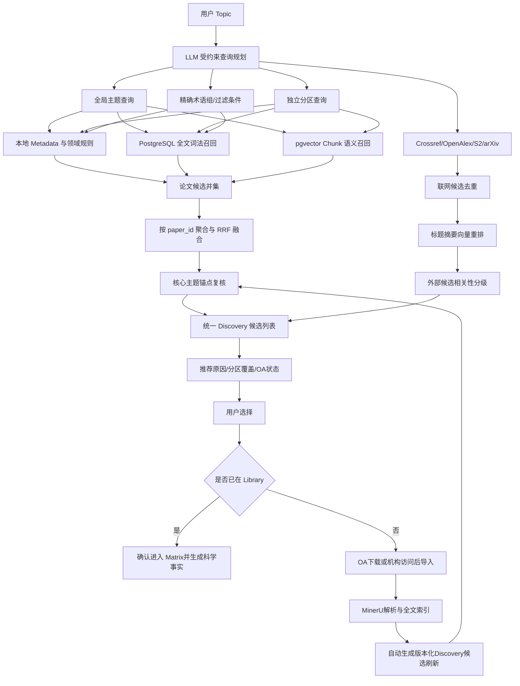

# Review Writer 第02阶段 Topic 混合语义检索功能优化方案

> 文档状态：已完成逻辑审查、用户确认与代码实施  
> 编写日期：2026-08-27  
> 适用范围：所有学科、所有新建项目和历史项目  
> 目标阶段：阶段02“文献检索与选择（Discovery）”  
> 核心原则：复用现有 PostgreSQL 全文索引、pgvector、MinerU Chunk 和模型网关，不新建向量数据库，不增加新的用户确认步骤。

## 1. 文档定位

本文只解决阶段02从用户 Topic 中检索相关论文的问题，具体包括：

- 在现有 Topic 查询规划、领域规则、Metadata 匹配和联网多源检索基础上，引入向量语义召回；
- 复用文献库已经建立的 Chunk 级向量索引，将 Chunk 结果聚合成论文级相关性；
- 对尚未下载的联网候选使用标题与摘要进行语义重排；
- 用精确检索保证科学对象正确，用语义检索减少不同表达方式造成的漏检；
- 保持用户显式选择论文进入 Matrix 的现有流程；
- 不把阶段02的相关性片段误当成后续 Claim 的直接证据。

本文不是 Matrix 科学事实提取或章节 Evidence Package 的替代方案。两个阶段职责如下：

| 阶段 | 核心问题 | 检索粒度 | 结果用途 |
|---|---|---|---|
| 阶段02 Discovery | 哪些论文可能属于综述范围 | 论文级 | 候选推荐与人工选择 |
| Matrix/Sections | 论文中的哪些原文支持具体科学问题 | `paper × question × chunk` | 科学事实、Claim 和写作证据 |

### 1.1 已确认的阶段边界

1. 阶段02不得读取当前项目已有的 Matrix 科学事实参与相关性排序。阶段02只能使用 Library Metadata、当前版本 MinerU 原文Chunk、全文词法索引和Chunk向量。
2. 只有用户在阶段02确认并进入阶段03的论文，才生成本项目的 Matrix 科学事实；这些科学事实只在阶段03及后续证据链中使用。
3. 外部候选PDF下载、MinerU解析和索引完成后，系统自动生成一个有版本号的Discovery待确认修订，只重新评估受影响论文，不要求用户重新运行整次检索，也不自动改变已发布Matrix。

## 2. 当前实现事实

### 2.1 当前已有能力

阶段02目前已经具备：

1. 使用用户当前选择的文本模型生成受约束的查询计划；
2. 模型不可用时使用确定性查询规划回退；
3. 提取核心主题、关键词、年份过滤、分组轴和用户明确要求的独立主题；
4. 根据项目 taxonomy profile 加载对应领域规则；
5. 在本地 Library 中基于标题、摘要、作者关键词、已核验 Metadata 和受限MinerU原文进行匹配；
6. 并行检索 Crossref、OpenAlex、Semantic Scholar 和 arXiv；
7. 按 DOI、来源标识和标题去重；
8. 综合标题摘要匹配、多来源排名、引用量、时间和 Metadata 完整性进行外部候选排序；
9. 重新检索只生成待确认结果，用户确认后才根据论文集合变化使下游阶段失效。

### 2.2 文献库已有向量索引

文献库在 MinerU 解析和全文索引后，会为每个非参考文献 Chunk 建立向量：

```text
Paper P001
  ├─ Chunk C001 → 1536 维向量
  ├─ Chunk C002 → 1536 维向量
  ├─ Chunk C003 → 1536 维向量
  └─ ...
```

当前已配置：

- 向量模型：`Qwen/Qwen3-Embedding-4B`；
- 向量维度：1536；
- 向量存储：PostgreSQL `pgvector`；
- 向量调用：服务端模型网关；
- 全文单位：带章节、页码、内容类型和相邻关系的 MinerU Chunk；
- References Chunk：不进入语义召回。

因此本方案不再生成“每篇论文一个新向量”，而是把现有 Chunk 向量按 `paper_id` 聚合成论文级相关性。

### 2.3 当前缺口

当前向量能力主要用于 Matrix 和章节证据检索，阶段02的本地候选仍由 Discovery 脚本中的确定性评分产生。具体缺口为：

- 阶段02没有调用现有 pgvector Chunk 检索；
- 相同科学概念使用不同表达方式时可能漏检；
- 文献库页面虽然显示“语义索引已完成”，但该状态不代表 Discovery 已消费这些向量；
- 联网候选仍以词面、来源排名和书目信号为主，没有标题摘要语义重排；
- 当前结果缺少“精确命中、全文命中、语义补充命中”的统一解释；
- 向量索引状态缺失或模型切换时，阶段02没有明确的降级状态。

## 3. 优化目标与非目标

### 3.1 优化目标

- 提高 Topic 相关论文的召回率，尤其是标题和摘要没有使用用户原始术语的论文；
- 保持或提高当前精确度，避免一般性主题相似论文大量混入；
- 将现有 Chunk 向量聚合为可解释的论文级语义得分；
- 支持 Topic 全局主题和用户明确要求的各个独立分区；
- 为每篇候选展示推荐原因和命中来源；
- 语义服务失败时自动回退到当前检索方式，不让整个 Discovery 失败；
- 不增加用户逐篇额外确认步骤；
- 不让化学专用规则污染医学、材料、计算机或其他学科。

### 3.2 非目标

本轮不实施：

- 不部署 ChromaDB、Elasticsearch、Milvus 或其他独立检索服务；
- 不对整篇论文重复生成一个总向量；
- 不用向量判断年份、DOI、正式出版状态或开放获取权限；
- 不允许单一向量相似度自动把论文确认进 Matrix；
- 不在阶段02生成可直接用于正文 Claim 的证据；
- 不要求所有论文同时命中 Topic 的所有独立分区；
- 不把 ATA、联烯、金属或其他具体主题词硬编码进通用核心；
- 不改变现有九阶段结构、FastAPI、JobService、科学任务和服务端模型网关。

## 4. 总体目标流程



## 5. 查询规划契约

### 5.1 查询类型

查询规划需要在现有字段基础上输出三类检索内容。

#### 5.1.1 全局主题查询

用于判断论文整体是否属于综述范围。每个项目至少一个，不直接使用整段写作指令作为检索式。

示意：

```json
{
  "query_id": "topic_core",
  "label": "核心主题",
  "query": "terminal alkyne allenation to synthesize substituted allenes",
  "kind": "topic_core"
}
```

#### 5.1.2 独立分区查询

只从用户 Topic 明确要求分别组织、比较或讨论的维度中生成。例如方法、研究对象、材料类型、疾病亚型、时间阶段等。分区是可泛化字段，不能写死化学分类。

```json
{
  "query_id": "partition_02",
  "label": "用户要求的独立分区",
  "query": "...",
  "kind": "topic_partition",
  "source_surface": "Topic 中对应的原始表达"
}
```

#### 5.1.3 精确约束

精确约束继续使用确定性结构：

```json
{
  "required_concept_groups": [
    ["核心对象术语A", "同义词A1"],
    ["目标过程术语B", "同义词B1"]
  ],
  "exact_phrases": [],
  "filters": {
    "year_from": null,
    "year_to": null,
    "document_types": []
  },
  "explicit_exclusions": []
}
```

组内使用 OR，组间表达不同科学概念。硬过滤与显式排除不能由向量相似度覆盖。

### 5.2 查询数量控制

- 全局主题查询：1–2个；
- 独立分区查询：只保留 Topic 明确要求的分区，默认不超过12个；
- 用户显式关键词：必须保留；
- 查询向量按规范化文本哈希缓存；
- instruction-like 内容不能进入查询或图注；
- 模型规划失败时继续使用现有确定性回退，并同样生成可向量化的简化查询。

## 6. 本地Library混合召回

### 6.1 通道A：保留当前确定性检索

继续使用当前以下信号：

- 标题、摘要和作者关键词；
- 已核验结构化 Metadata；
- 项目 taxonomy profile 的合法别名；
- 首页标题、引言概述和反应/研究事实的受限全文准入；
- 年份与文献类型过滤；
- 核心 Topic 锚点；
- 用户人工确认的 Metadata 和项目标签。

该通道主要负责精确性和可解释性。

### 6.2 通道B：全文词法召回

通过现有 `LibraryIndexService` 对非参考文献 Chunk 执行 PostgreSQL 全文检索：

- 组内同义词为 OR；
- 不同概念组之间为 AND；
- 精确短语获得额外排序优势；
- References 不参与；
- 返回稳定的 `paper_id + chunk_id + page + section_path`；
- 该结果只作为阶段02筛选说明，不标记为 Claim 证据。

### 6.3 通道C：Chunk向量语义召回

对全局主题和每个独立分区分别生成查询向量，并在现有 `library_chunk_embeddings` 中检索。

语义召回必须满足：

- 仅查询当前用户的 Library；
- 仅查询当前版本、状态为 ready 的索引；
- 模型名称和维度必须与当前 embedding profile 一致；
- `is_reference = false`；
- 不读取其他用户的向量；
- 语义服务异常时不清空词法结果。

### 6.4 Chunk到论文的聚合

不把一个最高相似Chunk直接当作整篇论文相关。每个 `query_id × paper_id` 最多取前三个独立Chunk：

```text
semantic_paper_score =
    top1_similarity × 0.50
  + top2_similarity × 0.30
  + top3_similarity × 0.20
```

如果只有一个Chunk，则保留该得分，但候选状态最多为“语义补充候选”，除非标题、摘要或确定性信号也支持。

建议在 PostgreSQL 中使用窗口函数完成按论文Top-K聚合，避免先返回大量Chunk再在Python中扫描。返回：

```json
{
  "paper_id": "P001",
  "query_id": "topic_core",
  "semantic_score": 0.81,
  "top_chunks": [
    {
      "chunk_id": "...",
      "page_start": 2,
      "section_path": ["Results"],
      "similarity": 0.86,
      "excerpt": "..."
    }
  ]
}
```

相似度只用于当前模型内部排序。不能把未经评测的固定余弦阈值写成所有模型、所有学科通用规则。

### 6.5 章节位置加权

位置权重使用通用文档结构，不使用具体学科词表：

| 内容位置 | 建议处理 |
|---|---|
| 标题、摘要 | 高可信筛选信号 |
| Results、Findings、Discussion | 高可信筛选信号 |
| Methods、Experimental | 可证明研究或实验实际执行 |
| Introduction、Background | 中等信号，需其他位置共同支持 |
| Conclusion | 中等信号，不能单独扩展细节 |
| Related work 中单次提及 | 弱信号 |
| References | 完全排除 |

无法识别章节类型时不硬判，只使用原始相似度并标记结构未知。

## 7. 候选融合与精度保护

### 7.1 使用并集保证召回

```text
本地最终候选 =
    当前确定性候选
  ∪ PostgreSQL全文词法候选
  ∪ pgvector语义候选
```

不能要求论文同时命中三条通道，否则不同表达方式的论文仍然会被漏掉。

### 7.2 使用RRF融合排序

各通道分数不可直接相加，使用现有 RRF 思路融合。本地论文与尚未入库的外部候选拥有不同数量、不同质量的检索信号，必须分别排序，不能比较两类候选的绝对RRF分数。

本地论文排序：

```text
local_paper_rrf =
    1.0 / (K + metadata_rank)
  + 1.0 / (K + fulltext_lexical_rank)
  + 0.8 / (K + semantic_rank)
```

外部候选排序：

```text
external_candidate_rrf =
    1.0 / (K + title_abstract_lexical_rank)
  + 0.8 / (K + title_abstract_semantic_rank)
  + 0.4 / (K + external_source_rank)
```

- `K` 复用中央 retrieval tuning 中的 RRF 常量；
- 上述权重是首轮评测起点，不是学术准入阈值；
- 精确通道初始权重略高于语义通道；
- 引用量、发表时间和来源数量只作为低权重排序信号；
- 年份和排除条件在融合前执行，不参与软加权。

本地论文和外部候选在页面中可以统一浏览，但“本地第1名”和“外部第1名”分别表示各自列表中的排名。如果两者通过DOI、其他稳定标识或高置信规范题名判定为同一论文，则以本地 `paper_id` 为规范身份，合并外部来源、开放获取位置和来源排名，不显示重复论文卡片。

### 7.3 核心主题复核

向量候选进入推荐列表前执行通用核心主题复核。

#### 核心候选

满足下列任一组合：

- 标题或摘要明确支持全局主题；
- 全文精确检索命中必要概念组；
- 多个独立正文Chunk共同形成高语义支持，其中至少一个不是背景性单次提及；

阶段02不得读取旧Matrix科学事实补强上述判断。科学事实只能在用户确认论文进入阶段03后生成。

#### 语义补充候选

- 没有足够精确术语，但多个正文Chunk与主题语义相关；
- 标题表达与Topic不同，摘要或正文语义支持；
- Metadata缺失，但受限全文信息支持；
- 需要用户在现有选择流程中复核。

#### 背景候选

- 只提供领域背景、通用方法或综述性语境；
- 只在Introduction中相关；
- 与某个分区相邻，但不直接研究全局主题。

#### 排除候选

- 明确违反年份、文献类型或用户排除条件；
- 只命中参考文献或相关工作中的孤立提及；
- 与Topic语义相近，但核心研究对象或过程不同；
- 文献身份重复或记录不可恢复。

### 7.4 不要求所有论文回答所有问题

一篇论文只需支持它实际覆盖的分区。系统保存：

```json
{
  "matched_partitions": ["partition_02"],
  "unmatched_partitions": ["partition_01", "partition_03"]
}
```

`unmatched_partitions` 不构成论文缺陷，也不能在后续把该论文强制分配给所有章节问题。

### 7.5 语义阈值的配置生命周期

- 使用中央 `semantic_min_similarity` 作为语义候选召回下限；
- 该阈值只决定Chunk是否进入候选池，不能单独决定论文是否“推荐加入”；
- 推荐等级必须综合精确信号、多个独立Chunk、章节位置和核心主题复核；
- 阈值、RRF权重和模型快照作为一次Discovery执行记录保存；
- embedding模型或维度变化后，必须重新运行跨学科评测再发布新的推荐配置版本；
- 历史Discovery Artifact继续保留当时的模型和配置快照，不在后台重算并覆盖。

## 8. 联网候选的语义重排

### 8.1 外部检索仍使用关键词API

Crossref、OpenAlex、Semantic Scholar 和 arXiv 仍通过各自支持的文本查询进行候选召回。本项目不能把本地向量直接提交给这些外部数据库。

### 8.2 标题摘要向量重排

对去重后的外部候选构造：

```text
Title: ...
Abstract: ...
Keywords: ...
```

批量生成向量，与全局主题和分区查询向量比较。结果只附加标量得分和解释，不把1536维向量写入 Discovery Artifact。

缓存键：

```text
doi或稳定候选ID
+ title_abstract_sha256
+ embedding_model
+ embedding_dimension
```

首期复用模型网关的幂等与响应缓存，不新增外部候选向量表。

### 8.3 摘要缺失

- 有标题无摘要：只执行标题语义重排，标记“判断有限”；
- 标题和摘要均缺失：不执行语义重排；
- 不因Metadata不完整自动排除，但不得标记为高置信核心候选；
- PDF下载并经MinerU解析后，使用本地全文Chunk重新复核。

### 8.4 外部候选下载后的版本化刷新

外部候选没有本地 `paper_id` 前不能进入Matrix。PDF通过开放获取下载或机构访问后导入时，使用以下链路：

```text
external candidate_id
→ PDF进入当前用户Library
→ DOI/来源标识/规范题名匹配
→ 得到本地paper_id
→ MinerU解析、全文索引和向量索引完成
→ discovery.candidate-refresh任务
→ 只重新检索和评估受影响paper_id
→ 发布新的待确认Discovery修订
```

刷新规则：

- 使用 `expected_revision` 和当前Artifact ID执行原子发布；
- 下载任务记录原始 `candidate_id`、项目ID和Discovery修订号；
- 当前Discovery仍包含该候选时，外部记录转换为本地规范记录；
- 当前Discovery已经被用户重新检索替换且候选不存在时，不把旧候选强行写回；
- DOI相同或稳定身份一致时，以本地 `paper_id` 为主，合并外部来源信息；
- 刷新只生成待确认修订，不自动选择论文，不覆盖用户人工排除状态；
- 刷新不修改已发布Matrix，也不使阶段03及后续产物失效；
- 用户确认新论文集合后，才按现有依赖规则更新Matrix并生成科学事实。

这属于有版本、可审计的候选刷新，不是Artifact发布后的无版本静默修改。

### 8.5 获取权限与相关性分离

候选相关性与PDF获取状态必须是两个独立字段：

```json
{
  "relevance_status": "semantic_supplement",
  "access_status": "institution_required"
}
```

可能的访问状态：

- `open_access_downloadable`；
- `institution_required`；
- `metadata_only`；
- `downloaded_to_library`；
- `access_unknown`。

付费墙不能降低论文科学相关性；引用量也不能改变访问状态。

## 9. 推荐选择逻辑

### 9.1 单篇推荐

每篇论文生成：

- `recommendation_status`：recommended/review/background/excluded；
- `recommendation_reason_codes`；
- `matched_query_ids`；
- `matched_partitions`；
- `retrieval_channels`；
- 最多3条筛选解释片段；
- 当前索引和模型快照。

本地候选可以显示“加入Matrix”。外部候选在获得本地 `paper_id` 前不显示该按钮，而是根据访问状态显示：

- `下载并解析`；
- `通过机构访问`；
- `导入已下载PDF`；
- `正在解析/建立索引`。

完成版本化刷新后，候选才转换为可加入Matrix的本地论文。

### 9.2 批量推荐

批量推荐不能只选择总分最高的前N篇。推荐顺序为：

1. 为每个用户明确要求的独立分区保留高置信候选；
2. 再按照全局主题融合分数补足核心论文；
3. 同一论文覆盖多个分区时只计算一次；
4. 背景论文和仅语义单点命中论文不自动加入；
5. 用户仍可逐篇添加、排除或修改角色；
6. 批量推荐只处理已经具有本地 `paper_id` 的论文；
7. 批量推荐只修改待确认 Discovery 结果，不直接修改已发布 Matrix。

### 9.3 覆盖不足

系统自动诊断：

- 哪些Topic分区没有候选；
- 哪些分区只有Metadata候选；
- 哪些分区只有语义补充候选；
- 哪些候选需要机构访问；
- 哪些本地论文还没有语义索引。

是否扩大联网检索范围仍由用户手动开启。系统不能因覆盖不足在后台静默增加新文献范围。

## 10. Discovery产物扩展

### 10.1 查询计划

在现有 `query_plan` 中增加：

```json
{
  "semantic_queries": [
    {
      "query_id": "topic_core",
      "kind": "topic_core",
      "label": "核心主题",
      "query": "..."
    }
  ],
  "semantic_query_version": 1
}
```

### 10.2 本地候选

```json
{
  "paper_id": "P001",
  "retrieval_signals": {
    "metadata_rank": 2,
    "fulltext_lexical_rank": 5,
    "semantic_rank": 1,
    "rrf_score": 0.041,
    "retrieval_channels": ["metadata", "fulltext_lexical", "semantic"]
  },
  "semantic_screening": {
    "status": "ready",
    "model": "Qwen/Qwen3-Embedding-4B",
    "dimension": 1536,
    "matched_query_ids": ["topic_core", "partition_02"],
    "top_chunks": []
  },
  "recommendation_status": "recommended",
  "recommendation_reason_codes": []
}
```

### 10.3 外部候选

```json
{
  "candidate_id": "doi:...",
  "resolved_paper_id": null,
  "source_discovery_revision": 12,
  "external_semantic_screening": {
    "status": "title_abstract",
    "semantic_rank": 4,
    "matched_query_ids": ["topic_core"]
  },
  "relevance_status": "review",
  "access_status": "institution_required"
}
```

### 10.4 数据边界

- Discovery Artifact 不保存原始向量；
- 最多保存3个短解释片段，避免Artifact过大；
- 解释片段标记 `screening_only=true`；
- 不生成 `fact_id`、`claim_id` 或直接证据身份；
- 后续写作仍必须从 Matrix/Sections 的 Evidence Package 取证；
- 旧Artifact缺少新字段时按当前词法结果正常读取。

## 11. 后端实施设计

### 11.1 保持现有职责

- `discover.py`：继续负责查询规划、领域规则、本地确定性候选、外部来源检索和基础去重；
- `LibraryIndexService`：继续作为全文词法和向量检索唯一实现；
- `DiscoveryService`：在发布待确认Discovery产物前完成论文级聚合和融合；
- 模型网关：生成查询向量和外部标题摘要向量，统一计量、缓存和并发控制；
- PostgreSQL：保存现有Chunk、向量和Discovery Artifact。

不允许在 Discovery 脚本中复制一套 pgvector SQL 或直接读取其他用户数据。

### 11.2 建议新增的公共能力

在 `LibraryIndexService` 中增加论文级检索方法，例如：

```python
retrieve_paper_relevance(
    principal,
    queries,
    allowed_papers,
    per_paper_chunk_limit=3,
)
```

返回词法排名、语义排名、RRF基础信号和筛选片段。内部复用现有：

- ownership校验；
- 当前索引版本校验；
- query embedding缓存；
- pgvector余弦检索；
- PostgreSQL全文查询；
- References排除；
- RRF常量。

### 11.3 Discovery调用位置

在现有 `discovery.search` Job 内执行：

```text
查询规划与基础候选
→ 获取当前用户Library论文ID
→ 获取语义索引状态
→ 执行本地论文级混合召回
→ 执行外部标题摘要语义重排
→ 融合、解释和分区覆盖诊断
→ 发布待确认Discovery Artifact
```

不能把语义补充放到Artifact发布后的无版本后台静默修改中。

### 11.4 外部候选刷新任务

增加受现有JobService管理的 `discovery.candidate-refresh`，不增加第二套工作流框架。该任务由外部PDF对应的MinerU、全文索引和向量索引完成事件触发，职责仅为：

1. 根据 `candidate_id + DOI + 规范题名` 解析本地 `paper_id`；
2. 读取触发时记录的Discovery Artifact和修订号；
3. 对该 `paper_id` 执行本地论文级混合检索；
4. 合并外部来源和访问记录；
5. 使用仓库原子操作发布新的待确认Discovery Artifact；
6. 返回新的修订号和候选状态。

任务不得调用Matrix科学事实，不得修改Matrix Artifact。并发期间如果当前Discovery已经变化，则重新检查新Artifact中是否仍存在同一候选；不存在时安全结束，存在时基于新修订重算，不能覆盖用户更新。

### 11.5 历史索引和模型变化

- 新上传论文继续自动建立全文和向量索引；
- 部署时使用现有reindex机制对历史全文索引执行一次受控、可恢复的 `semantic_only` 回填；
- 回填按用户隔离和论文批次排队，使用现有有限并发，不一次加载全部用户论文；
- 已使用当前模型和维度完成的论文自动跳过；
- 中断后从未完成论文继续，单篇失败不终止整个批次；
- 管理端记录总数、完成、失败和待处理状态；
- 当前检索发现索引缺失时不现场串行重建全部论文，避免Discovery超时；
- 缺失论文继续走Metadata/词法通道，并在页面显示“语义索引待补充”；
- embedding模型或维度改变时，旧向量不参与新查询；
- 语义回填失败不删除已有全文索引。

### 11.6 并发和成本

- 本地论文Chunk向量已经存在，Discovery只生成少量查询向量；
- 外部候选按去重后的标题摘要批量Embedding；
- 同一DOI在多个关键词组出现时只Embedding一次；
- 批次大小复用中央embedding配置；
- 外部候选数量继续受现有400条总预算约束；
- embedding请求继续经过独立并发槽，不占用文本重写并发；
- 价格继续进入现有模型网关用量账本。

## 12. 前端功能调整

主要修改 `frontend/src/features/discovery/DiscoveryPage.tsx`、`DiscoveryJobProgress.tsx` 和现有CSS，不改变页面整体视觉结构。

### 12.1 进度状态

阶段02进度显示：

1. 正在生成查询计划；
2. 正在检索本地Metadata与全文；
3. 正在执行本地语义召回；
4. 正在查询外部文献来源；
5. 正在对外部候选进行语义重排；
6. 正在去重、融合和生成推荐说明。

向量服务失败时显示：

```text
语义召回暂时不可用，本次结果已使用Metadata和全文词法检索完成。
```

不能把整次任务标记为失败。

### 12.2 候选卡片

增加简洁徽标：

- 精确命中；
- 全文命中；
- 语义补充；
- 多通道一致；
- 仅标题摘要；
- 语义索引待补充；
- 开放获取；
- 需要机构访问。

按钮规则同步调整：

- 本地论文：显示“加入Matrix/已加入Matrix”；
- 可自动获取的外部论文：显示“下载并解析”；
- 需要机构权限的外部论文：显示“通过机构访问”或“导入PDF”；
- 正在处理的外部论文：显示可恢复的下载、MinerU、全文索引和向量索引状态；
- 外部论文转换为本地 `paper_id` 后：显示“加入Matrix”。

不能再让尚未入库的 `web_results` 设置 `selected_for_matrix=true`，避免前端显示已选择而后端确认时忽略。

### 12.3 详情面板

展示：

- 推荐等级；
- 匹配的Topic分区；
- 使用的召回通道；
- 最多3条相关片段及页码；
- 为什么推荐或为什么需要复核；
- 访问状态与下一步操作。

必须明确提示：

```text
这些片段仅用于筛选相关论文；正式写作仍会在Matrix和章节阶段重新建立问题级证据包。
```

### 12.4 高级设置

语义召回在服务器配置可用时默认开启，不新增主页面开关。高级折叠区只显示：

- 本次是否启用语义召回；
- 使用的模型快照；
- 已有语义索引论文数量；
- 降级原因。

普通用户不需要理解或调整相似度阈值、RRF常量和向量维度。

## 13. 失败与降级策略

| 情况 | 系统行为 |
|---|---|
| embedding服务不可用 | 保留现有确定性和全文词法结果，标记语义降级 |
| pgvector不可用 | 不执行本地语义召回，联网仍可做基础排序 |
| 部分论文没有向量 | 这些论文继续走Metadata/词法检索，并显示待补充状态 |
| 外部候选没有摘要 | 仅标题语义重排，不能标记高置信 |
| 某个联网来源失败 | 保留其他来源结果和来源级错误状态 |
| 付费墙 | 保留候选相关性，访问状态标记为需要机构访问 |
| 外部PDF已入库但候选刷新遇到修订冲突 | 读取最新待确认Artifact重新核对；候选已不存在则安全结束，不覆盖用户结果 |
| Query Plan模型不可用 | 使用确定性回退，仍可执行混合检索 |
| 模型余额不足 | 按现有业务规则停止本次智能检索，不覆盖上一次成功结果 |
| 语义结果与精确结果冲突 | 标记待复核，不自动排除或自动确认 |

## 14. Artifact失效与用户操作规则

- 重新检索继续生成新的待确认结果；
- 语义得分或推荐排序变化不会立即使Matrix和后续阶段失效；
- 外部论文解析完成后的候选刷新只产生新的待确认Discovery修订；
- 用户确认后，仅当Topic或最终选中论文集合实际变化时，才按现有规则更新Matrix和下游状态；
- 只改变推荐理由、排名或访问状态，不应使已确认Matrix失效；
- 用户人工选择和角色修改优先于后台推荐；
- 模型升级不能静默覆盖用户已经确认的论文集合。
- 阶段02不读取旧Matrix科学事实；用户确认后才为选中论文生成阶段03科学事实。

## 15. 测试与评测方案

### 15.1 单元测试

- 查询计划能生成全局主题和独立分区查询；
- 用户显式关键词不会丢失；
- 领域规则只在当前项目profile启用；
- References Chunk不会进入候选；
- Chunk Top-3按 `paper_id` 正确聚合；
- 单个孤立语义Chunk不能直接生成高置信推荐；
- 组内OR、组间概念约束不被破坏；
- RRF排序不直接混加原始余弦和词法分数；
- 本地论文和外部候选分别排序，不能比较两类候选的绝对RRF分数；
- 每篇论文只需匹配其相关分区；
- 模型和维度快照不一致的向量不会被使用；
- 其他用户论文和向量不可见；
- embedding失败时词法候选保持不变。
- 阶段02服务不能读取Matrix科学事实Artifact。

### 15.2 集成测试

- 本地Metadata无命中、全文语义命中的论文能够作为补充候选出现；
- 只在Related Work提到Topic的论文不会成为核心候选；
- 外部候选跨Crossref/OpenAlex/Semantic Scholar/arXiv正确去重；
- 同一外部候选只生成一次标题摘要向量；
- 与本地论文DOI或稳定身份相同的外部候选合并到本地规范记录；
- PDF下载并解析后能够从外部候选重新归入本地全文候选；
- 外部候选刷新发布新Discovery修订，但不修改已发布Matrix；
- 尚未获得本地 `paper_id` 的外部候选不能设置 `selected_for_matrix=true`；
- 付费墙不影响相关性评分；
- 重新检索不破坏已有Matrix；
- 结果Artifact可以被旧前端安全读取，新前端也能读取旧Artifact。

### 15.3 泛化评测集

不能只使用ATA或某一个化学项目调参。至少建立以下主题样本：

- 一个有大量同义表达的化学主题；
- 一个材料或能源主题；
- 一个生命科学或医学主题；
- 一个计算机或工程主题；
- 一个中文Topic与英文论文混合主题。

每个主题人工标注一组：

- 核心相关论文；
- 补充相关论文；
- 主题相邻但不应纳入的论文；
- 明确无关论文。

### 15.4 主要指标

- `Recall@20`、`Recall@50`；
- `Precision@20`；
- 各Topic独立分区覆盖率；
- 语义新增召回中真正相关论文比例；
- 仅背景提及造成的误召回率；
- 单次Discovery延迟；
- 查询向量和外部候选Embedding Token用量；
- 语义降级时与当前基线结果的一致性。

## 16. 实施顺序

### P0：接通本地已有向量

1. 扩展查询计划，生成全局和分区语义查询；
2. 在 `LibraryIndexService` 增加按论文聚合的混合检索能力；
3. Discovery复用已有Chunk向量并生成论文级排名；
4. 与当前确定性候选做并集和RRF融合；
5. 增加推荐状态、命中通道和解释片段；
6. 增加用户隔离、References排除和降级测试。

### P1：联网候选语义重排

1. 对去重后的标题摘要批量Embedding；
2. 按全局和分区查询进行语义重排；
3. 分离相关性状态与OA/付费墙状态；
4. 增加外部候选到本地 `paper_id` 的稳定身份映射；
5. 下载并解析后通过版本化刷新任务自动使用本地全文重新评估；
6. 修正外部候选按钮，在入库前禁止直接加入Matrix；
7. 增加外部候选缓存、修订冲突和失败降级测试。

### P2：推荐与覆盖体验

1. 调整进度状态；
2. 增加命中徽标和推荐理由；
3. 优化批量推荐，使其覆盖用户要求的分区；
4. 增加语义索引覆盖状态；
5. 使用跨领域评测集校准权重和阈值。

## 17. 验收标准

功能完成需同时满足：

1. 阶段02能够实际读取现有 `library_chunk_embeddings`，而不是只显示索引状态；
2. 不重新建设独立向量数据库或整篇论文向量；
3. 不同表述但科学主题一致的论文能够被语义通道补充召回；
4. 只在背景或参考文献中提及Topic的论文不会自动成为核心候选；
5. 现有关键词、领域规则、年份和排除条件继续生效；
6. 联网候选完成标题摘要语义重排，摘要缺失时明确降级；
7. 本地和外部候选分别融合排序，同一论文跨通道只保留一个规范身份；
8. 外部PDF解析后自动生成有版本的待确认Discovery修订，不要求重新运行整次检索；
9. 尚未入库的外部候选不能直接加入Matrix；
10. 每篇候选可以解释来自哪个通道、匹配哪个Topic分区；
11. 语义服务失败时Discovery仍能以当前方式成功完成；
12. 阶段02不读取或生成Matrix科学事实，只有确认进入阶段03的论文才生成科学事实；
13. 用户无需增加新的确认步骤；
14. 用户确认前不影响已有Matrix和后续产物；
15. 历史向量回填有限并发、可恢复且单篇失败不影响其他论文；
16. 通过跨领域回归测试，不包含主题专用硬编码；
17. Token用量进入现有网关账单，API Key不进入浏览器或科学子进程。

## 18. 最终技术决策

本方案确认采用以下最小充分实现：

```text
现有查询规划
+ 现有Metadata/领域规则
+ PostgreSQL全文词法召回
+ 现有pgvector Chunk语义召回
+ Chunk到论文Top-3聚合
+ RRF融合
+ 核心主题复核
+ 外部标题摘要语义重排
+ 用户显式确认
```

不增加新的数据库类型，不增加第二套检索服务，不提前执行Claim级证据判断。阶段02只负责更完整、更可解释地找到候选论文；正式科学事实和写作证据仍由Matrix与章节阶段重新建立。
